# 1.1 从一个回答出发：什么是大模型

> 请为青禾社区学习中心安排一个上午的开放日，包括阅读分享、手作体验和自由交流。

助手写出了完整方案，容量和预约却出了问题。

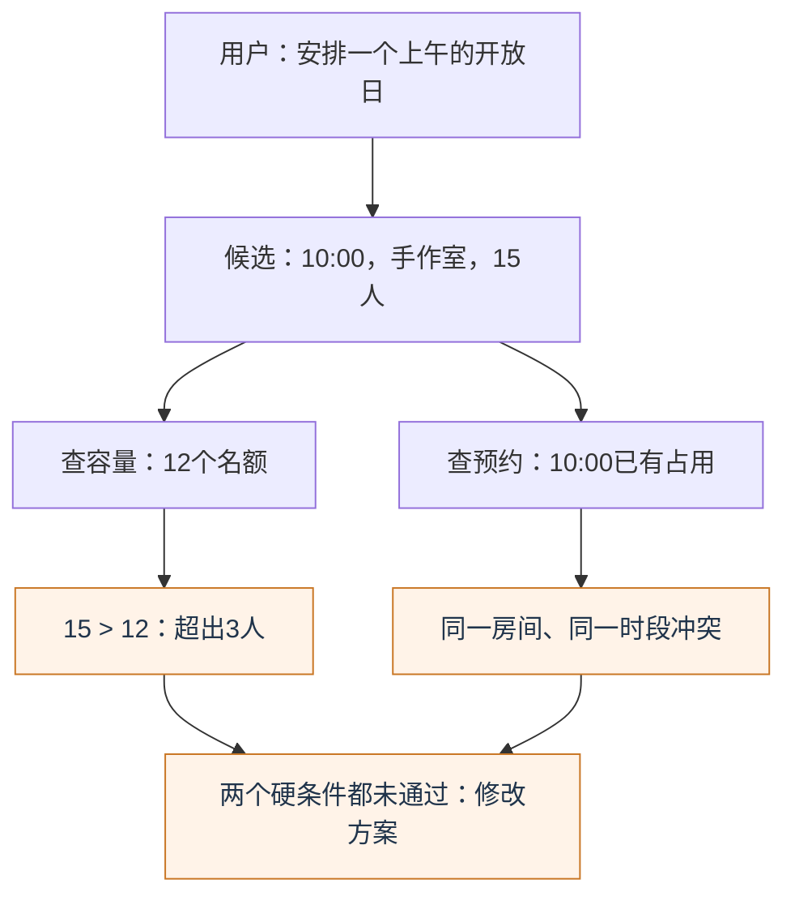

*图1.1-1　15人超过12人容量，10:00又与预约相交；容量和时段是两项独立检查。数据为教学设定。*

**它会生成文字，为什么还需要检查？大语言模型（LLM）通过大规模训练学习语言规律，根据当前上下文处理和生成语言。输出流畅，不代表事实已经核验。**

## 1.1.1 从人工智能到大语言模型

> 基础模型、多模态不是LLM下的互斥子类；参数规模里的1B是十亿个参数，不是字数或上下文长度。

这里有三种不同的读法：看技术归属、看命名角度，再看规模由哪些量描述。

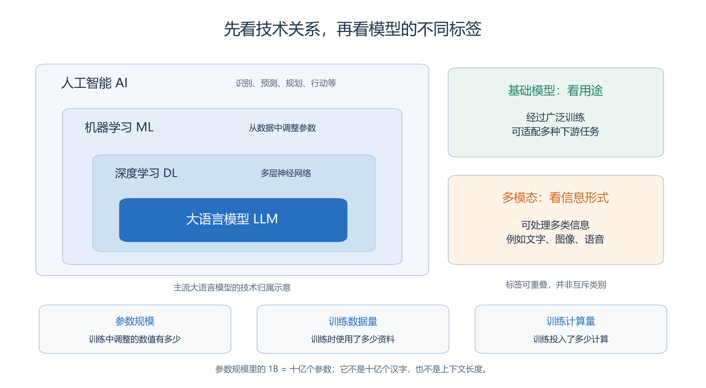

*图1.1-2　左侧是技术范围的包含关系；“基础模型／多模态”是命名角度，参数、数据与计算量是规模维度。不是训练步骤图。*

| 容易混淆的说法 | 应当怎样理解 |
| --- | --- |
| “1B就是十亿字” | 参数规模中的1B指十亿个可训练数值，不是字数 |
| “参数多，一次就能读得多” | 参数量与上下文容量是不同指标 |
| “模型越大，一定越好” | 还要看数据、训练方法、计算预算和具体任务 |

“大”没有统一门槛。计算最优训练研究表明，同一预算下，模型规模与数据量的分配会影响效果，不能只追求更多参数。[研究依据](https://arxiv.org/abs/2203.15556)

## 1.1.2 Token：文字怎样变成可计算的输入

同一句话涉及两个问题：文本怎样变成模型可处理的数值，本次请求又要占用多少上下文空间。图中分开画出。

<!-- book-figure: tokens-and-context -->

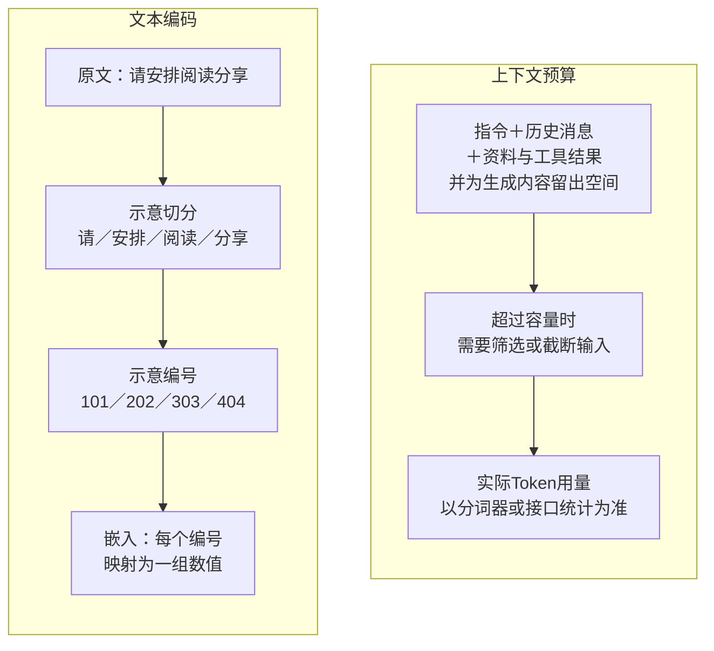

*图1.1-3　左侧说明文本编码，右侧说明上下文预算；窗口容量不是嵌入之后的处理步骤。切分与编号均为示意。*

> 片段、数字编号和向量均为示意；分词结果因分词器而异，Token数不等于汉字数。

**原图参考（转换前）**

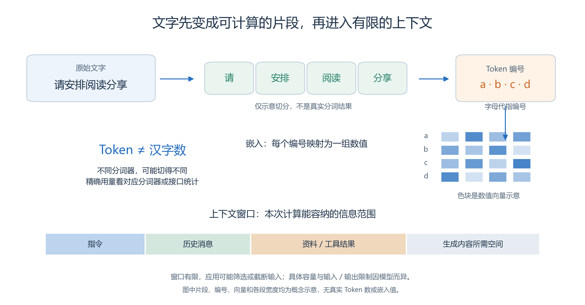

读图时抓住三点：

- **Token是片段**：可能是字、词的一部分或标点，不能固定换算成汉字。
- **编号用于索引，向量用于计算**：编号本身不是词义；后续表示还受周围内容影响。
- **窗口有限**：本次实际送入的指令、消息、资料和生成内容受到容量限制，大窗口也不等于长期记忆。

例如“安排很紧”和“把门关紧”都有“紧”，含义却不同。模型需要结合语境处理，不能只认一个字。

## 1.1.3 一段回答是怎样生成的

下面以常见的**自回归文本生成**为例：生成一个Token，把它接回已有内容，再继续。

从已经送入的内容出发，沿回环看模型怎样逐步生成；到达停止边界时，还要区分正常结束与长度限制。

<!-- book-figure: text-generation -->

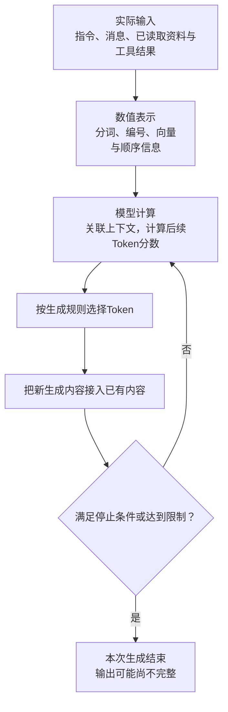

*图1.1-4　生成内容不断接入上下文；达到限制时可能只得到部分回答。回环表示生成过程，不表示已经核验事实或执行工具。*

> 自回归文本生成的概念过程；回环不表示每次重算全部历史，也不表示输出时核验了外部事实。

**原图参考（转换前）**

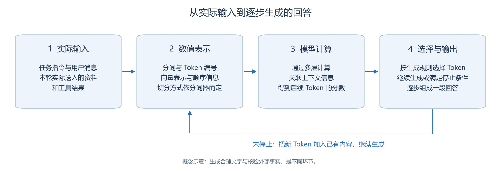

- **输入端**：文件在电脑里，不等于已经送给模型；需要应用实际读取并提供。
- **生成端**：模型为后续Token计算分数，按生成规则选择，直到停止或达到限制。
- **显示端**：流式输出把逐步产生的内容陆续显示出来，不代表边输出边核验事实。

预测后续Token并不等于只能简单接词；模型可以学到语法、概念、代码结构和问题求解模式。少样本研究展示了同一模型依据输入说明与示例处理多种任务的能力。[研究依据](https://arxiv.org/abs/2005.14165)

**模型怎样联系相隔的信息？先看“关联”和“顺序”。**

先把“容量12人”和“参加15人”联系起来，再比较“甲交给乙”和“乙交给甲”：关联信息与保留顺序都影响理解。

<!-- book-figure: attention-and-order -->

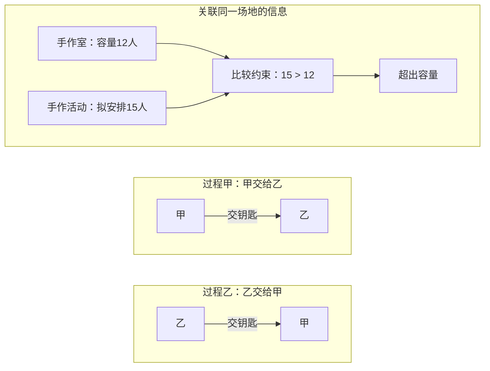

*图1.1-5　上组展示两条相关信息需要一起使用，下两组展示相同词语的不同关系；连线不是实际注意力权重。*

**原图参考（转换前）**

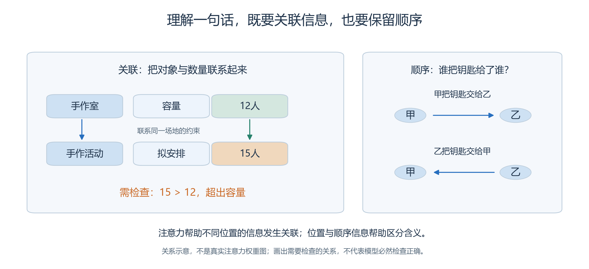

Transformer的注意力机制让不同位置的信息相互关联，位置与顺序信息也参与计算。“注意力”是技术名称，不表示主观体验，也不保证模型一定比较对12与15。[Transformer论文](https://arxiv.org/abs/1706.03762)

## 1.1.4 模型如何从训练走到使用

今天把房间表交给助手，与训练一个模型有什么不同？先看三个框的标题是否写着“更新参数”。

<!-- book-figure: training-and-inference -->

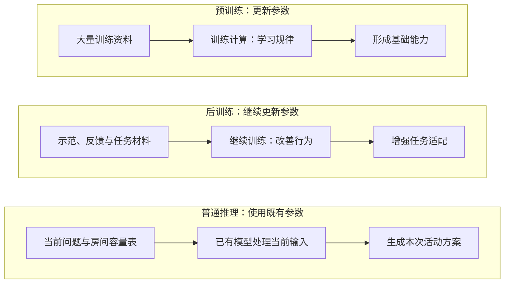

*图1.1-6　预训练和后训练改变参数；本次推理使用已有参数处理输入。三组展示作用差异，不是每次提问都重复训练。*

> 今天提供房间表，通常改变的是本次上下文，不是模型参数。

**原图参考（转换前）**

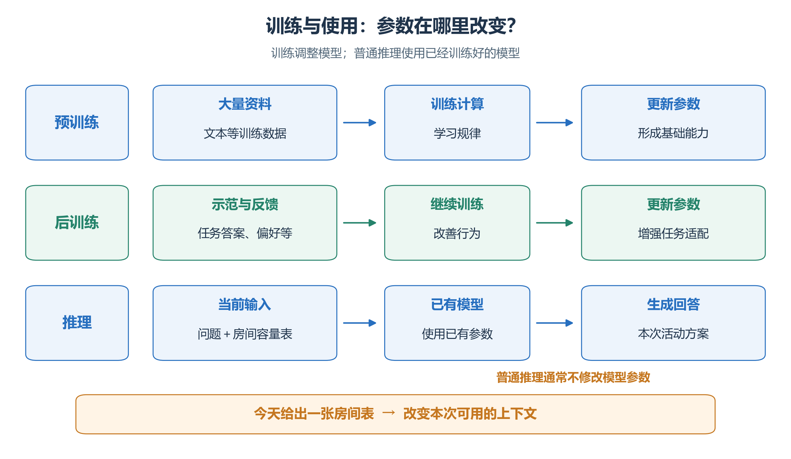

| 你做的事 | 通常属于什么 | 参数是否因此更新 |
| --- | --- | --- |
| 用大量资料学习广泛规律 | 预训练 | 是 |
| 用示范、偏好或奖励改善行为 | 后训练 | 是 |
| 把今天的房间表放进请求 | 推理时提供上下文 | 通常不会 |

后训练有多种方法，不能全部叫作强化学习。InstructGPT是利用示范和人类反馈改善指令遵循的研究实例，但改善后仍会犯错。[研究依据](https://arxiv.org/abs/2203.02155)

**告诉模型一件新事，不等于训练了一个新模型。**下一次没有提供这份表，就不能假定它仍能使用。

## 1.1.5 四种容易混在一起的“知道”

回答里的信息可能来自参数，也可能是这次才读到的材料。分别看参数怎样参与计算，以及资料和记忆怎样进入当前上下文。

<!-- book-figure: knowledge-sources -->

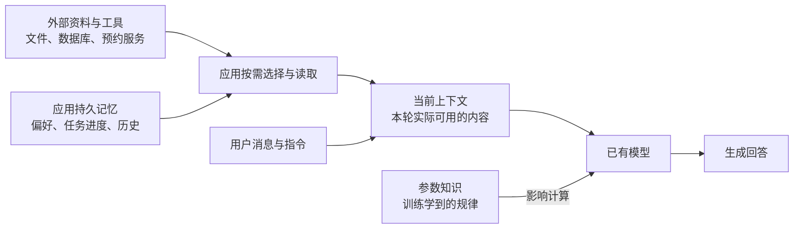

*图1.1-7　资料和持久记忆经读取进入本次上下文，参数参与模型计算；存放在外部的信息不会自动全部进入回答。*

> 文件在电脑里不等于已进入上下文；外部资料与持久记忆须真实读取。角色当前坐标以系统提交事实为准。

**原图参考（转换前）**

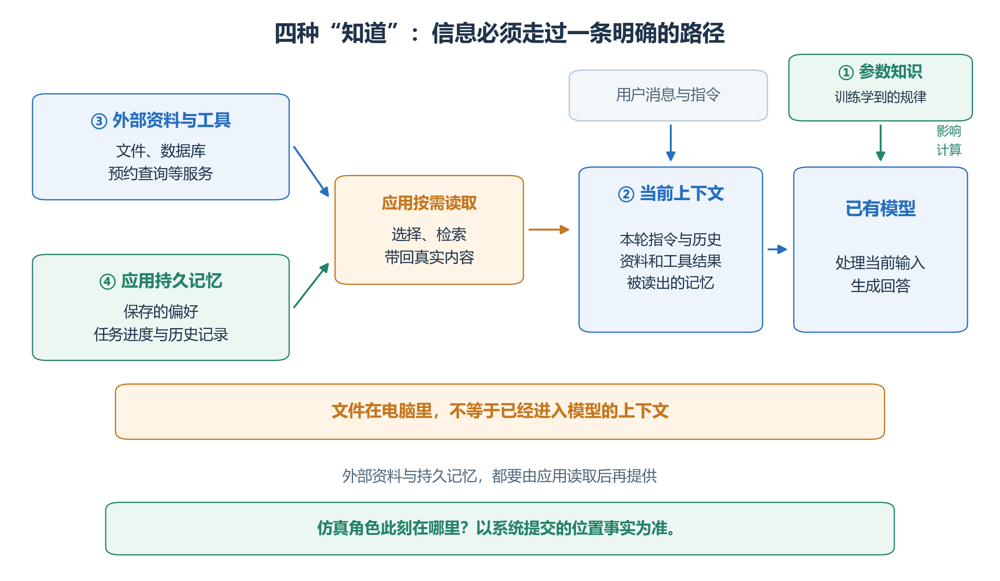

| 信息来自哪里 | 青禾例子 | 应检查什么 |
| --- | --- | --- |
| 模型参数 | “开放日通常需要活动安排” | 是否适用于当前问题，是否可能过时 |
| 当前上下文 | 本次提供的“手作室容量12人” | 是否确实送入，是否被截断或误读 |
| 外部资料与工具 | 查询10:00的预约记录 | 是否实际查询，返回的是哪条记录 |
| 应用持久记忆 | 保存“第一版尚未核验预约” | 是否保存、更新，并在需要时读回 |

检索增强生成（RAG）将模型与可检索资料结合，为取用和更新信息提供途径；检索到资料以后，仍要检查是否用对。[RAG论文](https://arxiv.org/abs/2005.11401)

在本书系统中，角色“记得自己去过阅读角”和“此刻就在阅读角”也不同。**此刻的位置以仿真系统的世界事实为准。**

## 1.1.6 为什么回答会变化，为什么会有“幻觉”

先核对容量与预约事实，再比较两次回答是否相同；这两个判断不能合并成一个“稳定可靠”。

<!-- book-figure: variability-and-errors -->

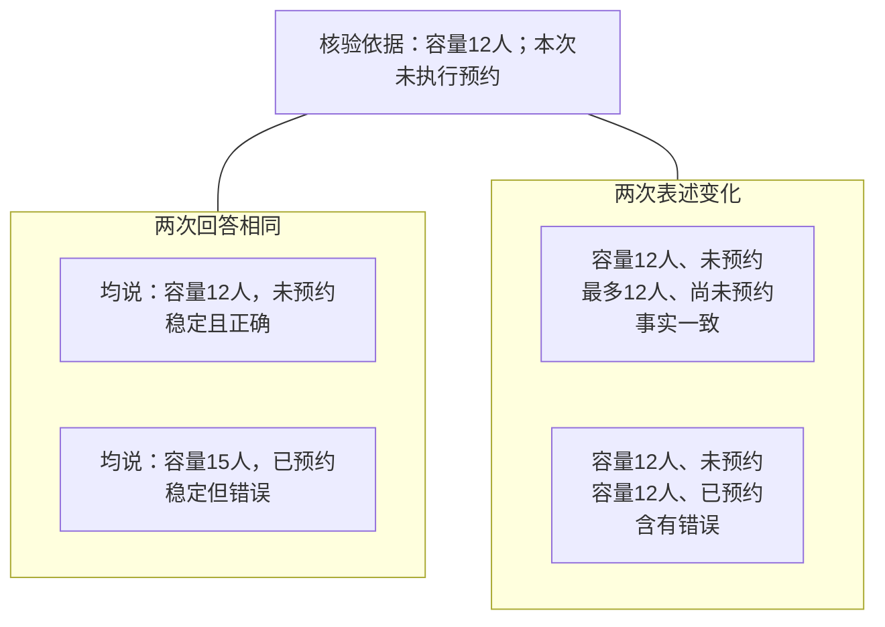

*图1.1-8　四组人工对照分别比较措辞稳定性与事实正确性；重复说“15人、已预约”仍然错误，不用于估计真实错误率。*

**原图参考（转换前）**

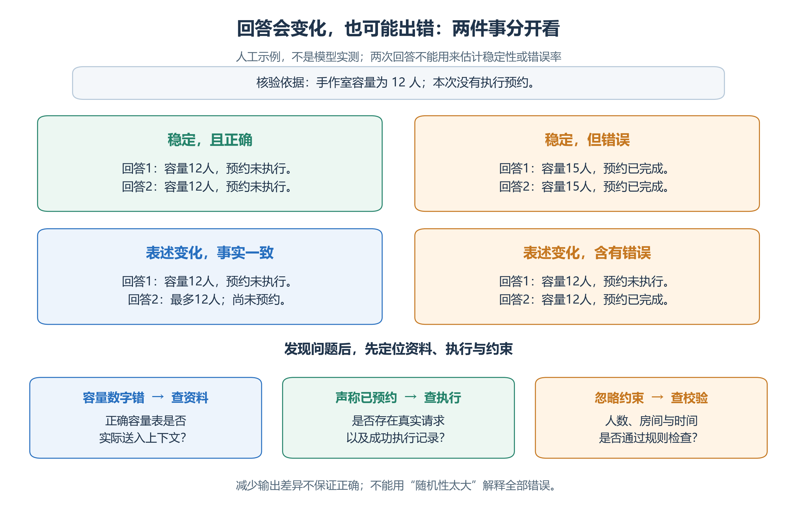

回答会受输入、历史、模型和采样规则影响。降低随机性可能减少差异，**不能保证正确，也不保证完全重现**。

| 看到的错误 | 优先检查哪里 |
| --- | --- |
| “手作室可容纳15人” | 容量表是否提供、是否正确使用 |
| “已经完成预约”，却没有记录 | 工具是否实际执行并返回成功 |
| 解释很完整，但安排仍冲突 | 数字、引用与业务约束是否通过独立校验 |

与其笼统地说“幻觉”，不如记录具体错误及证据。回到开场任务，下一步就是：**提供容量表 → 查询预约 → 检查候选方案。**1.2继续解释这些能力怎样在应用中配合。

[下一节：1.2 从模型到应用](02-from-model-to-application.md) · [八图索引与绘图源](figures/README.md) · [返回本章目录](README.md)
