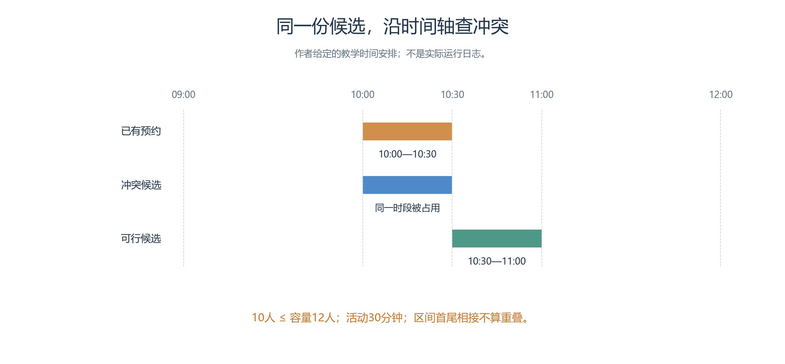
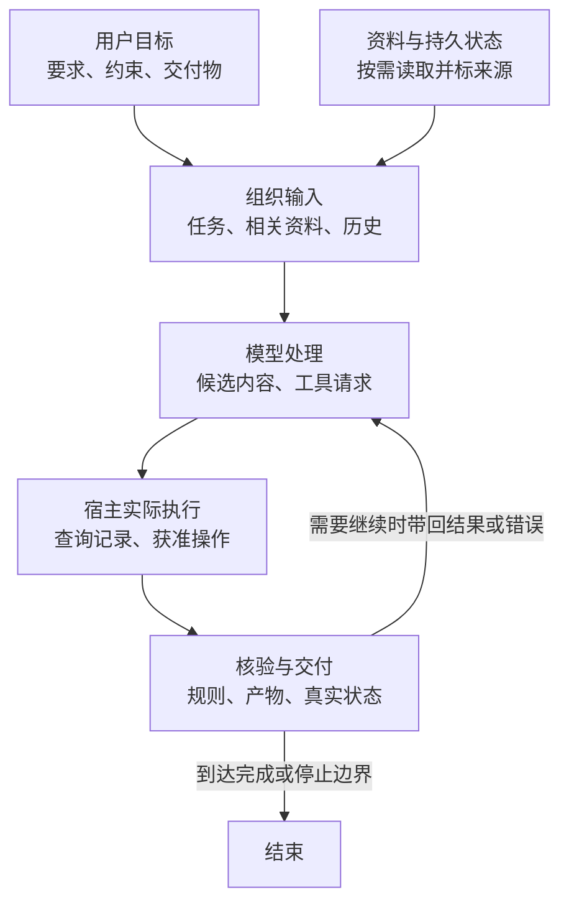
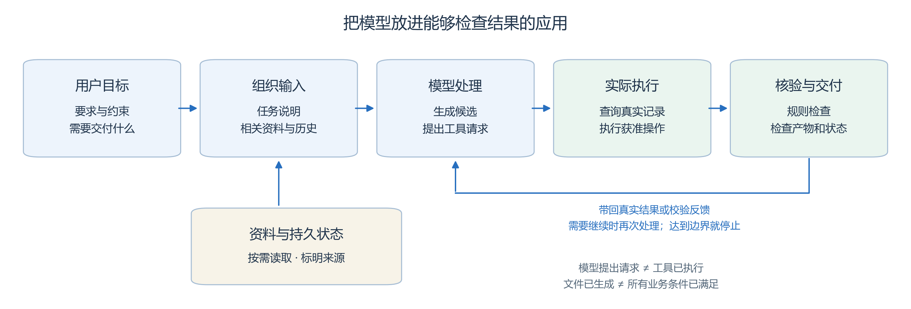
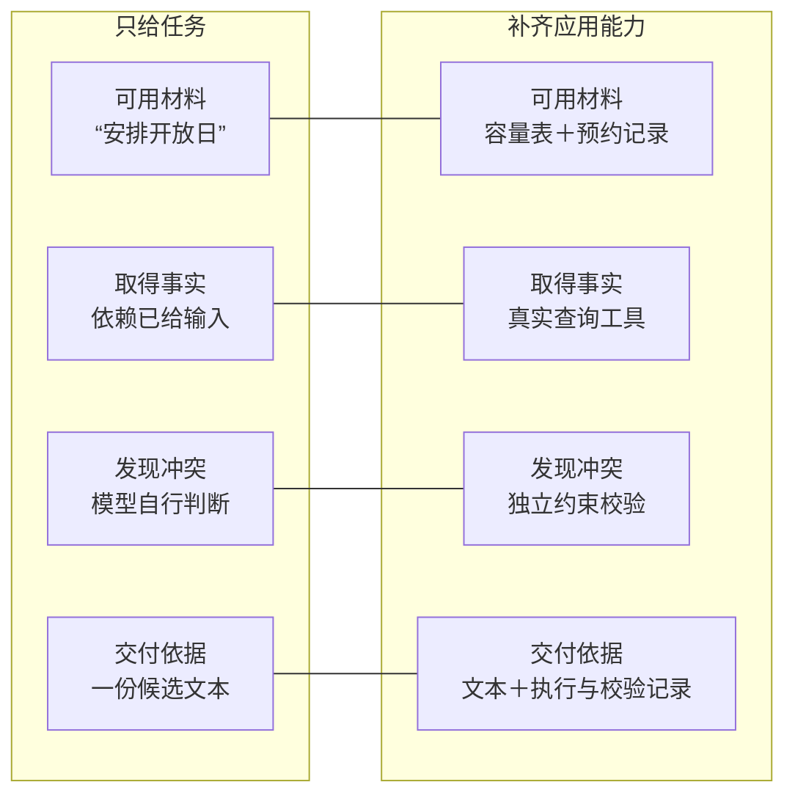
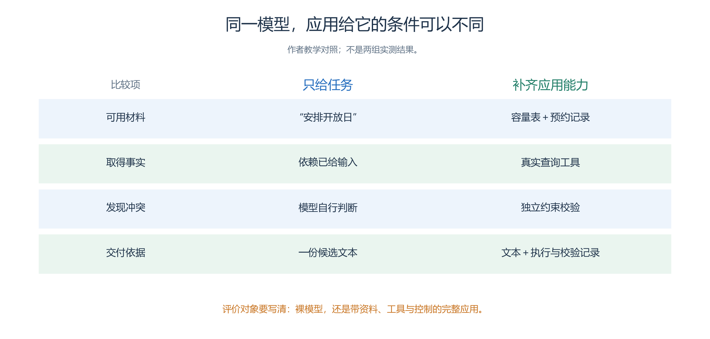

# 1.2 从模型到应用：能力来自哪些层

同一个模型，放进不同应用，表现可能不同。判断“这个 AI 很强”之前，先看它拿到了什么资料、能调用什么工具，以及谁来检查结果。

## 1.2.1 同一个任务，可以有不同的完成方式

本小例只安排10人参加30分钟活动：房间容量12人，09:00—12:00开放，10:00—10:30已有预约。先在时间轴上找出可用的连续半小时。

```mermaid
%%{init: {"gantt": {"fontSize": 16, "sectionFontSize": 16, "barHeight": 28, "barGap": 8}}}%%
gantt
    title 同一房间的候选时段检查
    dateFormat HH:mm
    axisFormat %H:%M
    todayMarker off
    section 开放时间
    09至12点开放 :openHours, 09:00, 180m
    section 已有预约
    已占用10点至10点半 :crit, occupied, 10:00, 30m
    section 冲突候选
    10点开始30分钟 :crit, conflicting, 10:00, 30m
    section 可行候选
    10点半开始30分钟 :feasible, 10:30, 30m
```

<!-- book-figure: s12-time-check -->

*图1.2-1　红色候选落进已有预约，10:30开始的候选与预约端点相接；这里只展示本节30分钟小例的时间条件。*

> 10人不超过12人容量；需连续30分钟。仅示意时刻，首尾相接不算重叠。

**原图参考（转换前）**

青禾的手作活动有五项条件：

| 检查项 | 教学设定 | 怎样判断 |
| --- | --- | --- |
| 人数 | 10 人，房间容量 12 人 | 10 ≤ 12 |
| 时长 | 连续 30 分钟 | 结束时间减开始时间 ≥ 30 分钟 |
| 开放时间 | 09:00—12:00 | 整段活动都在开放时间内 |
| 已有预约 | 10:00—10:30 | 新活动不能占用同一时段 |
| 相邻活动 | 首尾衔接不算重叠 | 10:30 开始可以紧接上一场 |

沿图检查：**10:00—10:30 冲突；10:30—11:00 满足这些条件。** 应用还须检查候选方案内各活动之间是否冲突。

| 参与层 | 做什么 | 留下什么证据 |
| --- | --- | --- |
| 模型 | 理解含糊要求，生成候选与解释 | 候选内容及依据 |
| 资料与检索 | 提供容量、规则、预约等材料 | 来源、有效时间、命中内容 |
| 工具执行 | 查询记录，执行获准操作 | 请求参数、结果、外部状态 |
| 校验与控制 | 检查约束，安排修正、停止或人工处理 | 校验报告与失败原因 |

“上午中段适合手作”可以解释偏好，却不能证明时段没有冲突。

## 1.2.2 一次任务背后的结构

时间轴给出了约束，应用还要把它变成可核对的交付。沿图看输入、候选、实际执行与核验各由哪里承接。

<!-- book-figure: application-layers -->

*图1.2-2　模型生成候选，宿主执行操作，独立核验决定能否交付；需要继续时，把结果或错误带入后续模型调用，不能由“已完成”的文字跳过核验。*

> 模型请求不等于工具执行，文件生成不等于业务完成；此图是应用组织示意，不要求固定流水线。

**原图参考（转换前）**

读图时抓住五个问题：

| 环节 | 要问的问题 | 青禾例子 |
| --- | --- | --- |
| 用户目标 | 哪些要求还没说清？ | 老年人是否需要减少换房间 |
| 输入组织 | 哪些材料与本次决策有关？ | 房间表、预约、旧消息摘要 |
| 生成与调用 | 谁提出请求，谁实际执行？ | 模型请求查询；宿主执行工具 |
| 过程管理 | 还差什么，何时结束？ | 未检查约束、错误处理、预算 |
| 核验与交付 | 哪条证据支持“完成”？ | 文件、校验报告、预约系统状态 |

选择材料、保留工具结果和整理旧消息，属于**上下文工程**，第二章会展开。模型提出查询请求，并不会因此自动获得预约服务的访问权限。

围绕目标多次选择并调用工具的组织方式通常称为 **Agent**。自主程度由环境决定，不要求固定采用“感知—计划—反思”流程。

交付时分别核验：

- **文件存在**：证明文件已写出。
- **检查通过**：证明满足这套明确规则。
- **真实预约成功**：需要预约系统中的状态证据。

## 1.2.3 工具会扩展能力，也会改变评价对象

保持模型不变，只改变它拿到的资料、可用工具和检查程序，开放日任务的结果会怎样变化？

<!-- book-figure: s12-model-and-app -->

*图1.2-3　逐行比较孤立调用与应用配合的条件；评价后一列时，测量对象已经包含资料、工具和控制逻辑。*

> 评价对象要写清：裸模型，还是带资料、工具与控制的完整应用。

**原图参考（转换前）**

| 任务条件 | 主要测到什么 | 仍可能怎样失败 |
| --- | --- | --- |
| 只让模型计算 | 当前输入与生成条件下的计算表现 | 算错、漏条件 |
| 允许计算器 | 识别需要、传参、理解结果、组织答案 | 表达式传错、结果用错 |
| 允许查预约 | 选日期、选房间、读记录、完成任务 | 查错日期、漏读、查询失败后编造 |

因此，**工具成功与任务成功分开记录**。评测应写清可用工具、数据、调用预算和最终判据。WebArena 就在给定网页环境中评价代理执行任务的结果。[WebArena](https://arxiv.org/abs/2307.13854)

第三章还会加入身份、可见信息和动作校验。角色说“我已走进阅读室”，需要已提交的移动事实支持。

## 1.2.4 模型名称、服务与产品不是同一个东西

| 名称 | 含义 | 评价时记录什么 |
| --- | --- | --- |
| 模型 | 执行推理的核心组件 | 精确标识、推理设置 |
| 模型服务 | 提供调用模型的接口 | 请求日期、接口与配置 |
| 产品 | 组织界面、文件、工具和任务体验 | 产品版本、工具与权限 |
| 模型快照 | 标识某个具体模型状态 | 提供方是否承诺固定；是否只是更新别名 |

- 同一模型可以出现在多个产品；同一产品也可以采用多个模型。
- 产品中的网页访问、文件保存和记忆可能来自附加能力，直接调用同名模型未必自带这些能力。
- 只能取得显示名时，就记录显示名与观察日期，不把它写成已固定的模型快照。

## 1.2.5 开放权重、本地部署与云服务

| 概念 | 说明了什么 | 还要核对什么 |
| --- | --- | --- |
| 开放权重 | 可以按相应条件获得参数文件 | 许可、训练资料与使用权利开放到何种程度 |
| 本地部署 | 在自己控制的设备或环境中推理 | 硬件、内存、安装、维护、数据流与实测性能 |
| 云 API | 由远程服务处理请求 | 接口限制、数据约定、网络条件与费用 |
| 混合使用 | 不同任务分配给不同环境 | 每类任务的质量、数据要求与总成本 |

开放权重不等于训练资料和全部权利都开放；本地也不天然更快、更准或更便宜。

选择顺序：**任务能否完成 → 数据与部署要求 → 满足条件时的时间和总成本**。费用中还要计入失败重试、检索、工具等待和维护。

## 1.2.6 一个有用的反问：换掉哪一层，结果会改变

| 观察到的问题 | 先查哪里 | 可以怎样做对照 |
| --- | --- | --- |
| 从未收到房间表 | 资料是否进入输入 | 同模型，有无规则材料 |
| 查询了错误日期 | 参数与调用过程 | 同材料，核对工具输入 |
| 资料齐全仍漏容量 | 提示、约束整理与模型表现 | 工具不变，加入独立校验 |
| 方案正确但没保存 | 执行与交付 | 查保存结果和实际文件 |

每次尽量只改变一个因素，才能解释改进来自哪里。下一节把“符合约束”“准确”“可靠”转成可以计算的指标。

---

[上一节：1.1 什么是大模型](01-what-is-a-large-model.md) · [下一节：1.3 怎样评价能力](03-measuring-capabilities.md) · [返回本章目录](README.md)
