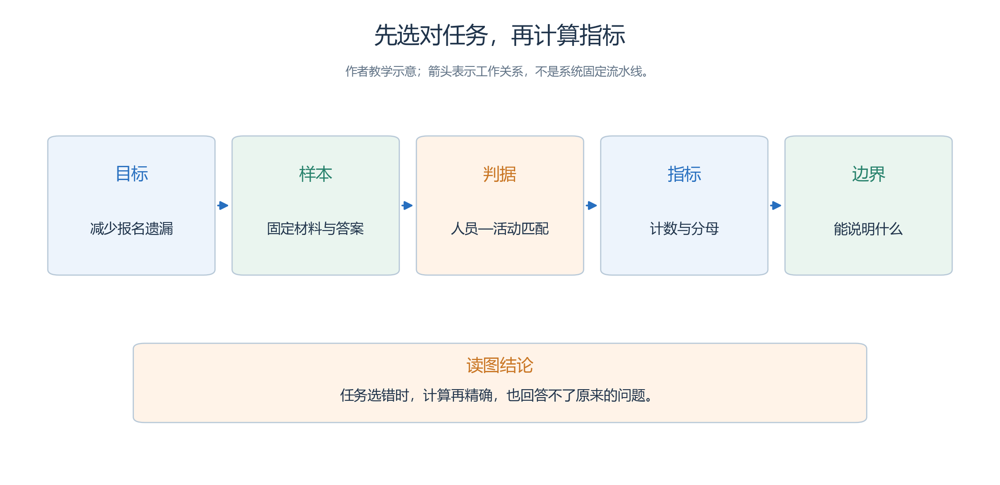
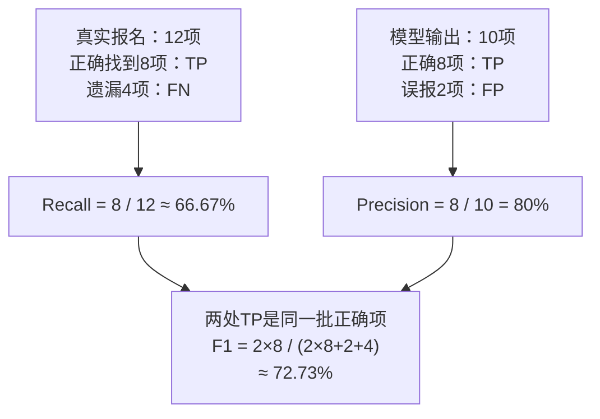
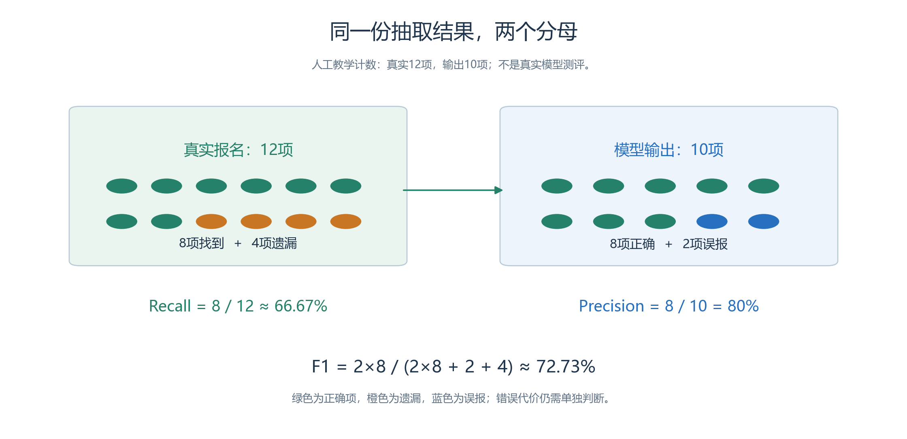
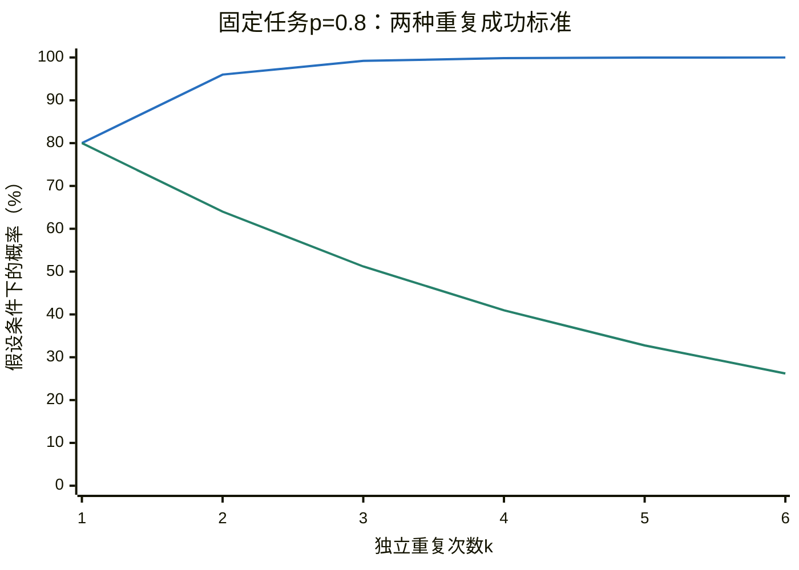
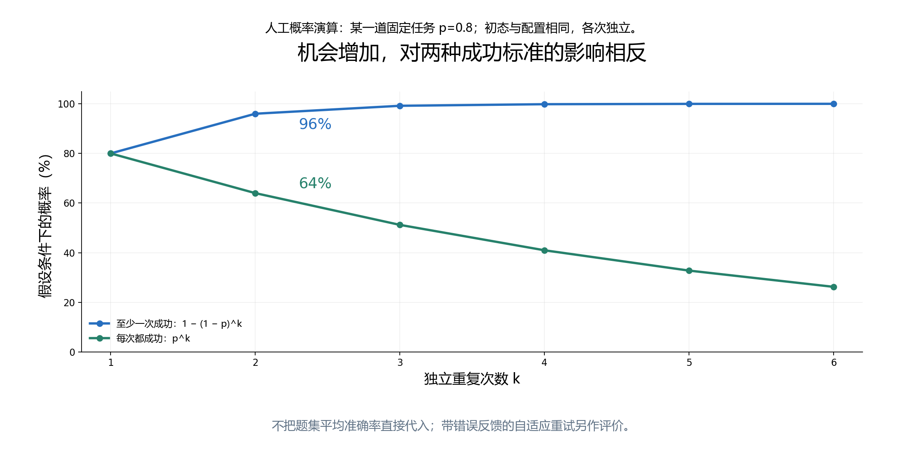
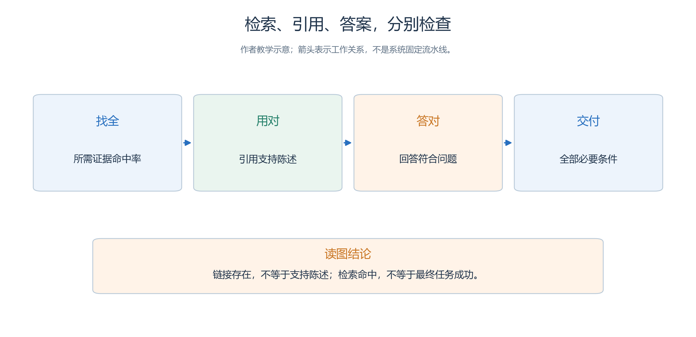
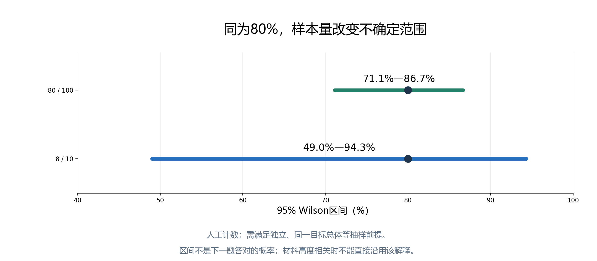

# 1.3 怎样把“聪明”变成可测量的问题

青禾社区学习中心准备选择一个活动筹备助手。

- 小林觉得甲模型“回答很像专业策划”，老周觉得乙模型“说话比较谨慎”。
- 两种印象都能提供线索，却还不足以决定谁来核对报名人数、检查场地冲突。
- 要回答这些问题，需要把“聪明”改写成可以观察、可以复核的行为。

例如，目标是“减少报名整理中的遗漏”，就先准备报名材料，人工标出应提取的信息，再检查模型找到多少、误报多少。

- 如果目标是“可靠地调整活动安排”，就需要核对调整后的实际结果，不能只数回答中出现了多少正确字段。
- 评价依次经过**使用目标、任务样本、可观察输出、判分规则、汇总指标和适用范围**。
- 指标是这条链上的一环；
- 选错了任务，再精确的计算也不能回答原来的问题。

本节全部人物、题目、运行记录和数值均为虚构教学数据，不是任何实际模型的测评成绩。引用的论文和资料用于说明评价方法。

## 1.3.1 从十道小题开始：准确率在数什么

这一小节用十道开放日事实题计算准确率。先把目标、题目、判据、分母和结论范围连起来，再读下面的逐题得分。

<a id="figure-s13-evaluation-chain"></a>

<!-- book-figure: s13-evaluation-chain -->


*图1.3-1　同一份材料、十道事实题、预先确定的答案，共同限定8/10的含义；不能把它外推为全部任务的成功率。*

**原图参考（转换前）**



先让助手阅读一份已经确认的开放日资料，再回答十道事实题。评分者提前写好标准答案，只检查事实是否正确；“上午九点”与“09:00”视为同一答案。

| 题号 | 问题 | 标准答案 | 助手答案 | 得分 |
| --- | --- | --- | --- | --- |
| 1 | 报到几点开始？ | 09:00 | 09:00 | 1 |
| 2 | 志愿者几点集合？ | 08:45 | 08:45 | 1 |
| 3 | 阅读活动几点开始？ | 09:30 | 09:30 | 1 |
| 4 | 阅读活动几点结束？ | 10:10 | 10:30 | 0 |
| 5 | 阅读活动在哪个房间？ | 阅览室 | 阅览室 | 1 |
| 6 | 阅读活动人数上限是多少？ | 20 人 | 20 人 | 1 |
| 7 | 绘画活动几点开始？ | 10:00 | 10:00 | 1 |
| 8 | 绘画活动几点结束？ | 10:40 | 10:40 | 1 |
| 9 | 绘画活动人数上限是多少？ | 12 人 | 15 人 | 0 |
| 10 | 服务台是否提供无障碍协助？ | 提供 | 提供 | 1 |

每题正确记 1，错误记 0，把最后一列相加得到 8，因此：

`准确率 = 正确题数 / 纳入评价的题数 = 8 / 10 = 80%`

这个数能说明：在这份资料、这十道题和这套判分规则下，助手答对了八道。它没有说明其余所有开放日问题也有 80% 的成功率。十题主要测信息读取，没有测复杂排程，更没有测真实工具执行。

分母必须事先约定。

- 如果第十题超时，按本次“限时完成全部问题”的规则应计失败，仍以十题为分母。
- 若试验被外部停电打断，可以按预定规则作废，但要记录原因，不能看到结果后只保留成功响应。
- 自由回答中的拒答如何计分，也应由题目目标决定：资料有答案却拒答可能是失败，资料没有答案时承认未知可能是正确。

题型还影响起点。每题恰有四个选项、只有一个正确且均匀随机选择时，猜测的期望准确率是 25%；这不表示随便猜十题一定答对两三题。题目若全是很容易的常识，90% 与专业难题上的 90% 也不是同一种证据。

## 1.3.2 少报和误报：为什么还需要 Precision、Recall 和 F1

这次改做报名提取：真实12项，输出10项，正确找到8项。图把“应该找到多少”和“报出来多少”分成两个分母。

<a id="figure-s13-extraction-counts"></a>

<!-- book-figure: s13-extraction-counts -->



*图1.3-2　左右两处TP是同一批8项正确报名；4项遗漏影响召回率，2项误报影响精确率，随后合算F1。人工算例。*

**原图参考（转换前）**



小林接下来要求助手整理报名材料。约定一条“人员—活动”对应关系算一项报名，姓名与活动都匹配才算正确；重复输出不能重复得分。材料中实际有 12 项，助手报出 10 项，其中 8 项正确，2 项是误读，还遗漏了 4 项。

这时有三种需要分开的计数：TP 是正确找出的项目，本例为 8；FP 是错误报出的项目，为 2；FN 是本应找出却遗漏的项目，为 4。于是：

```text
Precision（精确率）= TP / (TP + FP) = 8 / 10 = 80%
Recall（召回率）   = TP / (TP + FN) = 8 / 12 ≈ 66.67%
F1                = 2TP / (2TP + FP + FN) = 16 / 22 ≈ 72.73%
```

精确率问“报出来的有多少是真的”，召回率问“应找出来的有多少被找到”。

- 前者低，会产生不存在的报名；
- 后者低，会漏掉已经报名的人。
- F1 是两者的调和平均，不能靠其中一项很高就掩盖另一项很低，适合把两类错误一起观察。
- 它没有替组织者决定错误的代价：漏掉无障碍协助需求可能比多交给人工复核一条候选更严重，此时仍要单独报告召回率，并据业务代价设定验收门槛。
- 指标的定义及这种取舍可参阅 [Stanford《信息检索导论》](https://nlp.stanford.edu/IR-book/html/htmledition/evaluation-of-unranked-retrieval-sets-1.html)。

多类信息怎么汇总，也会改变结论。

- 假设普通报名的计数仍为上例，无障碍协助需求另有 `TP=2、FP=0、FN=2`，其 F1 为 `4/6≈66.67%`。
- **宏平均**先算每类 F1，再平等平均，得到 `(72.73%+66.67%)/2≈69.70%`；
- **微平均**先合并计数，得到 `TP=10、FP=2、FN=6`，再算出 `20/28≈71.43%`。
- 前者给每一类相同权重，后者让项目多的类别产生更大影响。
- 报告“F1 为多少”时必须交代平均方式；
- 宏 F1 也不是把宏精确率、宏召回率再代入 F1 公式。[scikit-learn 的 F1 定义](https://scikit-learn.org/stable/modules/generated/sklearn.metrics.f1_score.html)明确区分了这些口径。

还有一个小陷阱：没有输出任何项目时，精确率的分母为零；

- 某类在真实材料中完全不存在时，召回率的分母为零。
- 若 TP、FP、FN 都为零，F1 也未定义。
- 应提前约定显示“不适用”、按指定值计分或从某种汇总中排除，并公布有效类别数。
- 若真实有项目而全部漏掉，F1 则为 0，不能按“不适用”隐藏失败。

## 1.3.3 满足要求，是否就完成了任务

- 组织者要求通知“使用中文、包含日期、列出三个项目、以联系方式结尾”。
- 假设两份通知各有四条可检查约束，一份全过，另一份通过三条，则逐约束通过率是 `7/8=87.5%`，全部约束同时满足的通知比例却只有 `1/2=50%`。[IFEval 原论文](https://arxiv.org/html/2311.07911v1)正是把逐条指令与整条提示的通过情况分开评价，并区分严格、宽松的检查规则。

即使四条约束都满足，通知也可能把开放日期写错。

- 再如，助手调用改期工具时，参数格式正确、工具返回成功，也不代表“已把阅读活动移至可容纳全部报名者的空闲房间，并保留其他安排”这个任务成功。
- 评价者还应检查最终房间、容量、时间冲突以及是否误改其他活动。

任务成功率通常按“通过全部必要验收条件的任务数 / 任务总数”计算。中间的格式合规率、工具调用正确率帮助定位失败；最终任务率回答能否交付。两类指标应一起保留，不能相互替代。

## 1.3.4 多给几次机会，与每次都可靠，是两个问题

对同一道固定任务，假设每次独立成功的概率都是0.8。增加尝试次数时，“至少一次成功”和“每次都成功”会朝相反方向变化。

<a id="figure-s13-repeat-success"></a>

<!-- book-figure: s13-repeat-success -->



*图1.3-3　上升线对应至少一次成功，下降线对应每次都成功；k=2时分别为96%与64%。固定概率的假设演算，不是题集实测。*

> 蓝线（第1条、上升）为至少一次成功1−(1−p)^k；绿线（第2条、下降）为每次成功p^k。k=2分别为96%和64%。固定任务、初态与配置相同、各次独立；不能直接代入题集平均准确率，自适应重试另评。

**原图参考（转换前）**



如果助手第一次生成的排程检查程序有错，第二次成功了，应该怎样评价？`pass@1` 关注一次尝试；

- `pass@k` 关注同一道任务的 k 个候选中至少有一个成功。
- 它适合有可靠验证办法的场景，例如用测试检查程序。
- 但“候选中存在正确答案”并不保证应用能选出它，选择机制和全部候选的成本也要交代。[HumanEval 原论文](https://arxiv.org/html/2107.03374v2)用功能测试与多次采样评价代码生成，并给出了相应估计方法。

服务台自动办理事项更关心重复运行是否稳定。`pass^k` 问同一道任务独立重复 k 次，是否每次都成功。[τ-bench 原论文](https://arxiv.org/html/2406.12045v1)用这个指标区分偶尔成功与持续可靠。

为了直观理解，假设**某一道固定任务**每次成功概率都是 p，各次试验独立，且模型设置和初始环境相同，则：

```text
至少一次成功：pass@k 对应概率 = 1 - (1 - p)^k
每次全部成功：pass^k 对应概率 = p^k
```

设 `p=0.8、k=2`，前者为 96%，后者为 64%。

- 机会越多，“至少成功一次”越容易，“每次都成功”却越难。
- 这里的 k 次是相同初始条件下的独立试验，不是把第一次错误、修改后的提示和残留状态交给第二次的自适应重试。
- 后者也值得测试，但测的是整个重试策略。

更不能把全题集平均准确率直接当作上式的 p。

- 假设一半题始终成功，另一半始终失败，总平均为 50%；
- 重复两次后，至少一次成功和两次全部成功的题目比例仍都是 50%，不是 75% 与 25%。
- 题目难度不同，需要先逐题计算，再按规定汇总。

研究中常对每题采样 n 次，观察 c 次成功，在 `1≤k≤n` 时，用 `1-C(n-c,k)/C(n,k)` 估计 pass@k，用 `C(c,k)/C(n,k)` 估计 pass^k，然后对题目取平均。

- `C(a,k)` 表示从 a 项中选 k 项的组合数，`a<k` 时取 0。
- 这些是上述独立同分布采样条件下的无偏估计；
- 当 `k>1` 时，把有限样本的 `c/n` 直接代入幂公式，一般并不无偏。
- 初学者至少要记住：比较成绩时，同时对齐尝试次数、验证方式、环境重置和预算。

## 1.3.5 找到证据，还要用对证据

要回答“阅读活动是否需要改期”，先找原安排与最新占用通知，再检查回答是否正确引用它们。下图把证据进入候选与最终交付分开。

<a id="figure-s13-evidence-check"></a>

<!-- book-figure: s13-evidence-check -->


*图1.3-4　“找全、用对、答对、交付”各有自己的检查；下文依次计算检索命中、引用支持与覆盖，不能用一个比例代替全链条。*

**原图参考（转换前）**



开放日资料越来越多后，助手可能先检索再回答。

- 假设“阅读活动是否需要改期”必须查到两项证据：原安排与最新房间占用通知。
- 检索前五条结果只包含其中一项，则本例按证据项目计算的 `Recall@5=1/2=50%`。
- 重复命中同一证据不能当作找到两项。
- 它合理地测量“所需材料有没有进入候选范围”，却没有检验助手怎样理解材料。

“相关”应提前标注，评价单位可以是文档或去重后的证据片段，不应在算分中混用。

- 有些基准把“至少命中一个答案证据”也命名为 recall；
- 遇到这类分数要查看具体定义。
- 若没有应找证据，召回率分母为零，应另设“无需检索”样本规则。
- 若关心正确资料排得是否靠前，还可增加排名指标，但不能仅提高 k，把大量无关内容一并塞给模型。

回答阶段再把可核验陈述拆开检查。

- 本书约定：**引用支持率**为“得到其所附引用充分支持的陈述数 / 带有引用的可核验陈述数”；
- **证据覆盖率**为“得到所附引用充分支持的陈述数 / 全部需要外部证据的陈述数”。
- 若答案有五条需证据的陈述，四条附有引用，其中三条真正得到支持，两率分别为 75% 和 60%。
- 这是一套本书明确选定的口径，并非所有榜单通用定义。
- 没有附引用时，支持率未定义；
- 只要仍有需证据的陈述，覆盖率就是 0。

最后还要检查答案是否正确、是否遗漏关键条件。引用确实来自一份旧通知，也可能不适用于已经改期的活动；“有出处”不能替代时效与冲突核验。

## 1.3.6 开放写作为什么需要偏好评价

邀请函很难只有一个标准答案。

- 可以隐藏模型名称，让读者在相同材料下比较两份文本，分别评价事实忠实、信息完整、表达清楚和受众适配，再作总体选择。
- 假设甲在十次配对评价中胜六次、平两次、负两次，若事先规定平局算半分，则得分为 `(6+0.5×2)/10=70%`；
- 若只统计非平局胜率，则为 `6/8=75%`。
- 两种口径都能使用，但必须写清。

偏好评价合理地补充了唯一答案难以覆盖的体验，却会受读者群体、文字长短和呈现顺序影响。

- 应交换左右位置、使用明确量表，并单独核对事实。
- 模型也可以充当裁判，但需要用人工标注样本检查其偏差；[MT-bench 与 Chatbot Arena 原论文](https://arxiv.org/html/2306.05685v4)讨论了模型裁判的位置偏差、冗长偏差等问题。
- 一个偏好排名首先代表特定评价人群与题目分布下的相对表现，不能直接换算成“完成工作百分比”。

## 1.3.7 自信是否可信：校准与 Brier 分数

假如助手对一批判断都报告“有 80% 的把握”，这些判断长期约有 80% 正确，才符合概率校准的直观含义。

- 模型说“我非常确定”本身没有可计算的概率意义；
- 即便给出 0.8，也要用实际结果检验。
- 关于预测概率与真实正确频率的关系，可参阅 [Guo 等人的校准研究](https://proceedings.mlr.press/v70/guo17a.html)。

本书采用二元结果的 Brier 分数：第 i 项预测成功概率为 `p_i`，最终成功记 `y_i=1`，失败记 `y_i=0`，计算各项 `(p_i-y_i)^2` 的平均。数值越小越好，按此约定范围为 0 到 1。[Brier 分数定义](https://scikit-learn.org/stable/modules/generated/sklearn.metrics.brier_score_loss.html)也提醒我们区分二元与多类别的计算约定。

两项预测都给 0.9，一项成功、一项失败，其平均分是 `(0.01+0.81)/2=0.41`；

- 两项都给 0.5，同样结果下为 0.25。
- 这个小例子说明高置信的错误会受到较大惩罚，不能凭两项就判断长期校准水平。
- Brier 同时反映概率预测质量的多个方面，不是纯粹的校准误差；
- 还应按预测概率分组，检查各组真实成功率及样本量。[概率校准说明](https://scikit-learn.org/stable/modules/calibration.html)进一步解释了这种区别。
- 若所有任务一律报相同概率，即使整体频率碰巧对上，也未必能识别哪些任务更难。

## 1.3.8 能用，还要等得起、付得起

组织者面对的不是单个分数，而是实际等待。

- 首 Token 延迟 TTFT 在本书中定义为客户端发出请求至收到第一个输出 Token 的时间；
- 端到端延迟则从用户提交任务开始，到应用完成校验并交付结果结束。
- 检索、工具等待、重试和文件保存都属于后者。
- 很快显示“正在处理”，不能证明任务完成得快。

把一批任务延迟排序，P50 是中位数，P95 描述接近最慢一端的等待。

- 小样本应说明分位数算法，例如本书可用排序后第 `ceil(0.95×N)` 项作 P95，不能混用算法比较。
- 还要记录失败率和超时门槛；
- 只统计成功任务的延迟，可能把最差体验排除。
- 吞吐则测固定负载下单位时间完成多少任务，与单用户等待时间回答的是不同问题。

成本同样必须覆盖失败。

- 假设十项任务连同所有重试共花费 10 元，八项通过验收，则每次成功任务成本为 `10/8=1.25 元`，不是只把八项成功调用的费用相加。
- 成本范围应说明是否含工具、计算资源和人工复核；
- 成功数为零时该比值没有有限值，应报告“无成功任务”及总支出。
- 比较效率还需固定输入规模、输出要求、并发、缓存与质量门槛，便宜而频繁失败未必节省预算。

## 1.3.9 分数有多稳，证据能说明多远

同为80%，8/10与80/100支持的结论有多稳？先看两条区间的宽度，再读下方的抽样前提。

<a id="figure-s13-uncertainty"></a>



*图1.3-5　点估计同为80%；在正文的独立二项抽样假设下，80/100的95% Wilson区间比8/10更窄。人工计数演算，不是模型实测。*

八题正确得到 80%，八十题正确也可以得到 80%，但两者通常支持不了同样强的结论。在独立、来自同一目标任务总体等二项抽样假设下，8/10 的 95% Wilson 区间约为 **49.0%—94.3%**，80/100 的约为 **71.1%—86.7%**。样本增加使区间收窄；计算方法见 [NIST 比例置信区间说明](https://www.itl.nist.gov/div898/handbook/prc/section2/prc241.htm)。

95% 置信区间的含义是：若按相同抽样与计算方式反复进行，长期约 95% 的这类区间会覆盖总体真值。

- 它不是“模型下一题有 95% 的概率答对”，也不是当前这个固定区间包住真值的主观概率。
- 若十题全取自同一份通知，内容高度相关，更不能仅凭上面的独立抽样公式宣称已精确测出实际工作能力。

比较两个模型时，优先让它们回答相同题目，保留逐题结果，观察差异来自哪些任务；

- 再按任务和运行随机性分别考虑重复试验。
- 把同一题改十种说法，不能不加说明地当成十个完全独立的新任务。
- 题目和提示应在测试前确定，调提示所用的材料与最终测试材料分开保存，否则容易把对测试集的反复调整误认为普遍进步。

还有两类问题不会被扩大样本量自动解决。

- **测试污染**是测试题、答案或高度相近内容进入训练或调优过程，使成绩可能混入记忆优势；
- **基准饱和**是大量模型已接近题集上限，使这套题越来越难区分新进步。
- 前者需要数据来源与去重证据，后者需要更有区分度且仍贴近用途的任务，不能仅看分数就断言发生了哪一种。
- 公开训练数据之外的信息不可见时，应明确污染情况未知。[HELM 原论文](https://arxiv.org/html/2211.09110v1)把污染、评价条件与多维指标放在同一评价框架中讨论，提醒读者不要孤立阅读一个总分。

- 对青禾社区学习中心而言，一张有用的结果表应同时回答：测试了哪些工作，怎样算成功，失败在哪里，是否重复验证，耗时和成本多少。
- 下一节将用这套读法进入具体能力领域，逐项理解知识、推理、代码、工具和多模态基准，而不把排行榜上的缩写当作能力本身。

---

[上一节：1.2](02-from-model-to-application.md) · [下一节：1.4](04-capabilities-and-benchmarks.md) · [返回本章目录](README.md)
