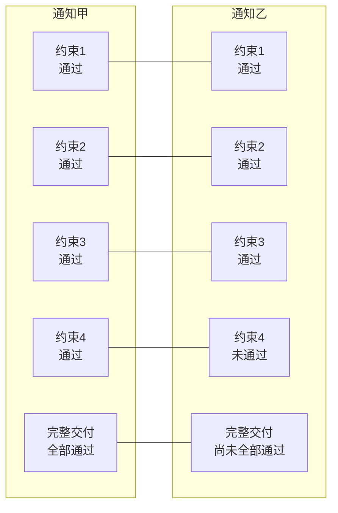
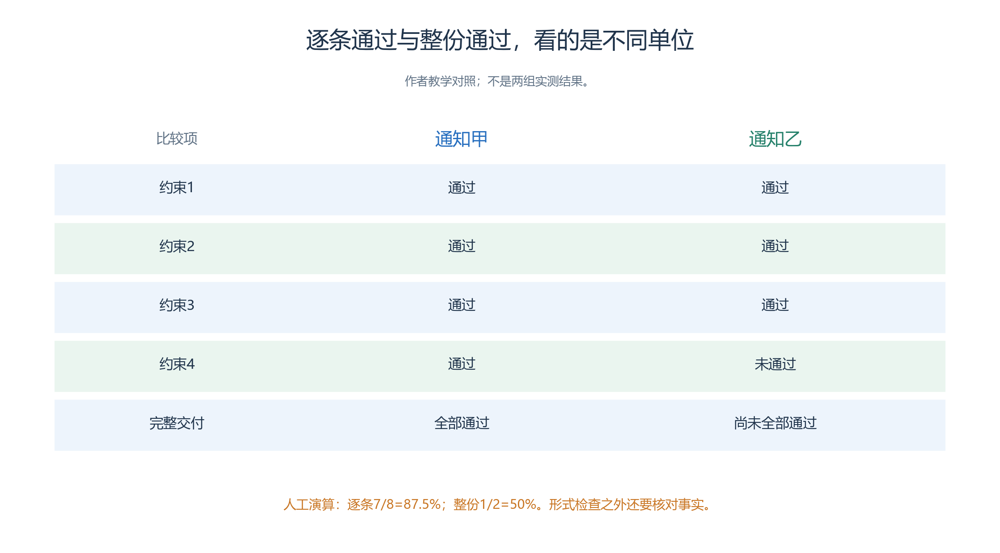
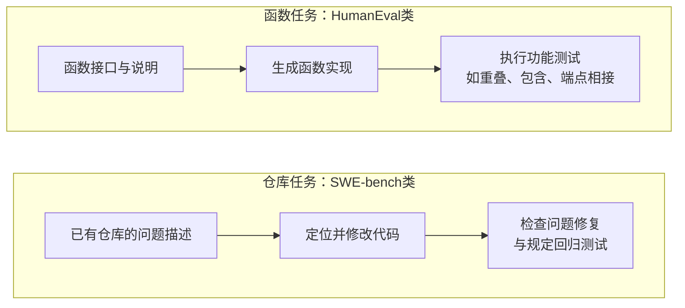
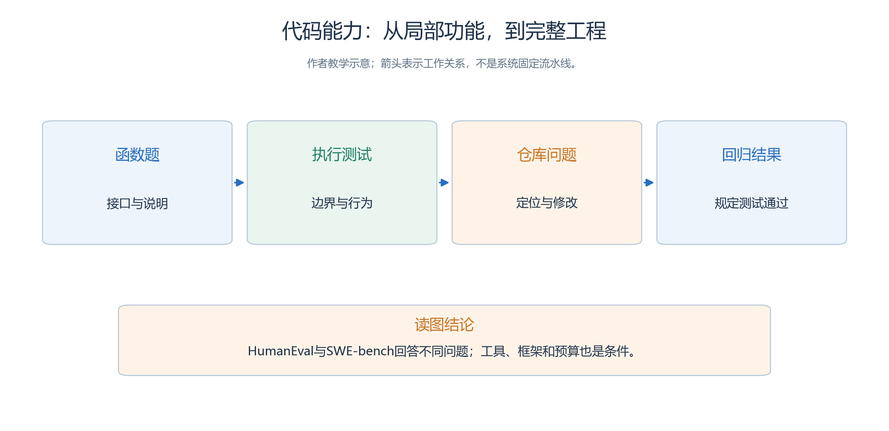
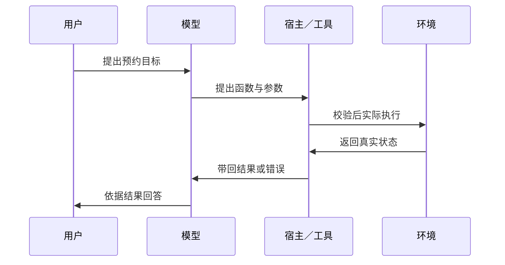
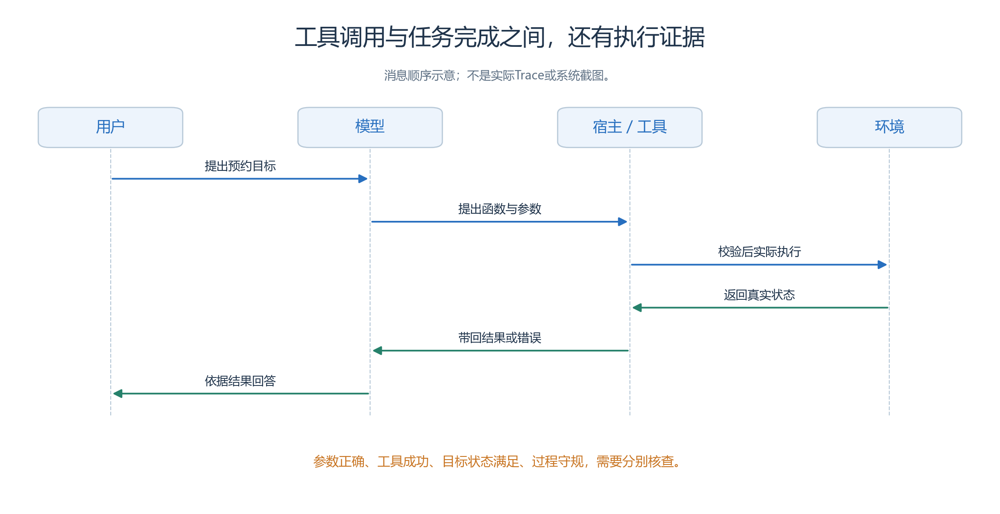
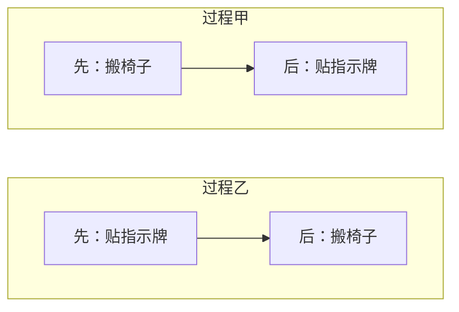
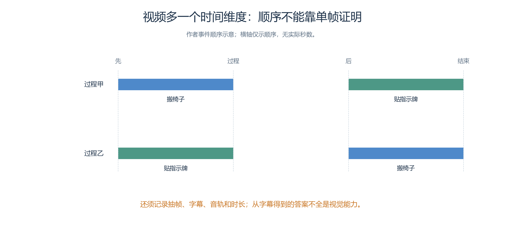

# 1.4 当前大模型有哪些能力：逐项读懂指标

筹备青禾社区学习中心开放日，组织者可能希望模型读懂场地规则、写通知、计算容量、检查报名程序，还希望它查询预约记录、听懂口述要求、看懂楼层图。

- 这些需求都可以用自然语言提出，却需要不同的能力，也需要不同的证据。
- 回答写得清楚，不能证明计算正确；
- 工具调用格式正确，也不能证明预约已经完成。

本节把能力拆开，逐项说明怎样测量、为什么这样测，以及怎样把基准成绩转化为自己的验收条件。

- 文中的开放日任务均为本书自编的教学情境，不是对应基准的原题，也不是模型实测结果。
- 基准名称与方法依据核验于 2026 年 9 月 25 日；
- 具体模型在特定条件下的发展水平，放在下一节的数据卡中讨论。

## 1.4.1 语言与知识：能否理解问题并运用相关知识

给模型三项材料，再问它怎样安排：

| 已知材料 | 内容 |
| --- | --- |
| 亲子阅读 | 面向儿童及陪同家长 |
| 数字课堂 | 面向希望学习手机操作的居民 |
| 报名方式 | 每项活动分别报名 |

**问题：**一位家长带孩子参加阅读，也想学习手机操作，应确认哪些安排？

有用的回答需要识别活动对象和潜在时间冲突，并指出报名与陪同规则仍待查阅。

- 只把原文改写一遍，尚未完成这个任务；
- 凭常识补出不存在的年龄限制，同样不合格。

业界常用多领域问答观察知识储备与理解能力。

- MMLU-Pro 包含多个学科的选择题，相比原 MMLU 增加了推理要求，并把选项扩展到最多十个。
- 评价时提取模型选择的答案，计算正确率；
- 选项增多降低了靠随机猜测得分的机会，但猜测基线仍要按题目的实际选项数判断。[MMLU-Pro 原论文](https://arxiv.org/abs/2406.01574)

这种方法合理之处在于把“知识丰富”变成一组有标准答案、能够重复评分的问题。

- 跨学科采样也能防止只用某个擅长领域代表全部能力。
- 不过，成绩同时受到知识覆盖、题目理解和推理的影响，并没有把三者完全分离。
- 选择题还提供了答案线索；
- 在真实咨询中，模型往往需要自己提出答案，甚至先发现信息不足。

因此，开放日助手的验收要补上中文资料题。

- 让它分别处理明确写出的事实、需要合并两段材料才能得到的结论，以及材料没有提供的内容。
- 对于最后一类，指出“还需要确认”比补出一个似乎合理的答案更有价值。
- 英文多学科成绩提供筛选线索，中文场景中的事实忠实性、表达和信息缺口识别仍需单独检查。

## 1.4.2 指令遵循：能否同时满足明确要求

先沿用1.3.3的两份通知：每份有四项要求。逐条数合格项，再逐份检查是否全部合格，会得到两个不同的比例。

<!-- book-figure: s14-instruction-levels -->

*图1.4-1　通知甲4项通过、乙3项通过：逐条7/8=87.5%，整份1/2=50%。下面另用单份3/4解释要求，分母不混用。*

**原图参考（转换前）**

现在要求模型写通知，同时满足四项条件：

1. 只输出标题和正文两段。
2. 正文必须出现“青禾社区学习中心”。
3. 不得出现“免费”。
4. 不增加材料中没有的时间。

其中既有形式约束，也有事实约束。

- 模型可能把地点写对，却多加了说明；
- 也可能严格输出两段，却把未确定的时间写成定案。

IFEval 专门研究可验证的指令，例如必须出现某个词、使用指定格式、满足规定长度。

- 它把部分要求转化为程序检查，减少评分者对“是否听话”的主观判断。
- 它分别报告指令级与提示级成绩：前者逐条统计要求，后者只有在一道提示中的全部要求都满足时才算通过。
- 严格与宽松两种判法也要区分；
- 宽松判法通过预定文本变换减少格式造成的误判，同时可能引入新的误判。[IFEval 原论文，第 2—3 节](https://arxiv.org/html/2311.07911v1)

假设一份通知有四项要求，模型满足了三项，那么这份通知的逐条通过比例是 75%，整份任务却没有全部通过。

- 这正是两种指标都值得保留的原因：前者帮助定位薄弱环节，后者接近交付文件必须同时合格的要求。
- 这只是教学计算，不是 IFEval 的实测分数。

程序检查的边界也很明确。

- “没有出现‘免费’”可以直接检测，“语气体贴”需要量表判断，“没有捏造时间”需要核对资料。
- 中文长度还必须说明按汉字、字符还是分词后的词数统计。
- 本书的通知验收会同时检查形式、事实和受众适配，不能把其中一项通过写成整份内容可靠。

## 1.4.3 数学与科学推理：能否在约束下得到可验证答案

假设一间教室在 09:00—12:00 可用，10:00—10:30 被其他活动占用。

- 每场体验课需要连续 45 分钟，两场之间至少留 15 分钟整理，最多能安排几场？答案是两场，例如 09:00—09:45 和 10:30—11:15。
- 评价时既要核对场数，也要检查给出的时间是否越界或冲突。
- 只检查“2”这个数字，可能放过一份错误的安排。

AIME 竞赛数学题常被用于观察数学求解能力。

- 采用它的模型评测通常按固定年份题集核对最终答案，并报告准确率或 pass@1；
- 多次采样再投票属于另一种设置。
- 固定答案减少主观判分，使数学结论便于检验，但年份、试卷范围、采样次数和答案选择方法都必须保留。
- 采用 AIME 2024 的研究报告就明确区分了单次能力估计与多数投票的结果。[DeepSeek-R1 原始研究报告](https://arxiv.org/html/2501.12948v1)

GPQA 则用由领域专家编写和验证的生物、物理、化学选择题，检验专业知识与复杂求解。

- 其设计还请非本领域的高学历人员尝试借助网络找答案，借此筛选不容易靠简单检索解决的问题。
- Main、Diamond 等分集有不同筛选条件，分数必须与分集一起读。[GPQA 原论文](https://arxiv.org/html/2311.12022v1)

这两类题集把难度放在了不同地方。

- 数学题强调约束关系与可核验结论，科学题往往还需要专业概念。
- 答对这些题能够支持“在该类问题上具有求解能力”，却不能直接支持“能够独立开展科学研究”：真实研究还涉及提出问题、设计实验、处理不确定数据和接受重复验证。
- 长篇解题文字也不是正确性的替代证据。

对开放日安排，本书会要求模型给出可以交给独立程序检查的时间段和人数。

- 算术交给计算工具之后，仍要检查模型是否理解了“连续占用”“至少间隔”以及边界时刻。
- 使用工具改变了完成任务的条件，应当单独记录；
- 它的价值在于提高应用结果的可靠性，而非让一次工具辅助结果代表模型闭卷能力。

## 1.4.4 代码与软件工程：从写出函数到修复真实问题

下面比较两种代码任务：按说明写时间冲突函数，以及修复报名程序中的重复记录。它们各自需要执行证据。

<!-- book-figure: s14-code-evidence -->

*图1.4-2　HumanEval类函数题用功能测试检查实现；SWE-bench类仓库题检查问题修复与规定回归。两条路线的成绩不能直接换算。*

**原图参考（转换前）**

开放日报名表需要一个函数判断两项活动是否时间冲突。

- 约定活动区间左闭右开，那么 09:00—10:00 与 10:00—11:00 可以衔接。
- 模型生成的代码应该接受普通重叠、完全包含、端点相接等测试。
- 代码排版整洁、注释充分，不能代替这些行为检查。

HumanEval 给出函数签名与文字说明，通过执行测试评价生成功能是否正确，并使用 pass@k 描述给定候选次数下的通过情况。

- 这比比较生成代码和参考代码的文字相似度更合理，因为不同实现可以完成相同功能；
- 多次生成中至少一次通过，却不等于一次交付就能成功。[HumanEval 原论文](https://arxiv.org/abs/2107.03374)

真实维护还要面对已有代码。

- 假设报名程序在重复点击后产生两条记录，工程助手需要找到入口、理解现有数据处理、修改实现并验证相关行为。
- SWE-bench 就使用真实仓库的问题描述及代码环境评价修复；
- Verified 是人工核验后的 500 个问题子集，核验涉及描述、测试与可解性。
- 其问题解决率衡量修复是否满足规定测试，而不是补丁是否看起来像人工答案。[SWE-bench Verified 官方说明](https://www.swebench.com/verified.html)

这类结果属于模型与执行系统的共同表现。

- 搜索代码的方式、允许运行的工具、反馈次数和预算都可能改变成绩。
- 测试也只覆盖写入断言的行为，未必覆盖所有边界条件、可维护性和安全属性。
- 因此，本书的程序验收会保留需求对应的测试与修改内容，并检查已有功能是否受影响。
- 简单函数的高通过率不能直接换算成维护整套系统的成功率。

## 1.4.5 工具与 Agent：会提出调用，能否完成目标

以预约教室为例，先区分“模型提出预约参数”和“宿主真的提交预约”。沿消息方向找到真实状态返回的位置。

<!-- book-figure: s14-tool-state -->

*图1.4-3　调用请求要经过宿主执行，并取回环境状态；下文分别检查参数、执行、目标状态与过程约束。预约往返为教学示意。*

> 参数正确、工具成功、目标状态满足、过程守规，需要分别核查。

**原图参考（转换前）**

“帮我预约一间适合十二人的教室”至少包含查询空闲时段、确认容量、补齐时间、提交预约和核对结果。

- 模型若请求 `reserve_room` 却遗漏日期，是参数错误；
- 接口返回成功而最终预约对象错误，是任务失败；
- 模型只说“已预约”，但没有执行记录，则没有完成证据。

BFCL，即 Berkeley Function Calling Leaderboard，围绕工具定义与用户请求评价函数调用。

- 其早期方法同时使用抽象语法树检查和执行核验：前者解析调用结构，检查函数及参数是否符合规定答案；
- 后者观察执行结果。
- 任务还包括从多个函数中选择、提出多个调用，以及识别没有适用工具的情形。
- 后续版本扩展了交互范围，因此引用时必须带版本。[BFCL 方法说明](https://gorilla.cs.berkeley.edu/blogs/8_berkeley_function_calling_leaderboard.html)、[官方基准入口](https://gorilla.cs.berkeley.edu/leaderboard.html)

- 这些检查能把接口选择和参数构造中的错误定位出来，但长任务还需要评价目标状态。
- 原始 τ-bench 让 Agent 在领域规则、工具与模拟用户之间交互，主要通过对话结束后的环境状态与目标状态比较来评价结果，并提出 pass^k 观察同一任务重复执行时是否每次都成功。[τ-bench 原论文](https://arxiv.org/html/2406.12045v1)

最终状态比“我已经办好”的文字更接近用户目标，不过并非所有过程约束都能仅凭终态识别。

- 提前越权读取信息、重复提交后又撤销等行为，仍需检查调用记录。
- 用户模拟器、任务版本和环境规则也限制成绩适用范围，原始 τ-bench 的成绩不能直接与后续 τ 系列混合排名。

开放日助手因此需要分层验收：参数是否正确、工具是否执行、最终状态是否符合请求、过程是否遵守权限与规则。

- 第三章的仿真角色同样遵循这个原则：声称抵达、完成活动或更新对象，不构成世界变化；
- 需要查看系统已提交的动作与状态事实。

## 1.4.6 长上下文与检索：放得进去，是否能够正确使用

活动资料可能包含场地手册、往年安排、报名表和多次修改通知。

- 组织者问：“哪项活动需要换教室，原因是什么？”答案可能分散在容量表、报名人数和最新通知里。
- 只找出某一句“阅读室可用”，不足以处理后来出现的容量冲突。

LongBench v2 用长材料中的问答评价这一类能力，包含单文档、多文档、长对话历史、代码仓库等六类任务，共 503 道选择题。

- 选择题便于稳定判分，但任务仍要求从较长输入中找出并综合相关信息。
- 项目页报告材料长度的单位是词，不能直接当作模型接口的 Token 数。[LongBench v2 官方项目页](https://longbench2.github.io/)

RULER 则通过可控制的合成任务，改变上下文长度与复杂度，包含检索、多跳追踪、聚合和问答。

- 比如把代号映射分散在多处，要求沿映射找到最终对象；
- 这比只在长文本中寻找一句指定句子更能检验信息组合。
- 合成任务有利于控制变量，不过不能代替真实文档中的歧义、过期信息和复杂排版。[RULER 原论文，第 3—4 节](https://arxiv.org/html/2404.06654v3)

开放日资料的测试应当同时改变信息位置、插入无关材料，并加入明确标注日期的旧通知。

- 我们要观察模型是否找到全部必要证据、是否采用有效版本、结论是否受到证据支持。
- 如果先检索再回答，还需把“检索有没有找全”和“模型有没有用对”分开评分。
- 一次找到埋在长文本中的名字，不能证明它能可靠处理同样长度的所有任务；
- 跨会话的持久记忆又是另一项应用机制。

## 1.4.7 图像、文档和图表：看见内容，也要看懂关系

- 给模型一张场地示意图、一份扫描报名单和一张人数柱状图，分别询问入口位置、报名者姓名、两个时段人数之差，得到的是三种不同的视觉任务。
- 它们涉及空间关系、文字与版面、图形编码与算术，不能合并为一句笼统的“识图能力强”。

*图1.4-4　三块示意输入分别考查空间关系、文档版面和图表编码。右图没有数值刻度，不能算出精确人数差；下文再解释对应评价。*

MMMU-Pro 使用多学科图文问题，并过滤部分仅凭文字就能回答的题目，还设置把题目置于图像内的输入形式。

- 这样可以减少模型绕开图像、只利用文字线索答题的情况。
- 准确率衡量该类多模态问题的回答是否正确，仍受分辨率、裁剪方式和输入设置影响。[MMMU-Pro 原论文](https://arxiv.org/html/2409.02813v1)

DocVQA 更接近扫描材料的使用情境：针对文档图像提问，需要读取内容并理解版面结构。

- 其主要指标 ANLS，即平均归一化编辑相似度，根据把预测答案变成参考答案所需的字符编辑来衡量接近程度，并对差异过大的答案计零分。
- 采用它是为了避免轻微文字识别误差一律得零分，但字符接近不等于业务上可以接受。
- 姓名错一个字、人数错一位数，可能都必须重新核对。[DocVQA 原论文，第 5.1 节](https://arxiv.org/html/2007.00398v3)

ChartQA 针对图表中的视觉与逻辑问题。

- 原论文对数值答案采用允许 5% 偏差的宽松准确率，对非数值答案要求精确匹配；
- 这个容差用于处理从图形提取数值可能产生的小误差。
- 它不能自动成为报名统计的容差：从柱高估计约两百人，与确认系统中究竟有两百零一条记录，是不同任务。[ChartQA 原论文，第 5.1 节](https://arxiv.org/html/2203.10244v1)

本书会优先用原始表格核对精确人数，用图片检查图文关系，并保存输入分辨率。

- 第三章还要把地图画面转化为空间语义与可行走规则；
- 模型看出“这里像一道门”，不能证明角色能够穿过。
- 最终应检查语义边界、碰撞与实际路径，视觉理解成绩不能代替这些系统事实。

## 1.4.8 语音、视频与生成：分别评价听懂、看懂和生成

居民可能口述“我不要上午的课程”，工作人员也可能录制一段布置现场的视频。

- 语音识别首先要准确转写，语义理解再判断是否拒绝上午安排。
- 词错误率 WER 用替换、删除、插入的词数之和除以参考词数，越低越好；
- 中文常按字符计算 CER，避免不同分词方式造成一部分差异。
- 大小写、标点、数字写法等归一化规则也会改变分数。[语音识别研究对 WER 与文本归一化的讨论](https://arxiv.org/html/2212.04356v1)

不过，漏掉“不要”与漏掉一个语气词都可能只增加很少的错误，业务影响却完全不同。

- 因此，开放日语音助手还应检查时段、人数、否定要求等关键信息，并按噪声、口音和多人交谈分别测试。
- 语音生成则需要另看内容正确、发音清楚、停顿自然及用户听懂情况；
- 听感评分不能证明它朗读的时间正确。
- 实时交互还要记录延迟与打断后的恢复。

视频理解多了时间维度。

同样完成搬椅子和贴指示牌，两段视频的先后顺序仍可能相反。回答“先做什么”需要时间信息。

<!-- book-figure: s14-temporal-input -->

*图1.4-5　甲先搬椅子，乙先贴指示牌；箭头只表示先后，不代表实际秒数。评估还须记录抽帧、字幕、音轨和时长。*

**原图参考（转换前）**

- 询问“志愿者先搬走椅子，还是先张贴指示牌”，单张截图无法完整作答。
- Video-MME 覆盖不同时长的视频，并讨论字幕、音频等输入对结果的影响。
- 因而视频问答正确率必须连同抽帧、时长、字幕与音轨设置读取，不能把字幕中得到的答案全部归为视觉能力。[Video-MME 原论文](https://arxiv.org/html/2405.21075v1)

生成能力则从要求走向新内容。

- 让模型画“一张桌子、两把蓝椅子，公告牌位于桌子右侧”，可以分别检查数量、颜色和相对位置。
- GenEval 正是以对象为中心评估这类图文一致性，优点是错误可以具体定位，但不能代表审美或中文文字质量。[GenEval 原论文](https://arxiv.org/html/2310.11513v1) 生成视频还要检查人物是否跨帧保持一致、运动是否连续、画面是否闪烁；
- VBench 将这些性质拆成不同评价维度。[VBench 原论文](https://arxiv.org/html/2311.17982v1)

- 这些能力可以帮助准备海报、口述材料和演示资源，并不意味着本仿真系统已提供对应的全部入口。
- 用于正式教材的地图与人物素材，还需要核对风格、比例、遮挡和跨状态一致性，不能只凭一次生成看起来满意就结束验收。

## 1.4.9 可信性：答对之外，还要知道依据与边界

组织者问：“开放日的负责人是谁？”资料没有写姓名，模型却给出一个自然流畅的回答，这是无依据的陈述。

- 另一个回答说“材料没有提供负责人姓名，需向组织者确认”，在这个任务上反而更有用。
- 事实性评价需要知道哪些话能核验，以及核验所依据的材料范围。

FActScore 提出把长回答拆成更小的事实陈述，再计算得到可靠来源支持的比例。

- 这样一段包含十项信息的介绍，不必因为其中一项错误就只能整体判为错误，也不会因为大部分内容正确而掩盖那一项问题。[FActScore 原论文](https://arxiv.org/html/2305.14251v1) 对本书材料，可以分别核对时间、地点、参与对象和报名条件；
- “没有找到证据”与“证据明确反驳”还应分别记录，便于后续补查。

单看事实支持比例也会出现偏差：模型只说一句安全的常识，可能全部有据，却遗漏用户真正需要的信息。因此还要检查完整性，以及证据是否覆盖当前问题。引用了一个链接，也不代表链接内容支持那句话。

可信性还包括校准和稳健性。

- 如果系统输出可比较的正确概率，那么被估为八成把握的一组任务，实际正确频率是否接近八成，才是校准问题；
- “我非常确定”只是一种措辞。
- 把请求换个说法、调整材料顺序后，答案是否无故改变，则属于稳健性。
- HELM 将准确性、校准、稳健性与效率等维度共同纳入评价，提醒我们不要让一个准确率遮住其他性质。[HELM 原论文](https://arxiv.org/html/2211.09110v1)

开放日验收会包含资料缺失、明确冲突和无权限请求，也包含本来可以正常完成的请求。既检查应该停止却继续编造的情况，也检查本可回答却过度拒绝的情况。拒绝次数更多，并不自动意味着系统更可信。

## 1.4.10 开放写作：没有唯一答案，仍然可以认真评价

同一份开放日通知，可以写得亲切，也可以写得简洁。

- 两篇不同文本都可能合格，逐字匹配参考答案就不合理。
- 此时应先分开硬要求与表达质量：时间地点必须正确，必要事项必须齐全；
- 在这些条件之上，再评价是否清晰、是否适合居民阅读、是否便于采取下一步行动。

一种可行方法是让不了解模型身份的评阅者，对同一任务的两个结果作成对比较，允许平局，并写明选择理由。

- 另一种方法是使用明确量表，例如“报名方法缺失”“有所提及但不能照着操作”“步骤完整且可操作”，分别对应不同档次。
- 档次描述比一句“写得好，给四分”更便于复核。

- 自动模型裁判可以降低评价成本，却需要用人工标注检查它是否按量表评分。
- MT-bench 与 Chatbot Arena 的原始研究讨论了位置偏好、偏爱冗长回答等问题，因此交换答案顺序、隐藏模型身份、检查评分理由是否引用真实内容，都是有意义的控制。[模型裁判研究](https://arxiv.org/html/2306.05685v4)

人类偏好同样受任务与人群影响。

- 热情的长通知可能更受一组评阅者欢迎，手机屏幕上的来访者却可能更需要简短指引。
- 因此，胜率应解释为在特定样本与评阅条件下的偏好，不能代替事实检查或工具执行结果。
- 对青禾开放日，最终问题是读者能否准确知道何时到哪里、参加什么、如何报名，以及哪些事项仍待确认。

下表把各项能力与应用验收对应起来。它用于选择测量方法，不把不同基准的分数相加，也不生成所谓通用能力总分。下一节将在这些区别的基础上，读取带日期、模型与执行条件的发展快照。

| 能力 | 代表性测量 | 开放日应用仍需补查 |
| --- | --- | --- |
| 语言与知识 | MMLU-Pro 答题正确率 | 中文资料理解、缺失信息识别 |
| 指令遵循 | IFEval 逐条与整题通过率 | 事实要求与形式要求同时满足 |
| 数学与科学求解 | 固定年份 AIME、明确分集 GPQA | 约束、单位、边界及工具条件 |
| 代码与工程 | HumanEval pass@k、SWE-bench 解决率 | 需求测试、回归与补丁审查 |
| 工具与 Agent | BFCL、τ 系列任务与重复成功 | 最终状态、调用过程与权限 |
| 长上下文 | LongBench v2、RULER | 多处证据、旧通知与遗漏 |
| 图像与文档 | MMMU-Pro、DocVQA、ChartQA | 原图质量、关键字段与精确数据 |
| 语音、视频、生成 | WER/CER、视频问答、分维度生成评价 | 否定词、时序、跨帧与跨状态一致性 |
| 可信性 | 事实支持、完整性、校准与扰动测试 | 有据回答、合理停止与错误拒答 |
| 开放写作 | 量表与盲评成对比较 | 信息准确、受众适配与可操作性 |

---

[上一节：1.3](03-measuring-capabilities.md) · [下一节：1.5](05-capability-snapshot.md) · [返回本章目录](README.md)
