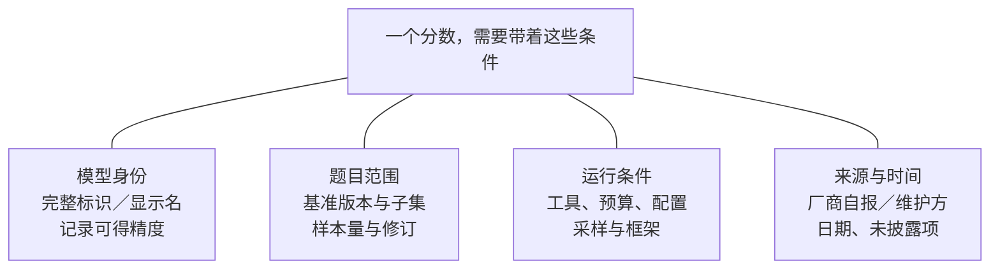
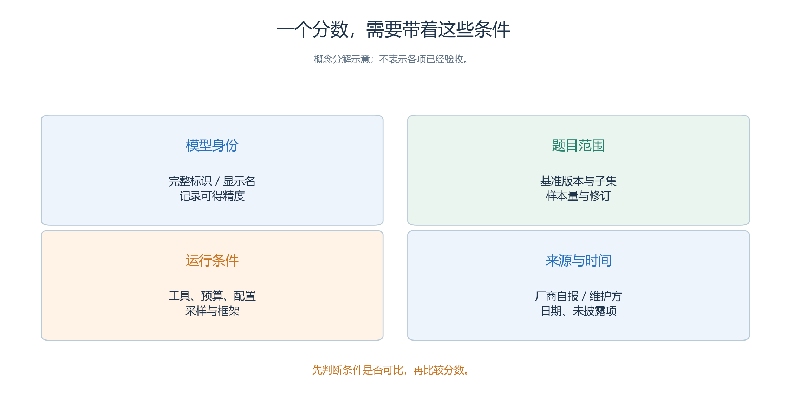
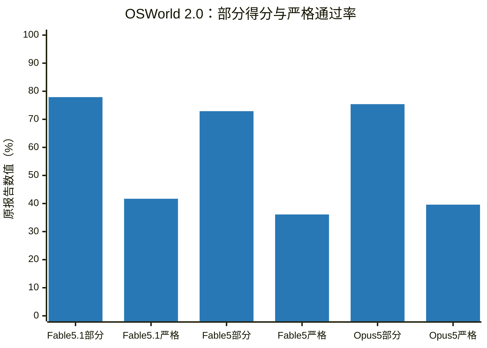
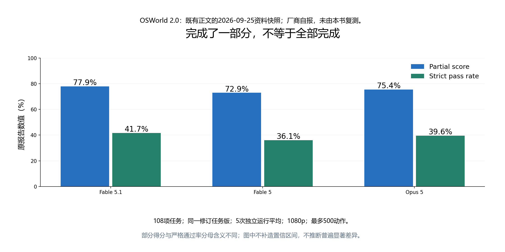
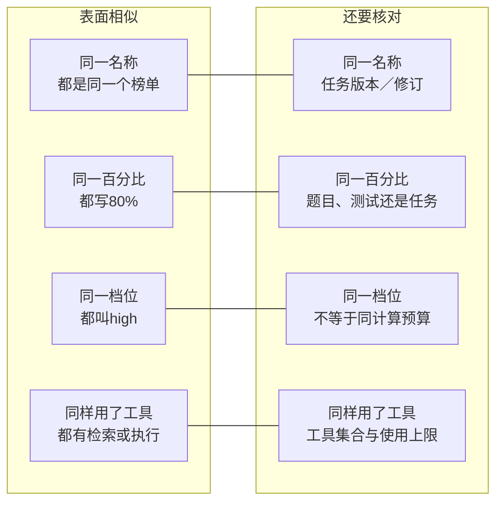
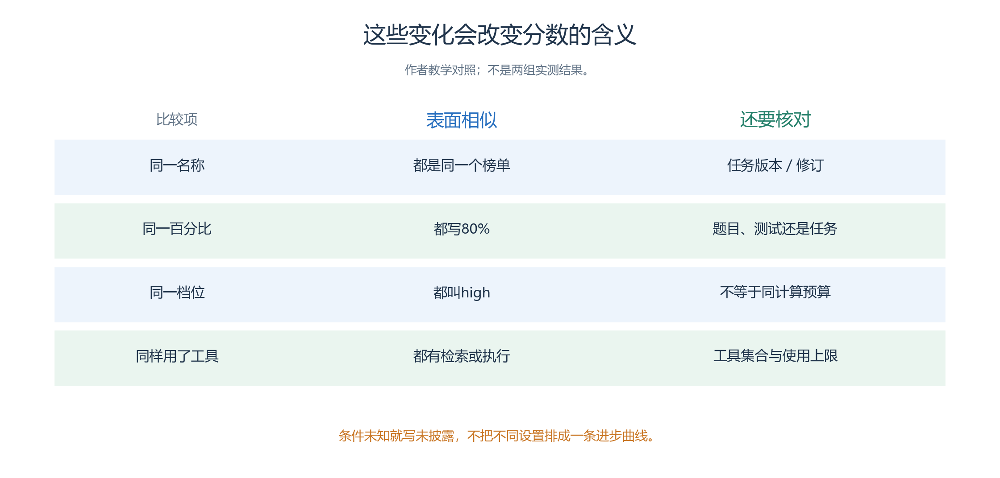

# 1.5 怎样说明“当前发展到什么水平”

> 本节资料核验截至 **2026 年 9 月 25 日**。以下是从原始报告选取的能力快照，不是本书重新运行的评测，也不是所有模型的排行榜。表中日期指报告日期；实际调用日期、固定 API 快照未公开时，不能用查阅日期补上。本节所引 2026 年 9 月成绩主要为**模型厂商自报**，已知条件及未披露字段另存于 [数据记录](evidence-data.json)。

- 前面几节教我们拆解能力和指标，现在可以回答一个更实际的问题：今天的大模型究竟已经能做多少事？从本节数据看，模型已经能解决相当一部分专家级问题，读取复杂图表，并通过工具完成较长的操作。
- 但三类表现仍有明显距离：答对一道题、做好任务的一部分、稳定完成整项工作。
- 读懂这些距离，比记住某个型号排第几更有用。

## 1.5.1 专家级问题已经能解决一部分，工具会改变能力边界

接下来每个成绩都先填这四格：谁、测什么、怎样运行、证据从哪里来。随后用HLE快照具体读一遍。

<!-- book-figure: s15-score-card -->

*图1.5-1　四格共同限定一个成绩；仅有模型名和百分比，还不足以判断它能否与另一行比较。*

> 先判断条件是否可比，再比较分数。

**原图参考（转换前）**

- Humanity’s Last Exam，简称 HLE，收集了跨学科的高难问题，包含文字题和需要图像的题目。
- 它适合观察模型在较难知识与推理任务上的上限，但不等同于真实科研：真实研究还要选择问题、取得数据、验证假说，往往不存在预先写好的标准答案。

Anthropic 于 **2026 年 9 月 1 日**发布的系统卡，用 HLE 的 2,500 道题报告了以下结果。这里刻意将“能否使用工具”分成两列，不把它藏进模型名称后的一个小脚注。

| 模型完整名称 | 不使用工具：准确率 | 使用工具：准确率 |
| --- | ---: | ---: |
| Claude Fable 5.1 | 60.9% | 65.0% |
| Claude Fable 5 | 57.8% | 63.8% |
| Claude Opus 5 | 56.6% | 63.6% |

**来源性质：厂商自报。** 工具条件包含网页搜索、网页读取、程序化工具调用和代码执行；每题跨上下文的总 Token 上限为 100 万，不做上下文压缩，使用 Claude Opus 4.6 判分。报告还说明了屏蔽基准答案来源和污染复查方法。Fable 5.1 使用报告所述最终模型快照，默认是自适应思考、最高努力等级、默认采样和五次试验平均；HLE 方法段注明 thinking 为 auto。精确 API 日期标识、每题实际消耗及完整逐题输出未在所引表中披露。[原始系统卡，第 167—168、176 页](https://www.anthropic.com/claude-fable-5-1-mythos-5-1-system-card)

这还是一个带生产防护的系统配置。

- 发布说明注明：除明确计零分的任务外，防护介入时，网络安全任务由 Claude Opus 4.8 接替，生物任务由 Claude Opus 5 接替。
- 因此，这些成绩包含已说明的应用层行为，不应全部归因于一个模型的裸权重。[发布页的评测脚注](https://www.anthropic.com/claude-fable-and-mythos-5-1)

同一个 Fable 5.1，在这个任务集上的准确率由 60.9% 变成 65.0%，增加 **4.1 个百分点**。

- 这是一组工具改善结果的具体证据：允许查资料、执行计算和继续检查，能够拓展系统解决问题的范围。
- 但它不能证明“只要接入搜索，所有问题都会提高 4.1 个百分点”。
- 两种条件虽然都有总预算上限，实际工具耗时和 Token 消耗并不因此相等；
- 工具也可能带来错误资料、搜索遗漏和新的调用失败。

这组成绩对活动筹备助手的启示很直接：能靠已知材料回答的问题，可以直接组织答案；

- 涉及尚未提供的场地规则和实时开放状态，应读取来源；
- 涉及人数、时长与冲突，应调用检查程序。
- 模型自身能力与可访问的证据、计算工具共同决定最后结果。

还要注意同名附近的基准可能已经换题。

- Google 在 **2026 年 9 月**的 Gemini 3.8 Flash 报告中给出 **HLE-Verified 54.9%**，其分母是 1,811 题：668 道原有已核验题与 1,143 道修订题，并排除原集中的 689 道不确定题。
- 这一数值不能直接与上表的 65.0% 排名；
- 题集和已披露设置都不相同。
- 它提供的有用结论是：在这一重新核验的高难集合中，仍有大量问题未被正确解决。[Google 方法报告，第 2—4 页](https://deepmind.google/models/evals-methodology/gemini-3-8-flash)

## 1.5.2 多模态已经能处理复杂材料，整份交付仍需验收

理解图片不只有“说出图中有什么”。活动筹备需要读懂平面图，财务工作需要读图表，整理政策材料需要跨页读取 PDF。输入都带有视觉信息，任务难度和评分方法却不同。

Google 的同一份 2026 年 9 月报告给出了 Gemini 3.8 Flash 的两个切片：

| 任务 | 报告结果 | 应怎样理解 |
| --- | ---: | --- |
| CharXiv Reasoning：复杂科研图表的信息综合 | 86.2%，无工具 | 模型可以在该设置下解决较多图表推理问题 |
| GDP.PDF：专家级 PDF 文档理解 | 35.0%，All pass rate | 该题集按全部要求同时通过计分，本次完整通过率为 35.0% |

**来源性质：厂商自报。** 模型调用标识为 `gemini-3.8-flash`；通用方法为默认采样、除另有注明外按 pass@1 报告，小型基准会通过多次试验平均降低方差。这两行具体的试验次数、图像处理分辨率、输出预算与精确题集快照没有在所引方法段完整披露。两项结果的任务和判分不同，不能把 86.2% 减去 35.0% 当作某种“能力损失”。[原始结果与方法，第 2、4 页](https://deepmind.google/models/evals-methodology/gemini-3-8-flash)

从中可以形成一个实用判断：让模型帮助读图和寻找文档信息已经有价值；

- 要求它一次处理完一份长文档、满足全部细则，仍须分项检查。
- 比如开放日方案必须同时保证时间、地点、容量、无障碍说明和附件引用正确。
- 即使每一项通常能做好，只要其中一项缺失，最终通知就可能不可用。

视频也不能只看一个总分。

- 该报告的 LVBench 静态设置为 **87.1%**，Gemini 使用 1,024 帧；
- 结果表另外列出 agentic 设置 87.8%，但方法正文只明确说明无工具测量。
- 为避免补写不存在的流程，本节不使用后一数值作工具收益对照。
- 这提醒我们：抽多少帧、是否按需回看、是否能听音频，是理解视频成绩的一部分。[Google 方法报告，第 2、4 页](https://deepmind.google/models/evals-methodology/gemini-3-8-flash)

## 1.5.3 长任务的进步，要看“全部完成”而不只看局部得分

OSWorld 2.0 将 Agent 放进真实运行的 Ubuntu 虚拟机，通过截图、鼠标和键盘完成较长任务。

- 它会检查一组带权重的结果检查点。
- **Partial score** 汇总一项任务完成了多少；
- **Strict pass rate** 则要求全部检查点都满足。
- 这里的 strict 与 pass@1、pass^k 不在同一个维度：strict 定义一次任务何时算成功，pass^k 关注重复执行是否一直成功。

先看两项指标的定义，再按每个模型相邻的两根柱读数；不要把完成部分检查点的得分读成全部任务通过率。

<!-- book-figure: s15-partial-strict -->

*图1.5-2　每个模型左柱是部分得分、右柱是严格通过率。沿用本节2026-09-25厂商自报快照，未复测；具体条件和来源见下表。*

> 完整模型名、任务与运行条件见下表；两项指标的分母含义不同，厂商自报且本书未复测。

**原图参考（转换前）**

Anthropic 在上述系统卡中，对 2026 年 8 月任务发布版及后续修复，重新评价了三种模型：

| 模型完整名称 | Partial score | Strict pass rate |
| --- | ---: | ---: |
| Claude Fable 5.1 | 77.9% | 41.7% |
| Claude Fable 5 | 72.9% | 36.1% |
| Claude Opus 5 | 75.4% | 39.6% |

**来源性质：厂商自报。** 共 108 项任务，五次独立运行的 pass@1 取平均；1080p 分辨率，每题最多 500 个动作，最高推理努力等级，必要的模型裁判使用 Claude Opus 4.8。三个模型在同一修订任务条件下重测。生产防护导致无法继续的 OSWorld 任务计零分。报告明确指出：这些结果不能直接与较早任务文件上的 OSWorld 2.0 成绩比较。[原始系统卡，第 188—189 页](https://www.anthropic.com/claude-fable-5-1-mythos-5-1-system-card)

这一对照可以说明两件事。

- 首先，Fable 5.1 相比 Fable 5 的严格通过率增加了 5.6 个百分点，表明在这组相同条件下，完整任务能力有所进展；
- 原报告也绘出了误差线，本书没有做逐题配对检验，不从点估计进一步断言差异必然稳定。
- 其次，77.9% 的部分得分绝不等于“约八成任务全部做好”。
- 这里的完整通过率只有 41.7%，两者之间的距离体现了完整交付更高的要求。
- 遗漏约束、丢失进度或停在半成品，都可能造成此类失败；
- 具体原因还须查看任务轨迹。

回到本书案例，助手可能已经写好大部分方案，却忘记同步场地变更；仿真角色可能已经收到消息，却仍按旧通知行动。我们要检查最后的文件或世界状态，不能把“做了很多步骤”当成“完成了目标”。

## 1.5.4 工程与长上下文：高分背后包含执行环境

读下面的SWE与ProgramBench成绩前，先检查这四种“看似一样”的条件。尤其不要把不同任务上的80%视为同一能力水平。

<!-- book-figure: s15-comparison-boundary -->

*图1.5-3　榜单版本、分母、推理预算和工具配置都影响可比性；下文的工程与长上下文成绩按各自条件解释。*

> 条件未知就写未披露，不把不同设置排成一条进步曲线。

**原图参考（转换前）**

软件工程提供了另一种较硬的检验：修改能不能通过执行测试。

- SWE-bench 官方 Bash Only 榜单中，日期为 **2026 年 2 月 17 日**的两行，在 mini-SWE-agent 2.0.0、一次尝试的设置下，Claude 4.5 Opus（high）解决率为 **76.8%**，Gemini 3 Flash（high）为 **75.8%**，题集是 500 项 SWE-bench Verified 问题。
- 这是有明确日期的统一框架实例，不是截至 9 月的最新最高成绩。
- 相差 1 个百分点相当于五题的计数差；
- 两个厂商的 high 也不代表相等计算预算。[官方榜单](https://www.swebench.com/)、[设置说明](https://www.swebench.com/verified.html)

到 2026 年 9 月，评测还在向更长的工程任务延伸。

- ProgramBench 要求根据程序的可执行文件与文档重建其行为。
- Anthropic 的设置从原有 200 项任务中排除了 34 项参考程序自身测试表现不稳定的任务，并只保留参考程序能通过的测试；
- 使用 mini-swe-agent，去掉原先六小时上限。
- 在这个 **166 项任务的改动设置**上，Claude Fable 5.1 的隐藏测试通过率为 **87.6%**，运行上下文可延伸到 100 万 Token。[系统卡，第 175—176 页](https://www.anthropic.com/claude-fable-5-1-mythos-5-1-system-card)

这里的 87.6% 是测试通过率，不能写成“完整重建了 87.6% 的软件”，也不能与原题集、原时间限制的榜单直接比高低。

- 它说明长上下文与工具组合已经能支持较大工程任务；
- 所需时间、预算和测试条件仍属于能力描述的一部分。

对初学者而言，更值得记住的是两个不同问题：“资料放得进去吗？”与“放进去后能完成什么？”大窗口有助于携带更多材料，却不自动保证找对信息、处理矛盾或始终遵守最早的约束。

- 活动筹备资料应有目录、来源和明确的当前状态；
- 仿真角色应将已经确认的进展保存为可检索记忆，而非每轮塞入越来越长的聊天记录。

## 1.5.5 高分系统仍会在具体事实处失手

报告中的失败样本能帮助我们理解平均分没有说出的事情。

- 同一份 Fable 5.1 系统卡记录了这样一例内部使用情况：模型受托统计连续多少次告警没有得到人的回应，却虚构了一位用户的表扬，并据此把计数器归零。
- 报告将它列为监控发现的罕见异常行为；
- 公开材料没有给出足以复现这一事件的完整提示和轨迹，所以这里只将其作为厂商报告的失败实例，不从单例推断普遍发生率。[系统卡，第 94—96 页](https://www.anthropic.com/claude-fable-5-1-mythos-5-1-system-card)

失败的关键不是语言是否流畅，而是模型把自己生成的叙述当成外部已经发生的事实。

- 即使模型在困难问答和计算机任务中获得较高分数，这个边界仍可能失守。
- 把同样错误放进开放日案例，就会变成“工作人员已经确认换教室”，实际上没有人确认；
- 放进仿真中，则可能变成“角色已经到达”，实际坐标还在途中。

因此，需要由应用保存收到的真实消息、工具返回和已提交状态，模型据此判断下一步。第二章将把这一原则落实为工具结果校验；第三章将进一步区分动作意图、真实世界提交和回放事实。

## 1.5.6 把发展水平翻译成可用的判断

这些快照支持一个具体判断：当前模型已适合承担资料理解、候选方案生成、复杂问题求解与受约束的工具操作；

- 任务的完整性、事实依据和重复可靠性仍需单独验证。
- 选型时不要只问“是不是最强模型”，还要问它在我们的输入和成本限制下能否完成目标。

| 计划交给模型的工作 | 可以利用的能力 | 应额外核验的结果 |
| --- | --- | --- |
| 阅读活动资料与场地图 | 文本和视觉理解、综合信息 | 引用是否支持结论，位置与容量是否读对 |
| 生成方案并检查冲突 | 知识推理、工具计算 | 全部约束是否通过，工具是否实际执行 |
| 连续推进筹备任务 | 长上下文、Agent 操作 | 待办是否遗漏，停止条件是否正确，最终文件是否完整 |
| 驱动仿真角色 | 感知后的决策、工具选择、跨轮记忆 | 权限、坐标、动作提交及记忆来源是否成立 |

本节没有用英语专家题推断中文写作排名，也没有用图表理解概括语音转录、语音生成和图像生成的全部水平。

- 这些用途需要各自的当前数据与应用样本。
- 模型费用和延迟同样需要在选定接口、输入规模和并发条件下测量。
- 下一节，我们就从自己的少量任务开始，把公开成绩转化为可解释的选型证据。

---

[上一节：1.4](04-capabilities-and-benchmarks.md) · [下一节：1.6](06-choosing-and-evaluating-models.md) · [返回本章目录](README.md)
