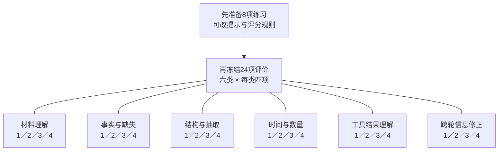
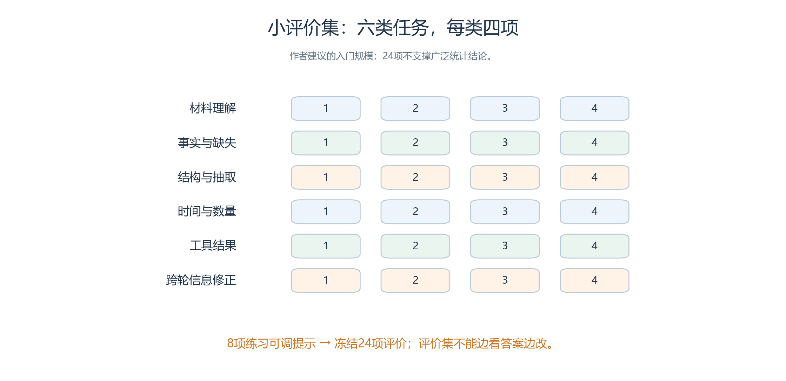
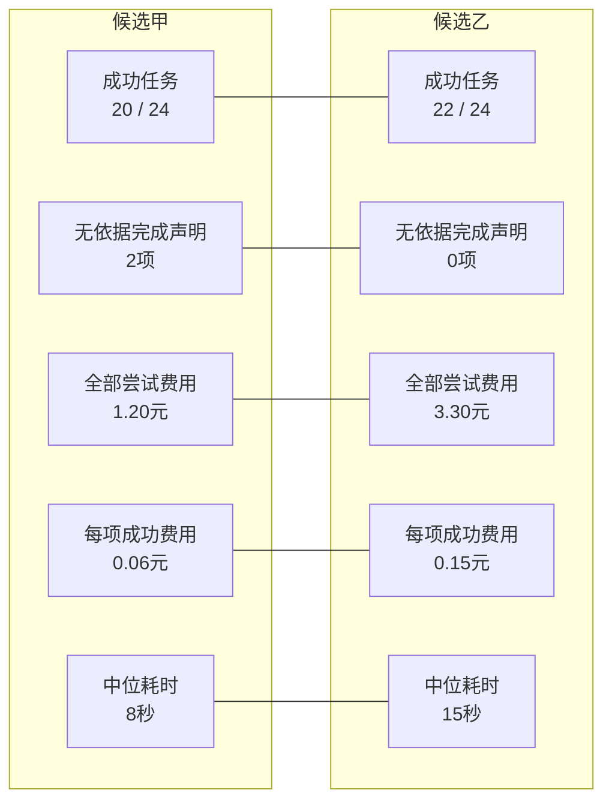
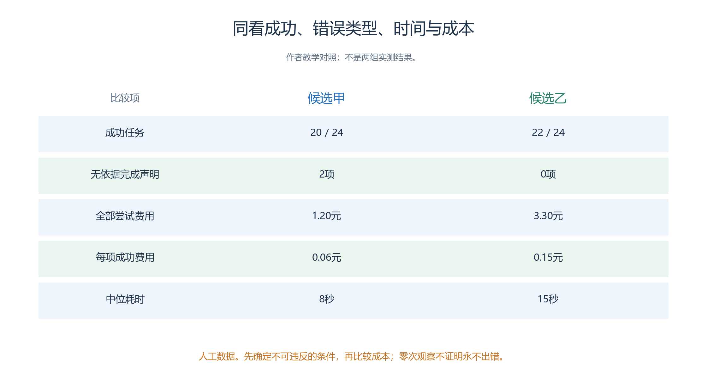
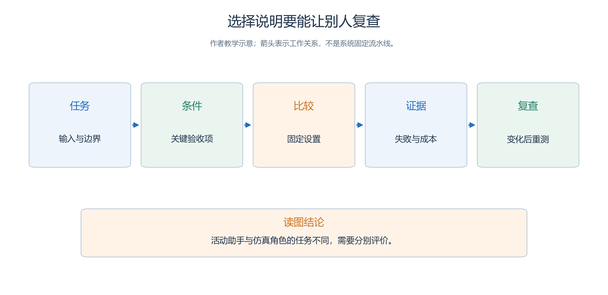

# 1.6 为自己的任务选择模型

读过前面的指标和数据，选模型的方式应当有所改变。我们不必先寻找一个包揽所有任务的“最强模型”，而可以从实际需求出发：要完成什么，哪些错误不能接受，在相同条件下哪种配置更适合。

本节把这个过程变成一项可以亲手完成的小练习。它使用青禾的虚构材料，不需要先搭建完整仿真系统。第二章介绍 API 和 WorkBuddy 后，可以用程序和产品操作重新执行同一套练习。

## 1.6.1 第一步：把目标写成可核验的结果

“写一份好方案”不够具体。它可以意味着文字好看、安排完整、没有冲突，也可以意味着方案已经被相关系统保存。为了避免评价时临时改变标准，我们先限定本次任务：

> 根据提供的材料生成开放日方案，正确处理房间容量、时间和预约；缺少信息时明确标出；每项关键安排给出依据。不执行真实预约，也不以文字声称已经执行。

这段目标同时划定了能力需求和执行边界。模型需要理解材料、组织约束、产生方案并表达不确定性；它不需要自行决定活动经费，更不能在没有工具的情况下宣布完成预约。

接着把目标转成检查项。

| 检查维度 | 可观察结果 | 本练习的判定方式 |
| --- | --- | --- |
| 事实与来源 | 容量、预约、人数等关键字段有依据 | 与输入材料逐项核对 |
| 约束满足 | 时间、容量、时长和相互冲突处理正确 | 人工或确定性程序检查 |
| 信息不足 | 缺失内容明确，未编造必要事实 | 与预设缺失项清单核对 |
| 交付完整 | 包含全部所需活动及待确认事项 | 按固定字段和任务清单核对 |
| 使用成本 | 时间、调用和费用可接受 | 记录端到端时间与实际可见用量 |

表达是否清楚也重要，但它不应覆盖关键事实错误。一份文笔优美却把十五人安排进十二人房间的方案，不能靠其他项目的高分自动变成合格结果。

## 1.6.2 第二步：准备小而有区分度的任务集

先用8题练习和调整，再冻结另一组24题评价。正式评价分为6组、每组4题，避免把调过提示的练习题算进成绩。

<a id="figure-s16-task-grid"></a>

<!-- book-figure: s16-task-grid -->



*图1.6-1　练习集与评价集分开；下表展开6组各测什么，24题的分母保持固定。教学题集设计，尚非实测结果。*

> 入门规模建议，不足以支持广泛统计结论；组内改变房间、数字和表述，不能边看评价答案边改评价集。

**原图参考（转换前）**



本练习建议先准备八项练习任务，用来检查提示是否清楚、评分规则是否一致；再固定二十四项评价任务。前者可以反复修改，后者在开始比较前冻结。任务数量用于入门实践，不足以支撑广泛的统计结论。

二十四项评价任务可按六组组织，每组四项。组内使用不同房间、数字或表述，避免只是把同一道题换名字。

| 任务组 | 四项任务应覆盖什么 | 主要看什么 |
| --- | --- | --- |
| 材料理解 | 明示条件、跨段条件、相近房间名、无关信息干扰 | 是否把正确条件对应到正确对象 |
| 事实与缺失 | 完整资料、缺容量、缺日期、只有未经证实的说法 | 是否分清已知、未知和传闻 |
| 结构与抽取 | 固定字段、多个活动、空值、字段关系 | 可读结构与内容是否同时正确 |
| 时间与数量 | 容量边界、预约重叠、相邻时间段、持续时间 | 是否满足明确规则 |
| 工具结果理解 | 查询成功、查询失败、错误房间、没有调用证据 | 是否正确使用结果并承认执行边界 |
| 跨轮信息修正 | 预约更新、人数更新、旧方案保留、冲突未解决 | 是否按新证据修正而不伪造进展 |

在尚未接入真实工具时，第五组可以提供预先写好的工具结果，评价模型能否理解结果。

- 这种做法必须标为“工具结果理解测试”，不能当成模型已经成功调用工具。
- 第二章接通工具后，再增加真实参数选择、执行和回传的端到端测试。

每项任务至少保存原始输入、预期检查项、允许的答案范围和失败条件。对开放式方案，不必规定唯一措辞；只要约束满足，多个不同安排都可能有效。

下面是一项可直接使用的练习任务。

> 开放日为 2026 年 10 月 17 日，时区为 Asia/Shanghai，开放时间 09:00–12:00。手作室容量十二人，10:00–10:30 已有预约。手作活动有十名参加者，需要连续三十分钟。拟安排 10:15–10:45。请检查是否可行；若不可行，在不改变人数和活动时长的情况下给出一个可行时段，并指出依据。时间区间按左闭右开处理，首尾相接不算重叠。

正确判断是原方案与已有预约重叠。10:30–11:00 是一个可行答案，但不是唯一答案，例如在其他条件允许时，09:00–09:30 也符合题意。评分应检查容量、时长、开放时间和预约交集，而不是检查输出是否逐字等于参考答案。

这道题同时说明为什么要写清边界约定。如果没有约定首尾衔接是否允许，评分者可能把 10:30 开始的答案判成不同结果。评价规则的歧义会被误算成模型差异。

## 1.6.3 第三步：固定比较条件

首先明确比较单位。你可以比较两个裸模型在相同输入下的表现，也可以比较两个已经配置好工具的完整应用。两种问题都合理，但报告必须说清楚。

如果比较模型，尽量固定材料、提示、工具、输出限制、采样设置和每项任务的允许尝试次数。如果比较应用，则把各自的检索、工具和执行策略一并记录，因为这些就是应用能力的一部分。

对于多轮任务，每项评价从相同的初始状态开始。

- 不要让后一项任务无意继承前一项的答案，也不要让第二个候选额外看到第一个候选的错误分析。
- 需要持续记忆的任务，则明确哪些信息应当保留，哪些应当隔离。

无法统一的条件也有记录价值。例如两个服务对推理预算采用不同的档位名称，这些名称相同并不代表计算量相同。可以按各自实际可用的配置比较整体质量与成本，但应避免称为严格等算力比较。

一个最小评价记录可以采用下面的字段：

```text
任务编号、任务类别、输入文件及内容摘要
模型完整标识、服务或产品版本、执行日期
提示版本、可用工具、推理与输出设置
是否成功、失败类别、关键证据、评分者
逻辑调用数、物理尝试数、端到端耗时
输入/输出用量、费用、人工介入情况
```

暂时拿不到的数据就写“未提供”或“未记录”。不要从回答长度猜 Token，也不要把等待页面的总时长全部当成模型计算时间。

## 1.6.4 第四步：先看错误分布，再看总分

同样答对二十项任务，两个候选可能很不一样。一个主要漏写非关键说明，另一个会在查询失败时宣布预约成功。它们的总成功数相同，实际使用风险却不同。

因此，每个失败都要归类。

- 青禾练习可以采用“事实错误、约束遗漏、结构错误、工具结果误用、无依据完成、未完成”这几类。
- 一次结果可能涉及多个问题，统计时说明是允许多标签，还是指定一个主要原因；
- 不能把多标签总数误称为失败任务数。

对有确定答案的部分，优先使用可重复的检查。

- 对表达、解释质量等开放部分，使用简短量表，并保留评语与依据。
- 条件允许时，让评阅者不知道候选名称，再对相同样本独立评分。
- 这样能减少品牌和风格偏好，但并不自动消除所有主观差异。

还应事先规定重试如何处理。如果真实产品允许一次修正，那么可以评价“最多一次修正后的成功率”，但要同时保留首轮成功率和额外成本。已经用过多次人工反馈的最终答案，不能标成一次生成成功。

## 1.6.5 第五步：按任务选择，而不是按一个综合分选择

同样24次任务，乙完成更多，但费用和耗时更高。先检查是否出现不能接受的“假完成”，再用全部尝试费用除以成功任务数，比较单位成功成本。

<a id="figure-s16-choice-tradeoff"></a>

<!-- book-figure: s16-choice-tradeoff -->



*图1.6-2　甲的每次成功成本为1.20/20=0.06，乙为3.30/22=0.15；连同假完成和耗时一起选，不能只看成功数。人工比较数据。*

> 人工数据。先确定不可违反的条件，再比较成本；零次观察不证明永不出错。

**原图参考（转换前）**



下面的表完全是教学假设，用于演示选择方法，不对应真实品牌或实测结果。

| 二十四项评价结果 | 候选甲 | 候选乙 |
| --- | --- | --- |
| 成功任务 | 20/24 | 22/24 |
| 无依据的完成声明 | 2 项 | 0 项 |
| 全部尝试总费用 | 1.20 元 | 3.30 元 |
| 每项成功任务费用 | 0.06 元 | 0.15 元 |
| 端到端耗时中位数 | 8 秒 | 15 秒 |

如果任务只是帮助人工起草活动宣传语，候选甲可能值得进一步考察，因为人会在使用前阅读和修改。

- 如果任务是自动处理预约状态，表中两次无依据完成声明就值得优先分析，不能被较低费用掩盖。
- 候选乙在这次小样本中没有出现这种错误，也不代表以后绝不会出现。

最终选择应结合可接受条件，而不是临时为喜欢的候选调权重。

- 例如，事先要求“关键约束必须通过独立检查，失败时停止交付”，然后比较通过该流程的任务成功率、时间和成本。
- 独立检查本身也要验证，不能假定写了一个检查器就永远正确。

有时适合采用不同模型承担不同任务。

- 起草文本与检查复杂冲突可能有不同要求，但增加模型分工也会增加输入传递、结果整合和调用成本。
- 应把这种组合当成一个新候选重新评价，而不是把两个单独模型的最好成绩相加。

## 1.6.6 为本书的两类任务分别写选择说明

开放日筹备助手与仿真角色使用同一套选择步骤，但各自的任务、硬约束和证据不同。图中的五步用于填写后面的选择记录。

<a id="figure-s16-selection-process"></a>

<!-- book-figure: s16-selection-process -->


*图1.6-3　先定义任务与条件，再比较候选和证据，最后安排复查；不以一次高分替代当前任务的验收。*

> 活动助手与仿真角色的任务不同，需要分别评价。

**原图参考（转换前）**



第二章的活动筹备助手需要读取文件、形成结构化结果、调用查询或检查工具，并在缺少资料时正确停下来。评价重点是约束、来源、执行和交付。

第三章的仿真角色还需要在多轮过程中理解当前位置、所见信息、私有记忆和工具反馈，按照世界合同选择行动。

- 单次写作表现无法覆盖这些要求。
- 我们需要进一步观察跨步一致性、动作参数、信息边界、记忆使用和调用成本。

这些测试应与内核检查分开。模型没有提出第二次世界动作，不能据此证明内核一定会拒绝第二次提交；那是系统合同的验证问题。同样，内核正确拒绝非法动作，也不说明角色已经完成业务目标。

本章可以先写出以下一页选择说明，把还需要在第二、三章实测的部分明确列出：

> **任务与输入：**我要处理什么，资料从哪里来。
>
> **必须满足的条件：**哪些约束不能靠平均分补偿。
>
> **候选与配置：**模型、产品或应用组合及其版本。
>
> **评价结果：**成功、失败类型、时间与成本，以及原始记录位置。
>
> **选择与理由：**为什么适合当前用途，哪些结果还不确定。
>
> **复查条件：**模型、提示、工具或任务材料发生什么变化时需要重新测试。

一份好的说明不需要声称候选在所有方面领先，而需要让另一个人理解：这个选择针对什么任务，依据是什么，在哪些条件下仍要保持检查。

## 1.6.7 章末练习

**练习一：找出信息来源。** 助手说：“手作室只能容纳十二人；我已为你预约十点半；你一直喜欢简短报告。”分别列出三句话需要什么证据。仅在回答中出现这些文字，能证明哪一项已经成立？

**练习二：重新计算指标。** 一个抽取任务共有十条必需约束，模型输出十条，其中八条正确、两条不存在，并漏掉两条必需约束。计算 Precision、Recall 和 F1。再说明，若漏掉的恰好是预约冲突条件，为什么总体 F1 不能直接代表方案可执行。

**练习三：解释不同的成功率。** 某个简化任务每次独立成功概率为 0.8。给两次机会，至少成功一次与两次都成功的概率分别是多少？现实应用中哪些因素会破坏独立且同分布的假设？

**练习四：阅读一张数据卡。** 从 1.5 选一条公开成绩，写出它能够支持的一个结论和不能支持的两个结论。检查测量日期、工具条件及来源性质是否明确。

**练习五：设计自己的小评价。** 选择一个熟悉的资料整理任务，准备完整、缺失、矛盾、过期四种输入各一项；先写评分条件，再请求模型回答。不要在看到结果以后，才修改“什么算成功”。

### 参考思路

练习一中，容量需要有效的场地资料或查询结果；预约完成需要真实执行及状态证据；偏好需要用户明确表达或可追溯的有效记忆。单独一段回答不能证明外部预约已经发生。

练习二中，TP 为 8、FP 为 2、FN 为 2，因此 Precision、Recall 与 F1 都是 0.8。指标把约束按同一种单位计数，而实际执行时某些条件构成不可违反的边界；应另列关键约束是否满足。

练习三中，至少一次成功为 0.96，两次都成功为 0.64。重试时改变提示、共享先前状态、任务难度不同、服务配置变化等，都可能让简单假设不成立。

练习四、五没有唯一文字答案，评价重点是能否明确条件、证据、分母与失败处理，而不是是否选择某个品牌。

- 本章从一份活动安排出发，介绍了模型怎样生成结果、应用怎样扩展能力，以及怎样用合适的任务和指标评价表现。
- 下一章将把这些认识变成具体操作：编写提示、组织上下文、连接工具、构建 Skill，并通过 OpenAI API 与 WorkBuddy 实际完成活动筹备。

---

[上一节：1.5 能力发展水平](05-capability-snapshot.md) · [返回本章目录](README.md)
