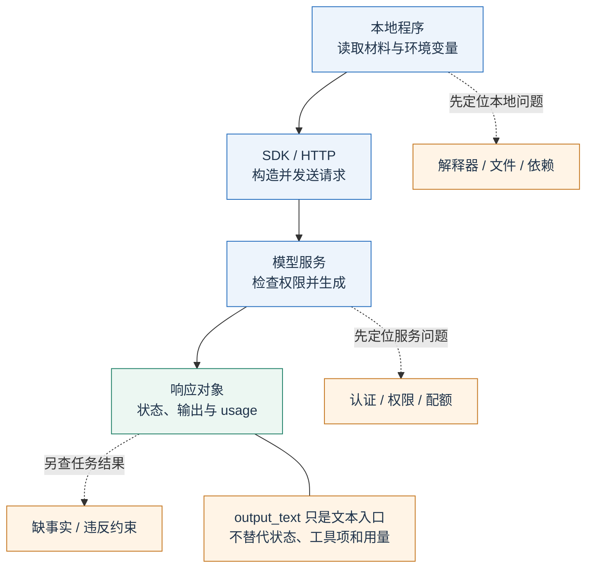
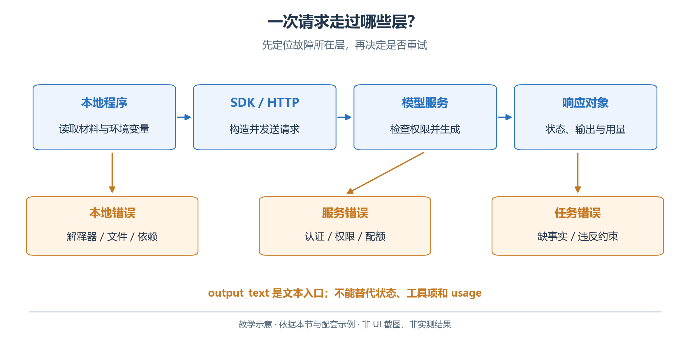
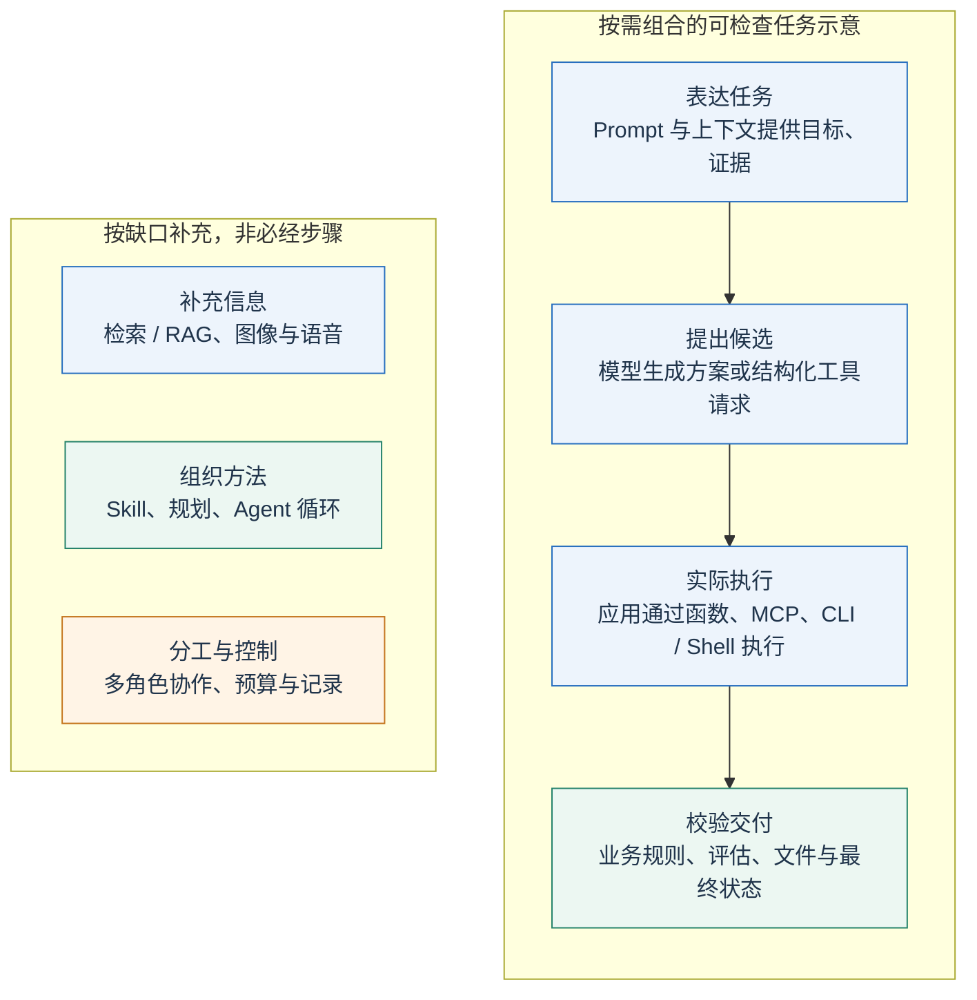
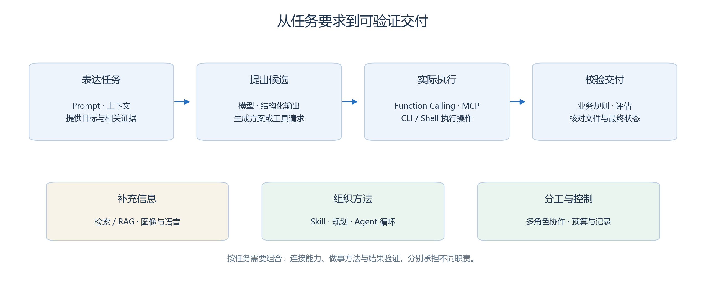
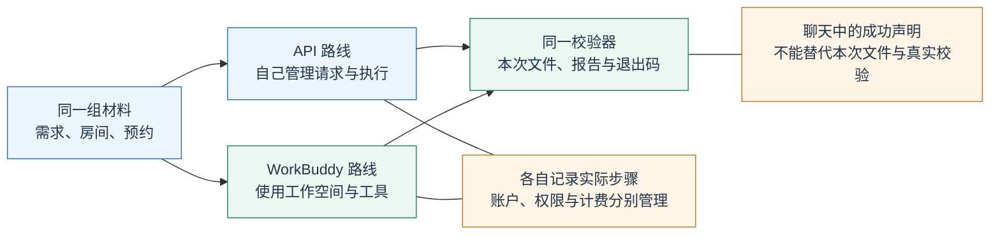
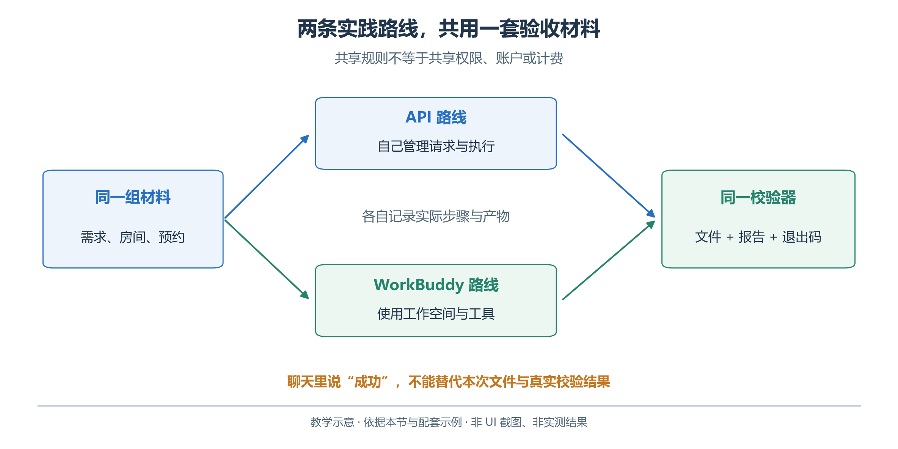

# 2.1　环境与第一次调用

青禾社区开放日需要一份可检查的筹备方案。本章沿两条路线推进：用 OpenAI API 看清请求与执行，用腾讯 WorkBuddy 体验文件、任务和工具，逐步完成读取、查询、校验与交付。

## 2.1.1 先认识本章的学习环境

先区分三个层次：

- **API**：客户端与服务端约定的交互接口。
- **HTTP / JSON**：前者传送请求与响应，后者常用于描述内容。
- **SDK**：封装连接、序列化和类型的程序库；使用 SDK 后仍会发生网络、认证、参数或服务错误。

<!-- book-figure: 01-request-lifecycle -->



*图 2.1-1　请求经过的层与故障归属。教学图，非界面截图或实测结果。*

图中的本地程序使用 Python，作为客户端发起请求，OpenAI 提供模型服务，`model` 指定请求使用的模型，`input` 是输入，`instructions` 描述本次行为要求。`response.output_text` 方便我们读取文本，但响应还可以包含工具请求、状态和用量等信息；后续章节会逐一展开。

**原图参考（转换前）**



WorkBuddy 则是已经把模型、任务界面、文件操作和工具接入组合起来的应用。它可以连接不同模型，但用户在产品里选择的模型、可用工具和权限设置共同决定实际能力。产品订阅、产品积分与 OpenAI API 账户的费用不能视为同一额度。

从一次请求扩展到完整任务时，会遇到信息、执行和检查等不同缺口。下面先标出本章技术各自参与的位置，后续小节再逐项实现。

<!-- book-figure: technology-map -->



*图 2.1-2　从任务要求到可验证交付。作者教学图，非 UI 截图或模型成绩。*

图中的箭头表达一次任务如何推进，不表示每次调用都必须用齐所有技术。本章所有数据均为教学虚构，不涉及真实预约、通知或外部发布。

**原图参考（转换前）**



## 2.1.2 统一材料，才能比较结果

开放日定于 **2026-10-17，Asia/Shanghai，09:00—12:00**。资料位于 [examples/data](examples/data/brief.md)，采用下面的固定条件：

| 活动 ID | 人数与时长 | 指定房间及容量 |
| --- | --- | --- |
| `reading_share` 阅读分享 | 24 人，60 分钟 | `reading` 阅读室，30 人 |
| `craft_workshop` 手作体验 | 10 人，60 分钟 | `craft` 手作室，12 人 |
| `exchange` 交流活动 | 16 人，45 分钟 | `discussion` 交流室，20 人 |

各活动都可在开放时间内安排，手作室已有 **10:00—10:30** 的预约。不同房间的活动可以同时举行；本题没有共享主持人或共享设备约束。时间区间采用 `[开始, 结束)`，所以 10:30 结束的预约与 10:30 开始的活动不重叠。

日期、容量和当前预约以本章 `data/` 为准，不能靠模型常识补齐。技术对照始终使用同一组材料和校验器；第一章局部算例不替代这里的完整条件，手作时长固定为 60 分钟。

## 2.1.3 安装独立的 Python 环境

读者需要会保存文件、打开终端，并能阅读变量、函数和列表这些 Python 基础语法。示例使用 Python 3.11 或更新版本。它们独立于 GenerativeAgentsCN 产品运行，不需要启动 Studio 或修改项目数据库。

下面以 Windows PowerShell 和本仓库路径为例；仓库位于其他位置时，只改第一行。为避免激活脚本的执行策略问题，可以直接使用虚拟环境中的 Python：

```powershell
Set-Location -LiteralPath 'E:\GenerativeAgentsCN\docs\book\chapter 02\examples'
python --version
python -m venv .venv
.\.venv\Scripts\python.exe -m pip install -r requirements.txt
.\.venv\Scripts\python.exe -m unittest discover -s tests -v
```

后文为便于阅读统一写 `python`。未激活虚拟环境时，将它替换为 `.\.venv\Scripts\python.exe`。macOS 或 Linux 的对应解释器通常是 `.venv/bin/python`。MCP 是可选扩展，额外依赖在 2.6 安装；本地校验器和基础离线测试不要求模型密钥。

先运行人工参考答案，确认环境本身没有问题：

```powershell
python validate_schedule.py fixtures/valid-schedule.json --output output/reference-check.json
```

退出码为 0 表示这份参考排期通过已编码的业务约束。这份文件由教材作者编写，不是某模型的运行成绩。再运行 `fixtures/invalid-schedule.json`，应看到具体错误与非零退出码。

## 2.1.4 配置 API，再执行最小调用

按 [OpenAI Developer quickstart](https://developers.openai.com/api/docs/quickstart) 准备 API 账户、项目与密钥。API Key 用于认证，模型名称用于选模型；两者的作用不同。先在账户中确认目标模型可用、支持 Responses 和本节文本输入，再把模型 ID 写进环境变量。

```powershell
$bookApiKey = Read-Host '输入本次练习的 OpenAI API Key' -AsSecureString
$env:OPENAI_API_KEY = [System.Net.NetworkCredential]::new('', $bookApiKey).Password
$env:OPENAI_MODEL = '替换为账户可用且支持所需能力的模型ID'
python first_response.py
```

这里的模型名称是明确的占位值，必须替换。不要把密钥粘贴进书稿、提示词、代码或共享结果；上述输入方式不回显密钥。环境变量保留在当前进程环境中，练习结束可用 `Remove-Item Env:OPENAI_API_KEY` 清除当前终端中的设置。

第一次调用的主要结构如下，完整可执行版本见 [first_response.py](examples/first_response.py)：

```python
import os
from openai import OpenAI

client = OpenAI(timeout=45.0, max_retries=0)
response = client.responses.create(
    model=os.environ['OPENAI_MODEL'],
    instructions='你是活动筹备助手。资料不足时明确说明，不编造预约事实。',
    input='请列出为社区学习中心安排开放日需要确认的五类信息。',
)
print(response.output_text)
print(response.usage)
```

`instructions` 为当前调用提供行为要求；`input` 是当前任务内容；`usage` 用于观察实际用量。示例关闭 SDK 自动重试，让最初的错误更容易定位。完整脚本还检查响应状态并保存返回内容，避免把拒绝、中断或空输出当作成功。[OpenAI Responses API](https://developers.openai.com/api/reference/resources/responses/methods/create)

本书没有为读者锁定一个“永久最佳”的模型。选择模型时，应记录实际请求与返回的名称，再按练习逐项确认结构化输出、工具调用、图像输入等能力。相同 API 入口不代表所有模型都支持相同参数。

## 2.1.5 出错时先分清发生在哪一层

| 现象 | 先检查什么 | 合理处理 |
| --- | --- | --- |
| 环境变量缺失 | 当前终端是否设置，名称是否拼写正确 | 在同一终端设置后重试 |
| 认证或权限错误 | 密钥所属项目、可用模型与账户权限 | 修正配置，避免反复提交同一错误请求 |
| 模型或参数不支持 | 模型能力与所用 API 文档 | 选择支持该能力的模型或调整参数 |
| 限流或额度不足 | 返回错误代码与账户用量 | 区分速率限制与账户额度，再决定处理 |
| 网络超时 | 连接、代理、服务状态与请求超时 | 保留错误；确认原因后有限重试 |
| 返回内容与任务不符 | 实际发送的输入、指令与材料 | 从提示和任务定义改进，不能只调网络参数 |

遇到错误时先读错误类型，不要把 Key 打印出来“检查”。一次调用成功也只证明当前请求能得到响应，还没有证明排期任务能完成。

## 2.1.6 在 WorkBuddy 中完成第一次任务

现在把同一任务放入 WorkBuddy：材料和校验规则沿用 API 练习，观察产品怎样读取文件、执行工具并交付结果。

<!-- book-figure: 01-routes-and-proof -->



*图 2.1-3　API 与 WorkBuddy 共用材料、分别取证。教学图，非界面截图或实测结果。*

两条路线在“同一校验器”处汇合，比较的是对应文件与实际检查结果；应用入口、账户和权限仍各自管理。

**原图参考（转换前）**



按官方安装指南安装适合操作系统的客户端并登录。本章界面说明参考 2026-09-25 查阅的官方文档，版本基线为 [5.6.2 更新日志](https://www.workbuddy.cn/docs/workbuddy/Changelog-5.6.2)；截图位置、可用模型和功能应以读者当前版本为准，本书没有将文档核查标为客户端实测。

新建任务后，点击输入框左下角“选择工作空间”，选择 `examples` 的练习副本。在输入框用 `@` 引用 `data/brief.md`，或上传该文件，输入：“读完资料后，列出当前已知信息与还需要核对的事项。”发送前检查附件是否已经添加、工作空间是否正确。[WorkBuddy 创建任务](https://www.workbuddy.cn/docs/workbuddy/Create-Task)

按三步检查读取是否有效：

1. 核对开放日期，以及需求表、房间表、预约材料的待查项。
2. 引用 `data/requests.csv` 与 `data/rooms.csv`，检查人数和容量；未提供预约时应保留待查询状态。
3. 在右侧结果区打开实际文件，让“已保存”与文件内容对应。

如需使用自定义模型，通过“设置 → 模型管理”填写服务 URL、Key 和模型名，按官方说明配置所需能力。WorkBuddy 的默认自定义接口按 `/chat/completions` 处理；开启自定义 URL 也不自动证明支持本章所有 Responses 参数。因此，API 示例和 WorkBuddy 实验可以使用各自兼容的模型，并分别记录配置。[WorkBuddy 模型配置](https://www.workbuddy.cn/docs/workbuddy/From-Beginner-to-Expert-Guide/Function-Description/Model)

本节完成的标志是：本地校验器可以运行；API 路线能保存一次真实响应，或明确记录尚未配置；WorkBuddy 路线能正确读取指定材料，或明确记录尚未实测。两条路线互相帮助理解，但不互相代替验收。

[上一章：为自己的任务选择模型](<../chapter 01/06-choosing-and-evaluating-models.md>) · [下一节：Prompt](02-prompt.md) · [返回本章](README.md)
