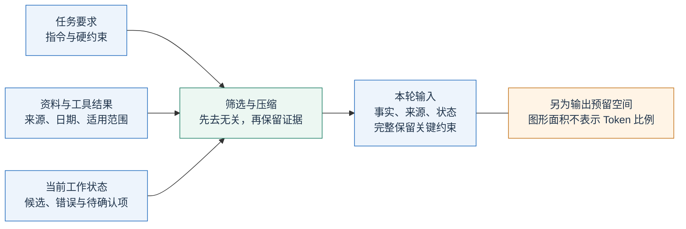
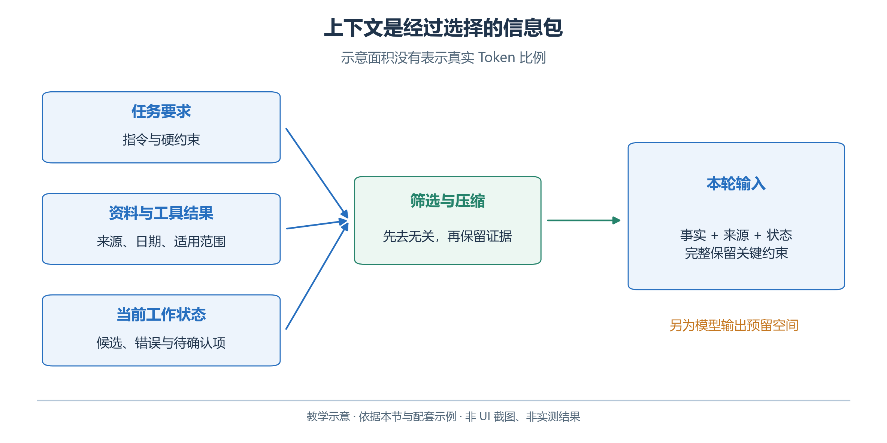
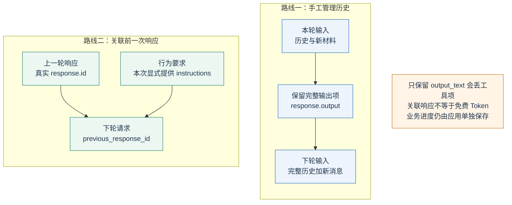
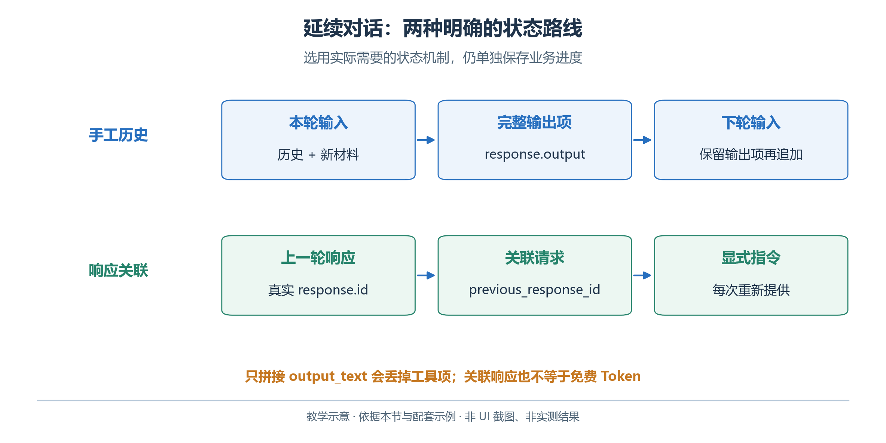
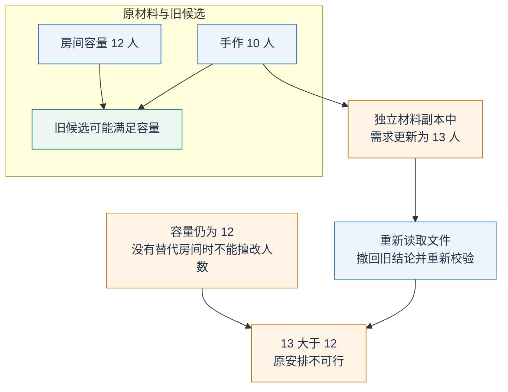
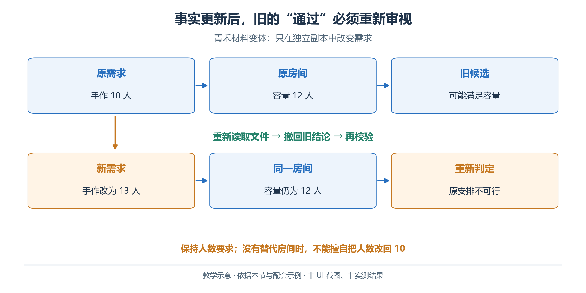

# 2.3 上下文工程：让模型在这一轮获得合适的信息

组织者说：“还是上次那个房间，人数以新表为准。”可靠处理这句话，需要明确上次任务、房间身份以及新旧资料关系；这些背景必须实际进入本轮请求。

上下文工程决定每轮实际获得哪些指令、历史、文件、工具结果和任务状态，以及它们如何组织、更新与移出。

## 2.3.1 内容可以放在一起，来源不能混在一起

青禾助手至少需要辨认四类内容。

| 内容 | 例子 | 应当怎样使用 |
| --- | --- | --- |
| 行为要求 | 不编造预约；提交前运行检查 | 指导本次工作方法 |
| 任务资料 | 活动人数、房间容量、允许时间 | 作为生成候选的依据 |
| 外部查询结果 | 某日期某房间已有预约 | 按工具来源和查询范围解释 |
| 工作状态 | 已提取约束，方案尚未校验 | 决定下一步，不冒充完成事实 |

不要把下列状态压成“时间已确认”：

| 表述 | 状态 |
| --- | --- |
| 十点半开始也许合适 | 候选意见 |
| 预约工具返回十点至十点半不可用 | 查询结果 |
| 方案通过校验 | 必须有对应候选的实际报告 |

更新材料时保留身份、日期及输入副本或摘要指纹。同名文件可能已变；由明确的新资料替换旧资料，不让模型猜哪份更权威。

## 2.3.2 长上下文不是无限记忆

上下文窗口限制单次请求能够处理的 Token 规模，还需要给输出及模型适用的推理开销留出空间。把全部聊天、全部文件、全部工具结果不断追加，可能造成超限，也会增加费用和无关信息。具体窗口与输出限制应查所选模型，不能把某个模型的数值当成全部模型共有属性。[OpenAI：Conversation state](https://developers.openai.com/api/docs/guides/conversation-state)

<!-- book-figure: 03-context-packing -->



*图 2.3-1　筛选、压缩与本轮上下文。教学图，非界面截图或实测结果。*

先筛选，再摘要：三项活动无需每轮携带十年宣传稿；整月预约可由程序按日期、房间和时段筛选，并保留来源与筛选条件。

**原图参考（转换前）**



摘要保留事实、来源和未解决事项，例如“阅读分享二十四人，来源 requests.csv；预约已查；候选未通过”。摘要是派生结果，重要事实仍须能回查原文件。

如果摘要遗失了手作活动的六十分钟时长，后面再写得流畅也不能补救。可以为摘要规定固定字段，并抽查日期、人数、持续时间、来源和未完成项，而不是只评价摘要是否简短。

## 2.3.3 OpenAI API：手工保留多轮状态

跨轮传递状态有两条路线：本小节先实现手工保留历史，2.3.4 再说明响应 ID 关联。图中的两个分组是可选路线，均须明确本轮实际获得的输入。

<!-- book-figure: 03-conversation-state -->



*图 2.3-2　手工历史与响应关联两条路线。教学图，非界面截图或实测结果。*

直接请求不会自动知道应用上一次发送了什么。手工管理时，保存原输入，将完整的 `response.output` 加入下一次输入，再追加用户的新消息。完整输出可能包括工具调用、推理相关条目和消息元数据；只保存 `output_text` 会丢掉这些信息。官方当前示例也采用保留完整输出的方式。[OpenAI：手工管理会话状态](https://developers.openai.com/api/docs/guides/conversation-state)

**原图参考（转换前）**



```python
import os
from openai import OpenAI

client = OpenAI(timeout=45.0, max_retries=0)
rules = "依据已提供资料回答；候选、查询结果和已验证事实须明确区分。"
history = [{"role": "user", "content": "手作室容量12人，活动10人。先检查人数。"}]
first = client.responses.create(
    model=os.environ["OPENAI_MODEL"],
    instructions=rules, input=history, store=False,
)
history.extend(first.output)
history.append({
    "role": "user",
    "content": "人数在正式需求中改成13人。请按新人数重新检查，不沿用旧结论。",
})
second = client.responses.create(
    model=os.environ["OPENAI_MODEL"],
    instructions=rules, input=history, store=False,
)
print(second.output_text)
```

这段例子的目标是观察模型是否撤销旧结论。十三人大于十二人的容量；正确回答应指出冲突，不能继续说“人数符合要求”。真实应用也应更新任务的正式数据并运行检查，不能只修改聊天记录。

`store=False` 表示不使用该响应对象的默认存储方式，不代表网络请求没有发生，也不能据此推导整个服务的数据处理政策。本书用它说明手工管理方式，具体数据约定另查服务文档。

## 2.3.4 另一种方式：引用前一次响应

需要服务端衔接会话时，可以使用 `previous_response_id`：

```python
first = client.responses.create(
    model=os.environ["OPENAI_MODEL"],
    instructions=rules,
    input="手作室容量12人，候选安排10人。请检查人数。",
    store=True,
)
second = client.responses.create(
    model=os.environ["OPENAI_MODEL"],
    previous_response_id=first.id,
    instructions=rules,
    input="正式人数改成13人，请重新检查。",
    store=True,
)
```

关键是第二次仍显式发送 `instructions`。官方文档说明，使用 `previous_response_id` 时，上一轮的这一参数不会自动作为当前轮指令继承。引用响应 ID 也不意味着前面的上下文 Token 免费；它主要改变状态传递方式。[OpenAI：指令与会话状态](https://developers.openai.com/api/docs/guides/prompt-engineering)，[OpenAI：会话链](https://developers.openai.com/api/docs/guides/conversation-state)

对于跨会话、跨作业的持久对象，官方还提供 Conversations API。初学阶段选定一种状态管理方式即可，不必把手工历史、响应链和持久会话同时叠加。应用仍要记录这些对象属于哪个用户和哪个任务，防止把青禾任务的资料接到另一位用户的对话中。

## 2.3.5 WorkBuddy：文件引用、追问与任务交接

本次追问练习只在材料副本中把手作人数由 10 改为 13，房间容量仍为 12。要检查的变化是：新需求出现后，旧的“容量可行”结论是否被撤回。

<!-- book-figure: 03-fact-refresh -->



*图 2.3-3　新事实使旧校验结论失效。教学图，非界面截图或实测结果。*

**原图参考（转换前）**



在教学目录中新建任务，通过 `@` 引用 `requests.csv`、`rooms.csv` 和 `rules.md`，先要求它生成“事实—来源”表。再追加：“只讨论手作体验，请说明还缺哪些资料才能确定时间。”此时它应意识到预约状态尚未核对。WorkBuddy 官方支持文件、文档与规则引用，也支持在原任务中继续补充消息。[WorkBuddy：创建任务](https://www.workbuddy.cn/docs/workbuddy/Create-Task)，[WorkBuddy：任务对话](https://www.workbuddy.cn/docs/workbuddy/Conversation)

接着只在练习副本中把手作人数改成十三，明确要求重新读取文件。观察它是否引用新值，是否撤回容量可行的旧结论。保留修改前后的文件和回答。若它继续使用十人，应先核对是否打开了正确目录、是否选中了同名旧文件以及是否真正完成了重新读取。

新建任务时不要假定旧任务的全部上下文已经转移。准备一份简短交接说明，列出输入文件、已确认约束、尚未完成的工作及输出位置，然后引用原始资料。产品的个人记忆可以保存偏好，但活动预约会变化，不能用长期记忆取代当前查询。

本节没有假定 WorkBuddy 的底层实现采用哪种响应链、摘要算法或向量数据库。可以验证的是它实际引用的材料、生成的文件，以及继续追问时是否正确使用新事实。

## 2.3.6 失败诊断与练习

练习：为当前任务写一份不超过两百字的交接摘要，再交给一个独立任务。检查摘要是否保留活动日期、三项时长、房间限制、预约待查状态和待交付物。让第二个任务根据摘要指出仍需读取哪些文件。

参考判断：好的摘要应减少重复沟通，同时保留重新取证的入口；它不需要把所有原文复制一遍。若新任务仅凭摘要便宣称所有安排已验证，说明完成状态被过度压缩，或任务没有建立证据检查。修正摘要和验证流程，比继续延长对话更有效。

---

[上一节：2.2 Prompt](02-prompt.md) · [下一节：2.4 结构化输出](04-structured-outputs.md) · [返回本章目录](README.md)
