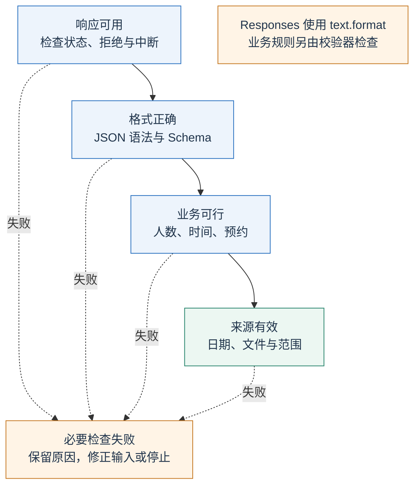
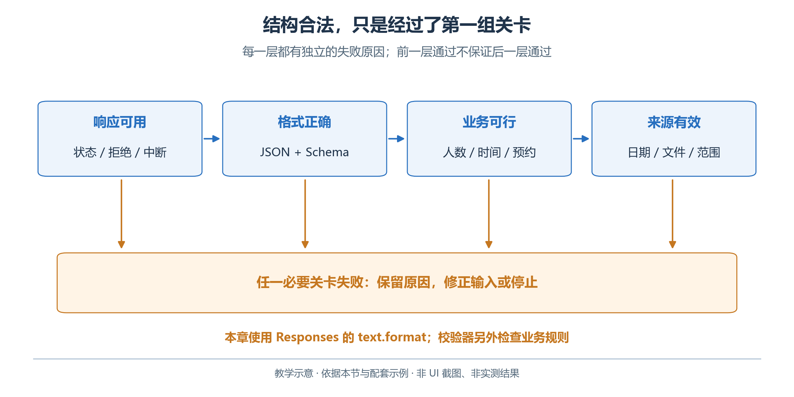
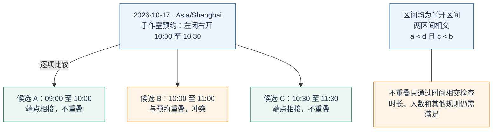
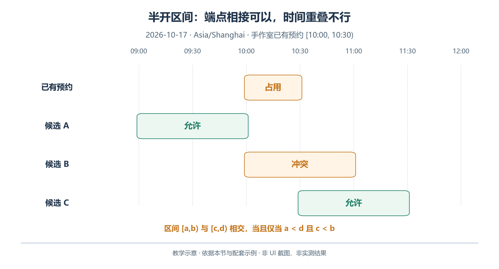

# 2.4 结构化输出：让结果可以被程序接收

结构化输出把活动、房间、起止时间和人数放进约定字段，让程序不必再次猜测“上午先阅读，稍后手作”的含义。

本节建立数据合同，再分别检查语法、结构、业务与事实来源。

## 2.4.1 语法、结构、业务、来源是四个不同问题

验收返回结果前，先确认响应没有拒绝或中断。图中的“格式正确”合并了 JSON 语法与 Schema 结构两个问题；业务可行性和资料来源仍要分别核对。

<!-- book-figure: 04-validation-gates -->



*图 2.4-1　响应、格式、业务与来源逐层检查。教学图，非界面截图或实测结果。*

这些是结果验收的检查点。来源的日期与适用范围也应在生成前核实；把来源列在图末，不表示可以等生成结束后才决定使用哪份材料。

**原图参考（转换前）**



下面是一条手作活动记录：

```json
{
  "activity_id": "craft_workshop",
  "room_id": "craft",
  "start": "2026-10-17T10:00:00+08:00",
  "end": "2026-10-17T11:00:00+08:00",
  "participants": 10
}
```

它是有效 JSON，字段也可以完全符合 Schema，但与手作室十点至十点半的已有预约重叠。若把人数改成十三，语法仍然正确，却又增加容量和需求人数不一致的问题。

| 检查层次 | 要回答的问题 | 青禾的例子 |
| --- | --- | --- |
| JSON 语法 | 能否解析 | 引号、逗号、括号是否合法 |
| Schema 结构 | 字段和类型是否符合合同 | 人数为整数，房间 ID 属于允许枚举 |
| 业务规则 | 记录之间及记录与规则是否相容 | 时长、容量、活动完整性、预约冲突 |
| 事实来源 | 所用数据是否有依据且适用于本次任务 | 人数来自当前需求，预约来自指定日期的查询 |

“返回 JSON”主要是对输出形式的要求。严格结构化输出进一步要求模型按支持的 JSON Schema 生成结果。两者都不能证明预约已经成立，也不能凭空填补缺失资料。

## 2.4.2 设计适合程序使用的合同

本章方案根对象固定包含 `date`、`timezone` 和 `activities`。每项活动包含上一段展示的五个字段。房间使用稳定 ID `reading`、`craft`、`discussion`，展示名称另从房间表读取，避免“阅读室”“阅览室”被程序误认成两个地方。完整合同见 [schedule.schema.json](examples/schemas/schedule.schema.json)。

Schema 中的 `required` 说明哪些字段必须出现；`enum` 限定离散值；`additionalProperties: false` 阻止模型临时发明未约定字段。在 OpenAI 严格结构化模式支持的 Schema 子集中，对象要显式禁止额外字段，所定义字段需要列为必填；需要表达可空值时，可使用包含 `null` 的联合类型。不要把一般 JSON Schema 的全部特性都假定为接口支持。[OpenAI：Structured Outputs](https://developers.openai.com/api/docs/guides/structured-outputs)

`null` 也要有业务含义：“待确认负责人”可为空，但本章没有该字段，缺开始时间更不能算正式排程。缺资料先阻断生成，未解决项写入说明；不完整草稿需另设合同。

时间必须含完整日期与时区偏移。字符串类型检查不能替代业务解析：仍需检查活动日期、时区、开始早于结束及准确时长。

## 2.4.3 OpenAI API：使用 Responses 的 text.format

完成第一节环境配置后，在 `examples` 目录运行：

```powershell
python structured_schedule.py
```

脚本读取教学材料和完整 Schema，再使用以下参数向支持结构化输出的模型请求候选：

```python
response = client.responses.create(
    model=os.environ["OPENAI_MODEL"],
    instructions="只依据提供材料安排活动，严格保留人数、时长和房间限制。",
    input=materials,
    text={
        "format": {
            "type": "json_schema",
            "name": "open_day_schedule",
            "strict": True,
            "schema": schema,
        }
    },
)
```

这是 [structured_schedule.py](examples/structured_schedule.py) 中请求结构的简化摘示，`materials` 与 `schema` 由脚本从文件读取。注意这里使用 Responses API 的 `text.format`，不能把另一种接口的 `response_format` 原样搬到这个请求位置。完整脚本的模型由 `OPENAI_MODEL` 指定；所选模型需实际支持该功能。[OpenAI：结构化输出用法](https://developers.openai.com/api/docs/guides/structured-outputs)

按图先检查响应状态与拒绝，再解析 JSON，最后做业务校验。中断时不补括号继续，拒绝文字也不能充当排程。

```python
if response.status != "completed":
    raise RuntimeError(f"响应未完成：{response.status}")
for item in response.output:
    if item.type == "message":
        for part in item.content:
            if part.type == "refusal":
                raise RuntimeError("模型返回拒绝，未生成候选方案")
schedule = json.loads(response.output_text)
```

上面展示最基本的分支。完整实现还应保留可获得的 `incomplete_details` 和请求信息，用于区分输出预算不足、内容限制和其他异常。不要在日志中记录 API 密钥。

## 2.4.4 让独立程序裁定业务规则

以手作室已有预约 10:00—10:30 为例，比较三段六十分钟候选。记候选区间为 `[a,b)`、预约区间为 `[c,d)`：两者都包含起点、不包含终点，端点相接不会重叠。

<!-- book-figure: 04-interval-collision -->



*图 2.4-2　半开时间区间的三个候选。教学图，非界面截图或实测结果。*

图中 A、C 的“不重叠”只表示与该预约不重叠，其他规则仍须检查。两个半开区间冲突的条件是 `a < d` 且 `c < b`；10:30 可紧接预约，10:15 开始则冲突。

**原图参考（转换前）**



本章的确定性检查器读取原始房间、需求和预约材料，再检查方案。它不会因为模型写了“已经全面核对”就跳过检查。先运行人工编写的有效夹具：

```powershell
python validate_schedule.py fixtures/valid-schedule.json --output output/validation-report.json
```

其中阅读分享九点至十点，手作体验十点半至十一点半，交流活动九点至九点四十五分。三项活动在不同房间同时开展是允许的；本章没有设置共同主持人等跨房间约束。夹具用来检查程序行为，不是某次模型生成成功的证据。

检查器还要确认活动恰好出现一次、人数与正式需求一致、使用允许房间、持续时间正确、处于开放窗口内。通过只说明符合本章已编码的规则；如果现实活动还有消防、设备或工作人员限制，需要先将这些要求纳入数据与检查，不能从“通过”推出无限范围的正确性。

## 2.4.5 WorkBuddy：生成文件，再执行相同检查

在教学工作空间中引用输入材料与 Schema，发送以下要求：

```text
依据教学材料生成 output/schedule.json，严格采用
schemas/schedule.schema.json 的字段，不修改原始人数和持续时间。
然后执行既有 validate_schedule.py 检查这个文件，保存报告。
若检查失败，先列出错误，再修正方案；不要修改校验规则来使结果通过。
最终说明实际运行的命令、结果文件及仍未解决的问题。
```

在右侧“工作空间文件”打开方案和报告，用“变更”核对它改了哪些文件。官方文档提供这些产物与修改查看入口。[WorkBuddy：结果查看](https://www.workbuddy.cn/docs/workbuddy/Results)

这一操作是产品中的文件生成与脚本验证，不能据此声称 WorkBuddy 已开启 OpenAI API 的 `strict` 参数。模型配置、传输协议和内部生成方式可能不同；本节共用的是交付合同和确定性校验规则。

## 2.4.6 失败诊断与练习

分别修改有效夹具副本，每次只改变一个因素：

| 修改 | 应发现的问题 |
| --- | --- |
| 手作改为 10:00—11:00，保留六十分钟 | 预约冲突 |
| 删除一项活动 | 活动缺失 |
| 重复一个合法活动 | 活动重复 |

再把时间改为不含时区的 `2026-10-17T10:30:00`。程序应指出时间合同不满足，而不是根据运行电脑的时区默默补值。这些练习说明，结构化输出让错误更容易被定位；它的价值并不是把所有错误变成不可能。

---

[上一节：2.3 上下文工程](03-context.md) · [下一节：2.5 Function Calling](05-function-calling.md) · [返回本章目录](README.md)
