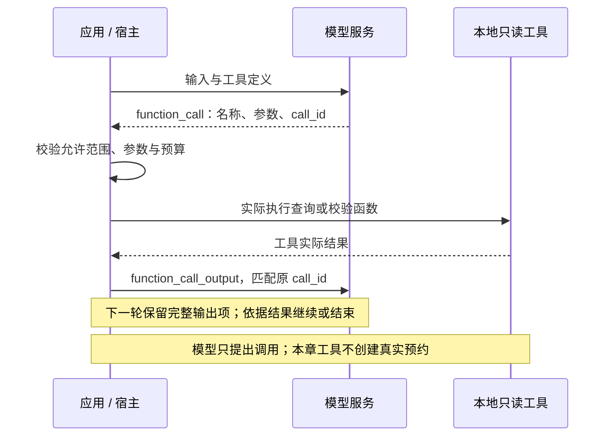
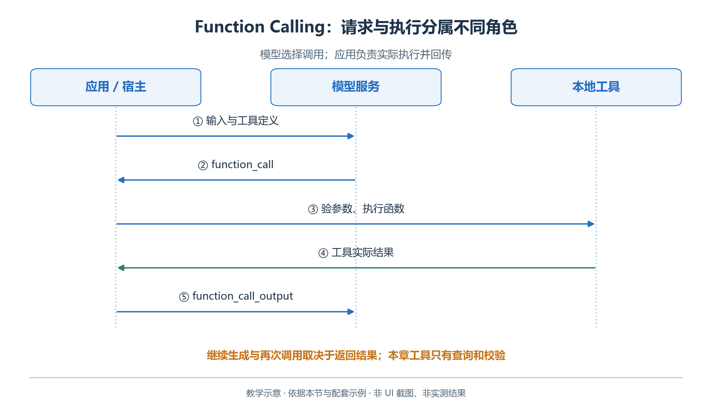
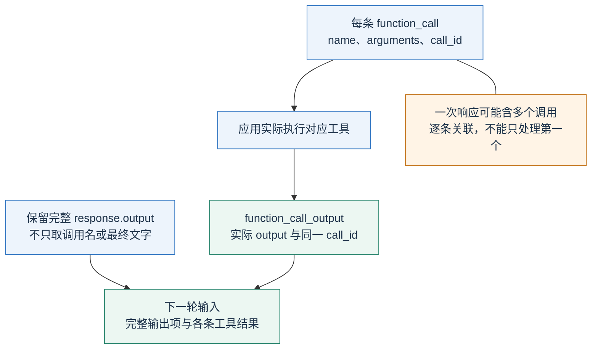
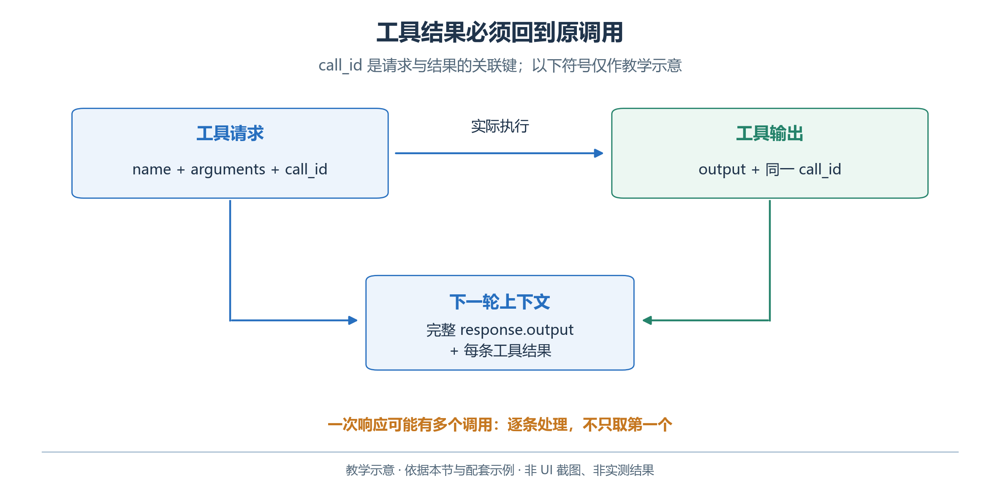
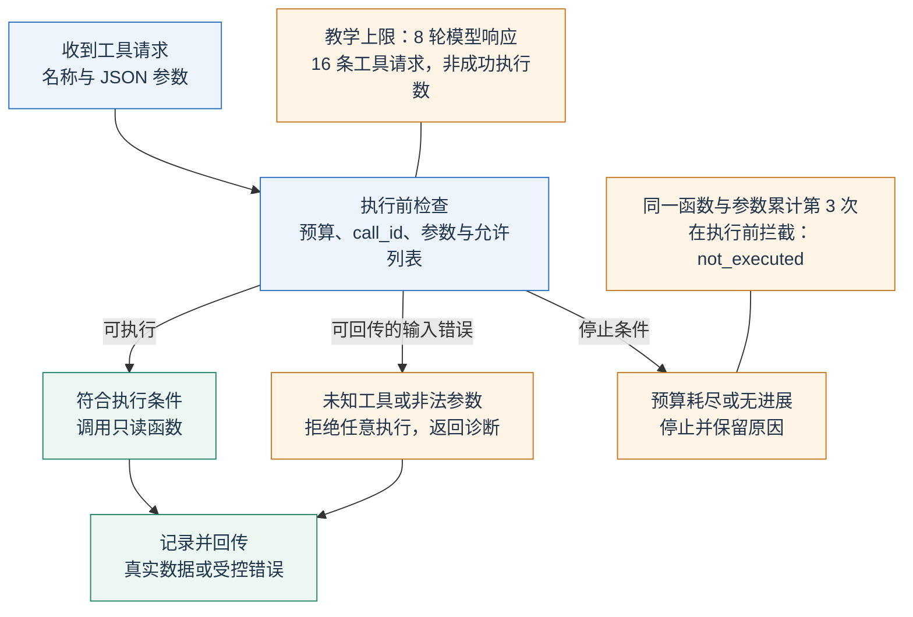
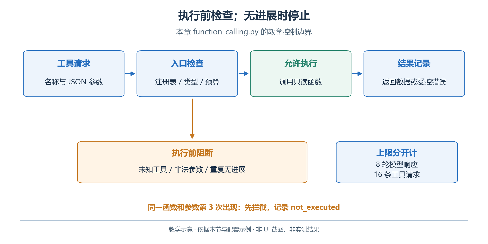

# 2.5 Function Calling：从提出请求到取得工具结果

已有材料可以生成候选，但预约可能更新。本节加入只读查询工具，按指定房间和日期获取本次依据，避免把旧记录当成当前事实。

Function Calling（函数调用、工具调用）连接两种职责：模型提出结构化请求，宿主检查并执行函数，再交回结果。只生成调用意图，不会查到记录。

## 2.5.1 先定义一个清楚且有限的工具

本章第一个工具名为 `get_room_availability`，输入是 `room_id` 和 `date`，返回教学预约记录及其查询范围。它只读本章材料，不连接真实预约系统，也不修改任何预约。第二个工具 `validate_schedule` 接收候选方案，返回确定性检查结果。

<!-- book-figure: 05-function-sequence -->



*图 2.5-1　模型请求、应用执行与结果回传。教学图，非界面截图或实测结果。*

**原图参考（转换前）**



先把查询能力做好，比一开始就把任意数据库操作或命令执行暴露给模型更容易理解和验证。工具参数用稳定 ID，工具说明明确用途和适用范围；模型无需猜测“手作教室”是不是 `craft`。

下面是第一个工具在 Responses API 中的定义形态：

```python
availability_tool = {
    "type": "function",
    "name": "get_room_availability",
    "description": "查询青禾教学数据中指定房间、指定日期的已有预约；只读。",
    "strict": True,
    "parameters": {
        "type": "object",
        "properties": {
            "room_id": {
                "type": "string",
                "enum": ["reading", "craft", "discussion"],
            },
            "date": {"type": "string", "enum": ["2026-10-17"]},
        },
        "required": ["room_id", "date"],
        "additionalProperties": False,
    },
}
```

这是本章固定日期练习的 Schema，实际工具若支持其他日期，应由真实服务校验范围。`strict` 约束调用参数的结构，但执行端仍需检查工具是否允许、参数是否有效及当前身份是否有权读取。工具描述本身不会建立认证和授权机制。[OpenAI：Function calling](https://developers.openai.com/api/docs/guides/function-calling)

## 2.5.2 一轮调用包含哪些证据

假设模型提出查询手作室的请求，返回条目的类型是 `function_call`，其中包含工具名、JSON 编码的参数和 `call_id`。程序解析参数，调用查询函数，再使用同一个 `call_id` 返回 `function_call_output`。

<!-- book-figure: 05-function-correlation -->



*图 2.5-2　用 call_id 关联每条工具结果。教学图，非界面截图或实测结果。*

`call_id` 用于匹配这次调用及其结果，不能换成房间 ID，也不能把不同工具的结果随意拼接。若同时查询三个房间，应处理实际返回的每一个调用，不能假定输出数组中的第一项一定是唯一调用。

按四项串起记录：查询日期与房间、工具实际返回、模型采用的时段、通过检查的候选。报告中一句“避开十点预约”不能替代这条证据链。

**原图参考（转换前）**



## 2.5.3 OpenAI API：完整回路比单次请求重要

运行本章完整示例：

```powershell
python function_calling.py
```

[function_calling.py](examples/function_calling.py) 注册两个只读工具，循环处理模型输出，并将通过检查的方案与说明写到输出目录。回路的核心可概括为：

```python
response = client.responses.create(
    model=model, instructions=instructions,
    input=history, tools=TOOLS,
)
history.extend(response.output)
calls = [item for item in response.output if item.type == "function_call"]

for call in calls:
    args = json.loads(call.arguments)
    result = dispatch_tool(call.name, args)
    history.append({
        "type": "function_call_output",
        "call_id": call.call_id,
        "output": json.dumps(result, ensure_ascii=False),
    })
```

这段展示调用后的衔接，不是省略保护措施的完整运行器。完整脚本另外检查响应状态、调用预算、参数和工具错误。关键顺序是先保留完整 `response.output`，再追加对应结果。若只保留调用名称或最终文字，会丢失会话需要的其他输出条目；使用推理模型时尤其不能任意丢掉相关条目。[OpenAI：处理函数调用](https://developers.openai.com/api/docs/guides/function-calling)

工具返回后仍须继续请求，模型才会读取结果并调整或结束。工具成功不等于最终答案已生成；模型停止也可能意味着提前作答或资料不足。

本章把成功条件放在应用中：只有最后一次候选检查通过，才允许作为交付方案保存。说明文件也应基于这个候选生成，避免把前一次失败方案的文字说明混到最终交付中。

## 2.5.4 参数错误、工具失败与无进展

收到工具请求后，应用要区分三种去向：符合条件才执行；可修正的输入错误回传诊断；预算耗尽或重复无进展则停止。

<!-- book-figure: 05-function-failure -->



*图 2.5-3　执行前校验与无进展阻断。教学图，非界面截图或实测结果。*

工具失败应返回明确的错误类别，而不是空列表。例如“日期不受本教学数据支持”不同于“该日期没有预约”。如果两者都返回 `[]`，模型就可能把查询失败误读为空闲。

**原图参考（转换前）**



同样，工具名必须来自允许列表。程序不能把模型返回的字符串直接交给 `eval`、动态导入或任意 Shell。未知工具、无效 JSON、字段类型错误应进入受控错误分支；文件或程序异常应明确报告失败并记录，是否重试由错误类型和预算决定，不应伪造成一次成功查询。

本章教学上限分开计数：

- 最多八轮模型请求、十六条进入处理的工具请求。计数在参数解析与执行前递增，不能当成成功执行次数。
- 同一工具和参数累计第三次出现时，在执行前触发无进展保护，也能发现两个工具交替重复。
- 达到上限就报告已完成内容与停止原因；真实应用还需判断工具状态是否变化。

这些是配套程序的保护参数，不是 OpenAI 的统一限制。

只读查询相对容易重试；涉及预订、转账或发送的写操作还需要额外的幂等与状态确认。一次网络超时可能发生在外部操作完成之后，盲目重复会造成重复副作用。本章不执行这类写操作，但读者应从一开始就区分查询与提交。

## 2.5.5 WorkBuddy：观察真实工具执行

WorkBuddy 的工具通常由宿主或插件提供；本书没有发现需要读者在界面中逐个粘贴任意函数定义的通用入口，因此不虚构“开启 Function Call”按钮。下一节通过 MCP 接入同一个只读查询能力。本节先理解接入后应该观察什么。

在完成下一节连接后，新建教学任务并明确要求：“查询 `craft` 在 `2026-10-17` 的预约，再为十人、六十分钟的手作体验提出可行安排。”展开对话中的实际执行步骤，核对工具与参数；再核对返回的十点至十点半预约和最终候选。官方“任务对话”说明了过程查看、展开步骤以及中断后继续的入口。[WorkBuddy：任务对话](https://www.workbuddy.cn/docs/workbuddy/Conversation)

若客户端只显示摘要，没有原始 `call_id` 或完整响应，不应在教材记录中补造这些字段。把可见内容标为客户端观察，把教学服务日志标为服务端证据。两者范围不同，可以互相核对，但不能假装界面展示了不存在的信息。

## 2.5.6 失败诊断与练习

先在不提供查询工具的条件下询问手作室预约，再在接入后重复同一请求。前者应说明无法核实，后者应使用工具结果。比较对象是证据是否到位，不是第二次文字是否更自信。

再做两个失败对照：

1. 查询不存在的房间 ID：应返回无效请求或请求澄清，不能悄悄换房间。
2. 校验 `10:00—11:00` 的手作候选：应发现预约冲突并修正候选，不能修改原预约。

把调用意图、执行结果与最终判定连成一条证据链。

---

[上一节：2.4 结构化输出](04-structured-outputs.md) · [下一节：2.6 MCP](06-mcp.md) · [返回本章目录](README.md)
