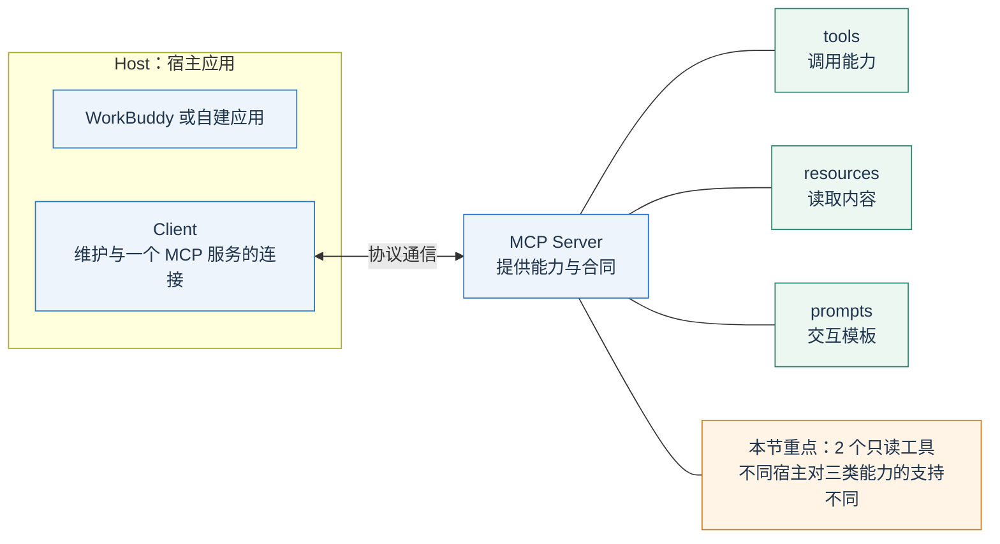
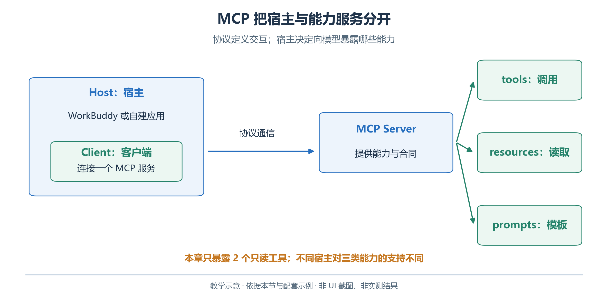
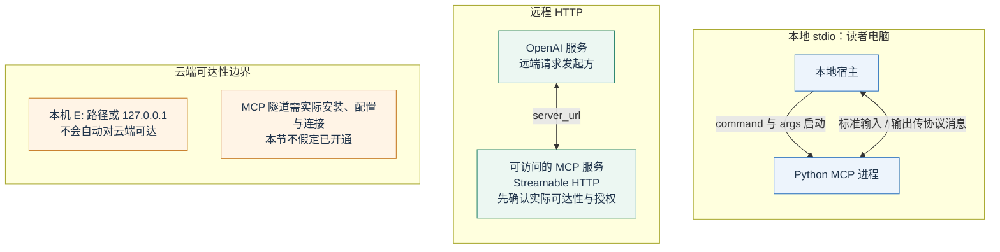
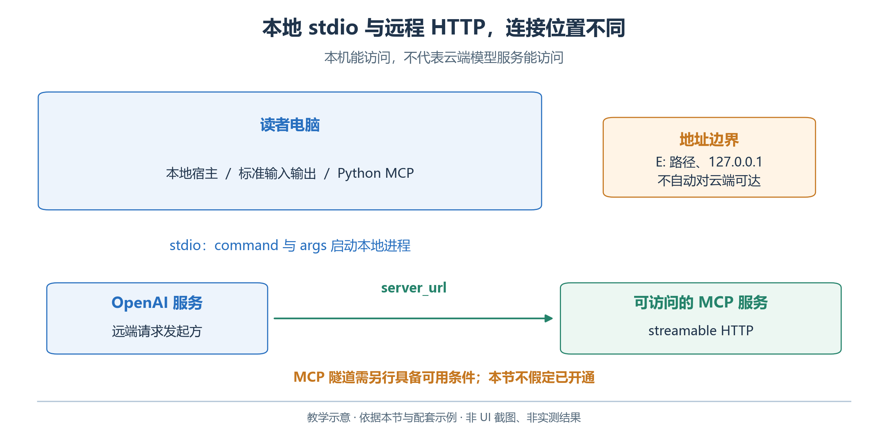
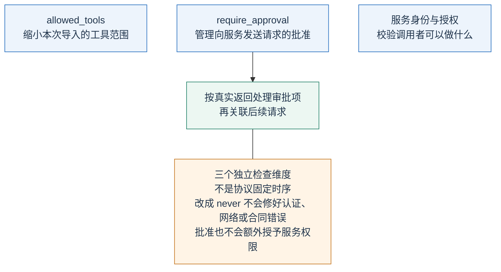
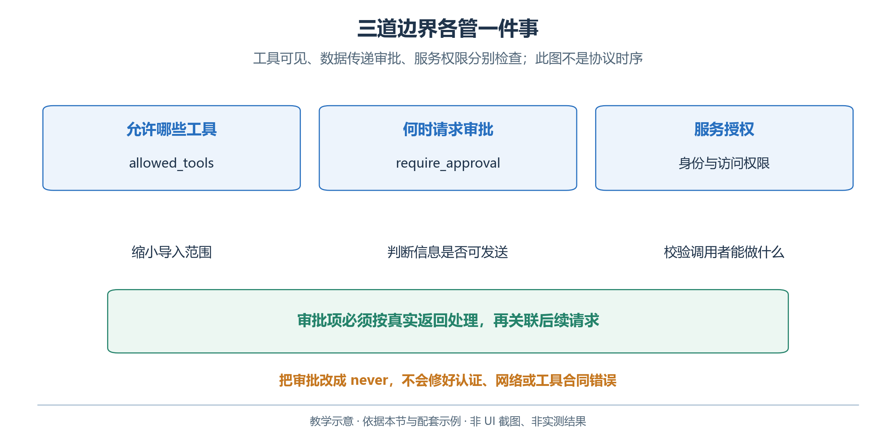

# 2.6 MCP：让工具以共同的方式接入应用

Model Context Protocol（MCP）约定应用怎样连接外部能力。把同一查询服务接入不同宿主时，可以复用能力发现、参数描述、调用与结果传输协议。

青禾预约规则仍由业务代码实现；共同连接协议不负责判断排期是否合理。

## 2.6.1 主机、客户端与服务端分别做什么

设想 WorkBuddy 接入了青禾的预约查询服务。WorkBuddy 是 **Host，宿主应用**，负责对话、模型、可用能力和用户交互。宿主内部连接某个服务的组件是 **Client，客户端**。提供预约查询的程序是 **Server，服务端**。这里的“服务端”指职责，不要求程序必须运行在远方的服务器上。[MCP 架构](https://modelcontextprotocol.io/docs/learn/architecture)

<!-- book-figure: 06-mcp-boundaries -->



*图 2.6-1　MCP 的宿主、客户端与服务器。教学图，非界面截图或实测结果。*

Host 外框表示客户端归宿主管理；Server 到 tools、resources、prompts 的连线表示能力分类，不是依次执行这三项。是否呈现或调用某一类能力，还取决于宿主支持。

**原图参考（转换前）**



```text
用户提出筹备任务
        ↓
宿主应用：组织上下文、调用模型、控制执行
        ↓
MCP 客户端：发现能力、发送调用、接收结果
        ↓  stdio 或 Streamable HTTP
MCP 服务端：校验参数、读取预约、返回业务结果
        ↓
预约材料：availability.json
```

多个服务由相应客户端分别维护连接。模型接收宿主提供的工具描述与结果，无需把数据库地址写进模型权重；生成工具名称也不证明已建立连接。

MCP 服务端可以提供三类基本能力：

| 类型 | 回答的问题 | 青禾中可以怎样使用 |
| --- | --- | --- |
| Tools，工具 | 能执行什么操作 | 查询预约、校验候选方案 |
| Resources，资源 | 有什么内容可以读取 | 房间表、活动规则 |
| Prompts，提示模板 | 可以怎样组织一次交互 | 根据材料核对活动约束的模板 |

这是协议能够表达的能力，不意味着每个宿主都以同样界面支持全部类型。本节围绕两项工具练习；配套服务还声明了 `open-day://rules` 资源。工具接通只能证明该工具链路可用，资源浏览、提示模板或协议其他扩展仍需分别验收。OpenAI Responses 的 MCP 指南主要介绍工具的导入与调用，应按该接口实际支持范围使用。[MCP 架构](https://modelcontextprotocol.io/docs/learn/architecture)、[OpenAI MCP 工具](https://developers.openai.com/api/docs/guides/tools-remote-mcp)

## 2.6.2 Function Calling 与 MCP 怎样配合

Function Calling 解决模型怎样提出一个带参数的工具请求，以及应用怎样返回结果。MCP 进一步约定应用怎样连接一个能力提供者、发现它的工具并调用。业务函数可以先被 Python 直接调用，再由 MCP 服务暴露；两条路径可以复用同一份业务校验代码。

容量与冲突规则只维护一份；Function Calling 包装器与 MCP 服务处理各自的参数、协议和错误转换。第三章也区分决策与有权限边界的执行，但这里的只读服务不是仿真 MCP。

## 2.6.3 本地 stdio 和远程 HTTP

先确定“谁在什么机器上连接谁”：本地 stdio 由桌面宿主启动进程；远程 HTTP 示例则由 OpenAI 服务访问配置的 MCP 地址。两条路线不能共用一个未经验证的本机地址。

<!-- book-figure: 06-mcp-transports -->



*图 2.6-2　本地 stdio 与远端 HTTP 的地址边界。教学图，非界面截图或实测结果。*

**stdio** 通过进程的标准输入与标准输出传输协议消息。桌面宿主可以启动本机 Python 服务，双方在同一台计算机上通信。标准输出此时是协议通道，调试日志应写到标准错误，不能随手 `print("服务启动了")` 污染协议数据。

**Streamable HTTP** 通过 HTTP 传输消息，适合连接远程服务。服务器的可达性、认证和部署由服务提供者安排。OpenAI Responses 也支持指南中说明的 HTTP/SSE 接入方式；新的远程教学部署优先按当前 Streamable HTTP 文档实现。[MCP 架构](https://modelcontextprotocol.io/docs/learn/architecture)、[OpenAI MCP 工具](https://developers.openai.com/api/docs/guides/tools-remote-mcp)

本机 `http://localhost:8000` 中的 localhost 指访问者自己。云端 API 不会因为请求里写了这个地址，就进入读者的电脑。OpenAI 当前另有 Secure MCP Tunnel，并允许用 `tunnel_id` 连接相应本地服务；它需要实际安装、配置和可用连接，不能用一个虚构的隧道 ID 代替。[OpenAI MCP 工具](https://developers.openai.com/api/docs/guides/tools-remote-mcp)

**原图参考（转换前）**



## 2.6.4 先检查教学服务的业务合同

配套的 [mcp_server.py](examples/mcp_server.py) 暴露以下只读工具。依赖与启动命令见[示例说明](examples/README.md)，使用同一虚拟环境中的解释器。

```powershell
python -m pip install -r requirements-mcp.txt
python mcp_server.py
```

默认启动 stdio 服务，等待宿主发送协议请求。终端停在那里不输出自然语言，通常只是等待输入，并不等于故障；正式连接时由宿主按配置启动它。需要本地 HTTP 调试时可使用 `python mcp_server.py --transport streamable-http --port 8000`，但这个本地监听地址仍不能直接供云端 API 访问。示例按 [MCP Python SDK 运行方式](https://py.sdk.modelcontextprotocol.io/run/)组织。

| 工具 | 输入 | 应检查的结果 |
| --- | --- | --- |
| `get_room_availability` | `room_id`、`date` | 指定日期的房间、开放时间及已占用区间 |
| `validate_schedule` | `schedule` 对象 | 候选方案是否满足规则及具体错误 |

接通后做三个业务对照：

1. 查询 `room_id="craft"`、`date="2026-10-17"`，应得到 `10:00–10:30` 占用，保留日期和 `+08:00`。
2. 查询不存在的房间，应返回可诊断错误，不能用空列表冒充空闲。
3. 提交与预约重叠的候选，应返回检查失败。

这三个步骤分别测试正常数据、无效身份与业务规则。服务连接成功只完成了接入检查；还需要确认宿主实际发现了工具、正确传参，并读取了业务结果。SDK 版本与宿主支持的协议版本也应记录；本书示例依赖按当前 Python SDK 编写，不能推断任意旧客户端都兼容。

## 2.6.5 通过 OpenAI Responses 使用远程服务

远程工具还要分别核对三个问题：本次导入哪些工具（`allowed_tools`）、发送调用前怎样批准（`require_approval`）、服务端允许该身份做什么。批准请求不会扩展服务授予的权限。

<!-- book-figure: 06-mcp-approval -->



*图 2.6-3　工具范围、审批与服务权限分别核对。教学图，非界面截图或实测结果。*

三个设置互相独立；只有“审批项→关联后续请求”这条箭头表示实际交互顺序。下面的代码保留审批返回项，再针对真实请求 ID 作出决定。

**原图参考（转换前）**



下面是远程接入的完整最小交互示意。运行前必须已有可访问的教学 MCP HTTPS 地址，并设置 `OPENAI_MODEL`、`OPENAI_API_KEY` 和 `OPEN_DAY_MCP_URL`。本地 stdio 练习不需要这一步，也不能直接把本机脚本路径填进 `server_url`。

```python
import os
from openai import OpenAI

client = OpenAI(timeout=30, max_retries=0)
model = os.environ["OPENAI_MODEL"]
tools = [{
    "type": "mcp",
    "server_label": "qinghe",
    "server_url": os.environ["OPEN_DAY_MCP_URL"],
    "allowed_tools": ["get_room_availability"],
    "require_approval": "always",
}]
instructions = "仅查询教学预约。工具失败时说明失败，不推测空闲时间。"
response = client.responses.create(
    model=model, tools=tools, instructions=instructions,
    input="查询 craft 在 2026-10-17 的预约，说明 10 点能否开始活动。",
)
for _ in range(4):
    approvals = [x for x in response.output
                 if x.type == "mcp_approval_request"]
    if not approvals:
        print("status:", response.status)
        print(response.output_text)
        for item in response.output:
            if item.type in {"mcp_list_tools", "mcp_call"}:
                print(item.model_dump_json())
        break
    answers = []
    for item in approvals:
        print(item.server_label, item.name, item.arguments)
        approved = input("是否发送这次工具请求？输入 yes 批准：") == "yes"
        answers.append({"type": "mcp_approval_response",
                        "approval_request_id": item.id,
                        "approve": approved})
    response = client.responses.create(
        model=model, tools=tools, instructions=instructions,
        previous_response_id=response.id, input=answers,
    )
else:
    raise RuntimeError("达到本练习的审批续接上限，保存记录后停止")
```

`allowed_tools` 缩小本次导入的工具集合；`require_approval` 管理向服务发送工具请求的批准过程。它们各有作用，批准不会让本来无权限的服务获得额外权限。生产应用还应验证服务身份，并按实际服务要求提供认证。本例的终端询问只是展示交互，教材没有替读者执行远程调用。[OpenAI MCP 工具](https://developers.openai.com/api/docs/guides/tools-remote-mcp)

应查看 `mcp_list_tools` 是否导入目标工具、`mcp_call` 的参数和结果是否正确。遇到连接错误、工具执行错误或仅有文字解释时，不能只凭 `output_text` 判断预约查询成功。若选择 `require_approval="never"`，意味着调用者预先接受相应数据发送，不是通用的排错手段。

## 2.6.6 在 WorkBuddy 中连接同一服务

进入 **插件 → MCP 服务器 → 配置 MCP**，选择适合教学工作区的配置范围。官方文档给出用户级 `~/.workbuddy/mcp.json` 与项目级 `<项目目录>/.workbuddy/mcp.json`；下面使用项目级配置，避免练习服务出现在无关项目中。[WorkBuddy MCP 配置](https://www.workbuddy.cn/docs/workbuddy/From-Beginner-to-Expert-Guide/Function-Description/MCP-Guide)

以下路径需要换成读者实际安装位置。JSON 中正斜杠可避免 Windows 反斜杠的转义问题；命令与参数分开，不要把整条命令塞进 `command`。

```json
{
  "mcpServers": {
    "qinghe-open-day": {
      "command": "E:/GenerativeAgentsCN/docs/book/chapter 02/examples/.venv/Scripts/python.exe",
      "args": [
        "E:/GenerativeAgentsCN/docs/book/chapter 02/examples/mcp_server.py"
      ]
    }
  }
}
```

保存后按顺序核对：

1. 连接状态与实际工具列表。
2. 查询 `craft` 在 `2026-10-17` 的预约，核对返回的占用区间。
3. 再试不存在的房间与冲突候选。

界面未展示原始参数或结果时，记录证据缺失，不能补写工具卡片。

连接失败先定位解释器路径、依赖、服务启动或协议问题；不修改活动规则，也不猜预约继续。以上路径依据官方文档，具体客户端连接与调用仍待读者实测。

## 2.6.7 本节练习

将 MCP 服务器停用，再提出同一个查询任务。合格的表现是说明能力不可用、保留待查询项；凭上一轮记录声称已经重新查询则不合格。恢复服务后，再比较原始返回与最终答案中的房间、日期、时间区间是否一致。

思考：如果服务从不写数据，是否就不需要控制其读取范围？参考答案是仍然需要。只读服务也可能读取和返回不该暴露的资料。本节使用固定教学材料；接入真实业务时，身份与读取权限由服务和宿主实现，不能交给提示词自行保证。

---

[上一节：Function Calling](05-function-calling.md) · [下一节：CLI 与 Shell](07-cli-and-shell.md) · [返回本章](README.md)
