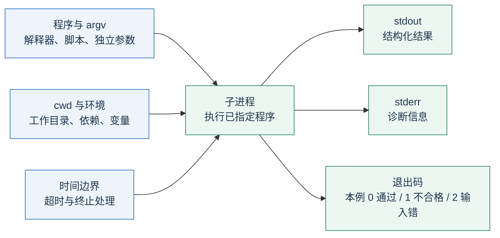
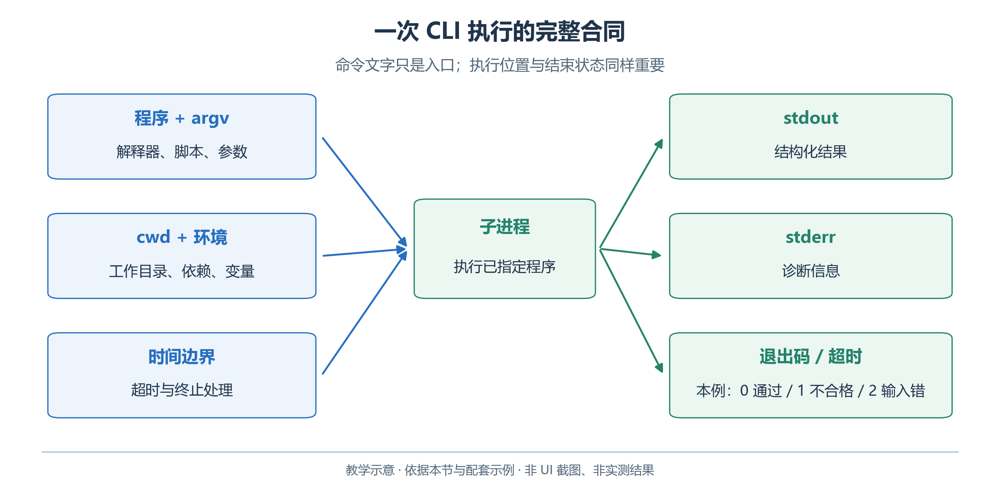
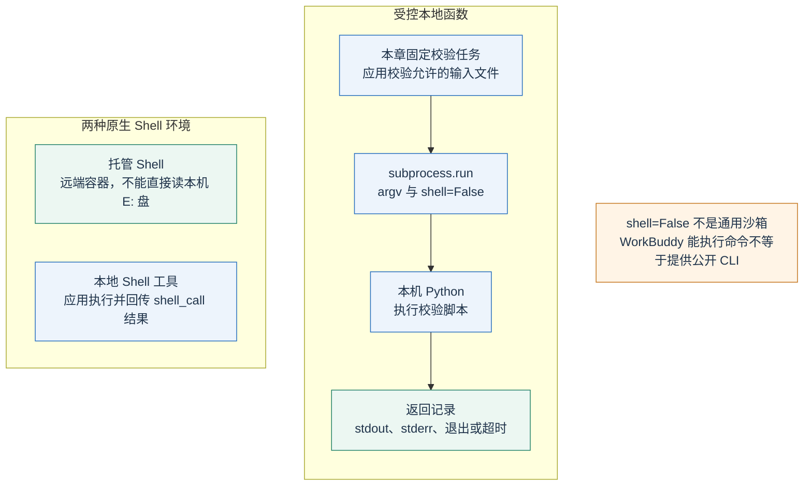
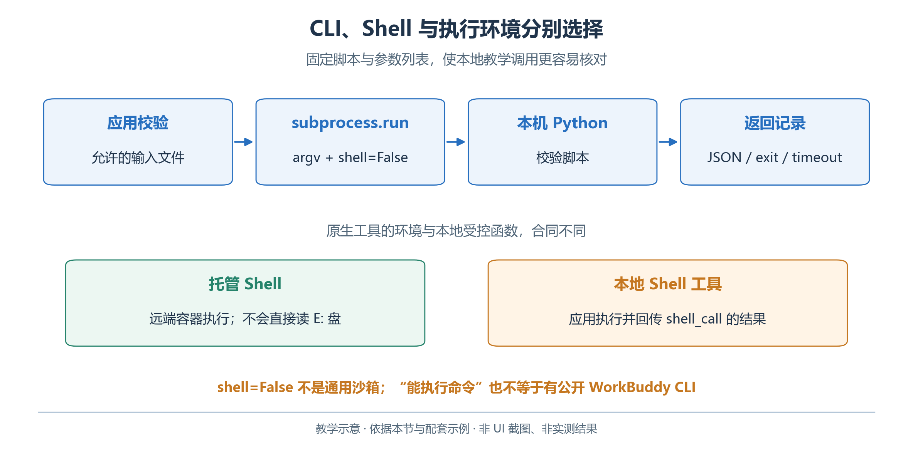

# 2.7 CLI 与 Shell：把明确规则交给程序执行

容量、时长和重叠已有明确规则，适合由程序逐条判定。模型组织候选、理解错误并解释修改；独立校验器提供一致的检查结果。

CLI 是 Command-Line Interface，即命令行接口；Shell 是读取命令并组织执行的环境，例如 PowerShell。一个校验程序提供 CLI，并不要求它必须经过 Shell 启动。Python 应用也能直接以参数列表启动该程序，避免额外的命令字符串解释。

## 2.7.1 读懂一条命令的六个部分

用同一条校验命令说明进程合同：参数决定检查哪个文件，工作目录与环境决定如何找到依赖，标准输出、标准错误和退出码分别提供结果与诊断。

<!-- book-figure: 07-cli-contract -->



*图 2.7-1　CLI 输入、环境与结果合同。教学图，非界面截图或实测结果。*

本例退出码 2 指文件或 JSON 输入错误；超时由启动它的执行器另行报告，不能伪装成校验通过或某个业务退出码。

**原图参考（转换前）**



先进入本章示例目录，再执行：

```powershell
Set-Location -LiteralPath 'E:\GenerativeAgentsCN\docs\book\chapter 02\examples'
python -X utf8 validate_schedule.py fixtures/valid-schedule.json --output output/validation-report.json
$LASTEXITCODE
```

这里的 `python` 是解释器，`validate_schedule.py` 是脚本；方案路径和 `--output` 后面的路径是参数。`-X utf8` 让该 Python 进程使用 UTF-8 模式，便于保存和检查中文输出。目录中包含空格，因此 PowerShell 切换目录时使用了引号；在 Python 参数列表中，则不应人为把引号作为路径字符传进去。

| 要素 | 含义 | 本练习要记录什么 |
| --- | --- | --- |
| 工作目录 `cwd` | 相对路径从哪里开始解析 | 本章的 `examples` 目录 |
| 参数 `argv` | 程序接收到的独立参数 | 脚本、输入文件、输出选项 |
| 标准输出 `stdout` | 主要结果通道 | 校验报告或结果摘要 |
| 标准错误 `stderr` | 诊断信息通道 | 文件读取或执行异常 |
| 退出码 | 进程结束的状态标记 | 本教材定义的 0、1、2 |
| 超时 | 允许进程运行的最长时间 | 由外层执行器设置 |

本书校验器约定：`0` 表示规则检查通过，`1` 表示方案不合格，`2` 表示文件读取或 JSON 等输入处理错误。这是本程序的合同，不是所有 CLI 的通用业务语义。调用者需要同时检查退出码和报告，不能看到有标准输出就判断成功。

## 2.7.2 为什么时间边界适合确定性检查

活动占用 `[开始, 结束)` 区间，包含开始，不包含结束。两个区间 `[a,b)` 和 `[c,d)` 重叠，当且仅当：

```text
a < d 并且 c < b
```

手作室的已有预约为 `10:00–10:30`。安排 `09:00–10:00` 与之相接，不重叠；安排 `09:30–10:30` 就重叠。只比较开始时间是否相同，会漏掉后一种冲突。

“没有冲突”还不足以通过。先检查日期、时区、开始早于结束、要求时长和请求覆盖完整性；缺少手作活动的方案同样不合格。校验器只判断已形式化的条件，不替组织者选择最佳方案。

打开[校验器](examples/validate_schedule.py)、[规则](examples/data/rules.md)和[预期检查](examples/data/expected-checks.md)，逐项对应输入与判定。`fixtures/valid-schedule.json` 是人工构造的参考输入，用于验证程序，不是大模型生成成功的证据。

## 2.7.3 先手工运行，再让模型调用

第一次运行使用上述正确方案；第二次使用示例目录提供的错误方案；第三次使用不存在的文件名。保存每次退出码和报告，不用同一个文件覆盖后便丢弃失败记录。

```powershell
python -X utf8 validate_schedule.py fixtures/invalid-schedule.json --output output/invalid-report.json
$LASTEXITCODE
python -X utf8 validate_schedule.py fixtures/not-found.json
$LASTEXITCODE
```

在一个候选副本中，将手作活动改成 `10:00–11:00`，其他字段保持完整。它满足六十分钟时长，却与 `10:00–10:30` 的已有预约重叠。把人数改成十三，则另有容量问题，因为手作室容量为十二。两个错误应由相应规则指出，而不只是笼统给出“方案不合理”。

这一步能建立可信的执行基线。如果手工运行都找不到文件，让模型重复执行同一条命令并不会解决问题。应先检查路径、环境和参数，再把可用 CLI 暴露给模型。

## 2.7.4 在 OpenAI 应用中包装受控命令

最小路线可以复用 2.5 节的 Function Calling 回路：定义一个 `run_schedule_check` 工具，只接受允许的输入名称；执行器把该名称映射到文件，启动固定脚本，再把结果作为 `function_call_output` 返回。模型无需拥有拼接任意命令的能力。

<!-- book-figure: 07-cli-execution -->



*图 2.7-2　受控进程与原生 Shell 的环境区别。教学图，非界面截图或实测结果。*

下面的代码实现“受控本地函数”这一组。另两项是 2.7.5 展开的原生 Shell 环境选择，各自承担执行与结果回传，不是该函数之后的必经阶段。

**原图参考（转换前）**



下面的片段展示执行器核心，运行位置为 `examples`。完整的工具请求与 `call_id` 回传方式沿用 2.5 节。

```python
from pathlib import Path
import subprocess
import sys

ROOT = Path.cwd().resolve()
ALLOWED_INPUTS = {
    "reference": ROOT / "fixtures" / "valid-schedule.json",
    "candidate": ROOT / "output" / "schedule.json",
}

def run_schedule_check(input_name: str) -> dict:
    if input_name not in ALLOWED_INPUTS:
        return {"error": "unknown_input", "input_name": input_name}
    source = ALLOWED_INPUTS[input_name].resolve()
    if not source.is_relative_to(ROOT):
        return {"error": "input_outside_workspace"}
    try:
        result = subprocess.run(
            [sys.executable, "-X", "utf8",
             str(ROOT / "validate_schedule.py"), str(source)],
            cwd=ROOT, shell=False, capture_output=True,
            text=True, encoding="utf-8", timeout=10, check=False,
        )
    except subprocess.TimeoutExpired:
        return {"error": "validation_timeout", "timeout_seconds": 10}
    except OSError as exc:
        return {"error": "process_start_failed", "detail": str(exc)}
    return {
        "exit_code": result.returncode,
        "stdout": result.stdout[:8000],
        "stderr": result.stderr[:2000],
        "output_truncated": len(result.stdout) > 8000
                            or len(result.stderr) > 2000,
    }
```

这段执行器有四条边界：

- `shell=False` 与参数列表避免 Shell 再解释参数中的特殊字符。
- `check=False` 保留业务不合格的退出码供调用者检查。
- 超时是执行失败，不能写成“未发现冲突”。
- `capture_output` 在进程结束前收集输出；它不是通用沙箱。若允许任意程序或大量输出，还需要流式限额和进程隔离。[Python subprocess](https://docs.python.org/3/library/subprocess.html)

候选变更后重新校验。交付记录输入摘要、执行时间和脚本版本，让报告对应本次文件；旧报告不能证明新候选通过。

## 2.7.5 OpenAI 原生 Shell 工具的两种位置

OpenAI Responses 也提供原生 `shell` 工具。托管模式在 OpenAI 管理的容器中执行，本地模式由调用者的执行环境处理请求。它是 Responses 的工具能力，不能把相同字段直接套到 Chat Completions 请求中。[OpenAI Shell 指南](https://developers.openai.com/api/docs/guides/tools-shell)

```python
import os
from openai import OpenAI

client = OpenAI(timeout=30, max_retries=0)
response = client.responses.create(
    model=os.environ["OPENAI_MODEL"],
    tools=[{"type": "shell",
            "environment": {"type": "container_auto"}}],
    input="用 Python 计算三场活动人数 24、10、16 的总和，报告计算结果。",
)
print(response.output_text)
```

这个短例演示托管执行，正确和为五十。容器不是读者的 Windows 电脑，不能读取本地 `E:` 盘。要在其中校验青禾材料，需要先把脚本和输入送入该环境，例如采用下一节的自包含 Skill 包，并检查实际产生的工具结果。

若环境改为 `{"type":"local"}`，应用需要接收 `shell_call`，实际执行命令，再以匹配的 `call_id` 送回 `shell_call_output`。返回项包含标准输出、标准错误，以及退出或超时结果。仅发送一次 `responses.create` 并打印文字，没有完成本地 Shell 回路。[OpenAI Shell 指南](https://developers.openai.com/api/docs/guides/tools-shell)

对于本节固定任务，前面的受控函数包装器已经足够。只有需要更广泛的文件和命令处理时，再实现原生本地 Shell 的执行器，并规定工作目录、命令权限、输出限额、超时和取消行为。

## 2.7.6 在 WorkBuddy 中执行相同校验

在教学工作区中提出以下任务，并保持客户端适合该工作区的默认权限设置：

```text
请先确认当前目录中有 validate_schedule.py 和 fixtures/valid-schedule.json。
运行 Python 校验器，输入该参考方案，将报告写到 output/reference-report.json。
展示实际命令、执行结果和报告内容，解释退出码。
然后校验我提供的候选方案，保留失败报告；不要为了通过而修改规则或校验脚本。
```

查看实际命令步骤以及右侧文件产物。若界面没有显示退出码，可让受控包装器显式输出进程结果；不要从绿色文字、任务结束或“已检查”一句话推断成功。[WorkBuddy 权限模式](https://www.workbuddy.cn/docs/workbuddy/From-Beginner-to-Expert-Guide/Function-Description/Permission-Modes)、[结果查看](https://www.workbuddy.cn/docs/workbuddy/Results)

这里使用的是 WorkBuddy 的命令执行能力。它不等于存在一个可在系统终端运行的公开 `workbuddy` 命令，也不等于输入框中的斜杠命令。命令入口、运行环境和可见输出应以客户端实际行为核对；遇到权限拒绝时，先判断该命令是否确实在本次任务范围内。

## 2.7.7 本节练习

设计两个候选：一个恰在 `10:00` 结束，另一个恰在 `10:30` 开始。根据手作室已有预约，二者在时间重叠规则上都应通过，但仍须分别满足时长、活动窗口与其他规则。再制造一个“JSON 正确、活动遗漏”的候选，解释它为何仍然不合格。

最后回答：为什么不能让模型修改校验器，直到自己的方案通过？因为校验器代表本轮已经确认的业务规则。改变规则意味着改变评测问题。若组织者确实修改了规则，应单独记录新规则和原因，再生成对应的新报告。

---

[上一节：MCP](06-mcp.md) · [下一节：Skill](08-skills.md) · [返回本章](README.md)
