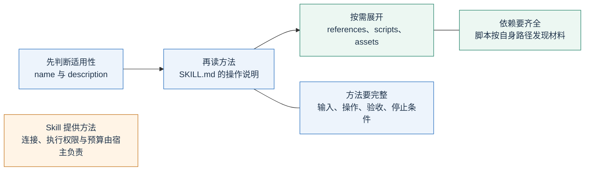
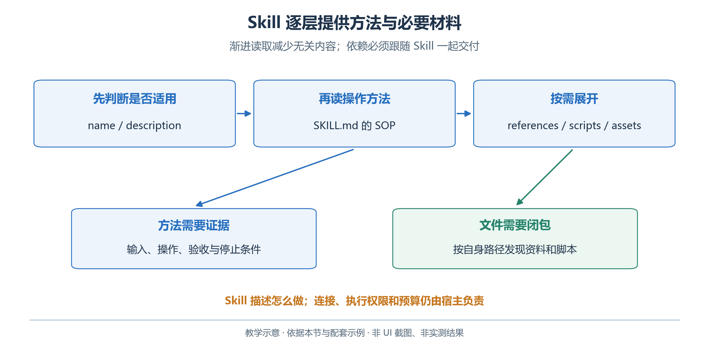
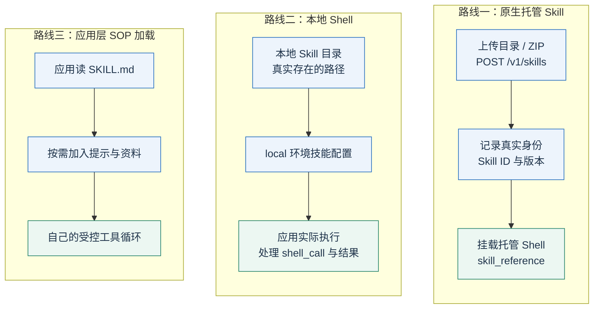
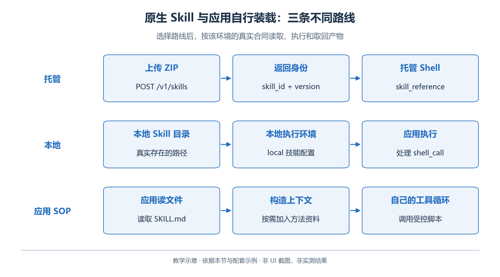
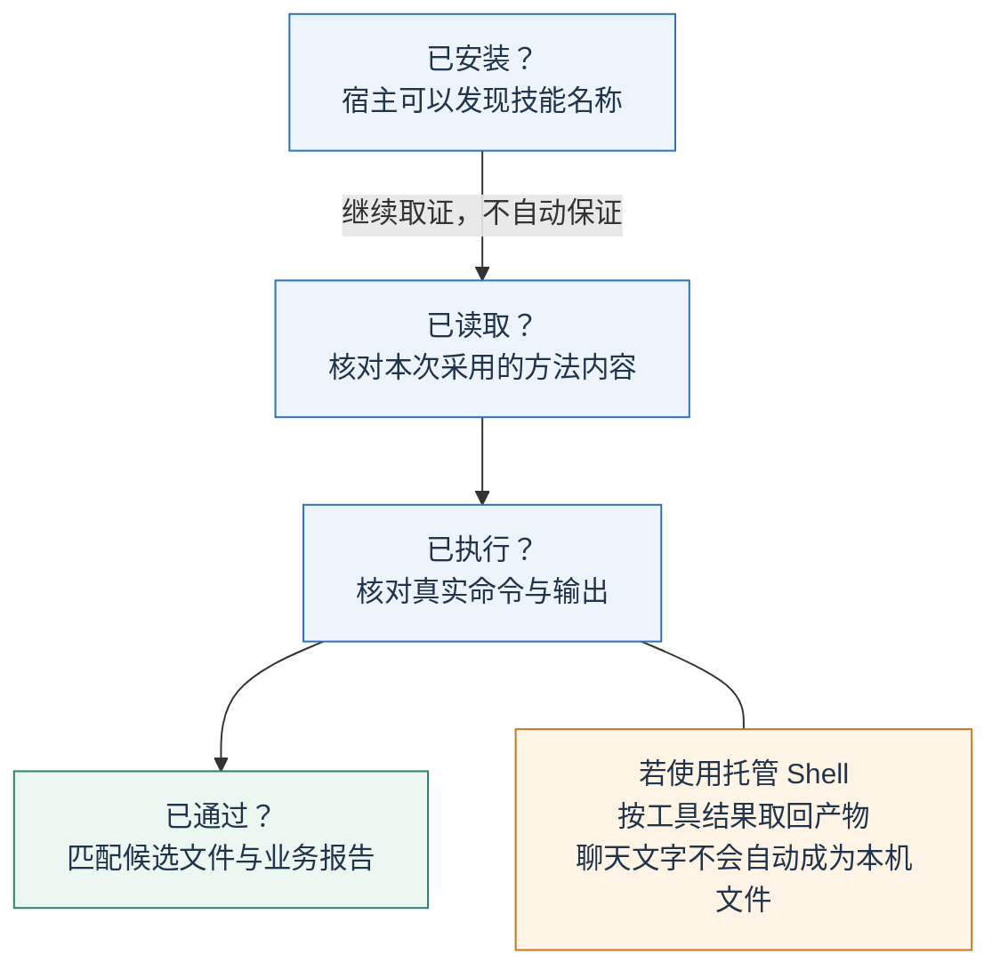
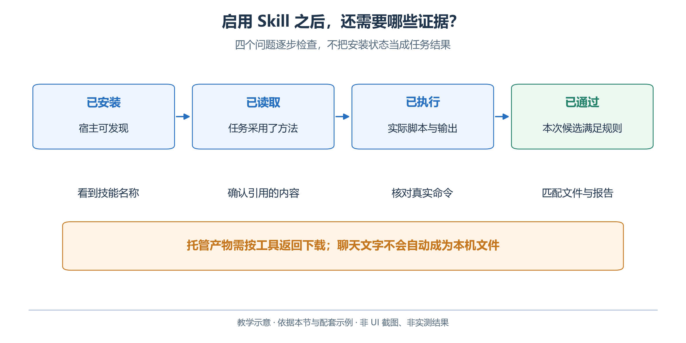

# 2.8 Skill：把一套方法做成可以重复使用的材料包

跨活动复用“读规则—查预约—生成—校验”的方法，可以减少重复说明与遗漏。Skill 将方法及辅助文件组织成材料包，供宿主按任务选用。

Skill 通常包括一个 `SKILL.md`，以及按需提供的参考资料、脚本和模板。它保存的是方法，具体结果仍由本次输入、模型和工具执行共同决定。安装了 Skill，并不能保证每一次任务都会自动调用它，更不能保证业务结果总是正确。[Agent Skills 文件规范](https://agentskills.io/specification)

## 2.8.1 Skill 的几个组成部分

本章配套的 [open-day-planner](examples/skills/open-day-planner/SKILL.md) 是一个自包含的教学目录：

```text
open-day-planner/
├── SKILL.md                    # 适用条件、操作步骤与停止条件
├── references/                # 青禾的教学规则和输入材料
├── scripts/                   # 校验脚本及其辅助模块
└── assets/
    └── schedule.schema.json   # 方案的数据结构
```

`SKILL.md` 开头的 front matter 是元数据，用短名称和描述帮助宿主发现该方法；后面的 Markdown 是具体操作说明。下面是教学缩略版，实际练习以配套文件全文为准。

```markdown
---
name: open-day-planner
description: 根据房间、活动请求和预约材料编写开放日方案，并运行独立校验。
---

# 开放日筹备

## 输入
读取 brief、房间表、规则、活动请求和预约材料。
先确认日期、时区、材料来源及本次输入位置。

## 操作
1. 整理明确约束和缺失资料；缺少必要事实时先报告缺口。
2. 使用实际可用的预约查询工具；离线材料只作指定日期的教学快照。
3. 生成候选 schedule.json，保持活动 ID 和房间 ID 不变。
4. 运行 scripts 中的校验器，读取完整报告。
5. 按错误修改候选，最多修正三轮，不修改规则来绕过错误。
6. 输出方案、报告、依据和未解决问题。

## 停止
规则冲突、输入缺失或校验仍失败时，保留结果并说明阻塞原因。
只生成筹备文件，不代表已经完成真实预约。
```

有效 Skill 同时写清适用条件、执行步骤、验收与停止条件。角色设定不能替代过程，只有步骤而无失败处理也不足以约束循环。

## 2.8.2 渐进读取怎样节省上下文

设想一个宿主安装了一百个 Skill。如果每次都把所有脚本、表格和说明全文送入模型，会占用大量上下文，而且让无关规则干扰当前任务。常见方式是先提供名称和描述，模型选中相关 Skill 后再读取 `SKILL.md`，随后按需读取引用文件。这就是渐进读取，也常称为渐进披露。[Agent Skills 文件规范](https://agentskills.io/specification)

<!-- book-figure: 08-skill-package -->



*图 2.8-1　渐进读取方法与辅助文件。教学图，非界面截图或实测结果。*

描述写明任务与触发条件；正文引用实际文件并说明路径基准。脚本按自身位置发现材料，不假定宿主已切换到 Skill 根目录。

**原图参考（转换前）**



工具定义、MCP 与 Skill 各自处理不同层次。工具告诉模型能做什么，MCP 组织能力连接，Skill 说明怎样运用已具备的能力。Skill 写着“查询预约”，不表示宿主就自动安装了预约服务；写着“运行 Python”，也不表示运行环境已经拥有 Python。

## 2.8.3 先验证方法，再安装

先读配套文件，检查步骤、脚本和资料是否齐全。然后在本地执行脚本，确认它能找到 `references`，Schema 与方案结构一致，且不依赖仓库外部的隐含文件。教学包中的规则与示例目录中的规则应保持一致，配套离线测试会检查关键副本，避免讲解一套规则、实际执行另一套规则。

用正确方案、预约冲突方案和缺字段方案分别运行，确认 Skill 所引用的检查程序能够区分这些情况。随后换一次人数或预约材料，观察流程是否重新读取输入。直接复制上一轮答案，不能证明 Skill 实现了方法复用。

Skill 本身不授予执行权限。宿主、工具服务和运行环境决定能读取哪些文件、能执行什么命令。参考资料中的外部文字也可能包含与任务无关的指令；它们是待使用的材料，不能覆盖本次任务的边界和执行规则。

## 2.8.4 OpenAI 原生 Skills：上传并挂载到托管 Shell

截至本章核查日期，OpenAI Responses 已提供原生 Skills 路线：上传目录或 ZIP 得到 Skill 身份，再把它挂载到 Shell 环境。不能再把“API 使用 Skill”一概解释成手工把 SOP 拼进提示。[OpenAI Skills 指南](https://developers.openai.com/api/docs/guides/tools-skills)

<!-- book-figure: 08-skill-hosting -->



*图 2.8-2　托管、本地与应用 SOP 的三种装载路线。教学图，非界面截图或实测结果。*

本小节先走“上传→身份→托管 Shell”路线；本地 Shell 和应用层 SOP 加载留到 2.8.5。三组分别描述装载方式，不能把某一组的上传、路径或执行权限直接套给另一组。

**原图参考（转换前）**



先在 `examples` 目录打包，ZIP 内保留唯一顶层目录 `open-day-planner`。下面的 Python 代码按相对路径写入文件，避免只压缩文件内容而丢失根目录：

```python
from pathlib import Path
from zipfile import ZipFile, ZIP_DEFLATED

folder = Path("skills/open-day-planner")
output = Path("output/open-day-planner.zip")
output.parent.mkdir(parents=True, exist_ok=True)
with ZipFile(output, "w", ZIP_DEFLATED) as bundle:
    for path in sorted(folder.rglob("*")):
        if path.is_file() and "__pycache__" not in path.parts:
            bundle.write(path, path.relative_to(folder.parent).as_posix())
```

确认包中只有本节需要的教学文件，再由读者上传。PowerShell 命令如下，密钥来自环境变量：

```powershell
curl.exe --fail-with-body -X POST 'https://api.openai.com/v1/skills' -H "Authorization: Bearer $env:OPENAI_API_KEY" -F 'files=@output/open-day-planner.zip;type=application/zip'
```

目录式上传则使用多份 `files[]` 表单项，并保留每个文件在唯一顶层目录内的路径。记录服务返回的 Skill ID 与实际版本，将该 ID 设置为 `OPEN_DAY_SKILL_ID`。下面的请求挂载刚上传的包；模型和账号须支持相应托管工具。

```python
import os
from openai import OpenAI

client = OpenAI(timeout=60, max_retries=0)
response = client.responses.create(
    model=os.environ["OPENAI_MODEL"],
    tools=[{
        "type": "shell",
        "environment": {
            "type": "container_auto",
            "skills": [{
                "type": "skill_reference",
                "skill_id": os.environ["OPEN_DAY_SKILL_ID"],
            }],
        },
    }],
    input=("请使用 open-day-planner Skill，按包内青禾教学材料"
           "编写 2026-10-17 的开放日方案，运行校验并报告结果。"
           "这里使用离线预约快照，不声称查询了实时服务。"),
)
print(response.output_text)
```

挂载后分三步核对：

1. 未写 `version` 时使用默认版本；固定复现时，填写上传后实际记录的整数版本，不照抄占位数字。
2. 明确要求使用 Skill，并检查实际读取与执行；可发现不等于已调用。
3. 按 API 文件获取方式取回容器产物；打印 `output_text` 不会把 `schedule.json` 保存到本机。

接口依据：[OpenAI Skills 指南](https://developers.openai.com/api/docs/guides/tools-skills)、[OpenAI Shell 指南](https://developers.openai.com/api/docs/guides/tools-shell)

## 2.8.5 本地 Shell 与应用层 SOP

本地 Shell 模式使用本地 Skill 路径，不能把托管模式的 `skill_reference` 原样放进去。相应工具声明形如：

```python
from pathlib import Path

local_skill_tool = {
    "type": "shell",
    "environment": {
        "type": "local",
        "skills": [{
            "name": "open-day-planner",
            "description": "根据材料筹备开放日并运行校验。",
            "path": str(Path("skills/open-day-planner").resolve()),
        }],
    },
}
```

这只是工具声明。应用仍须实现 2.7 节介绍的本地 Shell 执行回路，处理命令、输出、超时和取消。声明本地路径不会把执行工作自动交给云端。[OpenAI Skills 指南](https://developers.openai.com/api/docs/guides/tools-skills)

应用也可读取 SOP、加入提示，仅开放两个受控函数。应将其称为**应用层 SOP 加载**：它复用了方法，但没有实现自动发现、渐进读取或原生挂载。相似产物不能证明接口机制相同。

## 2.8.6 在 WorkBuddy 中安装和复用

回到 WorkBuddy，按安装、读取、执行、通过四项证据检查一次技能任务。图中的托管产物提示只适用于前述托管 Shell 路线；本地工作空间产物则核对实际文件。

<!-- book-figure: 08-skill-proof -->



*图 2.8-3　安装、读取、执行与通过分别取证。教学图，非界面截图或实测结果。*

**原图参考（转换前）**



进入 **技能 → 添加技能**，根据客户端支持选择上传已有技能包，或描述需求创建技能。官方文档还提供查找技能入口；本节使用自己的教学包，便于检查内容和比较结果。安装后在已安装列表确认启用状态。[WorkBuddy 技能](https://www.workbuddy.cn/docs/workbuddy/From-Beginner-to-Expert-Guide/Function-Description/Skills-Market)

在新任务中选择本章工作区，输入：“使用 open-day-planner，读取本次青禾材料，生成方案并运行独立校验；预约工具不可用时明确使用教学快照。”查看实际读取的 `SKILL.md`、脚本执行与报告，不以安装完成提示替代调用证据。

再关闭该 Skill，在独立任务中用相同材料进行对照。比较约束遗漏、是否运行检查、错误定位与交付完整性，不只比较答案篇幅。官方文档说明关闭与卸载不同：关闭保留文件但暂停模型自动调用，开关状态属于用户配置。操作时应留意当前客户端的范围和显示。[WorkBuddy 技能](https://www.workbuddy.cn/docs/workbuddy/From-Beginner-to-Expert-Guide/Function-Description/Skills-Market)

如果当前客户端拒绝导入包，应记录接受的文件类型和报错，并按客户端支持的创建入口提供同一套资料。不要凭文件名推断任意目录都能自动发现，也不要悄悄删掉脚本后声称已安装同样功能。

## 2.8.7 与第三章中的 Skill 有何联系

本系统将 Skill 按 `atomic`、`pack`、`brain` 等类型及包内 `skill_key` 管理，还要处理依赖闭包、参与者身份和仿真能力。通用 Agent Skill 的名字和目录，并不自动满足这些合同。第三章需要通过系统自己的资源与实验流程导入、装配和校验。

OpenAI 上传服务的 Skill 版本，是该外部服务管理上传内容的方式，也不意味着本系统应引入业务 Revision。共同点是可复用的方法与材料；各自的存储、身份、运行环境和权限仍以对应系统为准。

本节最后的练习是检查你的 Skill 是否回答了五个问题：什么时候用，依据什么事实，能够调用什么，怎样确认完成，失败时在哪里停下。若其中任何一个只能靠作者口头补充，就还应把这条说明写进材料包，并再次验证。

---

[上一节：CLI 与 Shell](07-cli-and-shell.md) · [下一节：Embedding 与 RAG](09-retrieval-and-rag.md) · [返回本章](README.md)
