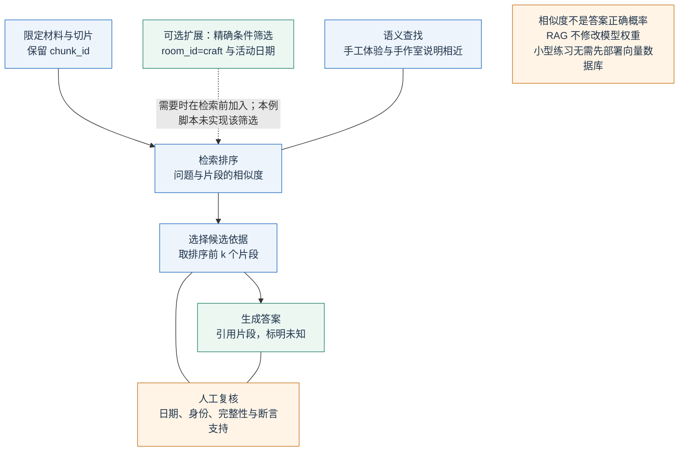
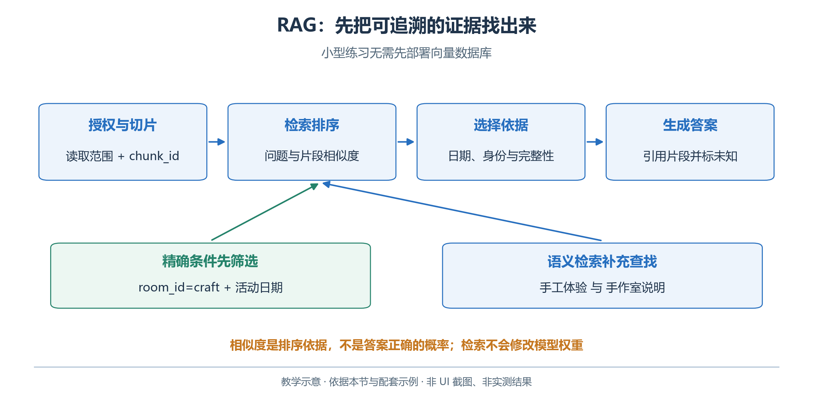
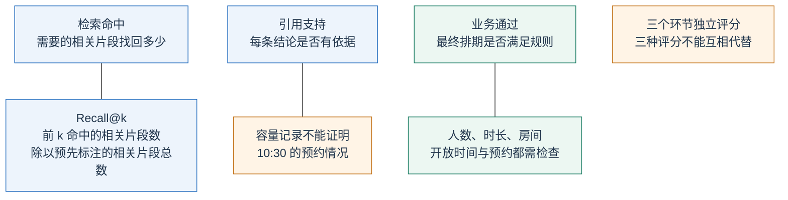
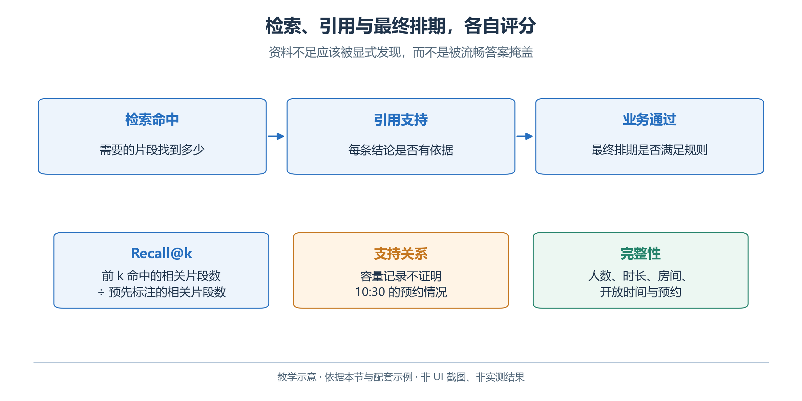

# 2.9 Embedding 与 RAG：先找依据，再组织答案

青禾材料很少，直接读取通常最简单。资料扩展为历年方案、场地与志愿者手册后，可以先检索相关部分，再交给模型回答，减少费用与无关内容。

RAG（Retrieval-Augmented Generation，检索增强生成）在生成时补充检索依据，不修改模型权重。文件名查找、关键词、数据库查询和向量检索都可参与，无需一律使用向量数据库。

## 2.9.1 Embedding 为什么适合找相近内容

Embedding 将文本转换成一组浮点数，形成向量。训练使一些语义相关的文本在向量空间中更接近，因此“哪里能做手工体验”有机会检索到“手作室使用说明”，即使两者没有完全相同的字词。OpenAI 的 Embeddings API 返回向量及用量等信息，文本生成和向量生成使用的模型应分别配置。[OpenAI：Vector embeddings](https://developers.openai.com/api/docs/guides/embeddings)

常见的相似度之一是余弦相似度：

\[
\operatorname{cos}(q,d)=\frac{q\cdot d}{\lVert q\rVert\lVert d\rVert}
\]

其中 `q` 是问题向量，`d` 是材料片段向量。它比较方向，适合对候选片段排序。相似度不是“答案正确概率”：得分较高可能仅仅因为两个句子都在谈手作室，其中一条记录却来自错误日期。也不能跨不同向量模型、不同索引设置直接比较分数阈值。

精确 ID、日期和数字仍适合关键词或结构化筛选。例如先限定 `room_id=craft` 和活动日期，再从场地说明中寻找相关规则。语义检索与精确匹配互补，并不存在“用了向量就应该淘汰表格查询”的原则。

## 2.9.2 切分材料时，保留能够解释证据的上下文

切片要服务于后面的检索与回答。先看本章脚本怎样把固定教学材料切成片段、按相似度取前 `k` 项，再把它们送给模型；日期、身份与证据完整性仍需要读者核对。

<!-- book-figure: 09-rag-pipeline -->



*图 2.9-1　从授权资料到可引用答案的 RAG 通路。教学图，非界面截图或实测结果。*

实线箭头是片段进入答案的路线；“人工复核”的无箭头连线表示核对对象。精确条件筛选是尚未实现的扩展，真实资料接入前的读取授权也仍由应用负责。相似片段进入上下文，不表示它已经足以回答问题。

切片需要保留判断所需的最小语境：

| 资料 | 合理切分单位 | 不应丢失 |
| --- | --- | --- |
| Markdown | 标题与段落 | 主题与来源 |
| 表格 | 一行及字段名 | 房间身份与容量单位 |
| 预约记录 | 一条预约 | 房间、日期、起止时间 |

**原图参考（转换前）**



本章配套脚本按 Markdown 二级标题、CSV 行和 JSON 中的预约记录组织教学片段，并给出 `文件名#段号` 形式的 `chunk_id`。这些编号便于定位本次检索结果，但不是跨所有文件编辑永久稳定的业务身份。重建索引后，应一起保存使用的输入副本和检索清单。

每个片段至少应能追溯到原文件。真实资料库通常还需要版本或更新时间、有效范围和访问权限。检索前就要过滤用户无权访问的材料，不能先把私有内容送给模型，再靠提示要求它“不要说出来”。

## 2.9.3 OpenAI API：做一个看得见每一步的小型检索器

先设置具有访问权限的向量模型，例如官方文档中的 `text-embedding-3-small`。文本回答仍使用第一节配置的 `OPENAI_MODEL`，两个环境变量各有用途。

```powershell
$env:OPENAI_EMBEDDING_MODEL = "text-embedding-3-small"
python rag.py "手作体验什么时候可以举办？" --top-k 3
```

[rag.py](examples/rag.py) 读取教学材料、构建片段、生成向量、计算相似度，取前 `k` 个片段交给文本模型回答。它把检索详情写入 `output/rag-retrieval.json`，回答写入 `output/rag-answer.md`。小型练习用内存中的列表即可，无需先部署向量数据库。

向量请求的关键形式如下：

```python
embedded = client.embeddings.create(
    model=os.environ["OPENAI_EMBEDDING_MODEL"],
    input=[question] + [chunk["text"] for chunk in chunks],
)
by_index = {item.index: item.embedding for item in embedded.data}
query_vector = by_index[0]
document_vectors = [by_index[i + 1] for i in range(len(chunks))]
```

这里 `chunks` 是预先分好的片段列表。根据返回的 `index` 还原输入对应关系，可以避免把片段与向量错配。问题与片段应采用相容的向量模型和维度；检索器也应处理空输入、异常向量或请求失败，不能把错误视为“没有相关资料”。

生成答案时，把问题、被选片段和来源 ID 明确区分，要求答案只依据这些证据，缺失时说明不足。即使答案引用了一个合法 `chunk_id`，仍需回到片段检查支持关系。例如 `rooms.csv` 的容量记录不能证明手作室十点半空闲。

`top-k=3` 是可调整练习值，未必找全需求、容量、开放时间与预约。运行后先读检索清单，再检查答案是否越过证据范围，不预设命令能得到完整排程。

## 2.9.4 托管 File Search 是另一条实现路线

不想自己实现切分与检索时，可以使用 Responses API 的托管 `file_search`。官方流程是上传支持的文件、创建向量存储、把文件关联进去、确认处理完成，再在请求中提供 `vector_store_ids`。检索可综合语义与关键词，由服务端执行。[OpenAI：File search](https://developers.openai.com/api/docs/guides/tools-file-search)

以下片段假设读者已经按该官方流程创建并确认索引就绪，将其 ID 放入 `OPENAI_VECTOR_STORE_ID`；它不是建立资料库的完整脚本：

```python
response = client.responses.create(
    model=os.environ["OPENAI_MODEL"],
    instructions="依据资料回答并引用来源；资料不足时明确说明。",
    input="青禾活动的开放时间和人数约束是什么？",
    tools=[{
        "type": "file_search",
        "vector_store_ids": [os.environ["OPENAI_VECTOR_STORE_ID"]],
        "max_num_results": 5,
    }],
    include=["file_search_call.results"],
)
```

`include` 让应用取得检索结果，便于检查实际依据；还要查看返回的引用注解，而不只打印文字。自行检索与托管检索应采用同一套题目和支持性检查，才能比较效果。托管路线会上传文件并建立服务端资源，读者应按自己的资料范围和保留要求管理；本章配套主示例采用前一种透明的小型实现。

## 2.9.5 WorkBuddy：用文件搜索完成相同的取证任务

选择教学工作空间，引用问题涉及的目录或文件，发送：“请找出手作体验的时长、允许房间、开放时间和预约冲突依据；逐项给出文件位置与相关原文，再提出候选。”官方支持选择工作空间、引用上下文和添加文件；这些是本练习使用的产品入口。[WorkBuddy：创建任务](https://www.workbuddy.cn/docs/workbuddy/Create-Task)

在展开的执行步骤中，观察实际采用了文件读取、搜索还是已连接的查询工具。打开原文件核对引用。若只读到了房间容量，应继续查预约；若查到了旧日期记录，应重新限定范围。WorkBuddy 的具体底层检索算法没有在本次练习中得到验证，因此不能把“它找到了文件”写成“它使用某种 Embedding 或向量数据库”。

缺资料对照：在独立工作区副本中移走预约文件，且不接预约工具。应保留“预约待核对”，不能由相似文档推测空闲；把文件缺失记录为输入变化。

## 2.9.6 检索命中、引用支持、最终正确分别测量

检索阶段可以检查 Recall@k：人工确定问题所需的相关片段，观察前 `k` 个结果找回多少。生成阶段检查每个可验证断言是否由引用支持，是否遗漏关键条件。最终方案再交给业务校验器。三个指标对应不同环节，不能互相代替。

<!-- book-figure: 09-rag-checks -->



*图 2.9-2　检索命中、引用支持与业务通过分别测量。教学图，非界面截图或实测结果。*

例如容量片段被找回，可提高检索命中，却不能支持“10:30 没有预约”。先标注相关片段集合再计算 Recall@k；练习中的四类必要依据可能对应多个片段，不能直接把 4 当成分母。

**原图参考（转换前）**



练习：为手作问题列出四项必须有的依据——人数与时长、允许房间、开放时间、已有预约。分别用 `top-k=1`、`3` 和更大的值运行，保存检索清单和答案；检查增加结果后是否补齐证据，还是只是加入更多无关文字。再提问“现场是否提供儿童看护”，材料没有相关信息，回答应说明无法确认。

这些实验帮助读者理解 RAG 的实际价值：把可追溯的资料送到生成环节，并让资料不足可以被发现。更新预约仍优先采用有明确身份与日期的查询工具；长篇说明采用检索更方便。两种方法可以在同一个 Agent 中协同使用。

---

[上一节：2.8 Skill](08-skills.md) · [下一节：2.10 Agent 与记忆](10-agent-loop.md) · [返回本章目录](README.md)
