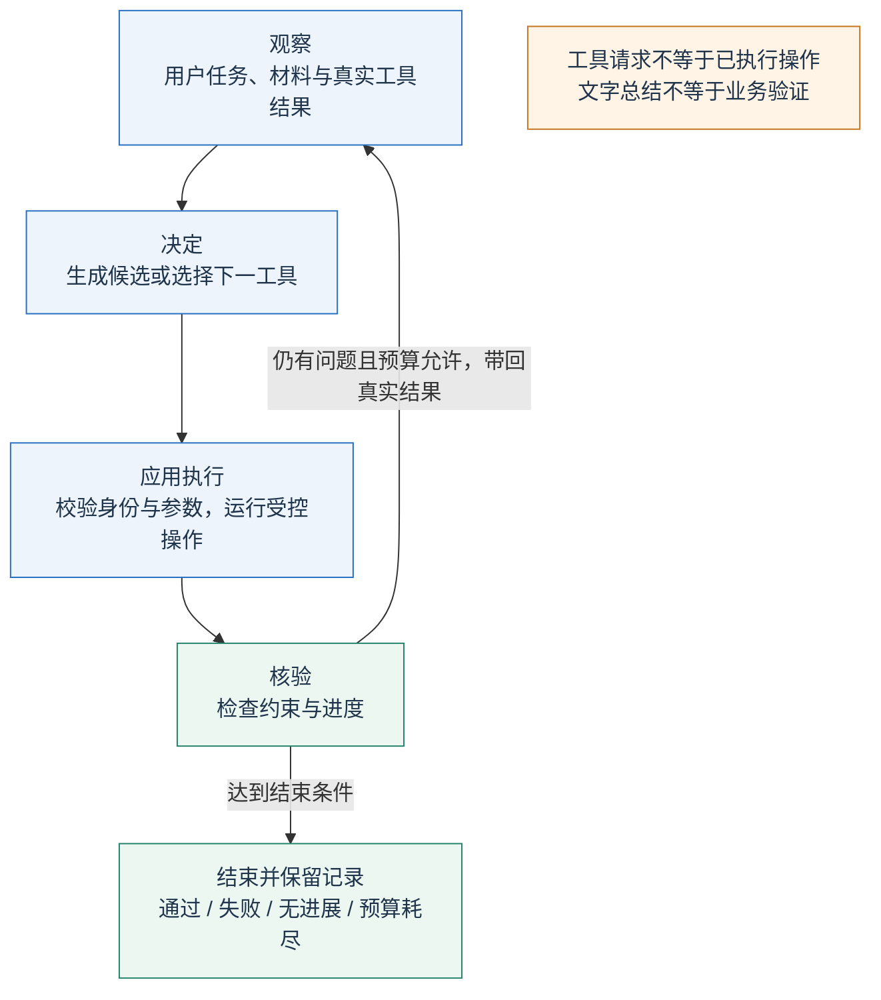
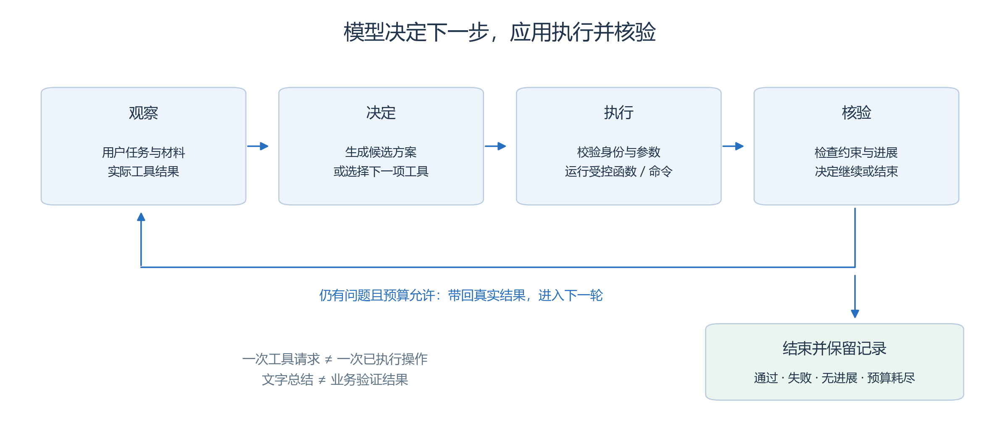
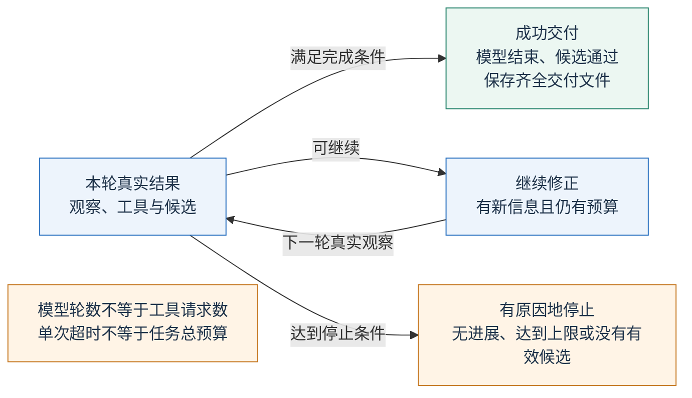
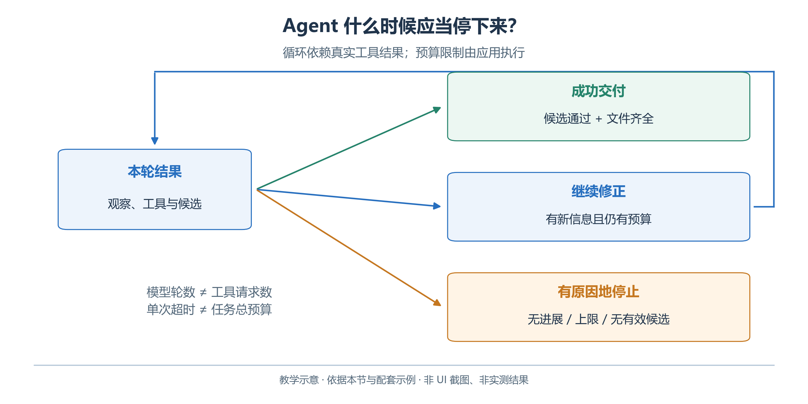
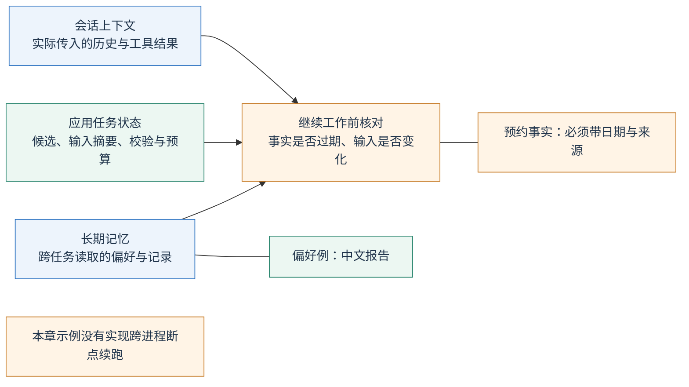
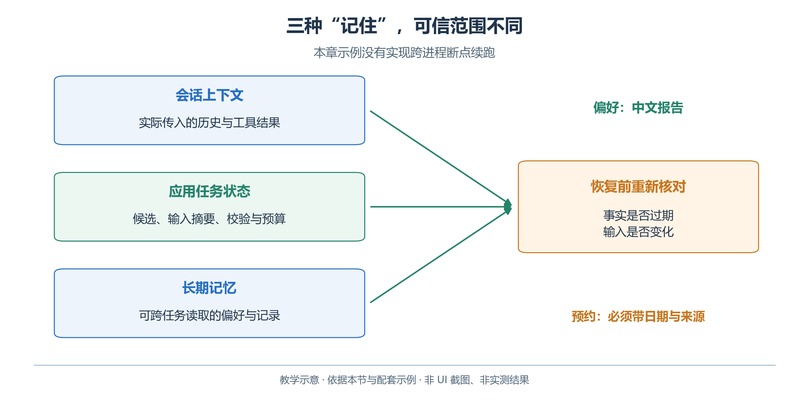

# 2.10　Agent 循环、规划与记忆

助手会读材料和调用工具之后，还需决定先做什么、失败后怎样调整、何时停止。这是 Agent 的控制逻辑；程序仍须守住执行边界。

## 2.10.1 从一次回答到一个闭环

按图阅读一轮闭环：

1. **观察**需求和上次工具结果。
2. **决定**下一次查询或候选。
3. **执行**由应用调用的工具。
4. **核验**目标是否满足，继续或有原因地停止。

<!-- book-figure: agent-loop -->



*图 2.10-1　观察、决定、执行与核验。作者教学图，非 UI 截图或模型成绩。*

图中最容易被忽略的是核验。“我已安排好全部活动”是一句模型输出；`validate_schedule` 返回通过，才说明本章编码的排期约束得到满足。两者都不能证明现实中的房间已经被预订。本章工具只有查询和校验能力，产物是本地筹备文件。

**原图参考（转换前）**



模型可以先查存在预约风险的手作室；程序仍掌握工具白名单、参数校验、调用预算与文件保存条件。灵活决定步骤不能覆盖执行规则。

## 2.10.2 规划、ReAct 与反思分别增加什么

**规划**把目标拆成可检查的子目标：确认输入完整、核对可用时段、生成候选、检查冲突、交付。计划应允许被事实修正。如果查询发现手作室 10:00—10:30 被占用，助手就应重新安排，不能把原计划当成已经发生的事实。

**ReAct**强调推理与行动交替：根据当前观察选择行动，再根据行动结果更新下一步。在本章里，可观察到的证据是工具请求、参数和结果；不需要模型公开完整的内部推理链。让助手简要说明“为什么查这个房间”和“下一步检查什么”，足以帮助使用者理解过程。

**反思**让模型回顾失败并提出调整。例如，发现手作活动安排在 09:30—10:30，模型可以指出它与已有预约重叠。反思文本仍需要下一次真实校验。如果只是反复改写“我应该更加谨慎”，排期文件没有变化，任务就没有取得进展。

三者都是组织任务的方法。对只有三项活动的问题，固定的“读取—生成—校验”工作流可能已经够用。只有当下一步依赖未知信息、工具结果或用户决定时，才需要更灵活的循环。

## 2.10.3 OpenAI API：把停止条件写在程序里

模型结束、候选校验通过与交付文件齐全必须同时核对。只拿到一次通过的工具结果，还不能替代完整工具循环的结束和文件保存。

<!-- book-figure: 10-loop-stop -->



*图 2.10-2　Agent 的成功、继续与停止条件。教学图，非界面截图或实测结果。*

**原图参考（转换前）**



[完整工具循环](examples/function_calling.py)实现了本节的小型 Agent。模型通过 Responses API 请求工具，应用执行后把结果传回；工具结果关联原来的 `call_id`，历史保留返回的输出项。调用格式见 [OpenAI Function calling](https://developers.openai.com/api/docs/guides/function-calling)。

从 `examples` 目录运行：

```powershell
python function_calling.py --output-dir output/agent-run
python validate_schedule.py output/agent-run/schedule.json --output output/agent-run/recheck.json
```

第一条需要有效 API 配置，会产生服务费用；第二条只在本地检查已生成文件。这里使用新的 `output/agent-run`，与 2.5 的结果分开。如果第一条失败且没有生成本次结果，不能拿以前留下的 `schedule.json` 证明这次成功。重复本节时也应另选新的输出目录；脚本的具体覆盖与保存规则见[示例说明](examples/README.md)。

理解循环时，至少检查下列四条结束规则：

| 结束条件 | 应用应怎样处理 |
| --- | --- |
| 模型结束且候选通过业务校验 | 保存可追溯的结果，报告已验证范围 |
| 模型结束但没有有效候选 | 标记未完成，不能凭总结判成功 |
| 达到轮数、工具数或时间预算 | 有原因地停止，保留已获得的诊断 |
| 同一调用反复出现、结果没有变化 | 判断无进展，停止或请求新的输入 |

分别记录模型轮数、工具请求数和实际执行数。本章脚本在解析与执行前递增工具请求计数；错误或阻断请求可能消耗预算，实际执行须看工具结果与 `not_executed` 记录。一次响应可含多个请求，不能混用上限。单次 `timeout` 也不限制任务总时长；实际产品还需总时间预算和取消信号。

错误回传应帮助模型修正输入，例如告诉它 `UNKNOWN_ROOM` 和允许的房间 ID；不要把服务器堆栈、凭据或无限增长的旧错误全部塞回上下文。模型拒绝、输出中断、网络失败、业务校验失败是不同结局，不应都用“再试一次”处理。

## 2.10.4 三种“记住”不能混在一起

“继续工作”可能是下一轮调用，也可能是新任务接手。先区分实际传入的历史、程序记录的进度，以及跨任务读取的偏好，再决定哪些事实需要重新确认。

<!-- book-figure: 10-memory-layers -->



*图 2.10-3　会话、任务状态与长期记忆的边界。教学图，非界面截图或实测结果。*

| 类型 | 青禾例子 | 更新与可信度 |
| --- | --- | --- |
| 会话上下文 | 上轮查询结果、模型提出的候选方案 | 只在实际传入上下文时可用；旧结果可能过期 |
| 应用任务状态 | 哪份候选通过校验、还缺什么、剩余预算 | 由程序记录；恢复时仍要检查输入是否变化 |
| 长期记忆 | 用户偏好用中文表格汇报 | 可以跨任务检索；偏好不能覆盖当次规则 |

“用户喜欢上午活动”可以是记忆；“10:00 手作室空闲”应当是带日期和来源的查询事实。把后者长期保存却没有有效期，容易让系统在下一次开放日复用旧预约。

**原图参考（转换前）**



OpenAI 的会话状态机制帮助应用延续对话，但不会替开发者建立业务状态机。无论使用手工历史还是 `previous_response_id`，应用都应单独保存需要恢复的任务状态，核查指令的继承规则，并在恢复前确认外部事实。[OpenAI Conversation state](https://developers.openai.com/api/docs/guides/conversation-state)

本章中断后再执行是新尝试，**没有跨进程断点续跑**。若扩展恢复，需要：

- 保存输入摘要、候选版本、查询时间、校验结果与预算。
- 定义可重复执行的只读操作，并确认事实未变。
- 对付款、发信、预约等副作用另设幂等标识与真实结果核对，不能依靠“模型记得做过”。

## 2.10.5 在 WorkBuddy 中体验三种任务模式

WorkBuddy 的输入框 `+ → 模式` 提供“仅问答 Ask”和“计划 Plan”，默认模式为 Agent。按照官方说明，Plan 先提供方案，用户审阅后可以“开始执行”或“调整计划”。这是产品的交互流程，不是模型内部推理的显示开关。[WorkBuddy 新建任务栏](https://www.workbuddy.cn/docs/workbuddy/From-Beginner-to-Expert-Guide/Function-Description/Task-Bar)

按下面的顺序做一次练习：

1. 在 Ask 中引用 `data/brief.md`，询问完成筹备还需要哪些材料；检查是否遗漏预约事实。
2. 切换 Plan，要求给出输入、步骤、产物和验收条件；把“校验通过后才能交付”写入计划。
3. 审阅后开始执行，让它读取材料并生成候选，再运行校验器。观察真实工具和文件变化。
4. 如果失败，给它实际错误报告，要求只修正相关安排；再次运行校验，不用聊天里的“已修复”作结论。

任务中断时，先检查已有文件和命令结果，再决定继续的位置。客户端能继续对话，不意味着外部命令一定取消成功，也不意味着每个已执行动作都能撤销。

另到“设置 → 记忆”查看已记录内容。可以更正、删除或关闭记忆；官方说明也提醒，自动概括可能产生偏差或时效性问题。本练习可以保存“报告用中文”，不应把一次开放日的预约表当成永远有效的偏好。[WorkBuddy 记忆](https://www.workbuddy.cn/docs/workbuddy/From-Beginner-to-Expert-Guide/Function-Description/Memory)

## 2.10.6 本节练习

让助手连续三次查询同一个房间，却不修改排期。讨论：这是合理复核还是无进展？答案取决于查询是否可能获得新事实。如果数据文件固定、查询参数相同、输出也相同，就不应无限继续。

再把 `plan.md` 改成“全部通过”，保留一个有预约冲突的 `schedule.json`。重新运行校验，体会执行状态、文本总结与业务完成度为什么要分别记录。

[上一节：Embedding、检索与 RAG](09-retrieval-and-rag.md) · [下一节：多模态与计算机交互](11-multimodal-and-computer-use.md) · [返回本章](README.md)
