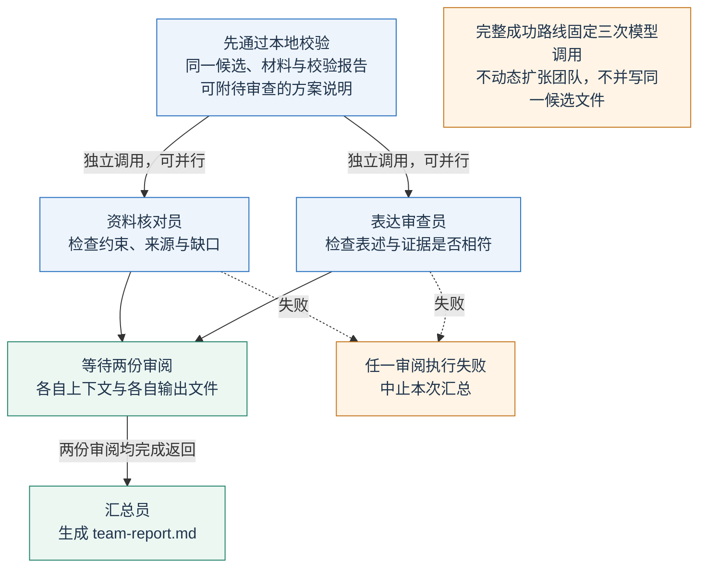
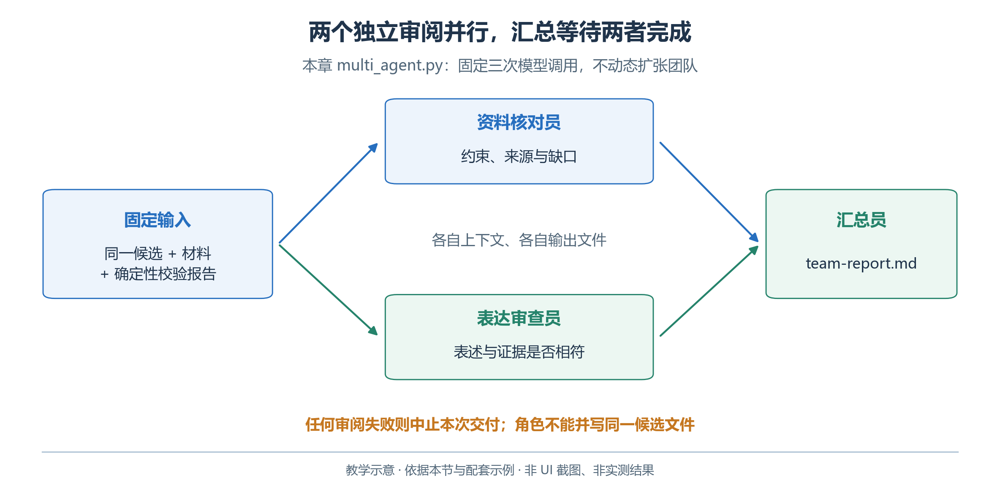
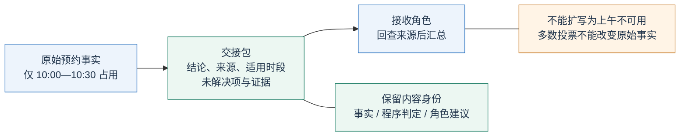
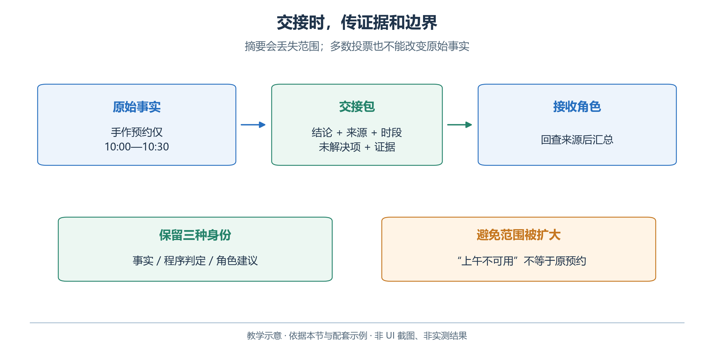

# 2.12　多 Agent 协作与工作流

增加角色，只有在减少遗漏、隔离上下文或缩短独立任务等待时才有价值。本节用资料核对、表达审查与汇总观察协作机制，不预设团队一定更好。

## 2.12.1 先判断是否值得拆分

多 Agent 可以复用同一模型。每个角色须有任务、输入、工具、输出合同和结束条件；一句“请三位专家讨论”不自动建立这些边界。

青禾的资料很少，一次调用加本地校验常常已经足够。本节把任务拆开，是为了观察协作机制，而不是预设多 Agent 一定优于单 Agent。本节只分成资料核对、表达审查与统一汇总三个角色。

<!-- book-figure: 12-multi-agent-forkjoin -->



*图 2.12-1　两个并行审阅与一次统一汇总。教学图，非界面截图或实测结果。*

图中“执行失败”指请求、响应处理等环节未能完成，不是审查员发现了业务问题。正常返回的批评意见应进入汇总；两位审查员收到相同材料，但各自的指令、上下文和输出文件独立。

| 角色 | 输入 | 交付物 | 不负责的事项 |
| --- | --- | --- | --- |
| 资料核对员 | 同一份材料、候选、校验报告与可选说明 | 带来源的约束核对与缺口 | 不替换原始预约记录 |
| 表达审查员 | 同上，侧重表述与依据 | 哪些表述需要补充依据 | 不宣告房间已被预订 |
| 汇总员 | 原输入包与前两份审阅意见 | `team-report.md` | 不自行改写已验收的排期 |

**原图参考（转换前）**



资料核对与表达审查使用相同输入包、独立调用，可以并行；汇总必须等待两者。若后一步依赖前一步结果，就按依赖顺序执行。

## 2.12.2 用 OpenAI API 实现最小分工

[配套脚本](examples/multi_agent.py)直接使用多次 Responses 调用，不要求额外安装协作框架。先用本地校验器检查给定排期，再把同一份输入分别交给两个角色，最后由一个调用汇总。读者需要提供已有的排期文件：

```powershell
python multi_agent.py fixtures/valid-schedule.json
```

这里使用的是人工编写的参考排期，目的是隔离“协作审阅”的学习变量；它不表示模型已经成功生成了排期。脚本会进行两次独立审阅和一次汇总，实际调用会产生费用。

核心结构如下；完整异常处理、响应留存和文件路径以脚本为准：

```python
from concurrent.futures import ThreadPoolExecutor

with ThreadPoolExecutor(max_workers=2) as pool:
    reviews = list(pool.map(review_one_role, roles))

# 所有审阅完成后才进入汇总；某个任务失败则中止本次交付。
report = summarize(reviews, deterministic_report)
```

每个 `review_one_role` 都构造独立的 `instructions` 和输入，使用独立客户端；角色之间没有隐式共享的聊天记录。程序把返回内容写入不同文件，只有汇总步骤写最终报告。两个角色如果同时修改同一个 `schedule.json`，会出现覆盖和混合版本；那是文件协调问题，多加一句“请合作”不能解决。

Responses 的普通调用足以组织这种固定分工。对于需要动态委派、会话管理、追踪或更复杂交接的应用，可以进一步研究服务方的 Agent 工具，但先明确角色合同，再选择框架。框架名称不会替代实际的权限、错误处理和验收规则。[OpenAI Responses API](https://developers.openai.com/api/reference/resources/responses/methods/create)

## 2.12.3 交接的是证据，不只是摘要

“手作室上午不可用”会把原预约 `10:00—10:30` 错扩到整个上午。交接必须保留具体结论、来源、适用时间、证据及未解决项，不能只传摘要。

<!-- book-figure: 12-handoff-contract -->



*图 2.12-2　保留范围与来源的交接合同。教学图，非界面截图或实测结果。*

交接中保留三类身份：

| 内容 | 本例 | 作用 |
| --- | --- | --- |
| 原始事实 | 预约文件 | 确定占用区间 |
| 程序判定 | 校验报告 | 判断明示规则 |
| 角色意见 | 建议交流放最后 | 供选择的偏好 |

多数投票不能把建议提升为事实，也不能覆盖容量限制。

**原图参考（转换前）**



对较大的任务，可以给各角色缩小输入范围，但汇总时保留可回查的来源。上下文越小，不相关信息越少；裁掉关键规则却会让角色在局部材料上得出错误结论。拆分的关键不是平均分配文字，而是保留每个判断所需要的最小完整证据。

## 2.12.4 工作流和自主协作的差异

固定工作流由程序预先规定步骤和分支，例如“两个审阅都完成后汇总，校验失败就停止”。自主协作则允许协调者根据任务动态选择角色、继续追问或改变分工。后者灵活，但调用次数、上下文扩散和失败传播更难预测。

协作需要总调用预算、并发上限、超时处理与裁决依据。超时是“没有返回”，不能当成“没有问题”；也不能持续增派审查员直到有人赞同。

本章脚本采用固定三次调用、只读输入和单一汇总写入。它没有自动创建无限子任务，也没有实现跨进程恢复。这个范围足够让我们观察独立角色是否发现了不同问题。

## 2.12.5 在 WorkBuddy 中使用专家与专家团

WorkBuddy 官方文档把“专家”描述为专业角色，把“专家团”描述为由团长拆解、分配并汇总的协作执行机制。操作入口是左侧“专家”，进入专家中心，查看角色或团队说明后“召唤”。具体可见团队以账户与客户端为准。[WorkBuddy 专家](https://www.workbuddy.cn/docs/workbuddy/From-Beginner-to-Expert-Guide/Function-Description/Expert-Center)

本节可以做以下对照：

1. 在一个普通任务中提供完整材料和同一份候选，请单个助手做审阅，保存报告。
2. 在专家入口选择适合资料分析或方案审查的角色；若有合适专家团，阅读成员分工后再使用。
3. 明确要求只审阅指定文件，列出每条意见的来源，并引用本地校验器报告。
4. 查看是否出现真实的任务分工、阶段结果与汇总产物；若界面没有展示独立任务，就只记录产品可见的过程。

如果现有专家团不支持本书设想的三种角色，可以在三个独立任务中人工传递审阅材料，作为手工协作练习；不要把这种方式写成已经配置了自定义专家团。多个任务都使用同一目录时，也要约定各自的输出文件。

专家角色本身不自动获得额外权限。它能否读取文件、访问外部服务，仍取决于实际配置的能力和授权。WorkBuddy 的任务协作也不等于第三章的仿真角色交互：后者涉及世界状态、空间、虚拟时间以及已提交动作。

## 2.12.6 如何判断协作值得保留

用相同任务集比较单 Agent 与多 Agent，记录最终正确率、漏检数、误报数、总 Token、总耗时和人工复核时间。并行通常只缩短独立任务的等待部分，两个审阅加一次汇总的 Token 开销仍然需要相加。

不能只挑选多 Agent 成功、单 Agent 失败的一次展示。两个角色还可能共享同一模型的偏差，形成“一致但错误”的结果。若本地校验器已经可靠地检查容量和时间，把这些规则交给两个模型重复判断，未必是最有价值的分工；更值得检验的是不同角色能否发现材料缺失、解释误导或未声明的假设。

本节练习：在一份 `plan.md` 副本中加入“已向居民发出通知”，但不给任何发送工具或结果。用 `python multi_agent.py fixtures/valid-schedule.json --plan path/to/plan.md --output-dir output/false-claim-review` 实际传入该文件，或在 WorkBuddy 中引用它。观察单 Agent、两个审阅角色和汇总员是否指出缺乏证据。判分对象是具体结论和依据，不是讨论轮数。

[上一节：多模态与计算机交互](11-multimodal-and-computer-use.md) · [下一节：可观测性、评估、可靠性与成本](13-evaluation-and-reliability.md) · [返回本章](README.md)
