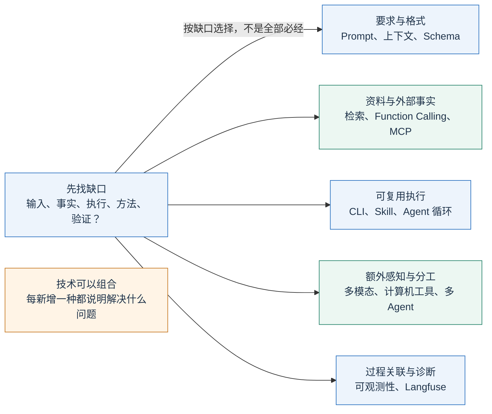
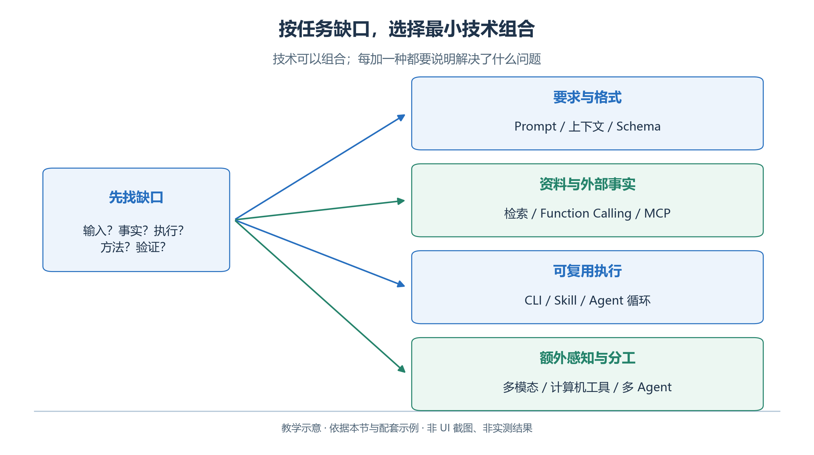
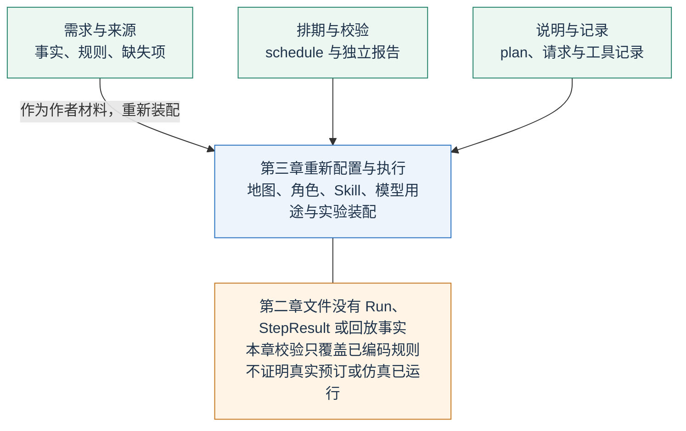
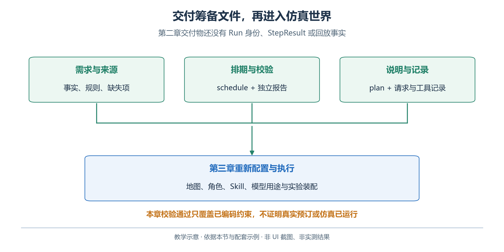

# 2.14　技术选择与完整交付

开放日筹备需要可检查的交付物。先找缺口，再选择技术；小任务也可以只用文件读取、模型调用与确定性校验。

## 2.14.1 按问题选择技术

<!-- book-figure: 14-technology-choice -->



*图 2.14-1　按任务缺口选择技术。教学图，非界面截图或实测结果。*

| 当前缺口 | 优先考虑 | 判断是否用对 |
| --- | --- | --- |
| 要求含糊，输出偏题 | Prompt 与例子 | 相同材料下是否更稳定满足评分表 |
| 格式无法被程序消费 | Structured Outputs | 是否可解析、符合 Schema，且另行通过业务校验 |
| 需要当前预约等外部事实 | Function Calling | 是否真实执行工具并使用返回结果 |
| 相同能力要被多个宿主接入 | MCP | 协议、传输、认证、工具合同是否实际兼容 |
| 重复计算、转换和检查 | CLI 或受控 Shell | 固定输入下能否复现，退出码是否正确 |
| 做法需要重复使用 | Skill | 是否正确选用 SOP、脚本与验收步骤 |
| 资料很多，不能全部放入上下文 | 检索与 RAG | 是否找全依据，引用是否支持结论 |
| 下一步依赖未知结果 | Agent 循环 | 是否根据观察调整，并在边界内停止 |
| 需要读图、听录音或操作页面 | 多模态与计算机工具 | 感知、执行和最终状态是否分别核实 |
| 可分离的子任务需要独立处理 | 多 Agent 工作流 | 质量或耗时收益是否超过协调成本 |
| 不清楚错误发生在哪次调用 | 可观测性与Langfuse | 本次Trace、输入、模型调用、校验和产物能否关联 |

这些技术承担不同职责，可以组合：MCP 连接包装 CLI 的服务，Skill 指导调用方法，Agent 循环选择下一步，结构化输出约束交付格式。

**原图参考（转换前）**



## 2.14.2 一次完整的 API 路线

先按 2.1 准备独立 Python 环境，再从 `examples` 目录完成下面的顺序。前两条不访问模型：

```powershell
python -m unittest discover -s tests -v
python validate_schedule.py fixtures/valid-schedule.json --output output/reference-check.json
```

这一步确认资料和本地逻辑可以工作，尚未评价模型。接着配置 API 环境变量，记录准备使用的模型，然后运行：

```powershell
python first_response.py
python structured_schedule.py
python function_calling.py --output-dir output/final-run
python validate_schedule.py output/final-run/schedule.json --output output/final-run/final-check.json
```

前三条会访问 OpenAI 服务。先单独观察普通文本，再观察受 Schema 约束的候选，最后运行带工具反馈的完整循环。中间脚本的候选不能直接当作最后一次的交付物；具体文件名与失败保存方式见[示例运行说明](examples/README.md)。不要批量执行后只看最后一行，任何一步失败都应先查看实际输出。

最终按四项核对：

1. 三项活动齐全，独立校验通过。
2. `output/final-run/plan.md` 与同目录 `schedule.json` 一致。
3. 本次查询、响应与文件相互对应。
4. 没有“已经预约成功”等无执行依据的表述，本章没有提交预约的写入工具。

再次实验使用新的 `--output-dir`，保留此前证据。

若要练习可观测性，可按[2.13.7](13-evaluation-and-reliability.md#langfuse-practice)单独运行Langfuse示例。它观察自己这次生成与校验的过程，不会自动补录上面脚本此前的调用；Trace与业务报告都要指向同一次尝试。

RAG、MCP、多模态与多角色脚本是扩展路线。这个小型排期任务不依赖全部扩展才能完成，也不应为了展示工具数量而重复查询、上传或生成文件。

## 2.14.3 一次完整的 WorkBuddy 路线

建立本章练习目录副本，选择它作为任务工作空间。先用 Ask 熟悉资料，再用 Plan 审阅执行方案；如果任务已经很明确，也可以直接使用默认 Agent。向助手提交如下任务合同：

```text
请完成青禾社区学习中心 2026-10-17 的开放日筹备。
工作空间中的 data/brief.md、rooms.csv、rules.md、requests.csv 是任务材料，
data/availability.json 是本次教学预约事实；如果连接了教学 MCP，请查询对应工具。
读取文件时以 data/ 目录为准，不使用 fixtures/ 中的答案作为生成依据。
先整理约束和缺失项到 output/constraints.json，再提出 output/schedule.json。
用 validate_schedule.py 独立检查，保存 output/validation-report.json；
失败时按真实错误修改后重验，最多修正三轮，仍失败则说明未解决项。
最后生成 output/plan.md，引用材料与校验结果，只说明有证据支持的完成事项。
本任务只交付筹备文件。请保留候选、错误与修正记录，便于我复核。
```

其中 `constraints.json` 是 WorkBuddy 练习的自定义产物，用来展示约束整理；其格式可按“约束、来源、待确认项”组织，不要与排期 Schema 混淆。API 主线直接读取同一组材料，没有把约束抽取作为一个必须由模型执行的前置步骤。

通过右侧“工作空间文件”“变更”“产物”查看实际内容；如果使用浏览器预览，也要回到文件确认保存位置。对话中的下载链接、工具卡片和文件内容应能互相对应。[WorkBuddy 结果查看](https://www.workbuddy.cn/docs/workbuddy/Results)

若没有配置 MCP，可以直接读取本地预约文件并运行校验器，记录这是文件路线。若 Python 或技能依赖不可用，记录缺少的依赖并完成安装后重试；不能在没有执行命令的情况下写“校验通过”。

## 2.14.4 用交付清单明确完成边界

交付检查先落实到文件，再决定哪些内容可供第三章使用。图中把下表五类交付物归为“需求与来源”“排期与校验”“说明与记录”三组，它们进入仿真前仍要重新配置与执行。

<!-- book-figure: 14-integrated-delivery -->



*图 2.14-2　筹备文件与第三章仿真事实的交接边界。教学图，非界面截图或实测结果。*

| 交付项 | 检查方式 | 不能从中推出什么 |
| --- | --- | --- |
| 约束与来源 | 对照原始材料，列出缺失项 | 不能证明已执行查询或操作 |
| 候选及最终排期 | 解析 JSON、核对活动和时间 | 合法 JSON 不等于可行排期 |
| 校验报告 | 独立命令、退出码、具体错误 | 不能证明未编码的规则也满足 |
| 方案说明 | 与最终排期逐项一致 | 不能证明真实通知、预订或发布完成 |
| 运行记录 | 模型、输入、响应、工具、版本与日期 | 本地模拟测试不能证明远端服务可用 |

**原图参考（转换前）**



本题允许不同房间活动同时举行，因为未配置共享主持人或设备约束。现实任务若有设备、主持人、清洁间隔或无障碍需求，须先补齐输入与规则再扩展校验器，不能把未建模条件视为已满足。

## 2.14.5 何时研究微调、蒸馏和部署

如果模型持续误用术语、格式或领域风格，先排查提示、示例与数据质量；若有足够多高质量训练样本和独立测试集，再考虑微调。监督微调改变模型对任务模式的适应，不应拿它替代实时预约查询。OpenAI 的可微调模型与训练流程应以实际账户支持为准。[OpenAI Supervised fine-tuning](https://developers.openai.com/api/docs/guides/supervised-fine-tuning)

蒸馏通常把较强系统生成并经过筛选的示例用于训练较小模型，目标可能是降低延迟和成本。教师回答也可能有错，所以训练数据仍需验证。训练集与评价集混在一起，会夸大改进效果。

部署还包括身份认证、配置、服务监控、数据保存、并发和密钥管理。本章的命令行程序是学习样本，没有提供多租户服务或生产级任务调度。这些扩展的优先级应由真实瓶颈决定，不必在最小任务中一次堆齐。

## 2.14.6 章末练习与参考思路

**练习一：找出能力归属。**助手从 PDF 中找到房间容量，调用接口查询预约，运行脚本后生成文件。分别标出模型、资料检索、工具执行和应用校验承担的工作。

参考思路：理解与组织输出由模型参与；找到材料靠实际读取或检索机制；接口和命令由宿主执行；容量与冲突约束由校验器判定。某一环节的结果不能替代另一环节的证据。

**练习二：设计一次失败。**把手作候选放到 09:30—10:30，要求助手修正；再把参与人数改到超过房间容量且没有替代房间。两次任务应有什么不同结局？

参考思路：前者在原规则下有其他时段可用，可以修正；后者在给定材料下可能不可行，应说明冲突和待调整条件，不能擅自减少人数。构造第二个任务时，要在材料副本中同步变更需求。

**练习三：选择最小技术组合。**只有三个短文件、没有外部变化，是否需要向量数据库、MCP 和多个 Agent？

参考思路：普通文件读取、一次模型调用和确定性校验可能足够。引入其他技术应有明确理由，例如复用工具接口、资料规模增大或分工带来可测收益。

**练习四：准备第三章。**列出本章可以复用的资料，以及必须在仿真系统重新配置的内容。

参考思路：活动主题、人物描述和需求可以作为作者材料；地图、坐标、Agent、Brain、Skill、模型用途以及实验装配仍须通过系统规定的流程建立。筹备文件没有 `run_id`、已提交 StepResult 或回放事实，不能用它们证明仿真已经运行。

第三章将把同一个开放日放进可感知、可行动、可回放的世界。届时，“安排了一个活动”与“角色已经走到房间并实施活动”之间的区别，会成为新的学习重点。

[上一节：可观测性、评估、可靠性与成本](13-evaluation-and-reliability.md) · [下一章：在共同世界中行动](<../chapter 03/README.md>) · [参考资料](references.md) · [返回本章](README.md)
