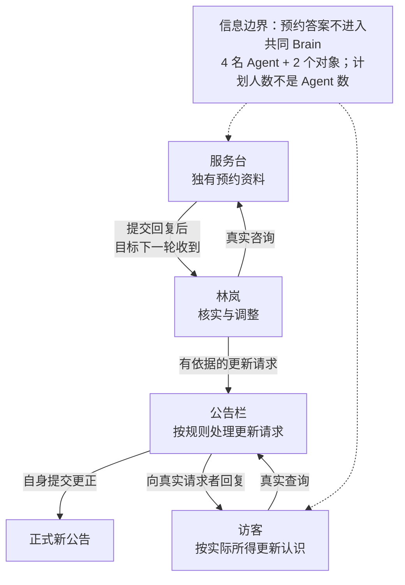
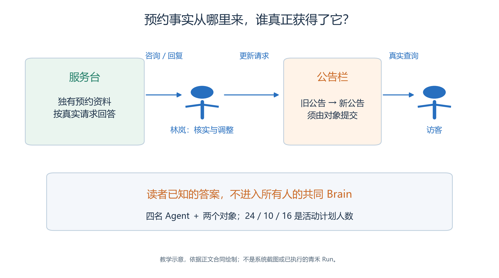
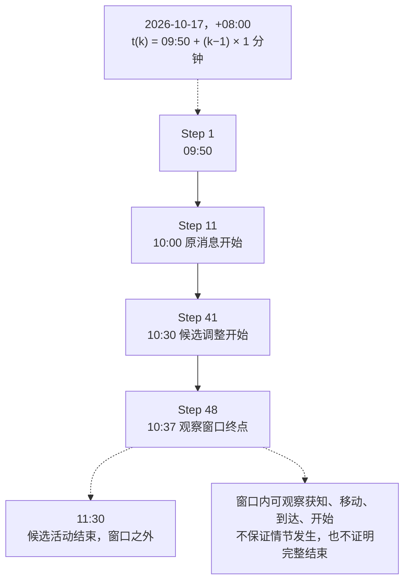
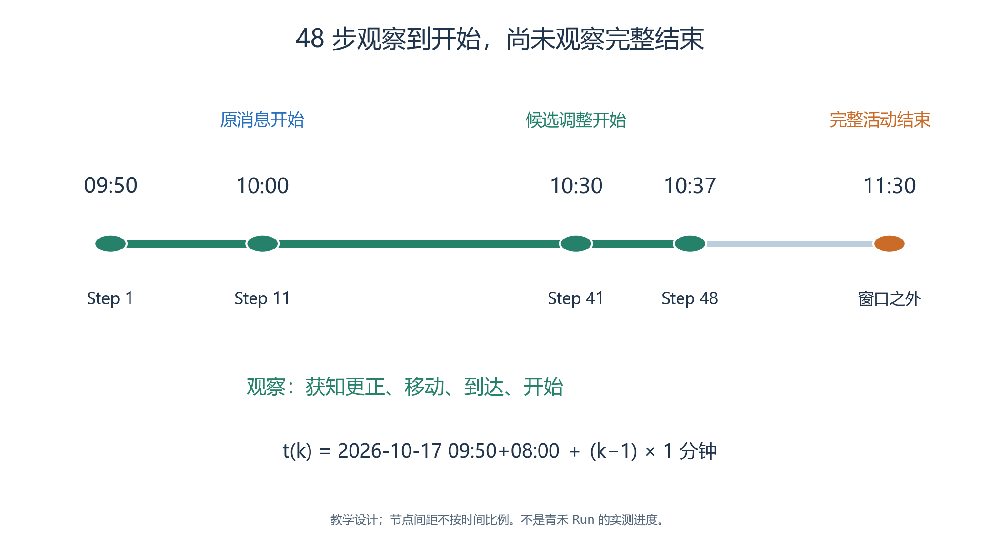

# 3.1　把筹备方案放进一个会发生变化的世界

第二章的助手已经能够读取资料、检查预约并生成排期。

- 但排期表中写着“去手作室”，不意味着任何人已经走到那里；方案写着“通知来访者”，也不意味着对方已经听到并理解消息。
- 第三章把问题推进一步：让有位置、有记忆、有不同目标的角色在同一个世界中行动，并根据真实发生的事情评价结果。

我们仍以青禾社区学习中心的开放日为主题。场所与活动数据延续第二章，新的学习目标是观察行动、信息传播、对象反馈和运行事实。

## 3.1.1 一个可以贯穿全章的问题

<!-- book-figure: 01-information-sources -->

*图3.1-1　箭头表示需要真实信息渠道，不预排 Step；预约答案只放在应当掌握它的对象材料中。*

先跟随林岚的咨询与更新请求，再看访客自己的查询：这两段渠道不能互相代替。图只展开一条可能的信息路线；若由周宁转述，还须核对相应双人消息。

**原图参考（转换前）**

原消息说手作体验将在 10:00 开始，服务台掌握的预约资料却表明，手作室在 10:00—10:30 已被其他安排占用。组织者需要核对事实、调整安排、请求公告栏更新；志愿者与来访者需要通过实际咨询或交流获知变化，再修正各自行动。

沿图逐段取证，不跳过中间环节：

| 进展 | 需要成立的事实 |
| --- | --- |
| 咨询与比较 | 林岚真实咨询，下一轮收到预约反馈，再比较可行安排 |
| 公告更新 | 请求更新后，公告栏实际提交状态与回复 |
| 获知与行动 | 其他人物通过渠道获知，更正自己的记忆，再按实际位置与时间开始活动 |

箭头表示因果依赖，不是硬排的 Step 时间表。

- 模型可能询问更多问题，也可能晚一步行动。
- 只要我们事先定义观察对象和验收规则，就能分析这些差异；不能把“Step 3 必须说话、Step 4 必须到达”写进剧本，再把执行剧本当成自主行为。

本章已提供[案例资料包](case/README.md)，包括地图与人物素材、完整 Skill、配置说明和验收模板。

- 它是准备录入系统的作者材料，尚未创建新的实验或产生新 Run。
- 正文中的操作步骤以当前界面和源码为依据，示意过程不冒充实际运行结果。

## 3.1.2 四个人，两项对象能力

| 参与者 | 初始位置与职责 | 开始时知道什么 |
| --- | --- | --- |
| 林岚 | 公共大厅，组织者 | 掌握旧活动计划，需要核对场地 |
| 周宁 | 手作室，志愿者 | 先检查物料，再到大厅帮助来访者；掌握旧消息 |
| 陈晨 | 交流室，阅读来访者 | 想参加 10:00 的阅读分享，会整理物品并询问安排 |
| 许安 | 阅读室，手作来访者 | 想参加原消息中的 10:00 手作体验，需要核实 |
| 服务台 | 大厅中的固定对象 | 掌握手作室已有预约；按真实请求回答 |
| 公告栏 | 大厅中的固定对象 | 初始展示旧安排；接收有依据的更新后提交新状态 |

前四项是公共 Agent 资源，后两项是地图 Game Object 绑定根 Skill。服务台可以感知和回应，但它不会因此出现在公共人物目录，也不自动拥有一个能够自由移动的人物身体。

原排期中的 24、10、16 人是三项活动的计划人数，不是本实验已创建的 Agent 数。

- 本章只模拟四位代表人物及两个对象。
- 没有建模的参与者，不计入到达率、会话或费用分母；更不能把四人的行为推断为真实社区人群的统计规律。

## 3.1.3 从地图图片到空间语义

本章采用 32×24 格的学习中心：上方依次是阅读室、手作室和交流室，下方是公共大厅，三个房间通过门洞连接大厅。完整背景由教材原创矢量素材绘制，公告栏另有两张可切换的状态图。

图片负责可见外观，World、Sector、Arena、Game Object 负责语义，碰撞与寻路定义实际可走范围。一个画得像门的地方，如果碰撞没有开口，就不能作为通路；一张公告图改变了颜色，如果没有相应世界提交，也不能称为对象状态已更新。

四层地址是“青禾社区 → 学习中心 → 公共大厅 → 公告栏”这类层级关系。

- 公共 Agent 本身不携带某张地图的固定出生坐标；坐标与初始已知空间属于实验装配。
- 地图与人物的具体录入材料见[地图说明](case/map/README.md)和[人物资料](case/agents/README.md)。

本章选择四个不同初始 Arena，让空间选择器产生可区分的位置，便于观察跨房间行动。故事从人物已经进入学习中心开始，不把未模拟的地图外进场过程补写成事实。

## 3.1.4 作者知道的事情，不一定是角色知道的事情

读者已经知道预约冲突，但我们不能把答案放进所有角色的共同 Brain。否则，许安即使从未咨询，也能说出“改成 10:30”；这只是作者泄露了答案，不能证明发生了信息传播。

- 本案例把不同信息放在不同位置：公共场所名称进入地图语义，人物目标进入各自资料，预约事实进入服务台的私有操作材料，旧消息进入公告栏初态。
- 公告栏的 `state` 外观标签可以公开感知，详细公告正文需要通过相应互动获知；对象内部其他字段不会自动向所有人公开。

阅读者也要区分两种“公开”：材料对教材读者公开，不意味着运行时对所有 Agent 公开。评分答案、完整事件预期和他人的记忆不能为了方便调试而整份拼进公共上下文。

## 3.1.5 一次活动有三种时间

<!-- book-figure: 01-observation-window -->

*图3.1-2　教学参数推算，时间节点间距不按比例；48 步到 10:37，不代表活动完整结束。*

图中只画虚拟时间。Step 48 到 11:30 的虚线伸出观察窗口，说明即使窗口内开始了手作，也还不能据此宣称活动完整结束；模型处理时间和墙钟时间另行记录。

**原图参考（转换前）**

**虚拟时间**决定世界中的日期、活动安排与等待截止。**模型处理时间**是请求、生成和工具选择实际花费的时间。**墙钟时间**包含模型、工具、暂停和人工处理等整个过程。

本案例的候选配置是从 2026-10-17 09:50（+08:00）开始，每 Step 推进 1 分钟，请求 48 步。当前 Scheduler 以开始时间对应 Step 1，因此 Step 48 对应 10:37。这个窗口能观察手作调整为 10:30 后是否有人到达、是否开始活动，不能证明 11:30 的手作活动已经结束。

当前 `ga-cn-v1` 的移动常量是每虚拟分钟 4 格，所以一轮 1 分钟的 MOVE 最多消费 4 格路径；32 像素的格子只是显示尺度。步长、角色数、对象数与模型调用链都会影响实验成本，48 步也不是系统默认值或必然合适的预算。[算法常量](../../../src/generative_agents/ga_protocol/schemas/engine.py)、[调度器](../../../src/generative_agents/ga_runtime/engine/scheduler.py)

可以按研究问题建立较小的独立练习，也可以直接准备完整案例；正式运行前不强制试跑若干步。如果已经封存，就先复制成新的独立实验再调整，不回写旧实验或修改旧 Run 证据。

## 3.1.6 本章怎样组织实践

前半章先建立可行动的世界：认识资源、录入空间、编写 Brain 与对象 Skill，再观察感知、记忆、交流和反馈。后半章处理可恢复与可解释的实验：草稿、封存、运行控制、回放、质量、导出和复现。

每一步都要保留与问题相匹配的证据。例如，地图预检通过证明某些结构条件成立，不能代替人物穿过门洞的实际轨迹；模型说“我记住了”不能代替记忆写入和后续检索；运行状态变成 COMPLETED 也不能代替业务目标达成。

第三章借用两个历史小案例帮助理解：晨间生活展示连续活动与进度记忆，穿门阅读展示门洞、移动预算与到达后的动作。

- 它们的原始证据保留历史含义，不能与新案例拼成一次已经完成的开放日运行。
- 晨间资料的配置目录缺失、阅读对照的未闭环项目会在相应练习中说明。[历史案例索引](../sample/README.md)

## 3.1.7 开始前的自检

先安装并启动当前项目，按仓库[启动说明](../../../README.md)进入 Studio。确认正在使用的代码版本、工作区和模型环境；如果系统已有其他运行，不为读书练习擅自重启服务或更改它的资源。

然后阅读本案例的总览，明确这一轮要观察什么、能承担多少调用、在哪里停止。

- 建议本次核心问题定为：“原安排发生有依据的修正后，角色是否通过实际渠道获知，并据此调整记忆和行动？”
- 这比要求“所有能力都表现完美”更容易得到可解释的结论。

本节练习：写出三条不能靠自然语言总结证明的结果，并为每条指定证据。

- 参考思路包括：抵达需要坐标与移动事实，公告更新需要对象提交，消息已收到需要真实目标参与者的后续上下文或回复。
- 后续各节将把这些检查落到具体入口。

[上一章：技术选择与完整交付](<../chapter 02/14-integrated-delivery.md>) · [下一节：界面与作者资源](02-studio-and-resources.md) · [返回本章](README.md)
