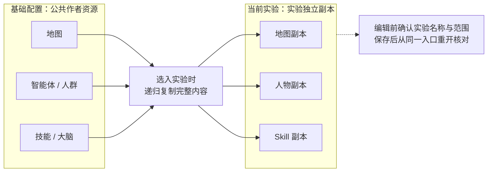
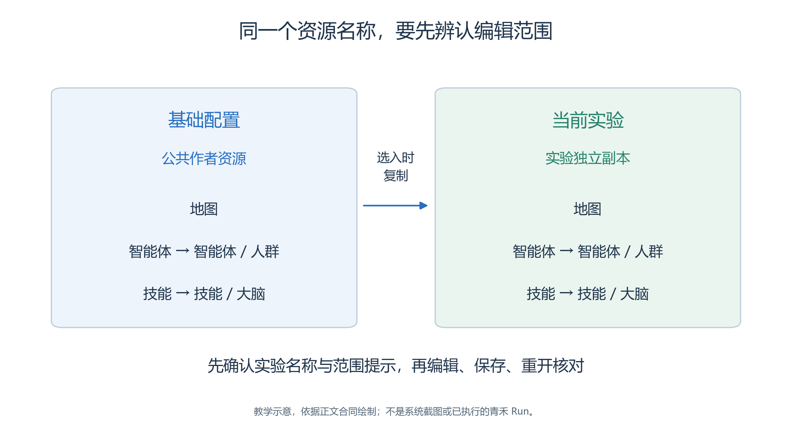
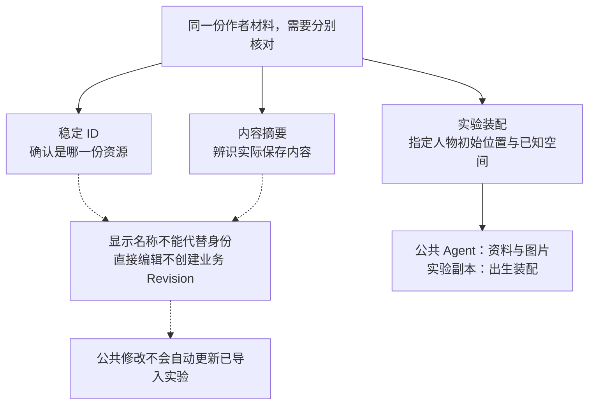
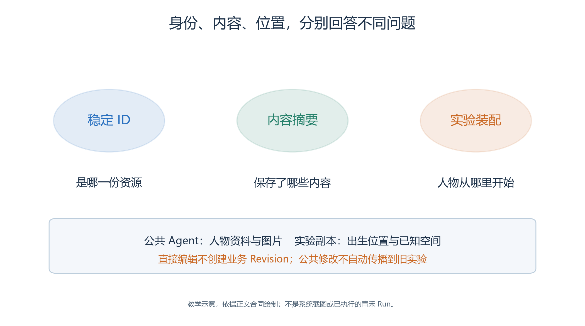

# 3.2 认识界面与作者资源

第二章的筹备助手处理文件和工具，第三章还要建立一个可供角色生活与行动的世界。

- 地图描述场地，Agent 描述人物，Skill 描述方法，模型配置提供推理服务。
- Studio 的工作是把这些作者材料组织成独立实验。
- 本节先认清编辑范围，再准备四位角色，避免把公共材料、实验副本和运行结果混在一起。

本节界面名称依据当前页面与前端源码；入口的只读观察不等于已经完成新案例的上传、保存或运行。青禾案例仍是教学设计，具体素材与空间方案见[案例地图说明](case/map/README.md)。

## 3.2.1 先看清正在编辑哪一份内容

<!-- book-figure: 02-editor-scope -->

*图3.2-1　页面范围的概念图，不是界面截图；选入时复制，后续修改不会自动同步。*

从“递归复制”这个节点向两侧看：两边可以出现相同资源名称，保存却落在不同范围。进入地图编辑器前，先用当前实验名称与范围提示确认自己处在哪一侧。

**原图参考（转换前）**

首页侧栏将“实验”与“基础配置”分开。

- 基础配置下有“地图”“智能体”“技能”“模型”；打开某个实验后，侧栏变为“当前实验”，包含“实验概览”“实验结果”以及实验自己的资源入口。
- 实验页还显示“实验独立副本”的范围提示。

同一个“地图”按钮可能打开公共地图，也可能打开当前实验内的地图。

- 判断依据是页面所在范围和实验名称，不能只看按钮文字。
- 修改前先确认范围，保存后再从同一入口重开核对。[页面结构](../../../src/generative_agents/adapters/web/static/shell/experiment-console.html)、[资源范围控制](../../../src/generative_agents/adapters/web/static/resources/resource-scope.js)

“人群”和“大脑”并非另外两个一级菜单：进入“智能体”后可切换“智能体／人群”，进入“技能”后可切换“技能／大脑”。

- 这种分组有助于理解关系：人群组织人物，大脑也是一种 Skill。
- 不要根据旧截图寻找已经变动的导航位置。[资源页签](../../../src/generative_agents/adapters/web/static/resources/resource-tabs.js)

## 3.2.2 认识资源，不把源码合同当作已完成操作

| 资源 | 本案例的用途 | 当前可核对的入口或边界 |
| --- | --- | --- |
| Map | 学习中心的图像、四层语义与通路 | 基础配置“地图”，新建或打开地图 |
| 图像与 Spatial Asset | 背景、物件外观和可复用空间内容 | 当前地图编辑器“素材”可导入原图、创建切片；独立 Spatial Asset 另有实现，不把旧编辑器控件当作必然可见入口 |
| Agent | 林岚、周宁、陈晨、许安 | “智能体”页新建和直接编辑 |
| Crowd | 将这四人组织为一次选择集 | “智能体 → 人群”，使用 Agent 管理选择成员 |
| Skill／Brain | 子任务方法、对象行为和人物决策 | “技能／大脑”页签，详见下一节后的行为编写 |
| Model Preset | 聊天与 Embedding 服务配置 | 基础配置“模型” |
| Evaluator | 业务评价配置 | 后端有资源与入包合同；当前导航没有专门的 Evaluator 编辑页，不虚构点击流程 |

最后两项尤其容易引起误解：能保存 Embedding 配置，不证明本次记忆检索已经使用向量；Evaluator 能作为资源复制，也不证明运行链已经调用它。第三章后续将分别检查实际消费位置与质量结果。[模型编辑器](../../../src/generative_agents/adapters/web/static/resources/model-workspace.js)、[作者资源路由](../../../src/generative_agents/adapters/web/routes/authoring.py)

## 3.2.3 创建四位人物，描述动机而非强制剧情

在基础配置“智能体”页点击“＋ 新建智能体”。

- 身份页填写“显示名称”“年龄”“当前目标”，选择头像和行走图；“特质与计划”页填写天生特质、背景经历、生活方式、日常计划和长程目标。
- 下面是本案例的写作方向，完整配置应与角色资料一同保存。

| 人物 | 角色与目标 | 应避免的写法 |
| --- | --- | --- |
| 林岚 | 组织者，核对开放信息并与服务台确认调整 | “第 5 步一定宣布完成”，把剧情当作事实 |
| 周宁 | 志愿者，了解公开安排，帮助访客找到合适场所 | 默认知道所有人的私有记忆 |
| 陈晨 | 阅读访客，查明阅读活动位置和当前安排 | 尚未移动就写“已经坐在阅读桌旁” |
| 许安 | 手作访客，核实场地信息后前往手作区域 | 无条件相信过期通知，不允许依据新信息调整 |

这些内容向 Brain 提供人物背景和目标，不会直接绕过世界校验。例如，“组织者”这个身份文字不赋予任意修改服务台内部状态的权限。“日常计划”也不是由内核机械执行的固定程序。

人物还有“感知视野上限”“注意力带宽”和“地图显示大小”。

- 前两者影响可获得的信息，显示大小只影响行走图的视觉比例，不改变坐标、碰撞或感知范围。
- 应使用本案例参数，不能因为输入框有初值就把它当成推荐值。[Agent 编辑与保存](../../../src/generative_agents/adapters/web/static/shell/console-api.js)

公共 Agent 不保存出生位置。

- 当前公共编辑器会隐藏“初始位置与空间”页签；进入实验后，再给人物副本装配空间。
- 先上传图片、保存公共人物、重开确认，再加入人群；不要把本地素材文件存在当作已经上传。

## 3.2.4 用 Crowd 组织一次选择

切换到“人群”页签，点击“＋ 新建人群”，填写名称和用途，使用“创建并管理 Agent”进入成员管理。选择四位公共 Agent，点击“应用到人群草稿”，再按页面保存人群。重开后逐一核对名称、稳定身份和成员数量。

Crowd 是作者侧组织方式，不是第五个在地图中行走的人物。

- 创建实验时，成员展开为独立 Agent。
- 后端对同一公共 Agent ID 的重复选择去重；若不同资源携带相同的 `agent_key`，则明确拒绝，不能靠显示名称合并。
- 本案例四个姓名不同，也仍需核对四条独立记录。[人群工作区](../../../src/generative_agents/adapters/web/static/resources/crowd-workspace.js)、[成员展开与复制](../../../src/generative_agents/ga_studio/experiments/workspace.py)

## 3.2.5 模型配置：可选择不等于已经可用

基础配置“模型”页点击“＋ 新建模型”，按实际服务填写配置名称、模型 ID、服务地址和 API Key。

- 当前表单还提供超时；聊天配置包含最大输出 tokens 与 Temperature。
- 保存后才可“测试连接”，有未保存修改时应先保存。
- 连接测试可能访问所配置的服务，应把结果记录为这次配置的观察，而不是整场仿真已通过。

聊天和 Embedding 是不同用途，可分别准备配置。

- 实验创建页要求选择相应项目；不要随手填入一个并不存在的模型名称来通过表单。
- 模型 API 协议以本系统网关实际支持为准，不能把第二章 Responses 示例的全部参数直接复制到这里。

密钥由本机凭据设施管理，表单不回显已保存密钥。交换包保存的是凭据环境变量引用，不携带密钥；异机运行需要重新提供相应环境。公共配置修改也不会自动更新既有实验。[模型服务实现](../../../src/generative_agents/ga_studio/resources/models.py)

## 3.2.6 稳定身份、直接编辑与整理资源

<!-- book-figure: 02-identity-content-placement -->

*图3.2-2　稳定身份、内容摘要和出生装配分别核对，不能用显示名称代替身份。*

三条分支回答不同问题：ID 确认资源身份，摘要辨识内容，实验装配才指定出生位置。修改人物资料和改变它在青禾的落点，要在对应范围分别核对。

**原图参考（转换前）**

资源的稳定 ID 用来确认“是哪一个资源”；显示名称用于阅读，内容摘要用来辨识内容。

- 改名不是发布新版本，保存也不是建立业务 Revision。
- 代码中的并发控制字段用于避免覆盖同时发生的编辑，不能据此发明“发布后跟随最新”的资源关系。

当前公共资源页面提供删除操作；架构与后端还定义了归档能力，但本节没有找到所有资源统一可见的归档／恢复入口，因此不写成已经完成的 UI 流程。

- 实验列表的归档与恢复则有明确入口，将在 3.8 节练习。
- 删除公共资源不影响已经导入实验的物理副本，但练习应选专门副本，不删除仍用于作者工作的原材料。

本节的交付是资源准备清单：四个人物及图片、人群成员、地图与对象素材、选定 Brain 和依赖、模型配置，以及仍待补齐的项目。只有这些内容实际保存并重开核对，才能把状态从“教材设计”改成“已配置”；接下来的运行还需要独立证据。

---

[上一节：3.1 案例与边界](01-case-and-boundaries.md) · [返回本章目录](README.md) · [下一节：3.3 从图像到四层空间](03-map-and-space.md)
