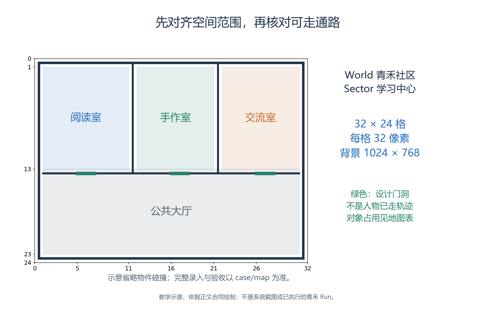
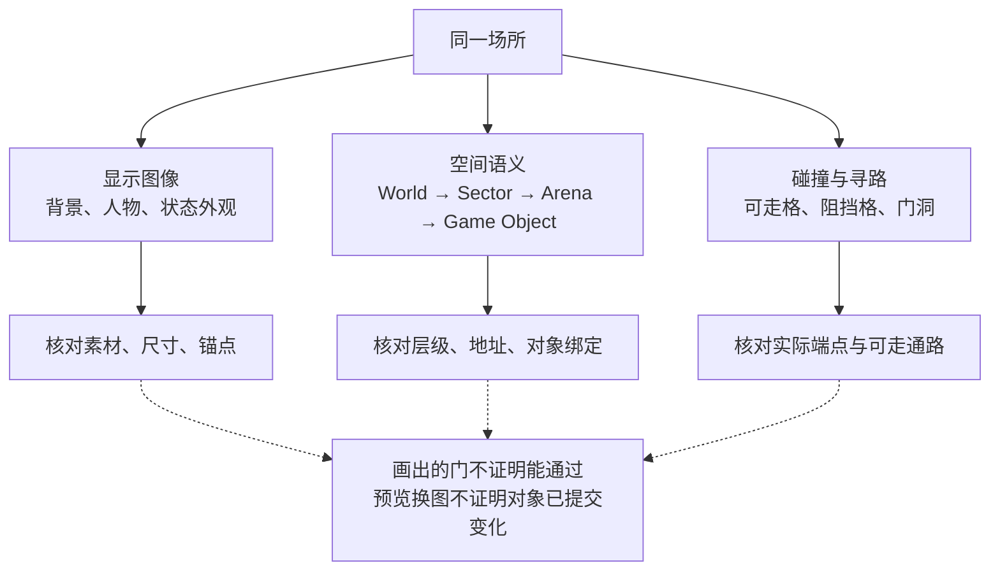
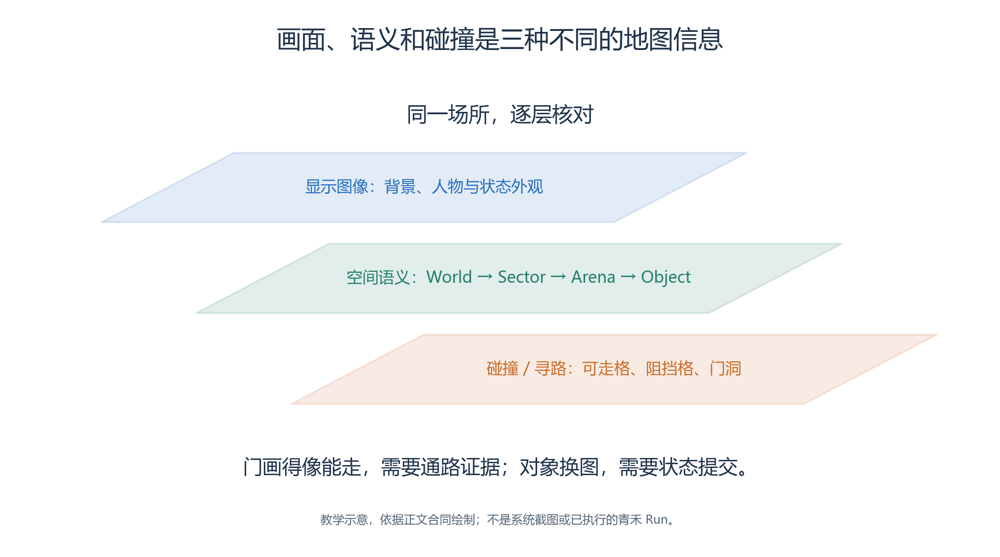
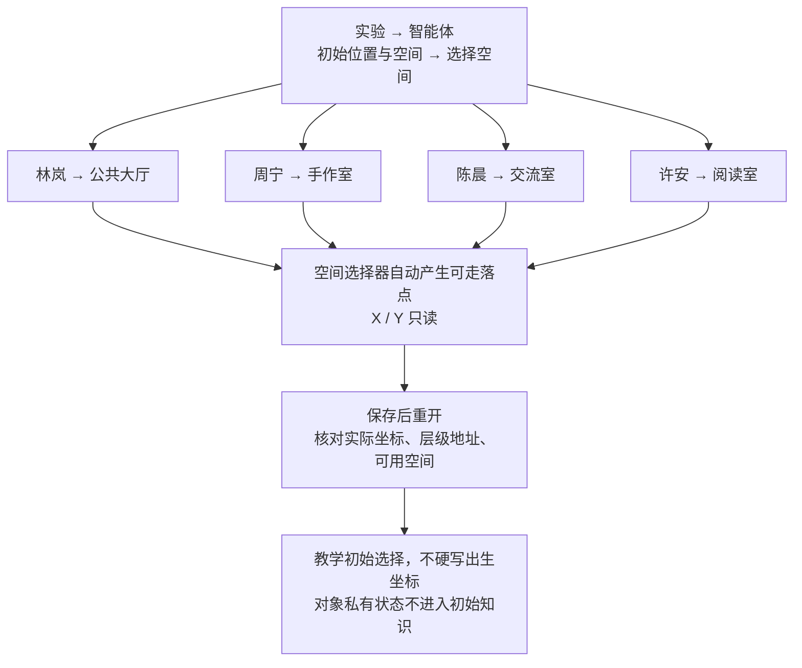
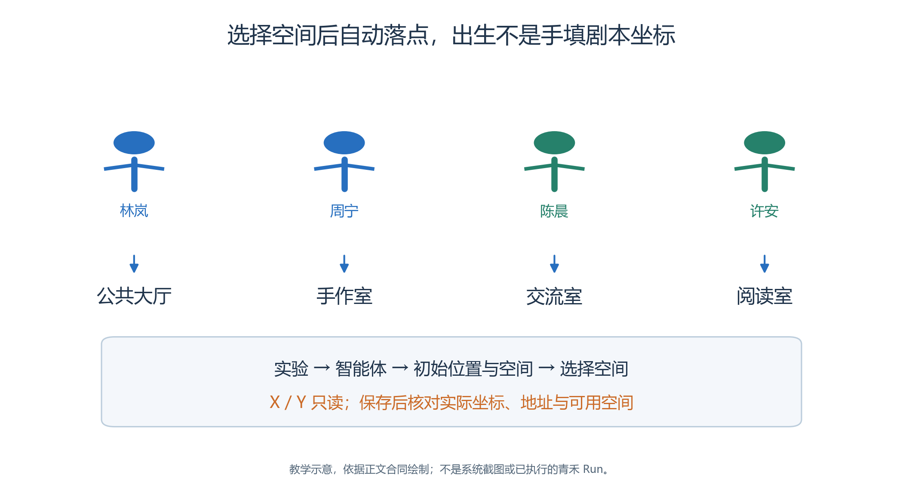

# 3.3 从图像到四层空间

一张画着房间和门的图片，尚未构成仿真地图。

- 人可以从图像猜出哪里能走、哪个物体是服务台，系统需要明确的语义、几何范围与碰撞配置。
- 本节把青禾的教学场景分成三个可以分别核对的部分：画面长什么样，地点叫什么，角色实际可以走到哪里。

以下尺寸与位置是本章的新设计，尚未成为已运行实验。全部素材、节点范围和待验收项统一以[地图资料](case/map/README.md)为准；制作过程不修改晨间或穿门阅读的历史地图。

## 3.3.1 先把尺度定下来

<a id="figure-03-semantic-map"></a>


*图3.3-1　作者设计的范围示意，省略物件碰撞；不是实际寻路结果，完整配置见地图资料。*

图中绿色短线标出设计门洞，彩色区域标出 Arena 语义范围；语义范围内仍可能有墙体或物件阻挡。保留静态几何图，是为了同时核对 32×24 坐标、区域边界与门洞位置，不能把这些短线当作已执行的穿门轨迹。

青禾地图采用 32×24 格，每格 32 像素，完整背景为 1024×768 像素。格坐标从左上角开始，X 向右、Y 向下。人物的世界位置以格坐标记录，图片的像素位置只是显示方式；把图放大两倍，不会让角色一次走得更远。

本章四层空间为：

```text
World：青禾社区
└── Sector：学习中心
    ├── Arena：阅读室 → 阅读桌
    ├── Arena：手作室 → 手作台
    ├── Arena：交流室 → 交流桌
    └── Arena：公共大厅 → 公告栏、服务台
```

前三层描述世界、区域和场所，第四层 Game Object 描述具体物件。每层都可以有自然语言语义；只有 Game Object 绑定对象根 Skill。一个 Arena 内可以有可走空地，空地不必为了凑齐四层而虚构“地面对象”。

| Arena | X、Y | W、H | 教学作用 |
| --- | --- | --- | --- |
| 阅读室 | 1、1 | 10、12 | 阅读访客的目标区域 |
| 手作室 | 12、1 | 9、12 | 手作准备与信息调整 |
| 交流室 | 22、1 | 9、12 | 入场后的整理与交流 |
| 公共大厅 | 1、13 | 30、10 | 连接房间、查询公告与咨询 |

World 与 Sector 覆盖整张 32×24 地图。表中的范围包含语义区域，不承诺其中每一格都可走；墙体和物件占用还要由通路配置确定。

## 3.3.2 新建地图，导入整张背景

<a id="figure-03-map-layers"></a>
<!-- book-figure: 03-map-layers -->


*图3.3-2　三类地图信息分别核对；可见图像不能代替四层语义录入、通路设置或世界提交。*

顺着三个分支分别检查素材、地址和通路。显示分支中“画出门”不能跳过碰撞分支的连通性检查；状态图片预览也不能跳过后续运行中的对象提交。

**原图参考（转换前）**



在基础配置“地图”点击“＋ 新建地图”，填写名称、可选稳定键和用途，选择“空白地图（自由绘制）”，输入宽 32、高 24、Tile 尺寸 32，再“创建并编辑”。不选择一个无关旧地图来充当默认背景。

当前编辑器实际使用“世界”“素材”两页。

- 在“素材”点“＋ 导入原图”，选择本章背景 PNG。
- 选中原图后“＋ 新建切片”，为完整背景设置 X=0、Y=0、W=32、H=24，保存切片。
- 然后回“世界”，选根节点，在“显示素材”中选择该切片；设置节点名称、空间范围和语义，保存。[地图编辑器实现](../../../src/generative_agents/adapters/web/static/resources/map-editor-v2.js)

这一步包含上传、切片、绑定和保存。

- 看到图片出现在素材列表，只能说明原图进入了编辑器；它未必已经作为世界背景显示。
- 保存后离开再重开，检查根节点仍绑定同一素材、尺寸没有改变、画面没有拉伸或裁掉边缘。

整张背景已经画出的桌椅无需再叠一套重复图。

- 可以为它们建立语义节点，而不额外选择显示素材。
- 需要随状态换图的公告栏，则单独准备视角、像素尺寸、锚点及切片边界相同的外观素材，避免切换时像在地图上跳动。

## 3.3.3 建立四层地址树

在“世界”左侧“四层地址树”中，使用父节点旁的“＋”逐层创建子节点。World 下创建 Sector，Sector 下创建 Arena，Arena 下创建 Game Object。不要跳过层级，也不要仅在图片上写一个房间名，就认为系统已经知道它的地址。

选中节点后，右侧可填写“节点名称”“空间范围”X/Y/W/H和“空间语义”。例如阅读室语义说明它适合阅读与分享，公共大厅语义说明它连接各场所并提供公共咨询；不要把某位人物私下知道的信息写进公开空间语义。

公告栏 `board` 与服务台 `helpdesk` 的业务设计标识，用于教材对照。

- 编辑器新建节点时产生自己的稳定节点 ID，读者不能假定它会自动等于这两个短名，应在配置记录中建立对应关系。
- 对象 Skill 的详细内容见 3.4 节；本节先保证对象位置、外观和地址正确。

对象右侧“状态外观”的状态名与初始状态 JSON 顶层 `state` 精确匹配；未命中时使用默认显示素材。

- 默认图、状态图和初始值要一起核对。
- 编辑器预览切换正常只是配置检查，运行时还需真实 `SET_OBJECT_STATE` 提交与回放事实证明变化。[状态绑定与对象属性](../../../src/generative_agents/adapters/web/static/resources/map-editor-v2.js)

## 3.3.4 画面有门，还要把门设为可走

在“世界”点击“通路”，右侧提供“阻挡”“可走”“恢复素材结果”“路径检查”。

- 当前交互要求按住 Ctrl 再左键点击或拖动编辑格子；普通拖动用于平移画布。
- 素材页对应的是“碰撞”，在切片局部网格配置，放置时随素材旋转。[通路编辑实现](../../../src/generative_agents/adapters/web/static/resources/map-navigation.js)

按地图资料标记外墙、房间分隔和物件占用。

- 横向隔断位于 y=13，各房间门洞分别在 x=5/6、16/17、26/27；先形成连续隔断，再用“可走”打开这些格。
- 世界级手工配置优先于素材结果，修改后检查“配置来源”，防止忘记旧覆盖仍在生效。

选择“路径检查”，按 Ctrl 依次点 A、B，检查大厅至三个房间、房间至对象旁站位的路线。

- 结果应区分起点阻挡、终点阻挡、不可达和可达距离。
- 一次成功路径只证明这两个端点连通；还要检查实际人物出生点及可交互站位。

本章不把路径检查的预览线当成角色已走过的路。运行时，Brain 仍需先获得可见目标，再提出导航与移动，最后以提交后的坐标核对抵达。预检没有报错，也不能替代这一运行检查。

## 3.3.5 人物图片、显示比例与出生装配一起检查

<a id="figure-03-spawn-selection"></a>
<!-- book-figure: 03-spawn-selection -->


*图3.3-3　教学初始选择；实际坐标须由空间选择器生成并保存，本图没有指定出生坐标。*

四个人名后的房间是初始装配选择，不是已经完成的移动。沿箭头到“自动产生可走落点”后，才有需要保存核对的实际坐标；下面再分别检查人物图片与空间入口。

**原图参考（转换前）**



当前头像要求正方形 PNG，至少 32×32；行走图接受 96×128 或 128×128 PNG，每帧 32×32，四行依次表示下、左、右、上。

- 图片本身留白较多时，相同“地图显示大小”也会显得更小。
- 要同时检查人物与背景风格、每帧位置、脚底锚点、桌面遮挡和缩放清晰度。[图片校验](../../../src/generative_agents/ga_studio/resources/assets.py)

人物选入实验后，进入该实验“智能体”，编辑“初始位置与空间”。

- 点击“选择空间”，当前选择器会取所选场所或对象中心附近的可走格，并显示自动坐标；X/Y 只读。
- 本章不教读者绕开页面填入预定坐标。[空间选择器](../../../src/generative_agents/adapters/web/static/resources/spatial-picker.js)

| 人物 | 设计中的初始 Arena | 起始情境 |
| --- | --- | --- |
| 林岚 | 公共大厅 | 已抵达，核对公开安排 |
| 周宁 | 手作室 | 检查物料，随后去大厅协助 |
| 陈晨 | 交流室 | 整理随身物品，随后前往阅读区 |
| 许安 | 阅读室 | 浏览等候，随后核实手作安排 |

分置四个场所可以避免本次设计中所有人选择同一中心点造成遮挡。

- 实际保存坐标以选择器结果为准，记录坐标与真实层级地址；落在 Arena 空地时保存三层地址，落在对象范围内时保留第四层。
- 检查“可用空间”只包含设计允许的公开地点与对象，不把对象私有状态作为人物的初始知识。

## 3.3.6 用旧案例理解检查方法

晨间案例提供完整背景、人物与桌面状态图的历史材料，其[2026-09-09 导出记录](../sample/01-morning-routine/verification/exports/README.md)包含 32 步结果。不过当前工作区缺少原 `settings/` 目录，不能把引用的旧配置清单说成仍然齐全。

穿门阅读的[正式运行记录](../sample/02-doorway-reading/verification/formal-run-record.md)适合学习门洞、移动预算与抵达后再活动；[封门对照](../sample/02-doorway-reading/verification/contrasts/blocked-door/README.md)则说明“感知到对象”与“能够到达”是两项判断。该对照的 B02-007 回放和导出核验仍未闭环，不写成完整通过，也不把旧人物坐标搬到青禾地图。

完成本节应留下背景及状态图、语义范围、碰撞与路径检查记录、四名人物的实际出生地址和画面核对项。尚未浏览器保存或运行的项目继续标为待验收，随后再编排行为。

---

[上一节：3.2 界面与作者资源](02-studio-and-resources.md) · [返回本章目录](README.md) · [下一节：3.4 Brain 与 Skill](04-brain-and-skills.md)
