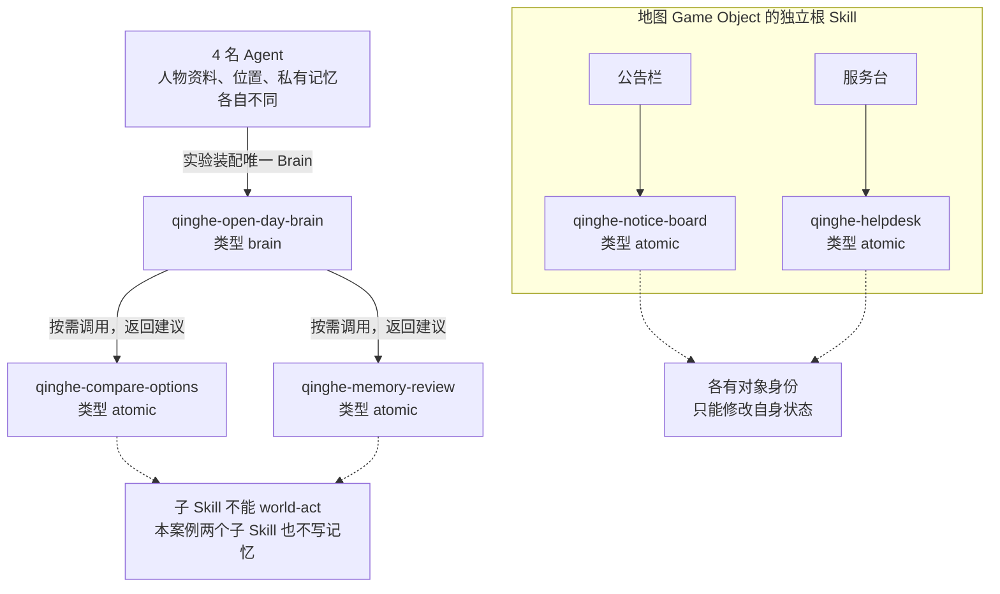
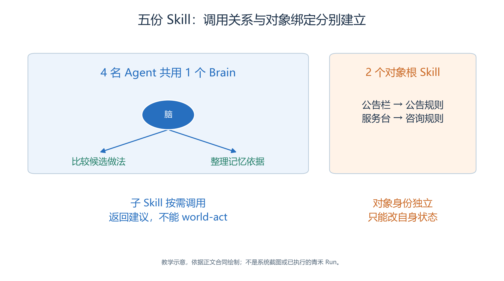
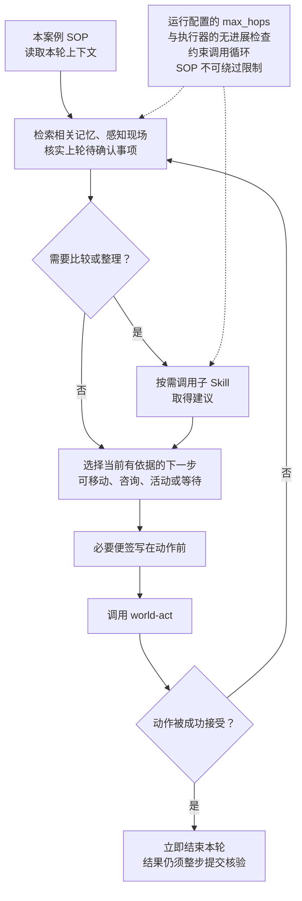
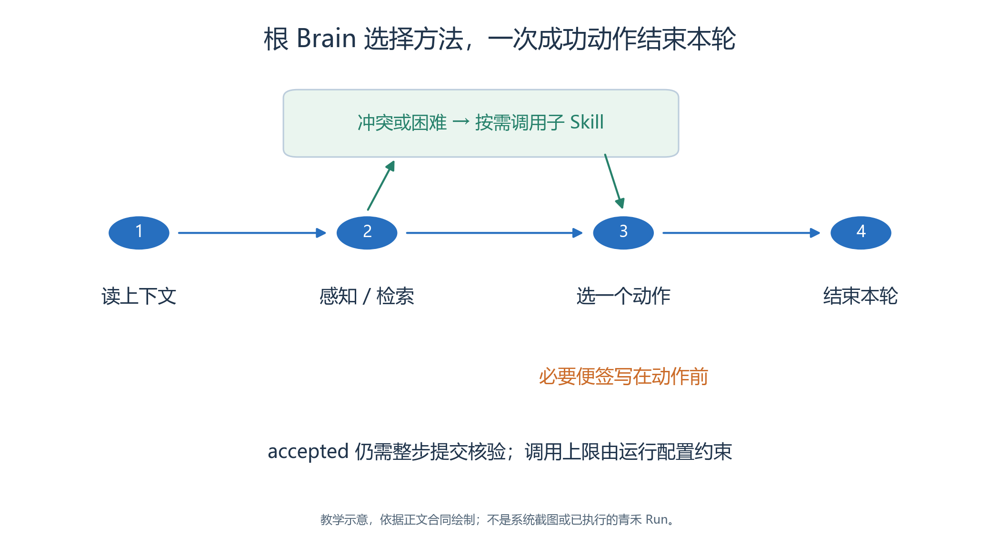

# 3.4 Brain 与 Skill：让角色自己决定下一步

现在，青禾学习中心已经有了地图、人物和活动目标。

- 接下来的问题是：林岚怎样发现安排需要调整？
- 周宁什么时候协助来访者？
- 许安面对新的消息，又怎样改变原来的打算？
- 这些决定需要写成角色可以执行的行为方法。

本系统把这项工作交给 Brain 和 Skill。

- Brain 是一名 Agent 本轮行动的组织者；子 Skill 可以比较方案、整理证据或提出建议；内核负责检查动作是否合法、提交事实和推进时间。
- 我们不需要为四个人画四张固定流程图，也不应把“第几步必须说哪句话”当作自主行为。

## 3.4.1 先分清“是什么类型”和“在哪里使用”

<a id="figure-04-skill-topology"></a>
<!-- book-figure: 04-skill-topology -->


*图3.4-1　依赖表示可调用关系，不是固定顺序；图中五份 Skill 仍是待录入的作者材料。*

Brain 的两条出线表示它可按需求助两个子 Skill；对象框内两条线表示地图绑定。公告栏与服务台各自运行，不能把它们接在 Brain 依赖后面当成必经步骤。

**原图参考（转换前）**



系统中的 Skill 有三种固有类型：`atomic`、`pack` 和 `brain`。单个技能处理相对集中的问题，技能包组合其他技能，Brain 用来驱动 Agent。对象 Skill 和子 Skill 则描述装配后的使用角色：一个 `atomic` Skill 可以被 Brain 调用，也可以作为某个 Game Object 的根 Skill。

本案例准备五份文档：Brain 引用两个子 Skill，另外两个根 Skill 分别绑定公告栏与服务台。它们组成下列依赖与绑定关系：

| 名称 | 类型与使用位置 | 负责的判断 |
| --- | --- | --- |
| `qinghe-open-day-brain` | `brain`，实验唯一 Brain | 根据当前角色、可见事实和个人记忆选择本轮动作 |
| `qinghe-compare-options` | `atomic`，按需调用的子 Skill | 比较两种以上可行做法，指出缺少的证据 |
| `qinghe-memory-review` | `atomic`，按需调用的子 Skill | 区分已知事实、待确认事项和失效认识 |
| `qinghe-notice-board` | `atomic`，公告栏根 Skill | 回答公告查询，处理符合教案规则的更新请求 |
| `qinghe-helpdesk` | `atomic`，服务台根 Skill | 根据自身掌握的场地信息回答咨询 |

四名 Agent 共用同一个 Brain。角色差异来自人物资料、当前任务、位置、收到的消息和私有记忆，不是复制四套几乎相同的程序。公告栏与服务台有各自的对象身份，不会因此出现在公共 Agent 列表中。[完整技能材料](case/skill/README.md)

## 3.4.2 把 SOP 写成条件与证据

<a id="figure-04-brain-turn"></a>
<!-- book-figure: 04-brain-turn -->


*图3.4-2　本案例 SOP 示意，不是内核强制流水线；成功 world-act 后本轮结束。*

从“需要比较或整理”分支走向动作选择，咨询本身也可以是有依据的下一步，不必等全部答案齐备才行动。最下方的成功分支结束本轮；拒绝分支才返回判断，并受调用上限约束。

**原图参考（转换前）**



一个可靠的 Brain 至少要回答五件事：现在知道什么；还缺少什么；何时需要子 Skill；可以提交什么动作；何时停止。本案例采用以下方法：

1. 读取本轮身份、虚拟时间、当前位置、上轮活动和外部观察。
2. 检索与当前目标有关的私有记忆，感知附近实际存在的人物、空间和对象。
3. 对照新证据核实上轮待确认事项；存在冲突或选择困难时，调用相应子 Skill。
4. 选择一个当前可执行的动作。需要移动便先移动，需要咨询便先发出请求，尚未得到答复便保留不确定性。
5. 在动作前保存必要的待确认便签，调用一次 `world-act`；成功后本轮结束。

这里的“先读取、再判断”是本案例选用的 SOP，不是所有实验都必须采用的内核流水线。

- 若角色正在等待已知时间边界，没有新消息，也没有需要调整的计划，就不必每轮都调用两个子 Skill。
- 反之，遇到公告与服务台答复不一致，才值得付出额外模型调用来比较来源。

例如，许安原来相信手作活动会按旧公告开始。

- 收到新的服务台答复后，他可以先整理“旧公告内容”和“最新咨询结果”的关系，再决定去核实公告、询问组织者或进行其他活动。
- 教材给出的是这些选择的条件，不提前替模型写好结局。

## 3.4.3 当前系统怎样读取 SKILL.md

配套文件采用本项目当前支持的文档格式。开头只使用 `name`、`description` 和可选的 `example_input`：

```markdown
---
name: qinghe-compare-options
description: 比较开放日现场的候选做法，返回有依据的建议。
example_input: 已有两种活动安排，请比较依据和待确认事项。
---

# 比较候选做法

只依据输入中的事实和共享上下文提出建议。
不知道的条件写成待确认项，不补造已发生的行动。
```

`kind` 由资源类型或对应目录确定，不写入这份 front matter。第二章介绍的通用 Skill 材料，不能原样假设具有本系统的全部运行合同。例如，在这里自行添加 `version`、`allowed-tools` 等前置字段，会遇到当前解析器不支持的问题。

Brain 正文中的 `$qinghe-compare-options` 表示一个子 Skill 依赖。

- 运行时解析出依赖后，为模型提供 `call_skill` 工具，参数是 `name` 和 `input_text`。
- 父技能应把有用的观察、约束和问题传给子技能，再利用其自然语言结果继续判断。
- 依赖关系不是执行顺序，也不会因为写在列表第一项就自动先调用。[文档解析实现](../../../src/generative_agents/ga_protocol/skills/documents.py) 中可查看 `SkillRegistry._parse`；[执行器](../../../src/generative_agents/ga_runtime/skills/executor.py) 的 `SkillRuntime._run` 负责实际调用。

需要注意，子 Skill 得到的是同一轮的 `IterationContext`，但不能替根 Brain 提交世界动作。

- 执行器会从子技能的可用工具中去掉 `world-act`。
- 本案例进一步让两个子 Skill 保持纯建议角色：它们既不改世界，也不写记忆。
- 根 Brain 对建议负责，并完成最终校验。

调用也有硬边界。

- `SkillRuntime` 使用运行配置传入的 `max_hops`，既限制工具循环，也累计整棵调用树的工具次数；还检查完全重复以及语义上重复且没有进展的调用。
- SOP 里写“最多尝试三次”只是行为约定，不能修改内核上限。
- 编写长调用链时，要为必要的记忆处理与最终动作留出预算，而不是把所有可用技能依次调用一遍。

## 3.4.4 在页面中建立和核对依赖

在资源中心的“技能”入口创建两个子技能和两个对象技能，类型选择“单个技能”；在“大脑”入口创建 `qinghe-open-day-brain`。稳定名称与配套文档保持一致，再把对应 `SKILL.md` 全文放入编辑区域，点击“保存内容”。

保存后，重新打开 Brain 的“Scripts 与 MCP”页，核对它识别出的两个子 Skill，以及正文引用的感知、导航、记忆、动作能力。

- 对象技能则在地图编辑器选中公告栏或服务台后，从“对象 Skill”的 `Skill` 选项中绑定。
- 两者的检查位置不同：Brain 属于实验运行装配，对象技能属于地图的 Game Object。

再把资源选入实验。

- 此时系统递归复制完整依赖内容，实验得到自己的副本。
- 以后修改公共 Brain 不会自动改变这个实验；草稿需要调整时，在明确的实验范围内编辑或重新导入，保存后再次核对内容与依赖。
- 封存实验的处理见后文，不能靠修改公共文档让已封存内容“跟随更新”。
- 页面行为可对照 [Skill 工作区](../../../src/generative_agents/adapters/web/static/resources/skill-workspace.js)。

本章文件属于资料准备，尚未证明它们已在页面保存、导入或由模型成功执行。

- 读者完成操作时，应记录保存后的实际内容摘要和实验预检结果。
- 普通叶子 Skill 可以按需要试运行；依赖仿真 MCP 的 Brain 或对象 Skill，应在具备世界上下文的实验中核验，不能把孤立聊天输出当作世界行为证据。

## 3.4.5 怎样判断 Brain 做对了

假设 Brain 输出“我已经通知了大家”，这句话只说明模型生成了文本。

- 要证明通知发生，需要找到真实的 `SPEAK` 或对象回复事实；要证明公告更新，需要找到对象提交的状态变化。
- 本轮工具返回 `accepted: true`，也首先表示动作请求已经被接受，之后仍须以 World Commit 和已提交 StepResult 核对结果。

- 检查一次行为时，把三个层次连起来看：Brain 得到的输入是什么；它通过哪些工具获得新证据；最终提交了什么动作。
- 只看最后一句回答，无法判断它有没有跳过咨询、误用子技能建议或提前宣布成功。[BrainRuntime.run_step](../../../src/generative_agents/ga_runtime/skills/brain.py) 与执行器中成功 `world-act` 后立即返回的分支，解释了为什么便签必须在动作之前写。

练习：把“每轮都反思一次”改成“证据冲突、重要目标改变或重复无进展时才整理记忆”。

- 观察真实调用轨迹，比较额外调用次数与行为质量，而不是只比较文字长短。
- 再检查是否出现“子 Skill 已经通知林岚”的建议。
- 参考判断是：这种说法应改成候选动作；子 Skill 的文本没有构成通知事实。

---

[上一节：3.3 地图与空间](03-map-and-space.md) · [返回本章目录](README.md) · [下一节：3.5 感知、导航与动作](05-perception-navigation-actions.md)
