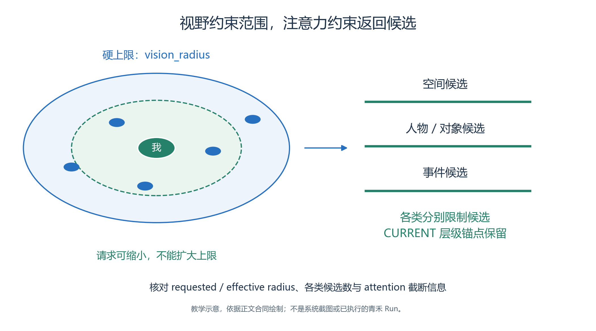
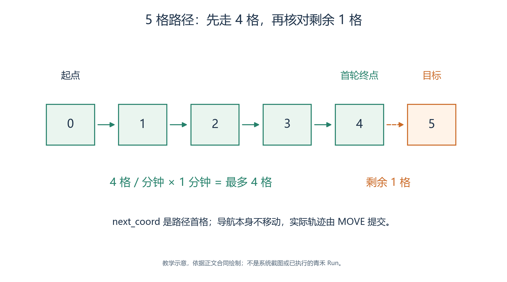
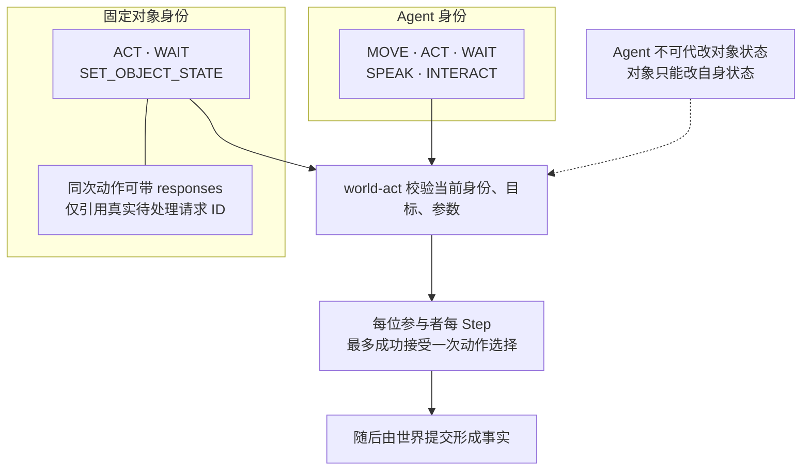
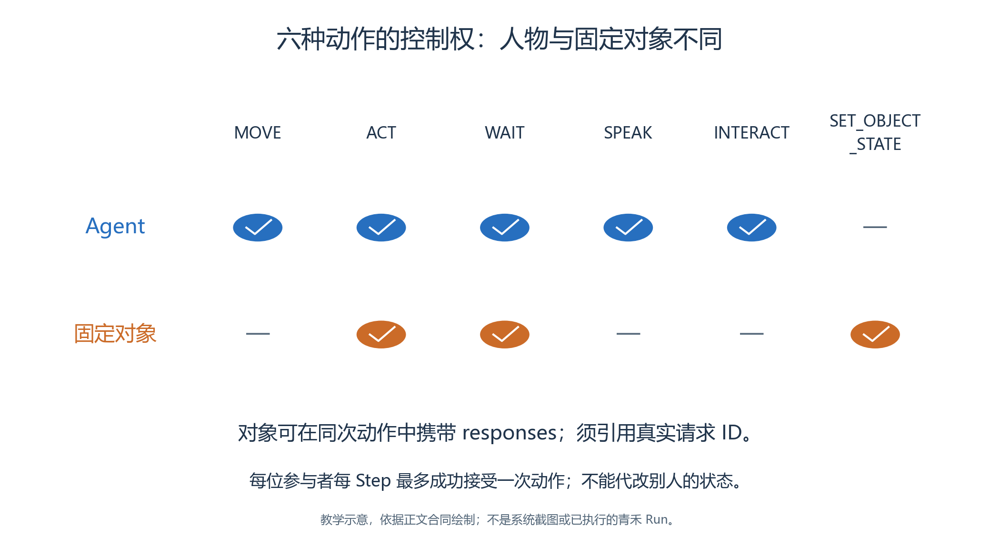

# 3.5 感知、导航与动作：让语言落在真实空间里

“走到公告栏前查看通知”听起来只有一句话，在仿真中却包含三个不同问题：角色是否知道公告栏在哪里；能否沿可走路线接近它；到达后究竟做了什么。本节把这三个问题拆开，避免人物在文字里已经抵达、画面上仍停在原地。

## 3.5.1 感知返回有范围的事实

*图3.5-1　范围与候选筛选的概念图，圆点数量不代表一次真实 MCP 返回。*

绿虚线画的是主动缩小请求半径的情形，蓝色外圈是视野硬上限；请求超限时，生效范围仍不能越过外圈。右侧另画候选筛选，说明“在范围内”不保证“出现在返回中”。保留这种静态几何关系，圆点不作真实 MCP 结果计数。

Agent 调用 `world-perceive` 时可以不传参数，也可以请求一个较小的 `radius_tiles`。运行时使用人物配置的视野作为硬上限：把请求数字写得更大，不会获得更远的视野。返回值明确给出 `requested_radius_tiles`、实际 `radius_tiles` 和 `vision_radius_tiles`，可用来核对请求与生效范围。

结果的主要部分如下：

| 返回内容 | 角色可以据此判断什么 |
| --- | --- |
| `current_location` | 当前坐标、地址和位置锚点 |
| `spatial_nodes` | 当前范围内的四层空间语义 |
| `nearby_agents` | 附近角色的身份、位置与活动 |
| `game_objects` | 对象地址、公开状态和当前交互项 |
| `events` | 当前范围内可观察的事件 |
| `active_conversations` | 属于该参与者的活动会话 |
| `attention` | 各类候选数量、带宽以及是否发生截断 |

视野决定空间范围，注意力带宽限制候选输出。

- 带宽不是整个 JSON 的总行数：当前位置的层级锚点需要保留，不同类别的附近候选分别受到限制。
- 不要看到返回节点数量超过一个带宽值，就直接认定限制无效；应分别对照 `nearby_space_candidates`、`nearby_agent_candidates`、`game_object_candidates` 和 `event_candidates`。[SimulationMCPServer._perceive](../../../src/generative_agents/ga_runtime/capabilities/server.py)

在青禾案例中，陈晨看到公告栏的外观状态变了，只能确认“这个对象的公开状态已变化”。

- 对于绑定 Skill 的对象，通知正文等内部字段不会因为站得近就自动进入感知。
- 要知道具体改了什么，应发起真实查询。
- 这种限制为“有人先知道、有人后知道”的情节提供了基础。

## 3.5.2 导航是查询，不是移动

`world-navigate` 接受一个目标：可见范围内的 `target_coord`，或者当前已感知、系统已知空间上下文中存在的三层或四层 `target_address`。

- 两种参数二选一，不同时发送。
- 地址的每一层都必须来自实际材料或工具结果，不能把“那边的教室”拼成自创路径。

返回 `reachable: true` 表示存在可走路线。`distance_tiles` 是这条路线的格数；`next_coord` 只是路径第一格；`movement_required: false` 则表示已经处于目标范围内。查询不会修改坐标，也不会消耗本轮唯一的世界动作。

如果周宁查询到通往服务台的路径，就应在后续 `MOVE` 中保留原来的完整目标。把 `next_coord` 当最终目的地，会让每次请求都只打算移动到相邻一格。相反，把路线终点直接写进当前坐标，也不会使角色瞬移。

还有一个实现细节值得读者记住：当前地址合法性检查使用人物的已知空间树、当前位置和实际感知；普通记忆流里写着某个地址，并不等于系统已知空间树已经增加了该地址。

- 已知空间需要来自允许的初始装配、探索或实际感知；一条自然语言便签不能自动把任意地址加入可导航范围。
- 本节 Skill 使用运行时给出的地址，不把教材作者的全图知识直接交给角色。[SimulationMCPServer._navigate](../../../src/generative_agents/ga_runtime/capabilities/server.py)

## 3.5.3 内核怎样决定走了多远

*图3.5-2　人工构造的五格路径；依据 ga-cn-v1 每分钟四格说明预算，不是青禾实测轨迹。*

顺着实线从起点 0 读到首轮终点 4，再看指向目标 5 的虚线：首次 MOVE 最多走四格，剩余一格尚未完成。格内数字是路径位置示意，不是 Step 编号；静态格子用于保留邻接关系，不代表本案例已执行轨迹。

成功选择 `MOVE` 后，内核计算路径并按本轮移动预算消耗路径格。

- 当前预算由步长和 `movement_tiles_per_minute` 相乘得到，至少为一格。
- 页面没有供本案例直接修改移动速度的选项；这个算例用于解释当前算法，不是青禾案例的实测轨迹。[算法配置](../../../src/generative_agents/ga_protocol/schemas/engine.py)、[Scheduler._movement_budget](../../../src/generative_agents/ga_runtime/engine/scheduler.py)

世界提交会记录真实起终点、实际执行路径以及剩余路径。

- 下一轮 Brain 需要依据当前坐标和地址继续判断；人物说“已到达”不能替代这些字段。
- 只有实际抵达对应场所，才进行现场活动或进入交互距离。

同一个三层区域或四层对象地址可能覆盖多个可走格，导航可以选择其中的合法终点。

- 因此，人工预想站在对象左侧，运行时停在另一处可走位置，并不必然意味着导航错误。
- 应检查实际终点是否满足地址、碰撞和交互距离，再判断是否符合教学要求。

地图上的格、图片像素和现实中的米也要分清。

- 三十二像素的 Tile 是画面尺度，不自动表示三十二米；“每分钟四格”描述的是本实验离散空间中的移动预算。
- 若研究行走速度，需要另行定义空间标尺与实验假设，不能从图片尺寸反推人物的现实速度。

## 3.5.4 六种动作分别表达什么

<!-- book-figure: 05-action-ownership -->

*图3.5-3　按当前能力合同整理；可用原语不表示任何参数或目标都能通过校验。*

先从当前身份所在的框进入 world-act：林岚所在的 Agent 框没有 SET_OBJECT_STATE，公告栏自己的框才有。两条路线都经过校验，图下半部的“接受选择”与“形成事实”仍是不同阶段。

**原图参考（转换前）**

世界动作统一通过 `world-act` 提交，每名参与者每 Step 最多成功选择一次：

| 原语 | 典型用途 | 需要核对的事实 |
| --- | --- | --- |
| `MOVE` | 走向服务台或阅读区 | 执行路径、实际终点、剩余路径 |
| `ACT` | 在当前位置阅读、整理资料 | 非空 `predicate`、`object`，当前位置 |
| `WAIT` | 等待答复或已知时间边界 | 等待原因与适当的预期边界 |
| `SPEAK` | 向一名角色传达消息 | 参与者、消息与稳定会话身份 |
| `INTERACT` | 查询公告或向服务台咨询 | 实际 `selection_key`、请求及后续回复 |
| `SET_OBJECT_STATE` | 修改对象自身状态 | 对象身份、状态补丁与提交事实 |

普通活动用 `ACT`。

- 例如抵达阅读区后，可以提交 `predicate: "阅读"`、`object: "开放日介绍资料"`。
- 这不需要内核新增一个“阅读资料”的业务编码。
- `WAIT` 则用于确实没有立即继续的条件，例如等待已发出的对象请求获得回复；不能为了省事，把所有活动都写成等待。

`ACT` 是当前位置上的活动。如果提供 `target_coord` 或 `target_address`，它们必须与当前事实一致；它不能顺带完成移动。`MOVE` 的可选 `predicate` 用来表达“快步行走”这样的移动活动，不写“已经抵达服务台”。移动事件中的实际地址由内核确定。

对于绑定 Skill 的公告栏，林岚不能以 Agent 身份直接 `SET_OBJECT_STATE`。她必须 `INTERACT` 提出请求，由公告栏在自己的轮次决定并提交状态变化。这个权限边界使对象具有独立行为，也留下了可审核的请求链。

## 3.5.5 从页面一路检查到事实

配置阶段先查看人物的感知参数，地图中再核对语义范围、碰撞、出生点以及对象交互距离。

- 保存后重新打开，确认页面保留的是实际值。
- 预检通过只表示静态合同满足要求，不代表角色已经走过路线。

运行后，在回放中选择人物和相应时间位置，查看 Agent 检查器的“位置”“动作”及当前窗口事件。

- 需要确认边界时，继续查看对应调用记录和结构化事实：一次感知请求有没有真的发出；返回了哪些候选；导航查询指向什么；MOVE 最终走了哪些格。
- 页面标签与证据入口可对照 [实验控制台](../../../src/generative_agents/adapters/web/static/shell/experiment-console.html)。

本案例要求保留失败信息。

- 若目标不可达，工具可能返回 `reachable: false` 和 `BLOCKED_OR_DISCONNECTED`；若地址从未感知或不在已知空间中，则可能直接拒绝请求。
- 前者说明路线条件，后者说明知识或参数边界，不能一律归为系统故障。
- Brain 应利用错误缩小问题范围，选择有依据的下一步，而不是扩大视野数字或猜门洞绕过限制。

练习：任选一段实际轨迹，对照目标地址、查询距离、移动预算、执行路径和最终坐标，说明人物是否抵达。

- 再把本轮动作文字遮住，只用结构化事实作判断。
- 如果仍能得出同样结论，说明证据足够；如果只能依据“正在前往”四个字判断完成，就需要重新取证。

---

[上一节：3.4 Brain 与 Skill](04-brain-and-skills.md) · [返回本章目录](README.md) · [下一节：3.6 记忆与跨步进度](06-memory-and-progress.md)
