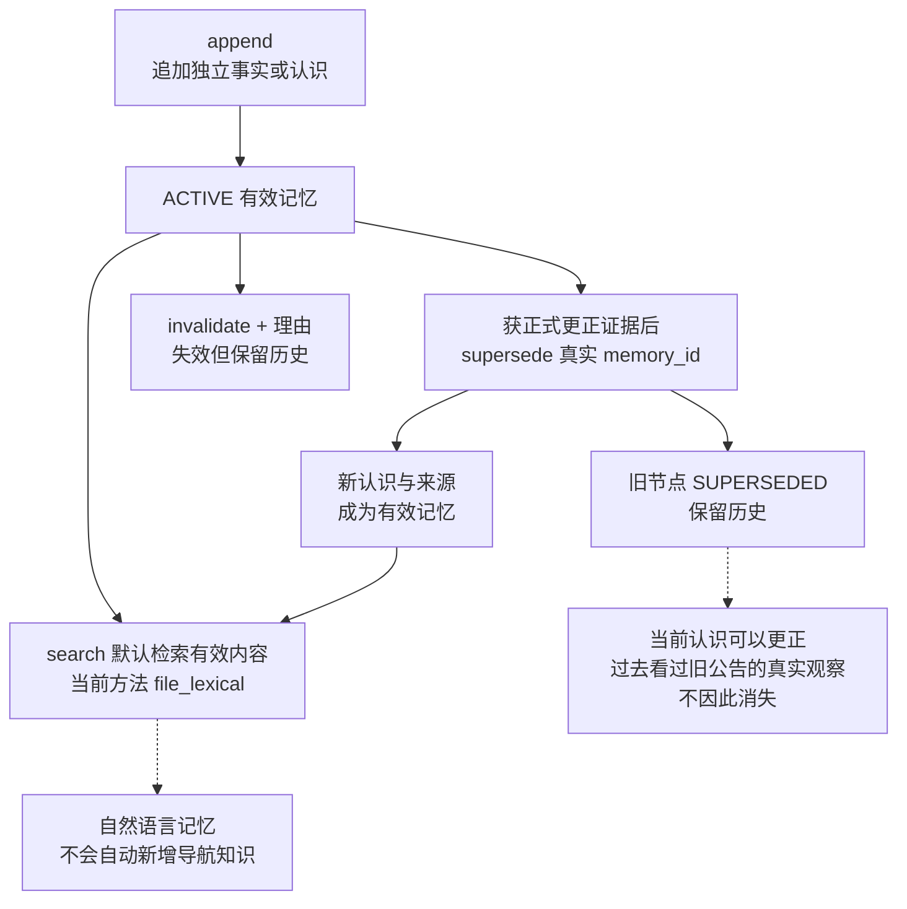
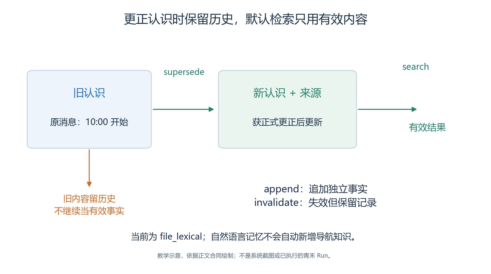
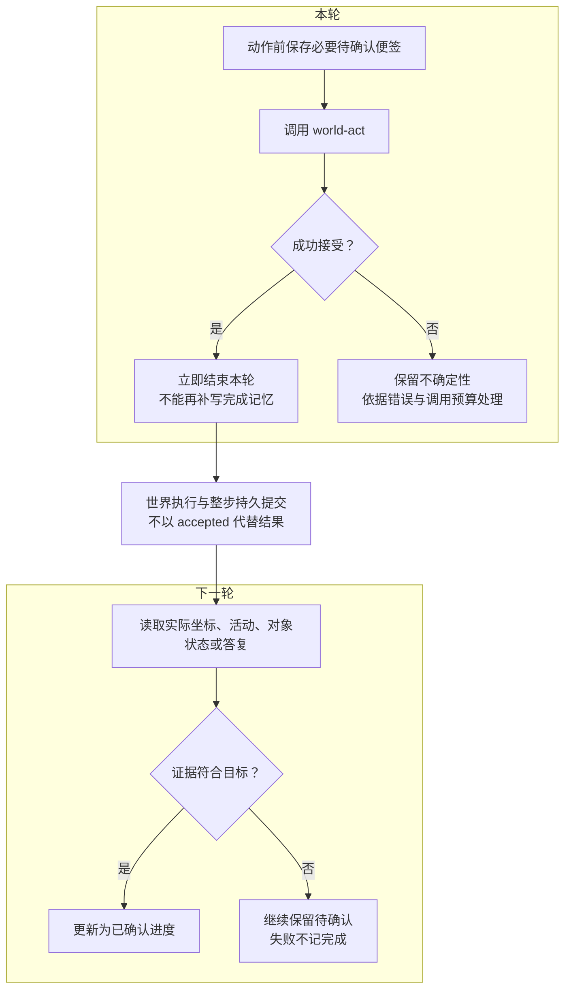
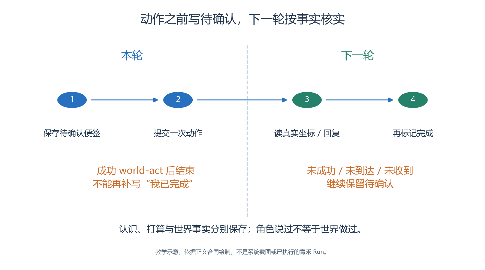

# 3.6 记忆与跨步进度：区分“我打算做”和“已经发生”

许安第一次走进学习中心时，可能只记得旧消息：“手作活动十点开始。”

- 如果几轮之后，他收到服务台的答复，又查询到更新后的公告内容，就有了核对旧认识的新依据。
- 一个可信的角色应该能够改变认识，同时保留自己曾经依据什么采取行动的历史。

记忆解决的是这种跨轮连续性。它使角色能够延续目标、记录经验和解释判断；它不会替代世界事实，更不能因为写下“公告已经更新”就真的改变公告栏。

## 3.6.1 三种容易混在一起的内容

写 Brain 时，首先区分三种信息：

| 内容 | 青禾案例中的例子 | 适合保存的位置 |
| --- | --- | --- |
| 已提交的世界事实 | 某人移动到服务台附近；公告栏提交状态变化 | StepResult 及相关事实记录 |
| 角色的认识 | 许安相信手作活动按旧时间开始 | 该角色的私有记忆或初始人物资料 |
| 待确认进度 | 林岚已经提出更新请求，尚待对象回复 | 明确标成待确认的私有便签 |

三者可以互相提供依据，却不能互相冒充。

- 角色误信旧消息是可以研究的行为现象；回放把这种误信画成公告已经改动，则会破坏事实边界。
- 因此，检验仿真结果时，要同时保留“人物认为怎样”和“世界实际怎样”的区别。

本轮 `IterationContext` 给出当前身份、时间、坐标、空间语义与运行变量。Agent 的变量包括人物资料、`current_action`、`known_spatial_memory` 和新收到的 `external_observations`。这些是本轮输入，不等于模型天然记得整段 Run 的所有历史。[BrainRuntime._agent_variables](../../../src/generative_agents/ga_runtime/skills/brain.py)

## 3.6.2 四个工具组成记忆的生命周期

<a id="figure-06-memory-lifecycle"></a>
<!-- book-figure: 06-memory-lifecycle -->


*图3.6-1　记忆认识更新示意，只有收到正式证据才更正；历史记录保留，不虚构记忆 ID。*

沿 supersede 的分叉看，新认识进入有效检索，旧认识留下历史；旧节点并没有被删除。这里“正式更正证据”指青禾通知的更新条件，不是工具替模型判断消息真伪。

**原图参考（转换前）**



系统提供 `memory-stream-search`、`memory-stream-append`、`memory-stream-supersede` 和 `memory-stream-invalidate`。当前参与者身份由运行时注入，模型不传另一个人的 ID 来读取其记忆。对象也使用自己的记忆身份，与 Agent 隔离。

追加时，必需字段是自然语言 `content`；可附 `kind`、1 到 10 的 `poignancy`、SPO 三元组、地址和 `evidence_memory_ids`。工具没有一个任意的 `source` 参数，因而应把“谁说的、何时获得、尚有哪些不确定性”写入内容，需要引用已有记忆时再使用真实返回的记忆 ID。

下面展示的是教学用内容写法，描述一种获得真实答复后才允许记录的记忆，并非已经执行的工具结果：

```json
{
  "content": "我已收到服务台关于手作室使用时段的答复；以该答复的真实内容为依据继续核实公告。此条记录咨询所得信息，不代表公告已更新。",
  "kind": "event",
  "poignancy": 7
}
```

`supersede` 用于修正一条仍为 `ACTIVE` 的认识：传入真实 `memory_id`、新内容和可选理由，旧节点保留并标为 `SUPERSEDED`，新节点成为有效记忆。`invalidate` 则表示某条有效记忆已经不能继续使用，必须说明理由。两种操作都不删除历史。

例如，“我当前相信手作十点开始”可以被新的认识替代；“九点五十分看见旧公告写着十点开始”却是一个历史观察，不应仅因为公告后来更新就宣布这次观察从未发生。

- 需要更正的是当前认识；过去确实看见过旧公告的经历，仍可作为历史证据保留。
- 当前 `supersede` 主要修改自然语言内容，并继承原节点的附加元数据；若结构化 SPO 本身已变化，应另行追加正确事实，避免新内容与旧三元组矛盾。[FileMemoryStream.supersede](../../../src/generative_agents/ga_runtime/memory/stream.py)

## 3.6.3 当前检索实现不是向量数据库

第二章介绍过 Embedding 与 RAG，但本系统当前文件记忆的实现采用词法匹配。

- 它将查询与记忆内容进行文本切分，按词项重叠得到分数，再结合重要度和创建时间排序；返回值标注 `retrieval_method: "file_lexical"`。
- 不能因为工具描述使用了“语义检索”的表达，就把这里写成已经调用了嵌入模型。

这会影响 SOP 的写法。

- 检索“手作活动、公告、待确认进度”通常比过度含蓄的“刚才那件事”更便于找到相关节点；同义改写、指代省略和大量无关便签仍可能降低召回。
- 工具只返回最多 `limit` 条匹配记忆，空结果不证明这个人从未经历相关事情。

一个稳妥做法是围绕当前目标使用明确名称，在检索不到时结合本轮输入判断是否需要重新咨询。

- 不要通过写入几十条同义句提高“命中率”，否则重要事实可能被重复便签淹没。
- 当前实现和中文切分规则见 [FileMemoryStream.search 与 _tokens](../../../src/generative_agents/ga_runtime/memory/stream.py)。

## 3.6.4 在动作之前写“待确认”

<a id="figure-06-pending-confirmation"></a>
<!-- book-figure: 06-pending-confirmation -->


*图3.6-2　先保存待确认，再动作；下一轮核对已提交事实后才能确认完成。*

注意“立即结束本轮”和下一轮的判断菱形之间还隔着世界执行与整步提交。林岚写下准备更新公告的便签后，必须等实际答复再确认结果，不能沿成功接受分支直接记为完成。

**原图参考（转换前）**



本系统成功选择 `world-act` 后，根 Skill 的本轮执行立即结束。

- 因此，“移动后再调用记忆工具记录抵达”不是同一轮可以依赖的流程。
- 正确的进度衔接是：动作前记录必要的意图，下轮用实际坐标、活动、对象状态或答复核实结果，再更新进度。

以林岚请求更改公告为例：

1. 在已经获得足够依据、即将提交请求时，记录“准备请求公告栏更新；待对象回复确认”。
2. 使用当前真实交互项发送 `INTERACT`，本轮结束。
3. 下一轮读取 `external_observations`。若收到相符的确认，再记录请求结果；若没有收到，继续保留待确认状态。
4. 需要确认外观时，通过新的感知检查公告栏公开状态；不要把自己的请求内容当作对象已经采纳的内容。

便签不必每轮重复追加。同一目标已存在有效待确认记录时，检查它是否获得新证据，再决定替代、失效或继续保留。两份配套子 Skill 中，`qinghe-memory-review` 专门返回这种整理建议，实际写入由根 Brain 完成。

即使存在回滚和检查点机制，SOP 仍然要把意图与结果分清。

- 可恢复模型错误发生时，Brain 会回滚本轮相关记忆并放弃已选择但不能安全完成的动作；它不能让一条错误的“已经完成”便签自动变成正确业务判断。
- 源码中的 `begin_iteration`、`rollback_iteration` 展示了这层恢复边界。

## 3.6.5 在页面上检查一次认识更新

完成真实运行后，打开“结果 → Agent”，选择许安，再切换其结构化内容中的“记忆”。

- 当前页面展示创建 Step、记忆内容、重要度、状态和类型。
- 先限定一名人物，可以防止把林岚已经知道的消息误算成许安也知道。
- 再定位相关对话或对象响应的时间位置，核对新认识的来源。

该面板是记忆摘要，不完整展示节点 ID、替代关系或访问历史。

- 需要确认某次替代究竟关联了哪些节点，应继续核对原始已提交记忆记录或导出材料中的真实 ID 和关系字段；不能把摘要里的状态文字当作完整证据。
- 源码中保留的旧独立记忆面板也不代表当前可点击的页面入口。

验收时至少回答四个问题：新的认识在收到消息之前还是之后产生；旧节点被合理保留、替代还是失效；默认有效检索是否还把错误认识当作现行信息；下一步行动有没有利用新认识。页面显示一条“计划已调整”，并不自动回答这四个问题。[当前 Agent 记忆面板实现：renderAgentMemorySection](../../../src/generative_agents/adapters/web/static/shell/console-api.js)

本章新案例尚未产生实际记忆节点，材料中不会预填节点 UUID、Step 编号或检索成功次数。

- 读者应在取证表中填写真实值，保留未取得答复、没有更新认识或更新后仍按旧计划行动的结果。
- 这些差异可能揭示提示词、检索或消息传递的问题，比只保存最顺利的一次运行更有教学价值。

练习：为“听说活动取消”“已提交查询请求”“服务台回复没有取消”分别写一条记忆内容，并说明哪条属于未经证实的消息、哪条属于待确认进度、哪条具有明确来源。参考答案应保留来源和不确定性；只有直接抄写“活动取消了”而不标明听说，会把传闻错误升级为事实。

---

[上一节：3.5 感知、导航与动作](05-perception-navigation-actions.md) · [返回本章目录](README.md) · [下一节：3.7 对话与对象 Skill](07-conversation-and-objects.md)
