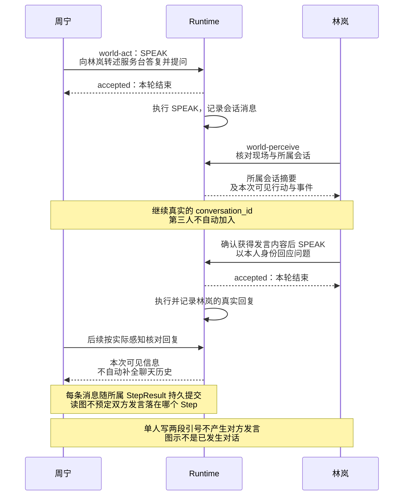
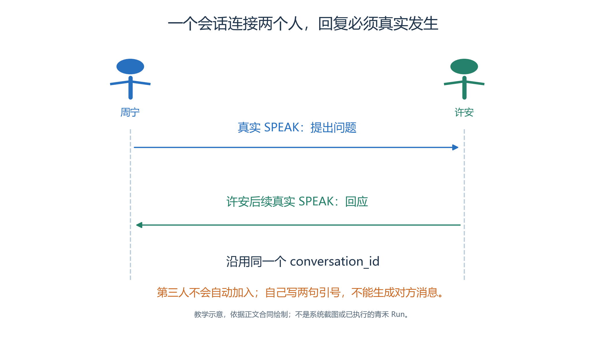
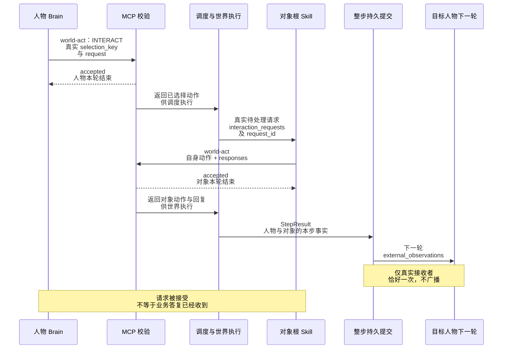
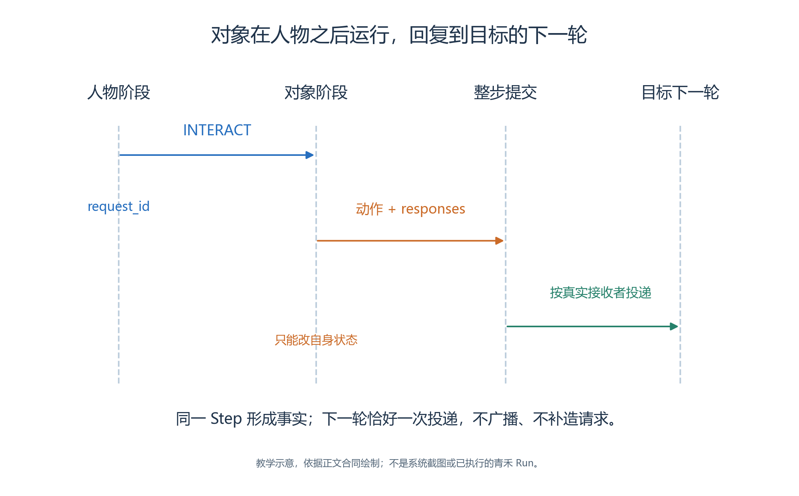
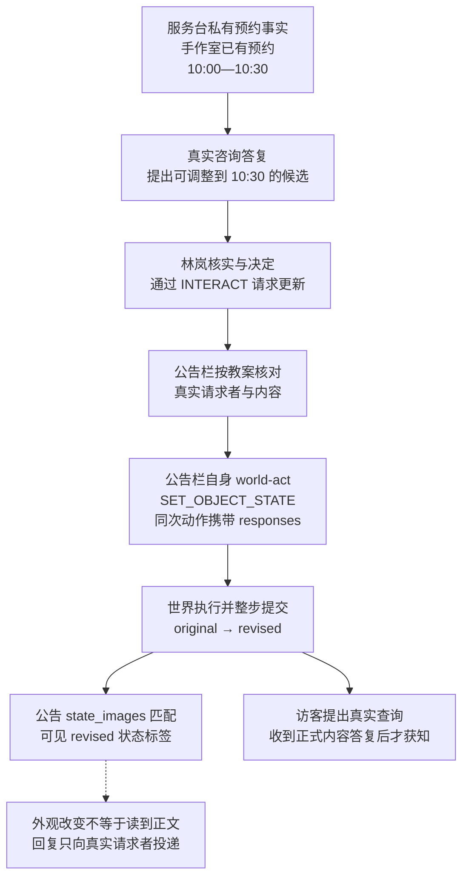
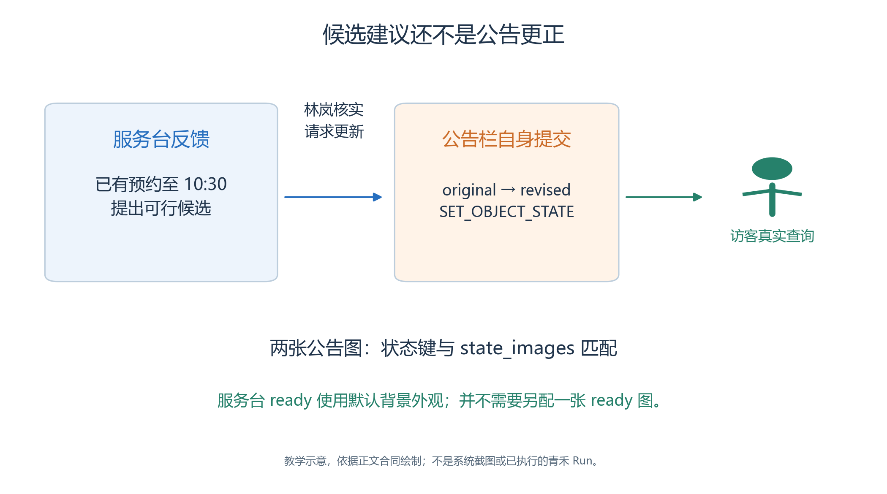

# 3.7 对话与对象 Skill：让信息通过真实交互传播

青禾案例最有价值的部分，不是四个人最终站在哪里，而是他们怎样逐渐获得不同的信息。

- 服务台掌握已有预约，林岚负责组织安排，公告栏保存当前公开通知，来访者则需要通过咨询或交谈更新认识。
- 只有信息沿着实际交互传播，我们才能解释行为变化。

本节分别介绍人与人对话、人与对象请求、对象自己的行动。三者都可以出现自然语言，却有不同的身份、时序和证据。

## 3.7.1 一次 SPEAK 连接两名 Agent

<!-- book-figure: 07-bilateral-speech -->

*图3.7-1　消息方向示意，不是已发生对话；每条 SPEAK 都需要真实发言者与接收者。*

当前图对应下文周宁向林岚转述服务台答复的例子：第二条 SPEAK 必须由林岚自己发出。下方原图仍保留转换前周宁与许安的通用问答示意，二者都不代表已发生会话。

会话内容何时可见要结合实际调度顺序，不套用对象回复固定到下一轮的规则；对外引用消息时，仍须核对它所属 Step 的已提交事实。

`active_conversations` 提供会话身份、计数和开放状态等摘要，不含完整消息。发言内容要另查实际返回的现场行动、事件与已提交会话事实，不能从会话存在直接推断对方已经理解。

**原图参考（转换前）**

Agent 使用 `world-act` 的 `SPEAK` 动作说话，提供 `participant_agent_keys` 和 `message`。当前实现要求恰好一个其他 Agent，因此“四个人开会”要由多轮双人消息组成，不能一次塞入三个收件人。

新会话可以省略 `conversation_id`；运行时建立或复用合适的会话。继续已有会话时，使用真实返回且属于这两名参与者的 ID，不自行编一个 UUID。需要结束时可以提交 `end_conversation: true`；不应为每一句回复都另开一个线程。[SimulationMCPServer._plan_action](../../../src/generative_agents/ga_runtime/capabilities/server.py)、[Game.record_conversation_message](../../../src/generative_agents/ga_runtime/engine/world.py)

本案例规定角色先在感知结果中找到对方，再进行现场交谈。这是教案的空间行为要求。读者仍须核对实际位置与消息记录，不能仅凭一条 `SPEAK` 就证明两人面对面站在一起。

例如周宁把服务台的答复告诉林岚时，应区分“服务台明确回复了什么”和“我建议怎么做”。

- 林岚收到建议，并不意味着公告栏已经修改；周宁说“我会去通知许安”，也不意味着许安已经收到。
- 后续需要另一条真实消息或对象交互来完成传播。

## 3.7.2 INTERACT 只负责发出请求

<!-- book-figure: 07-object-sequence -->

*图3.7-2　源码合同的阶段关系，纵向距离不是实测耗时；真实请求与回复随整步提交。*

先找两次 accepted，再找“整步持久提交”：MCP 返回的是已选动作，调度器与世界层随后执行。只有最右侧的下一轮反馈才能证明目标人物已收到对象答复，不能用第一次 accepted 代替。

**原图参考（转换前）**

与公告栏或服务台互动时，先从 `world-perceive.game_objects[].interactions` 取出实际 `selection_key`。这个选择键对应附近可用的交互项，不能根据名字自行拼写。`INTERACT` 同时提供 `request`，例如请求查询当前公告正文。

读图时核对三个载体：

| 阶段 | 真实载体 |
| --- | --- |
| 人物提出请求 | `INTERACT` 经世界提交形成带身份的请求 |
| 对象处理请求 | 本 Step 对象轮次通过 `world-act.responses` 提交答复 |
| 目标人物收到 | 下一轮 `external_observations` 中的真实答复 |

收到工具层面的接受信息，不等于已经收到对象的业务答复。Skill 若在发请求的同一轮直接总结“服务台确认了新的时间”，就跨过了尚未发生的处理过程。

对象请求带有运行时提供的 `request_id`、`agent_key`、`agent_name`、请求内容和观察时间。

- 对象回复只能引用自己当前待处理的真实请求 ID，格式为 `{"request_id": "实际请求ID", "message": "答复正文"}`。
- 答复必须通过本次 `world-act.responses` 提交，不能只写在对象的最终总结里。
- 重复、伪造或不属于该对象的请求 ID 会被拒绝。[GameObjectInteractionSystem.interact_selected](../../../src/generative_agents/ga_runtime/engine/objects.py)

## 3.7.3 对象也有独立的轮次

绑定根 Skill 后，公告栏与服务台每 Step 都会自主运行，即使当前没有人提问。它们可以按需感知、检索自己的记忆、处理待办请求，并提交一次动作。固定设施不移动，其动作只有 `ACT`、`WAIT` 和 `SET_OBJECT_STATE`。

对象的 `IterationContext.variables` 包含自己的 `object_state`、`last_action`、`interaction_requests`、待处理数量和近期幂等活动键。

- 需要回复时，把真实请求 ID 和答复放进本次动作的 `responses`。
- 同一个动作可以既改变自身状态，又答复相关请求；在最终文本里写“已回复”不会发送任何消息。

对象也可以观察本步已经执行的运动事实。

- `world-perceive` 返回 `observed_actions` 时，只提供视野内的实际路径片段，并带对应事实 ID；它不会把视野外的坐标或角色计划走的路线当作已观察事实。
- 对象针对已观察人物行动时，可填写 `target_agent_key` 与 `evidence_ids`；证据必须来自真实感知返回，且属于所选人物。
- 本案例不要求每轮凑齐这些字段，没有观察依据时就不填写。[ObjectMCPServer](../../../src/generative_agents/ga_runtime/skills/objects.py)

需要防止重复的一次性对象活动，可以使用稳定的 `idempotency_key`。例如“接受某个真实更新请求”应与该请求的真实身份关联；不能每次都随机换键来规避重复校验，也不能让所有查询共用同一键导致正常后续咨询被误拒绝。

## 3.7.4 设计公告更新这一段情节

<!-- book-figure: 07-notice-state-change -->

*图3.7-3　教学情节的证据门槛，候选建议、正式更新和访客获知不能合并成一件事。*

从候选到正式更正，要经过林岚的真实更新请求和公告栏自身提交；提交后的两个分支也不同，看到 revised 不等于读到通知正文。服务台 ready 沿用默认背景，是另一项外观配置，见 3.7.5。

**原图参考（转换前）**

本章教案给服务台一条私有背景事实：手作室在 `2026-10-17T10:00:00+08:00` 至 `2026-10-17T10:30:00+08:00` 有既有预约。原公告仍写手作活动十点开始，因此组织者需要先核实，再决定是否调整为十点半至十一点半。

这条私有事实只写入服务台材料，不放入四人共用的 Brain。

- 否则每个角色从第一轮就会通过系统提示知道答案，实验虽然可能顺利完成，却无法演示信息传播。
- 活动计划中的二十四人、十人和十六人是计划元数据；当前实验只有四名 Agent，不能据此声称有几十人已经到场。

公告栏初始公开状态为 `original`，更新后为 `revised`。

- 通知正文等字段由公告栏自己读取。
- 林岚以真实咨询结果为依据，通过 `INTERACT` 请求更新；公告栏按教案检查请求来源与内容，调用 `SET_OBJECT_STATE` 修改自己的状态，并在同一次动作中回复。
- 其他人随后看到 `revised`，仍需询问才知道正文。

公告栏 SOP 使用运行时注入的请求者身份识别本案例组织者，不相信请求文本里“我是林岚”的自称。

- 这是教学行为规则；它没有把一套通用的业务授权系统加入内核。
- 对象只改变自身，不能顺便改另一个人的记忆或手作室状态。

## 3.7.5 在地图页面配置对象

在地图编辑器选中四层结构中的公告栏，打开“对象 Skill”，绑定 `qinghe-notice-board`；服务台绑定 `qinghe-helpdesk`。

- 展开“感知与交互参数”，填写感知范围、注意力带宽、交互说明、交互距离和默认请求；在“初始状态”编辑 JSON 对象。
- 对应参数以本章案例材料为准，保存后重开核对。

公告栏的两张状态图片分别通过 `state_images` 对应 `original` 与 `revised`。

- 服务台的 `ready` 是公开状态标签，画面沿用背景中的默认外观，不需要另配一张 `ready` 状态图片。
- 状态标签和换图映射是两项相关但不同的配置。
- 编辑器中手动切图只能验证素材映射，运行中仍需找到真实 `SET_OBJECT_STATE` 与回放状态变化，才能证明 Skill 完成了更新。
- 对象绑定和初始状态入口见 [地图编辑器](../../../src/generative_agents/adapters/web/static/resources/map-editor-v2.js)。

## 3.7.6 核对消息是否真正到达

验收时沿请求链检查：谁在什么位置发出请求；对象处理了哪个请求 ID；答复是否进入指定 Agent 的下一轮；其他人有没有在未获知消息前就提前改变认识。

- 查看人物会话时，打开“结果 → Agent”，选择人物，再切换其结构化内容中的“对话”。
- “对话”页提供会话摘要；完整消息、真实参与者和消息顺序还需结合事实记录与回放核对。
- 对象答复则要结合事件和该角色收到的外部观察，不能把两者混成同一个聊天线程。[当前 Agent 对话面板实现：renderAgentConversationSection](../../../src/generative_agents/adapters/web/static/shell/console-api.js)

还要确认至少有一段真正的一来一回：一名 Agent 提问，另一名 Agent 在自己的行动中回答。

- 单个角色在消息里写下两个人的引号台词，只形成该角色的一条发言，不能证明对方参与了会话。
- 这个检查能发现一种常见偏差：模型写出了完整场景，却没有通过工具让其他参与者实际行动。

建议的四十八步只观察到十点半调整之后的开始阶段。

- 它足以作为检验信息获取、公告变化和后续行动的时间窗口设计，但不保证模型一定完成这些环节，也不覆盖十一点半的手作结束。
- 结果记录应写“本窗口内观察到什么”，不要用剧本计划填补尚未发生的部分。

练习：如果许安看到了公告栏的 `revised`，却没有询问内容，应当允许他知道什么？

- 参考判断是：他知道外观状态发生变化，可以决定去查询；他尚不能据此准确说出新的开始时间。
- 再设计一个错误请求：来访者自称组织者要求更新公告。
- 判断应依据真实请求者身份，并保留拒绝答复，而非把预期拒绝当作系统故障。

---

[上一节：3.6 记忆与跨步进度](06-memory-and-progress.md) · [返回本章目录](README.md) · [下一节：3.8 实验生命周期](08-experiment-lifecycle.md)
