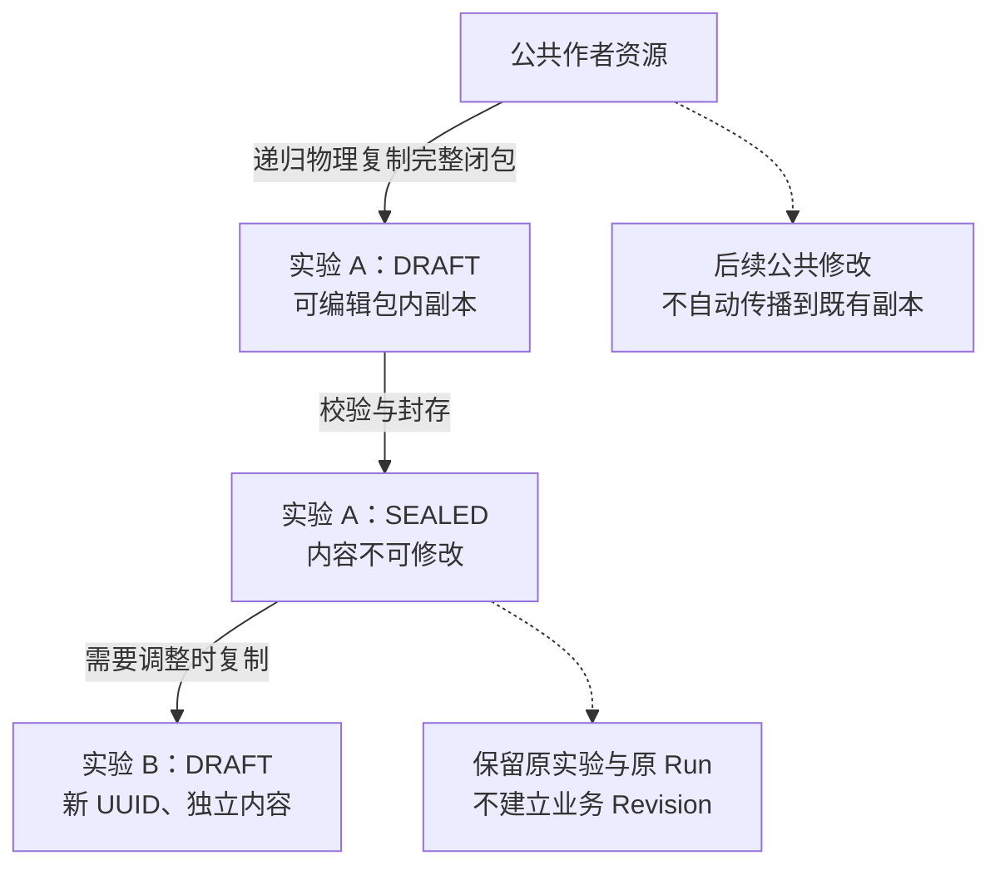
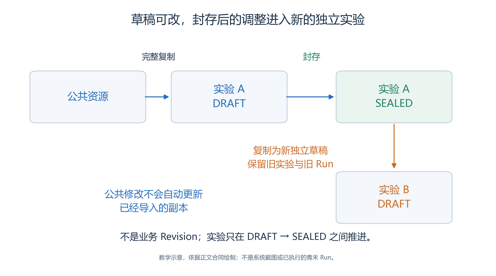
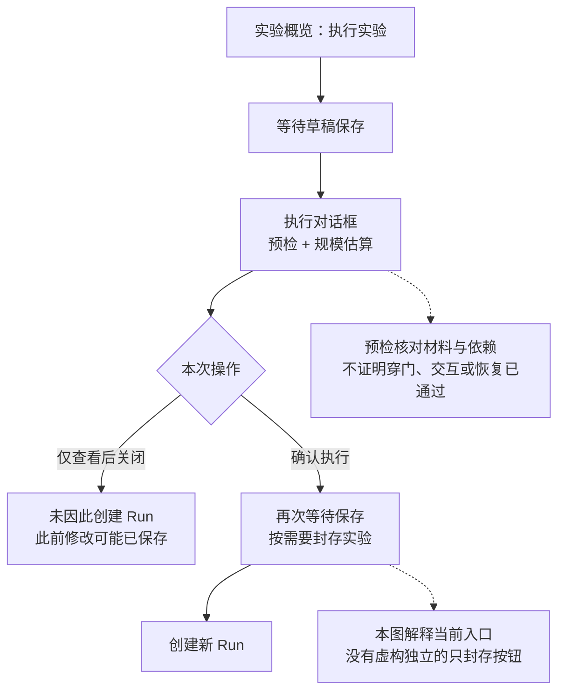
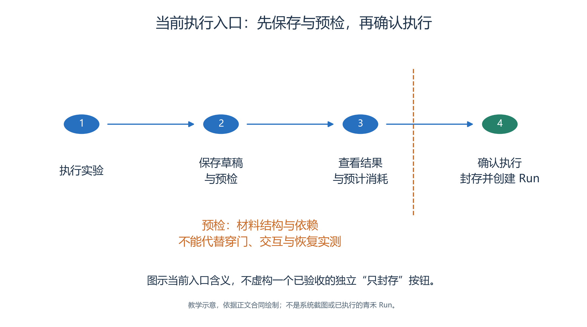

# 3.8 草稿、副本、预检与封存

前面几节分别准备了地图、人物和行为。

- 现在要把它们组合成一份边界清楚的实验：这一次采用哪张地图、哪些角色、哪一套 Skill 和模型配置？
- 哪些内容还能修改，哪些已经成为某次运行的依据？
- 实验生命周期回答的正是这些问题。

本节给出青禾案例的操作路径与检查方法。新案例仍处于资料准备阶段，以下步骤不能视为已经创建或封存的记录；实际操作后，应把实验身份、保存结果与检查证据补入案例材料。

## 3.8.1 创建的结果是一份独立材料

<!-- book-figure: 08-experiment-copy-seal -->

*图3.8-1　A、B 是说明标签，不是实验 UUID；新草稿独立，不建立业务 Revision。*

实验 A 从草稿到封存仍是同一身份；需要改内容时，向下复制得到的是独立实验 B。公共资源的虚线只提醒后续修改不传播，不能把它读成持续同步关系。

**原图参考（转换前）**

从实验中心点击“＋新建实验”，向导分三步。

- 第一步“定义实验”填写名称、目标、负责人和标签。
- 青禾的目标可以写成：“观察四位角色如何根据现场公告与服务台回复调整安排，核对实际移动、记忆更新和活动开始。”
- 这比“运行成功”更有用，因为它明确了稍后要查的事实。

第二步“选择资源”显式选择聊天模型、Embedding 模型、大脑 Skill、地图，以及一个或多个 Crowd。

- 本案例选入前面准备的四人群体。
- 创建前逐项核对所选资源，不用同名条目或无关旧地图充当本案例材料。
- 第三步“确认创建”检查名称、资源和成员摘要，然后创建草稿。[向导页面](../../../src/generative_agents/adapters/web/static/shell/experiment-console.html)

此时发生的不是记录几个公共资源链接，而是把选中资源及其依赖复制进实验：地图连同图像、语义与对象 Skill，Brain 连同子 Skill、脚本和模板，人物连同自身资料和图片，模型连同配置内容。

- Crowd 会展开为独立人物；核对四个实际 Agent 身份，并区分重复公共 ID 去重与 agent_key 冲突拒绝。
- 若摘要数量有疑问，应进入草稿核对实际成员，不能用“名字看起来相同”解释合并结果。[创建与复制实现](../../../src/generative_agents/ga_studio/experiments/workspace.py)

由此可以理解一个常见现象：后来在公共 Agent 中修改了许安的目标，已经创建的青禾实验仍保留原目标。

- 这是副本隔离的结果。
- 要改变本次实验，应进入它自己的智能体页面编辑；要让以后的新实验采用新目标，才修改公共作者资源。
- 两者可以相同，也可以故意不同。

## 3.8.2 草稿装配完成后，重新打开核对

创建成功首先得到 `DRAFT`，表示材料可编辑，并不表示空间与行为已经达到实验目的。

- 系统可以在创建时分配初始位置，但作者仍须按照场景重新装配。
- 依照 [3.3 节](03-map-and-space.md)的空间选择器，为林岚选择公共大厅、周宁选择手作室、陈晨选择交流室、许安选择阅读室，保存实际出生坐标、地址和初始已知空间。
- 不要把公共 Agent 资料中没有坐标误判为配置遗漏：坐标属于这一次实验。

在实验内核对每个对象的根 Skill、人物 Brain 及其依赖，确认已复制的内容正是准备运行的文本。

- 对时间参数，本案例采用 `2026-10-17 09:50`、`Asia/Shanghai`、每步 1 分钟、共 48 步；其他运行参数按 [3.9 节](09-running-and-cost.md)核对。
- 这段时间用于观察信息调整、抵达与活动开始，不能据此宣称一小时活动已经结束。

编辑后点击当前页面对应的保存操作，等待保存结果，再离开并从同一实验重开。

- 核对的是服务器保存后的副本，而非尚未提交的输入框。
- 保存图片或地图后，同样要重看素材、对象状态图和人物比例；一条“保存成功”提示不能替代这些检查。

实验模型页有明确的“复制所选配置到实验”操作，可将选择的公共模型配置复制进当前草稿。

- 它并不建立以后自动更新的关系。
- 不能根据模型页有复制按钮，推断所有资源页都有完全相同的替换入口。
- 需要换成另一张公共地图时，可以通过新建独立实验重新选择；无论使用什么已支持的显式导入路径，换图后都须重做出生点、地址、已知空间及对象绑定检查，旧坐标不能自动沿用含义。[范围与保存控制](../../../src/generative_agents/adapters/web/static/resources/resource-scope.js)

## 3.8.3 预检检查材料，观察检查行为

在实验概览点击“执行实验”，当前实现会先等待草稿保存，再打开执行对话框，取得预检和规模估算。

- 打开对话框与点击“确认执行”是不同阶段，查看预检本身不证明已创建 Run。
- 若只想查看预检，可以关闭对话框，但要知道此前的草稿修改可能已经被自动保存。[执行前检查流程](../../../src/generative_agents/adapters/web/static/shell/console-api.js)

应在这个边界检查四类材料。

- 第一类是空间：四层层级、节点范围、坐标与地址能否对应。
- 第二类是附件：地图、人物图片、状态图、Skill 脚本和模板是否齐全。
- 第三类是装配：人物出生位置、对象交互配置、唯一 Brain、所需模型配置是否完整。
- 第四类是 Skill 闭包：依赖是否齐全，包内 `skill_key` 是否冲突，是否存在非法依赖环。
- 同 key 同内容可以合并，同 key 异内容必须处理冲突，不能按显示名称悄悄覆盖。

这里需要区分校验合同与当前页面展示粒度。

- 当前预检接口调用整个实验包校验；失败时返回 `PACKAGE_INVALID` 及错误文字，统计为一个阻断项，成功则返回一个通过项。
- 因此，不能把上面四类校验合同写成当前页面必然显示的四条独立统计项。
- 若出现阻断，记录完整错误，回到对应草稿资源修正、保存，再重新检查。[预检接口](../../../src/generative_agents/adapters/web/routes/experiments.py)

预检也不能证明角色已经穿过门、看到公告或收到回复。

- 路径检查只能证明指定地图上两个点的可达性；角色是否实际抵达，要读运行中的 MOVE 事实。
- Skill 文本写着“更新公告”，也不能代替真实 `SET_OBJECT_STATE` 及其回放。
- 把这些行为证据留给后续运行验收，才不会把“可运行”误当成“目标已达成”。

## 3.8.4 确认执行跨过封存边界

<!-- book-figure: 08-preflight-execution -->

*图3.8-2　依据当前入口解释封存边界，不表示本案例已经点击执行或预检通过。*

在“本次操作”处分两路：关闭对话框不会因此创建 Run，但此前修改可能已保存；确认执行才继续封存与创建。预检分支的结论只覆盖材料与依赖，尚不覆盖人物穿门。

**原图参考（转换前）**

实验本身只有两个状态：`DRAFT → SEALED`。封存使这份实验内容不可再改，便于解释某次运行到底使用了什么材料。完成、失败、暂停则属于 Run，与实验是否封存是两条不同的信息。

当前 UI 将封存与启动连在一起：在草稿的执行对话框点击“确认执行”后，程序先等待保存、封存实验，再创建 Run。

- 本次没有核验独立的“只封存”前端按钮，不能将其写成已完成的点击流程。
- 准备正式运行前，应确认当前实验身份、人物数、地图、时间参数和预检结果；真正点击后，再按 [3.9 节](09-running-and-cost.md)观察新 Run 的状态。[封存与创建 Run 的顺序](../../../src/generative_agents/adapters/web/static/shell/console-api.js)

如果已经封存，需要修改周宁的 SOP 或公告内容，应使用“复制实验”产生新的独立草稿，再修改副本。

- 复制会生成新的实验 UUID，而不是给原实验增加一个 Revision。
- 原实验及其已有运行仍用于说明原来的条件，新副本用于说明新的条件。
- 对一个已封存实验再次执行，则是在相同实验内容下创建另一个 Run，不等于复制并修改实验。

操作过程中若出现“已创建仿真，但状态刷新失败”一类反馈，应重新进入该仿真核对，不能因为界面尚未刷新就连续再次点击执行。操作提示说明一次请求的结果，Run 状态才说明仿真当前走到了哪里。

## 3.8.5 在练习副本中理解归档、恢复和删除

实验中心每页固定显示 5 条，保留负责人、标签、分页和归档范围选择。

- 可以在当前、已归档及全部范围间切换，归档后从对应范围恢复。
- 这里的归档是展示管理，既不把草稿变成封存实验，也不把某个 Run 变成完成状态。[列表与归档接口](../../../src/generative_agents/adapters/web/routes/experiments.py)

练习时先复制青禾实验，将新名称标为练习用途，记录原件与副本不同的实验身份。

- 只在练习副本修改一个角色目标，重开两份实验，比较目标文字，确认隔离。
- 随后归档练习副本，在“已归档”中找到它，再恢复并确认内容仍在。
- 最后仅对确定不需保留的练习副本执行删除；不要以删除正式材料来演示独立性。

这组练习应分别记录“复制得到哪个新身份”“哪份内容改变”“哪条记录进入归档”“删除的是哪份材料”。

- 如果页面徽标、所选实验和操作提示互相冲突，先查清实际对象与状态，不继续用更多操作覆盖证据。
- 完成这些核对，才有一份可以进入运行观察的、边界明确的实验材料。

---

[上一节：对话与对象](07-conversation-and-objects.md) · [本章目录](README.md) · [下一节：启动、观察与估算](09-running-and-cost.md)
