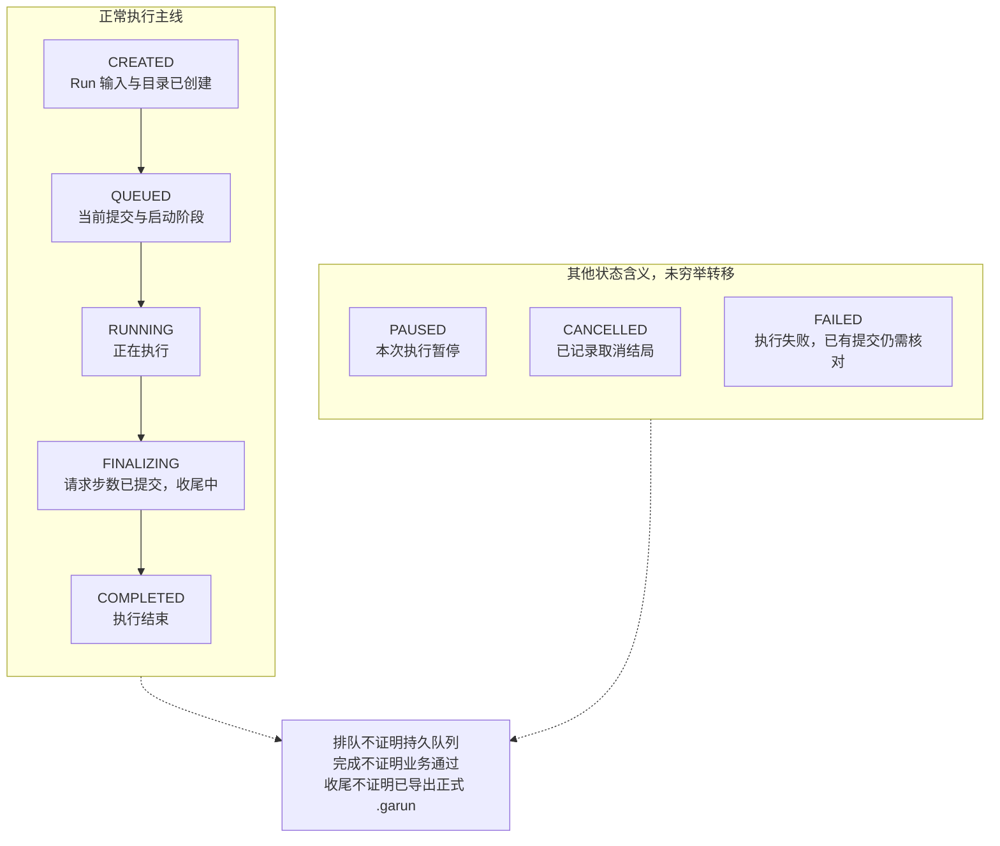
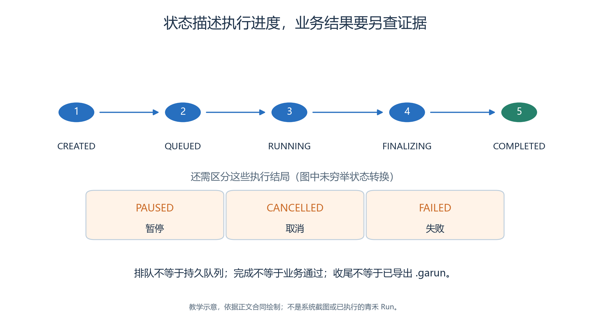
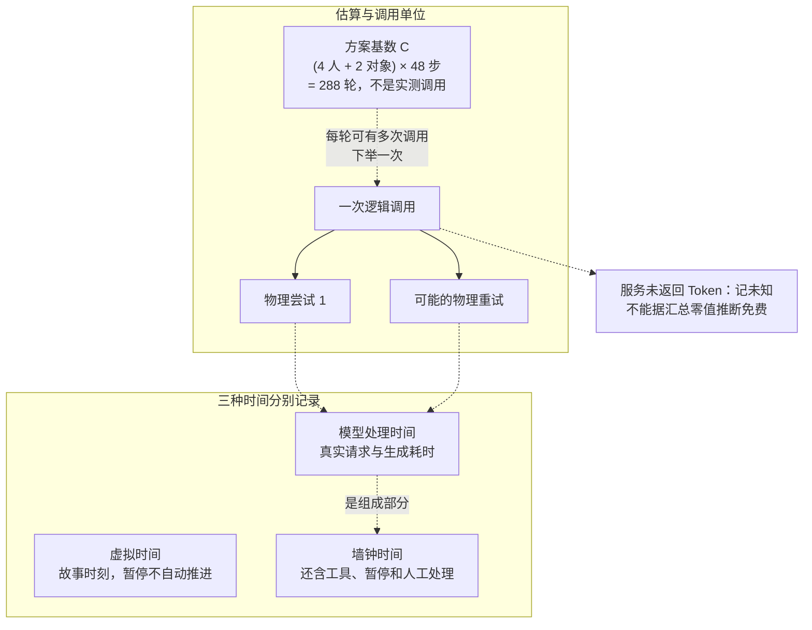
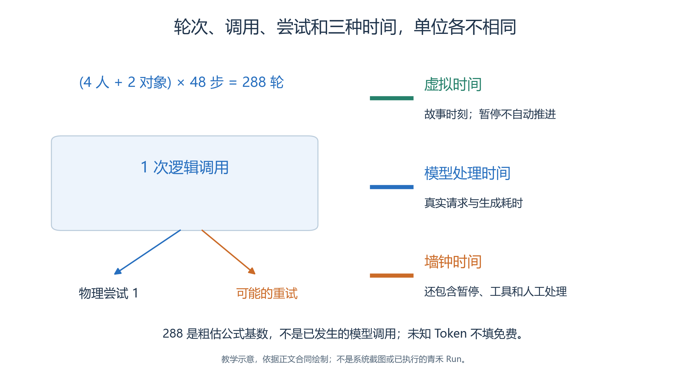

# 3.9 启动、观察与估算：读懂一次仿真的进度

青禾开放日的资源和规则准备好以后，我们希望观察一条完整的信息链：林岚从服务台得知手作室的已有预约，推动公告栏更正通知；周宁协助解释，陈晨和许安依据各自真正获得的信息行动。

- 点击执行以后，界面上的进度条只回答其中一个问题：系统提交了多少步。
- 它没有自动回答通知是否有效、访客是否理解，或模型用了多少成本。

本节介绍现有源码支持的启动与观察路径，以及新案例应记录的证据。青禾案例尚未通过本轮浏览器创建和运行，因此下面的数值计算是方案推算，不是运行成绩。

## 3.9.1 启动时固定了哪些输入

在实验中点击**执行实验**，检查确认窗口中的预检结果、执行参数和预计消耗，再点击**确认执行**。

- 前端会在需要时先封存草稿，再创建新的 Run。
- 创建成功后应重新读取所选 Run 的状态，确认实验和 Run 的身份；“已创建”提示不能代替运行状态。[启动交互](../../../src/generative_agents/adapters/web/static/shell/console-api.js)

Run 创建时把实验完整复制到自己的 `experiment/` 中，并保存内嵌实验的 ID 和内容哈希。

- 后续运行读取这个副本。
- 此时修改公共公告栏 Skill，不会改变已经启动的青禾 Run；若要比较新方案，应在独立实验中完成修改再运行。[Run 创建服务](../../../src/generative_agents/ga_runtime/lifecycle/service.py)

记录表至少应包含实验 ID、Run ID、实际模型标识、Brain 与对象 Skill 的内容、起始虚拟时间、步长、请求步数和启动时间。ID 由系统实际产生，不能用书中的名称或示意编号冒充。

## 3.9.2 八种状态分别说明什么

<a id="figure-09-run-states"></a>
<!-- book-figure: 09-run-states -->


*图3.9-1　展示正常主线及其他状态含义，不是完整状态转移图，也不是一次运行记录。*

主线最后两个节点要分开读：FINALIZING 仍在收尾，COMPLETED 才表示执行结束。旁边的暂停、取消和失败仅列含义，图没有用箭头承诺所有状态都能彼此切换。

**原图参考（转换前）**



| 状态 | 可以据此判断什么 | 还不能据此判断什么 |
| --- | --- | --- |
| `CREATED` | Run 目录及输入已创建 | 工作进程已经执行 |
| `QUEUED` | 已进入当前提交和启动阶段 | 有一个持久化队列会无限等待资源 |
| `RUNNING` | 正在执行 | 当前计算中的 Step 已提交 |
| `FINALIZING` | 请求步数已提交，正在收尾 | 报告已完成、正式 `.garun` 已导出 |
| `PAUSED` | 本次执行暂停 | 新方案已经替换进 Run |
| `CANCELLED` | 本次 Run 已记录取消结局 | 取消前没有消耗或已提交事实 |
| `COMPLETED` | 请求的执行过程结束 | 业务指标全部通过 |
| `FAILED` | 执行出现失败 | 所有已有提交都不可用 |

这些状态由协议明确定义。当前执行器在最后一步后进入 `FINALIZING`，生成质量报告后再写 `COMPLETED`；正式 Run 归档需要另行封存。[状态定义](../../../src/generative_agents/ga_protocol/schemas/manifests.py)、[执行器](../../../src/generative_agents/ga_runtime/lifecycle/executor.py)

当前本机监督器使用运行槽限制并发，槽位满时直接拒绝本次提交；获得槽位后才进入 `QUEUED` 并启动子进程。因此，不能把“排队中”扩写为已经实现了可跨重启恢复的持久化任务队列。[本机监督器](../../../src/generative_agents/ga_runtime/supervision/processes.py)

## 3.9.3 先把观察窗口算清楚

本章建议从 `2026-10-17T09:50:00+08:00` 开始，步长一分钟，即六十秒，先设计四十八步的观察窗口。这是案例参数，实际执行前仍需结合预算确认。

Scheduler 的第一个 Step 使用起始时间，后续逐步推进。因此：

```text
第 k 步虚拟时间 = 起始时间 + (k − 1) × 步长
Step 1  = 09:50
Step 11 = 10:00
Step 41 = 10:30
Step 48 = 10:37
```

这个窗口可以观察原定十点开始的手作如何被更正到十点半，以及许安是否在更正后到达并开始活动；它不能证明十一点半的手作活动已经完整结束。

- 若研究问题要求观察活动结束，应另行设计足够长的实验，而不是把“已经开始”记成“已经完成”。
- 时间推进依据见[Scheduler](../../../src/generative_agents/ga_runtime/engine/scheduler.py)。

还要区分三种时间：虚拟时间表示故事中的时刻；模型耗时表示请求经历的真实时间；墙钟时间包含操作、暂停和调试等待。暂停二十分钟不应让青禾的虚拟活动自动迟到二十分钟。

## 3.9.4 在页面中观察什么

进入当前 Run 的结果工作区，依次查看**仿真回放、Agent、仿真诊断、行为质量、结果与导出**。

- 运行参数位于实验概览的“时间与运行参数”，模型配置从实验自己的模型入口查看；前端初始化会移除 HTML 中遗留的参数与模型结果页签，不能只据模板文字寻找按钮。
- 具体结果取决于 Run 已提交的事实。[页面初始化与结果交互](../../../src/generative_agents/adapters/web/static/shell/console-api.js)

在仿真诊断中，选择正确的 Attempt，查看日志、模型调用和检查点。

- 模型请求开始时已有 `PHYSICAL_START` 记录，结束时再补充结果。
- 某个 Step 停留较久，应先检查是否有正在执行的请求、连续错误或重试，再判断是模型慢、正常等待还是无进展。[模型网关](../../../src/generative_agents/ga_runtime/models/gateway.py)

查看 Trace 时记录参与者、Step、用途、模型、开始和结束时间、错误及调用参数。

- 若本次配置没有保存 Payload，页面应明确显示缺失；不能拿模型事后总结补成历史原始请求。
- Attempt 选择器提供定位入口，但当前日志下载读取的是 Run 的进程日志文件，分析时仍须核对实际记录的身份和时间范围。[诊断接口](../../../src/generative_agents/adapters/web/routes/results.py)

许安因手作室尚未开放而 `WAIT`，与反复查询同一信息却没有进展，是不同情况。

- 前者应有理由、截止时间及后续动作条件。
- 不能仅凭画面上的人物不移动判卡死，也不能仅凭日志不断滚动判定有业务进展。

## 3.9.5 当前估算究竟怎样计算

<a id="figure-09-calls-time-units"></a>
<!-- book-figure: 09-calls-time-units -->


*图3.9-2　288 为作者方案的粗估基数；示意重试不表示真实发生过请求或费用。*

288 的单位是参与者轮次；它连接“一次逻辑调用”的虚线只作单位展开，不能把二者一一对应。一次逻辑调用又可能发生物理重试，随后再用真实耗时和用量校准估算。

**原图参考（转换前）**



本案例只模拟四名人物与两个绑定 Skill 的对象。第二章的二十四人、十人、十六人是活动需求元数据，不代表系统已经创建五十名 Agent。

当前估算接口使用 `C = (Agent 数 + Skill 对象数) × Step 数`。若四人、两对象、四十八步均启用，基数为 `288`；源码据此给出模型调用 `C–3C`、Token `500C–3000C`、墙钟秒数 `2C–30C` 的范围。[估算实现](../../../src/generative_agents/adapters/web/routes/experiments.py)

代入后，模型调用粗估为 288–864 次，Token 为 144,000–864,000，墙钟约 9.6–144 分钟。

- 这些数值只是当前固定公式的输出。
- 公式尚未逐条展开实际子 Skill 调用链，也没有依据读者所用模型的吞吐进行校准；其上下界不能当作费用承诺或完成时间保证。

更有用的后续估算，应从真实观察中得到每个 Agent 轮次、对象轮次的逻辑调用数，再加入物理重试、上下文长度和模型耗时。阅读长记忆、对象多轮回复与重复修复都可能增加消耗，但本节不会为了获得估算而要求正式运行前必须试跑固定的一至三步。

## 3.9.6 逻辑调用、物理尝试与费用

一次“让模型处理当前任务”是逻辑调用；因超时或格式错误重发请求，是同一调用下的物理尝试。

- 两者都要统计。
- 页面已有按用途显示逻辑调用、物理请求、重试与耗时的视图；正在执行的请求还应结合 Trace 查看。[用量汇总](../../../src/generative_agents/adapters/web/routes/results.py)

费用计算使用服务商实际计费规则和账单，区分输入、输出及适用的缓存等项目。

- 服务没有返回 Token 时，应记为未知；当前汇总中的零值可能来自缺少用量字段，不能自动解释成免费。
- 取消或失败也可能已经产生模型费用。

本节的交付应是一张真实运行观察表：每次观察标明 Run、Attempt、已提交 Step、当前状态和证据来源。把预计值、实际值与未提供的数据分栏，才能在下一次实验中改进预算，而不是用一个成功提示结束观察。

---

[上一节：实验生命周期](08-experiment-lifecycle.md) · [下一节：暂停、续跑与重跑](10-pause-resume-rerun.md) · [返回本章](README.md)
