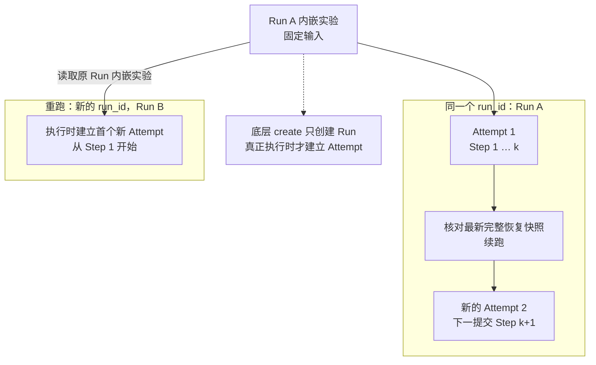
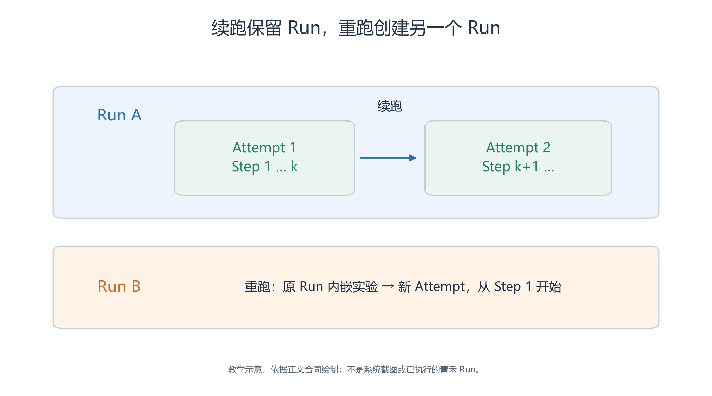
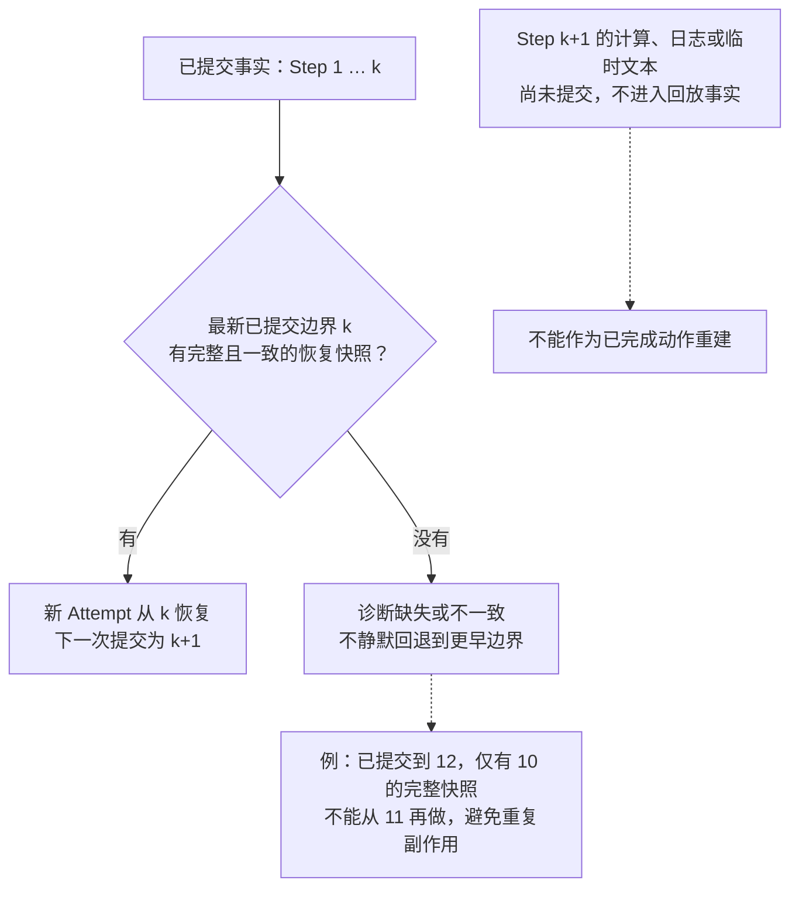
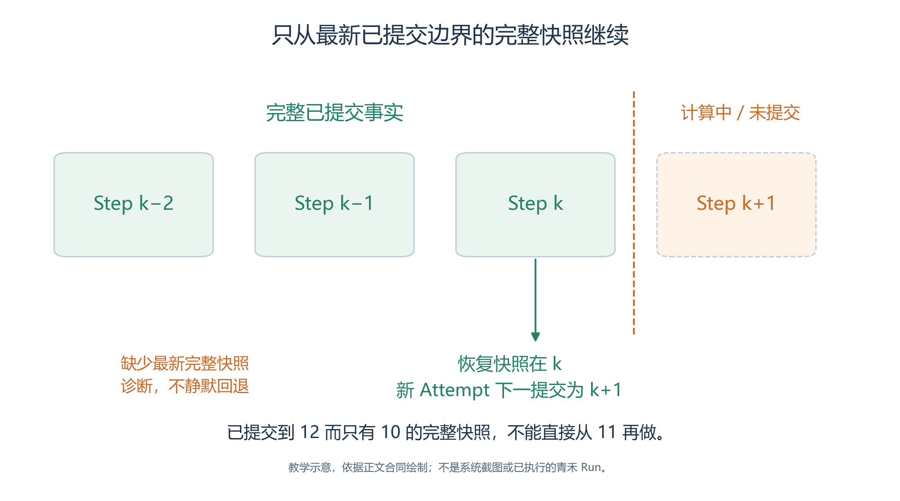
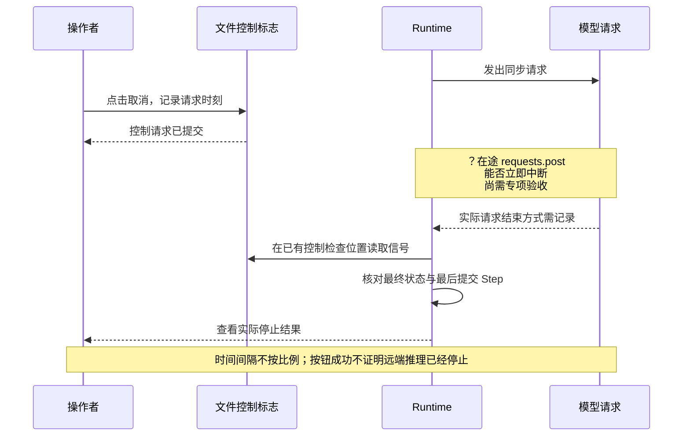
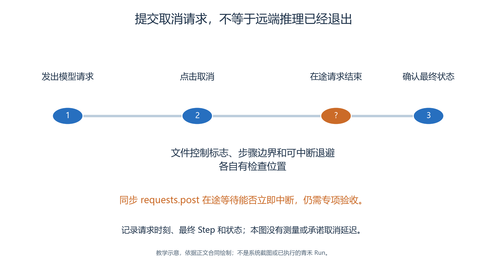

# 3.10 暂停、取消、续跑与重跑：让身份和边界保持清楚

青禾运行到公告更正前后时，我们可能想暂停检查，再继续观察访客反应；也可能想保留失败过程，重新运行一个对照。看起来都是“再运行一下”，实际上它们对应不同的数据身份与历史含义。

本节先说明现有文件协议和实现，再给出浏览器验收方法。这里没有已经生成的青禾 Run，也没有把代码阅读等同于暂停恢复实测。

## 3.10.1 Run 与 Attempt 为什么需要分开

<!-- book-figure: 10-run-attempt-identity -->

*图3.10-1　A、B、k 均为说明符号，不是实际身份；续跑与从头重跑不能互相代替验收。*

沿 Run A 框内的路线看续跑：run_id 保留，Attempt 改变，下一提交从 k+1 开始。跨到 Run B 的箭头则重新读取原 Run 的内嵌实验，从 Step 1 再执行。

**原图参考（转换前）**

Run 表示一段具有固定输入和请求步数的仿真。Attempt 表示实际执行这段仿真的一次尝试。暂停以后继续，属于同一个 Run 的新 Attempt；从头再做一次实验，则产生新的 Run。

| 操作 | 输入来源 | Run 身份 | Attempt 与 Step |
| --- | --- | --- | --- |
| 新跑 | 封存实验 | 新 `run_id` | 开始执行时建立首个 Attempt，从 Step 1 开始 |
| 暂停后续跑 | 本 Run 的内嵌实验和完整恢复快照 | 保持不变 | 新 `attempt_id`，从已提交边界的下一步开始 |
| 重跑 | 原 Run 内嵌实验 | 新 `run_id` | 新的首个 Attempt，从 Step 1 开始 |

底层 `create` 操作只创建 Run，还未必有 Attempt；真正进入执行器时才生成 Attempt。重跑可以记录 `origin_run_id`，用于说明来自哪次运行，但不能因此把两个 Run 当成一个历史。[生命周期服务](../../../src/generative_agents/ga_runtime/lifecycle/service.py)、[Attempt 建立](../../../src/generative_agents/ga_runtime/lifecycle/executor.py)

## 3.10.2 已提交边界比画面进度更重要

<!-- book-figure: 10-recovery-boundary -->

*图3.10-2　k+1 的未提交计算不进入回放事实；最新完整恢复边界缺失应诊断。*

菱形检查的是最新已提交边界 k，不是目录里随便一个较早快照。走“没有”分支时应留下诊断；不能把已完成的步骤重新执行来填补恢复材料缺口。

**原图参考（转换前）**

假设最后完整提交的是 Step `k`，模型已经开始计算 `k+1`。这时可能产生了一些日志和临时文本，但 Replay 的可见事实仍然只到 `k`。恢复时不能把这些文本当成已经提交的动作。

系统提交一帧及其独立校验记录，保存检查点或恢复快照，再推进可见状态。`checkpoints/` 用于按配置保留检查点，`recovery/` 支持精确边界恢复；恢复程序会核验 Run、Attempt、Step、虚拟时间、成员文件和帧哈希是否相符。[提交顺序](../../../src/generative_agents/ga_runtime/storage/commit.py)、[恢复快照核验](../../../src/generative_agents/ga_protocol/facts/recovery.py)

如果已经提交到 Step 12，却只有 Step 10 的完整快照，不能直接从 11 重新做起，否则可能重复此前已提交的活动、记忆和回复。当前恢复选择器要求存在最新已提交边界的完整快照；缺失时给出诊断，而不是静默回退到更早步骤。

## 3.10.3 暂停后的浏览器检查

在当前 Run 处于运行中时点击**暂停仿真**。

- 先把“暂停请求已提交”记录为控制请求，再等待所选 Run 的实际状态变为 `PAUSED`。
- 前端提示的安全步骤含义是：以一致的已提交边界收尾，而不是保留一幅无法恢复的半步画面。

随后进入**仿真诊断 → 检查点**，核对最新 Step、Attempt、虚拟时间、Hash、校验结果和恢复说明。

- 展开详情，检查人物坐标、当前动作、剩余路径、会话与存储内容。
- 当前页面有具体检查点详情和预览入口，不能只保存“共有几个检查点”的截图。[检查点视图](../../../src/generative_agents/adapters/web/static/shell/console-api.js)

青禾可以选择一个适合观察的暂停时机，例如公告栏状态已经更新、许安尚未完成后续行动。

- 不要为了让剧情好看而把动作绑定到固定 Step；暂停后按实际事实判断信息处于哪一阶段。
- 记录此时 `board` 的状态、相关请求 ID，以及哪位参与者已经得到回复。

## 3.10.4 继续执行时验证四件事

符合恢复条件时，页面显示**继续执行 · Step …**，检查点详情也会给出恢复操作。

- 确认窗口应指向当前已提交边界及当前 Attempt。
- 后端同时核对这两个条件，避免用户打开旧确认窗口后重复执行已经提交的步骤。[恢复接口](../../../src/generative_agents/adapters/web/routes/runs.py)

继续后依次检查：

1. Run ID 与暂停前一致，Attempt ID 已改变。
2. 新 Attempt 的恢复边界为 `k`，第一条新提交为 `k+1`。
3. 虚拟时间只前进一个步长；暂停的墙钟间隔没有混入虚拟时间。
4. 移动、会话、对象状态和回复没有重复，也没有丢失。

例如，服务台在暂停前已回复林岚的预约查询，续跑后不应把同一个请求再次当成新请求处理；尚未投递给目标人物的回复，则应在正确的下一轮恰好投递一次。人物剩余路径应从检查点恢复，不能因为续跑便跳到目的地。[对象恢复相关测试](../../../tests/runtime/test_object_skill_runtime.py)

这些测试源文件说明仓库已有相应回归目标，本次编书没有重新执行它们，也没有以它们替代青禾的浏览器验收。验收记录仍需保存实际前后状态。

## 3.10.5 取消请求与“立即停止”需要分别验证

<!-- book-figure: 10-cancel-request-versus-stop -->

*图3.10-3　问号标出未验收的在途等待边界；节点间隔不承诺取消响应时长。*

“控制请求已提交”的回箭头早于最终状态核对，因此按钮成功只证明提出了取消。问号所在的模型等待阶段仍须专项验收，本图不能给出远端推理停止时刻。

**原图参考（转换前）**

取消用于结束当前运行意图，已经提交的历史仍然有分析价值。

- 按下取消后，至少记录请求时刻、请求时的已提交 Step、最终状态、最终提交边界，以及在途模型请求的结束方式。
- 不能把按钮返回成功当作远端推理已经终止的证明。

这里存在一个需要明确写出的实现边界。

- 当前取消路由写入文件标志；Scheduler 在步骤边界检查控制信号。
- 前端取消提示中“立即终止、丢弃未提交 Step”的文字，比这条已核查执行链能够证明的行为更强。[控制路由](../../../src/generative_agents/adapters/web/routes/runs.py)、[Scheduler](../../../src/generative_agents/ga_runtime/engine/scheduler.py)、[模型网关](../../../src/generative_agents/ga_runtime/models/gateway.py)、[可中断退避](../../../src/generative_agents/ga_runtime/models/retry.py)

项目合同要求取消能够中断模型等待，而不只是在 Step 结束检查。

- 此项应作为独立待验收问题保存；本章没有执行长请求取消实验，也没有修复产品。
- 后续正式验收若复现不符，应停止该项验收，记录页面、动作、时间和事实边界，等待针对问题的处理决定。

当前 Web 恢复接口允许 `PAUSED` 或 `FAILED`，并要求可恢复边界；已取消的 Run 不在这条页面恢复路径中。

- 因此，应在需要继续时优先按暂停流程设计，不把取消当成另一种暂停。
- 没有已提交检查点的 Step 0 情况，也不能预设页面一定提供继续按钮。[恢复条件](../../../src/generative_agents/adapters/web/context.py)

## 3.10.6 重跑与修改后再跑

重跑读取原 Run 的内嵌实验，创建新的 Run。

- 即使公共资源已经改变，重跑的输入仍以原 Run 中保存的内容为准。
- 当前后端和 CLI 具有独立重跑能力；本次源码核查没有确认专门的前端“重跑此 Run”按钮，不能虚构操作路径。[Run 重跑服务](../../../src/generative_agents/ga_runtime/lifecycle/service.py)

若希望修改林岚的 SOP，再比较公告更正速度，应通过 UI 复制封存实验、编辑新的独立草稿、重新预检和执行。它是修改条件后的新实验运行，不应标为原 Run 的续跑。

即使输入和随机种子相同，再次调用远程模型也未必产生完全相同的文本和行为。确定性回放重建已有事实，重跑则重新生成事实，两者的可复现要求不同。

本节完成时，应有一张身份对照表和连续帧证据：暂停前的 Run/Attempt/Step、恢复后的对应值、对象与会话检查结果、取消限制，以及是否完成真正的重跑。未执行的项目保留“待验收”，不使用示意 UUID 填满表格。

---

[上一节：启动、观察与估算](09-running-and-cost.md) · [下一节：回放事实与诊断](11-replay-and-diagnosis.md) · [返回本章](README.md)
