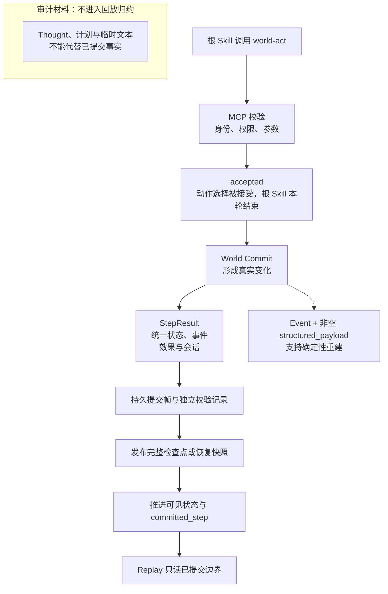
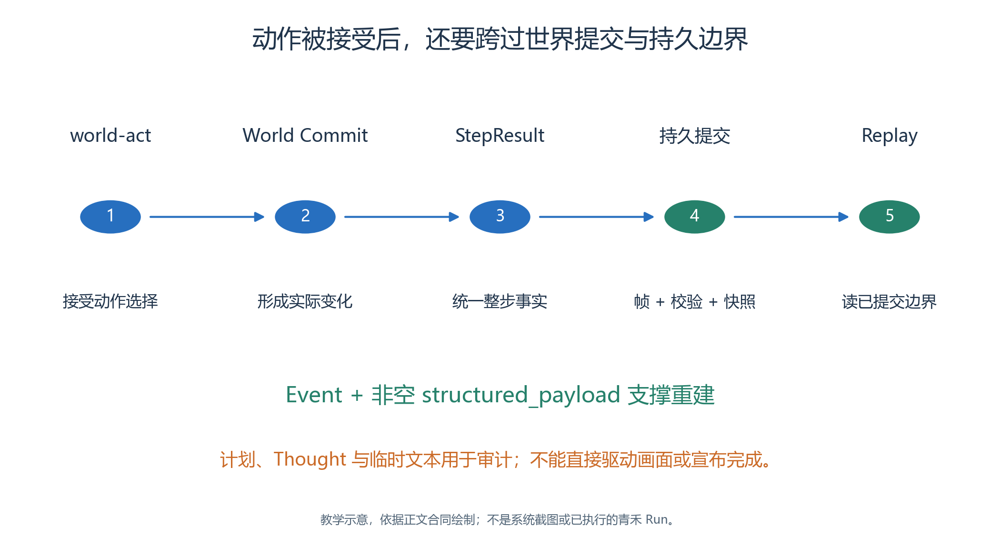
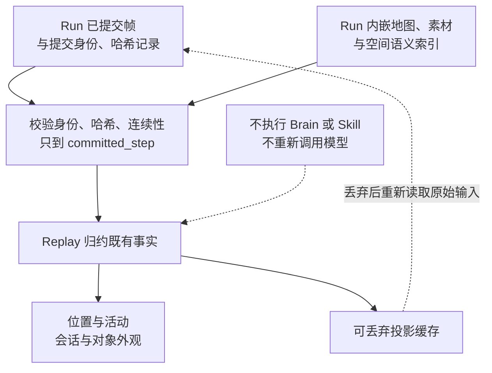
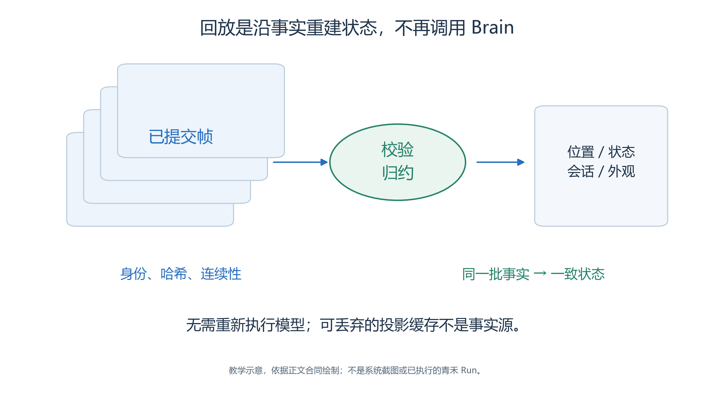
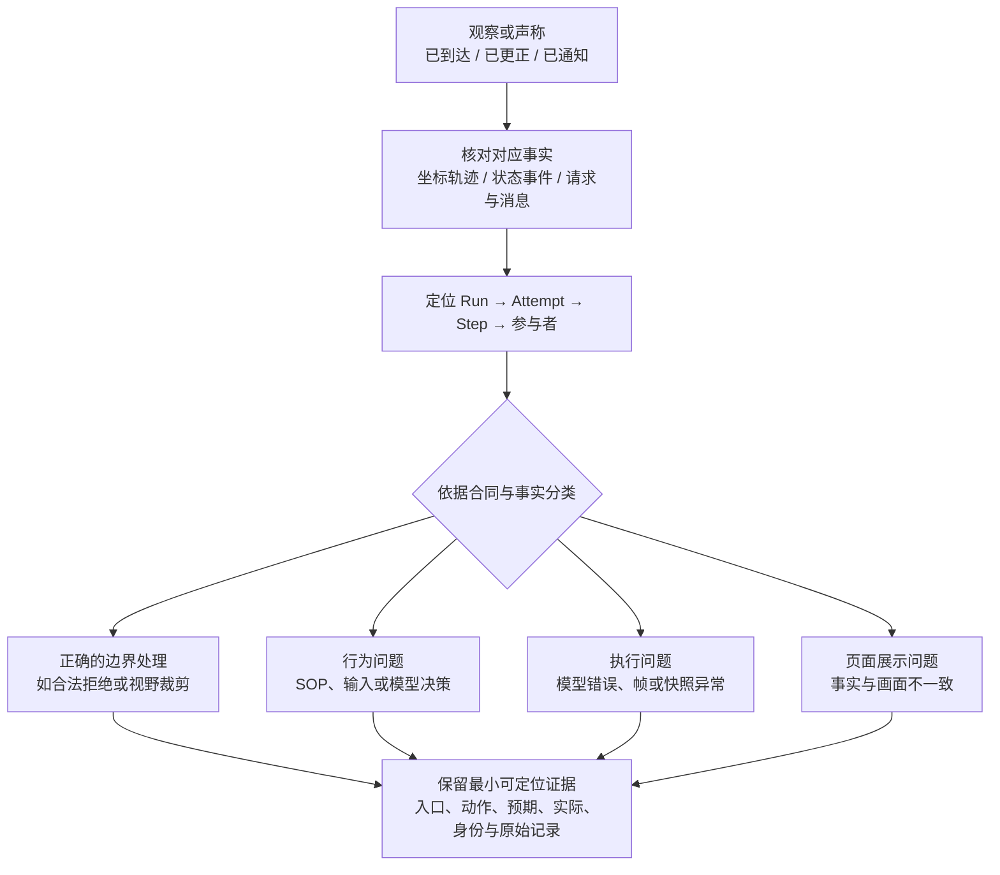
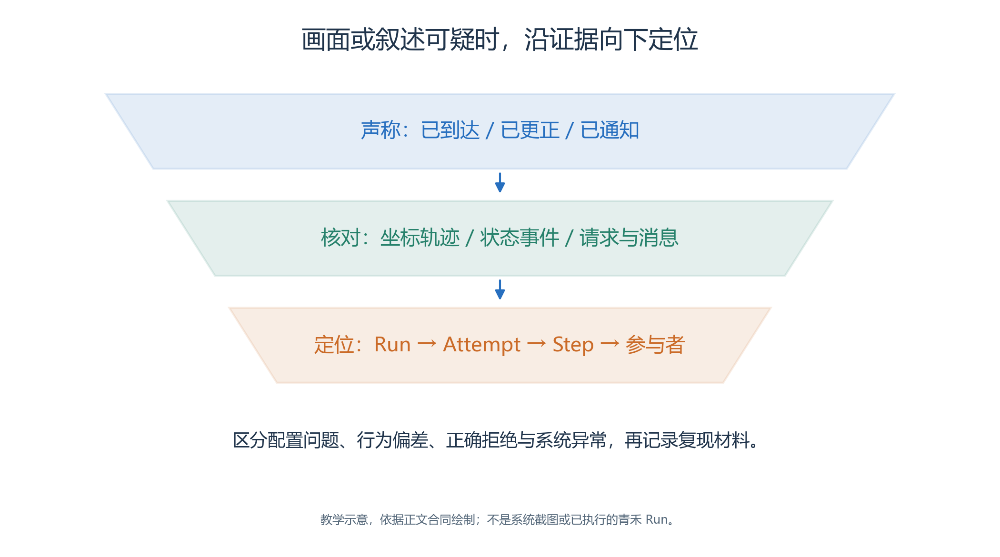

# 3.11 回放事实与失败诊断：从画面追到证据

在回放中看到许安站在手作室附近，可能意味着已经到达，也可能只是路过；看到公告栏旁写着“通知已更新”，也不一定代表对象状态真的变化。要解释系统行为，必须把画面、活动文字与已提交事实连接起来。

本节使用青禾的计划情节说明检查方法，不预填任何真实 Step、对话或状态变化。已有案例只作为注明日期与范围的历史证据。

## 3.11.1 一条动作怎样成为可回放事实

<!-- book-figure: 11-commit-chain -->

*图3.11-1　源码合同示意；accepted 与已持久提交分开，最终以 StepResult 和提交边界为准。*

沿主线从 accepted 向下追到 committed_step，才能确定回放边界。独立审计框没有连入 Replay：Thought 可以解释选择原因，实际位移和状态仍须由已提交事实证明。

**原图参考（转换前）**

模型先提出行动，MCP 校验身份、权限与参数，世界提交机制接受合法变化，随后把本步结果写入 StepResult。Replay 读取已提交帧，归约为位置、活动、对话和对象状态，再交给页面显示。

**StepResult 统一记录本步参与者状态、事件、效果和会话等内容。**图中的持久边界之后，才是正式回放可用的事实。

因此，模型输出“我已到达手作室”只是过程文本。能够证明位移的是提交事实中的实际坐标、路径和位置语义；能够证明状态改变的是相应对象事件及其结构化前后状态。[世界动作提交](../../../src/generative_agents/ga_runtime/engine/world.py)、[事实类型](../../../src/generative_agents/ga_protocol/schemas/facts.py)

## 3.11.2 Replay 为什么不重新思考

<!-- book-figure: 11-replay-reduction -->

*图3.11-2　Replay 读取既有帧和包内素材，不重新执行 Brain；图中没有实际帧内容。*

缓存的虚线返回原始输入，表示丢弃缓存后重新读取并校验同一批已提交事实。它没有绕到 Brain，也不授权把下一步的临时日志补入历史。

**原图参考（转换前）**

Replay 的任务是解释已经发生的记录。它读取 Run 内嵌的地图、素材和语义索引，校验身份、内嵌实验哈希、帧连续性与提交记录，不再次调用模型决定人物该做什么。[回放读取器](../../../src/generative_agents/ga_replay/reader.py)

设 `status.committed_step=k`，回放只能显示 1 到 `k` 的已提交事实。即使目录中出现了 `k+1` 的临时帧或日志，也不能将其加入正式时间线。`projection.json` 或缓存可以丢弃并重建，它们不能成为比原始提交更高的事实来源。

当前测试还专门覆盖一种重要情况：历史事实仍然完整，但其中的旧 Skill 执行字段不再满足当前执行校验，Replay 仍应只读既有事实，而新跑或恢复应按执行要求另行判断。这不等于允许读取不受支持的旧版包协议，也不意味着可以容忍内容损坏。[回放与执行隔离测试](../../../tests/foundation/test_replay_execution_isolation.py)

## 3.11.3 在页面中沿一条事件检查

选择正确 Run 后进入**仿真回放**，先记录可用 Step 上限和当前 Step。

- 先用时间线定位事件，再查看人物、会话或对象状态，始终核对所选 Run 与 Step。
- 时间线标记会区分检查点、对话、事件和 Attempt 边界。[回放交互](../../../src/generative_agents/adapters/web/static/shell/console-api.js)

不要只保留全场截图。

- 应分别检查：公告栏状态更新前后的近景，许安移动前后的坐标与四层地址，林岚与周宁的相关会话，以及对象回复到达目标人物的轮次。
- 地图概览用于解释空间关系，近景用于核对人物比例、脚底锚点、遮挡和状态图是否正确切换。

如果回放加载失败，先保存页面诊断、Run 和可用边界，不通过改公共素材或修改历史包来“补好截图”。Replay 应使用 Run 自带素材；当前公共资源中恰好存在同名图片，不能成为缺失素材的替代来源。

## 3.11.4 对 MOVE、公告更新和回复分别取证

| 要证明的结论 | 必须查看的事实 | 不能独立作为证明的内容 |
| --- | --- | --- |
| 许安已经抵达 | 实际 `to_coord`、地址、已执行路径、目标对应关系 | 计划路径、导航首格、活动描述 |
| 公告从旧安排变成新安排 | `GAME_OBJECT_STATE_CHANGED` 的对象身份与结构化前后状态 | 林岚说“已经通知”、普通 ACT 文本 |
| 预约查询得到回复 | 请求 ID、目标对象、回复事实、接收者下一轮上下文 | 服务台声称“已回答所有人” |
| 周宁完成一次交流 | 稳定 `conversation_id`、参与者与实际消息 | 两个人物看上去站在一起 |

MOVE 还包含活动语义。例如“前往手作室核实时间”可以描述移动目的，但不能把活动文字当成抵达证据。相反，坐标发生变化也不能自动补出未提交的活动目的。[移动语义测试](../../../tests/runtime/test_move_activity_semantics.py)

对象状态需要按历史归约。若从时间线中段开始播放，页面应带上此前已提交的对象状态，再应用当前窗口中的更新；不能每次都从公共资源当前状态或默认图片重新开始。[对象状态回放](../../../src/generative_agents/adapters/web/routes/replay.py)、[状态回放测试](../../../tests/runtime/test_replay_world_state.py)

## 3.11.5 分清四类问题再处理

<!-- book-figure: 11-diagnosis-evidence -->

*图3.11-3　用事实缩小问题范围，不因模型文字或画面停留直接判断系统缺陷。*

先完成“核对事实”和“定位身份”，再走四类判断分支。例如角色说已到达却没有位移事实，要查行为依据；事实坐标正确而画面错误，则需保留展示问题的证据。

**原图参考（转换前）**

第一类是**正确的边界处理**。

- 例如请求超过硬上限的视野时，运行时将实际半径限制在上限以内；对不可合法交互的对象构造目标，或在同一轮第二次提交世界动作，则可能被明确拒绝。
- 应检查真实 MCP 输入和返回，区分范围裁剪与错误拒绝。
- 拒绝被记录为质量告警，并不自动意味着系统存在缺陷。

第二类是**行为问题**。

- 例如许安已经确认手作改为 10:30，仍在此前按旧安排正式开始手作；周宁反复检索同样的空记忆；Brain 在达到循环上限后回退 WAIT。
- 本例没有改变手作地点，提前到场或准备不等于按旧时间开始活动，应核对实际 predicate、时间和依据。
- 系统可能正常运行，但 SOP、输入或模型决策需要分析。
- 修改方案应形成新实验，保留原 Run。

第三类是**执行问题**。例如模型持续报错、检查点成员哈希不一致、已提交帧出现缺口。应记录错误和最后完整边界，避免把失败之后的临时文件继续当作已提交事实。

第四类是**页面或展示问题**。

- 例如已提交位置正确，画面人物却出现在错误区域；状态事件明确存在，图片却没有切换；切换 Run 后仍显示前一次结果。
- 这需要同时保存帧证据和页面截图，才能区分渲染问题与模型行为问题。

## 3.11.6 用最小证据包描述异常

一份可复核的异常记录，至少包括页面入口、复现动作、预期、实际、实验/Run/Attempt/Step 身份，以及对应截图和原始事实。对于移动问题，再加感知范围、导航输入与输出、实际路径和最终坐标；对于对象问题，再加对象键、请求 ID、状态前后值和接收者。

例如“许安没有到达”过于含糊。应改为：“在实际 Step …，导航返回目标 …；本步执行路径终点 …，剩余路径 …；画面显示 …。”省略号只能在采集后填入真实值。没有证据时标“待复现”，不能为了叙事连贯补出一个步骤号。

按照仓库教材约定，后续浏览器构建或验收中发现真实 bug，应停止该项构建或运行验收，先报告影响与证据。未经针对该问题的明确决定，不修改产品、不绕过 UI 或手工改世界状态。[教材验收规则](../../../AGENTS.md)

## 3.11.7 如何使用已有微案例

“穿过门口，到阅读角看书”保留正式八步的历史记录，可用于学习导航与活动证据如何分开。

- 封门对照中的 B02-007 回放和导出核验尚未闭环，不能写成完整通过。
- 晨间案例的历史导出也不能证明当前青禾地图、Brain 或模型已经通过。[案例证据索引](../sample/README.md)

阅读历史记录时，先核对取材日期、Run、精确 Skill 和参数，再判断它支持哪项结论。

- 本节的练习是为“通知已更正”“许安已知晓”“许安按新安排开始活动”各写一条独立证据要求。
- 三者是不同的事件；许安也可能先从其他可靠渠道获知安排。
- 实际顺序应由证据确定，任何一条都不能仅凭另一条成立。

---

[上一节：暂停、续跑与重跑](10-pause-resume-rerun.md) · [下一节：质量与评价](12-quality-and-evaluation.md) · [返回本章](README.md)
