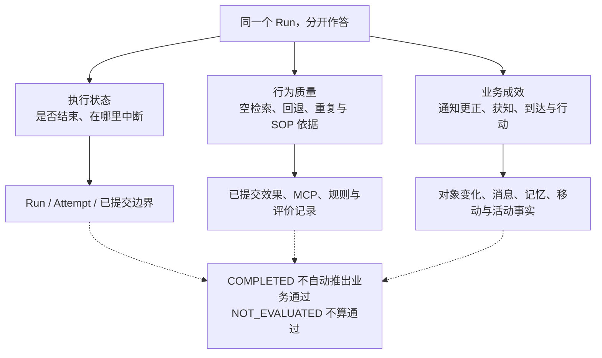
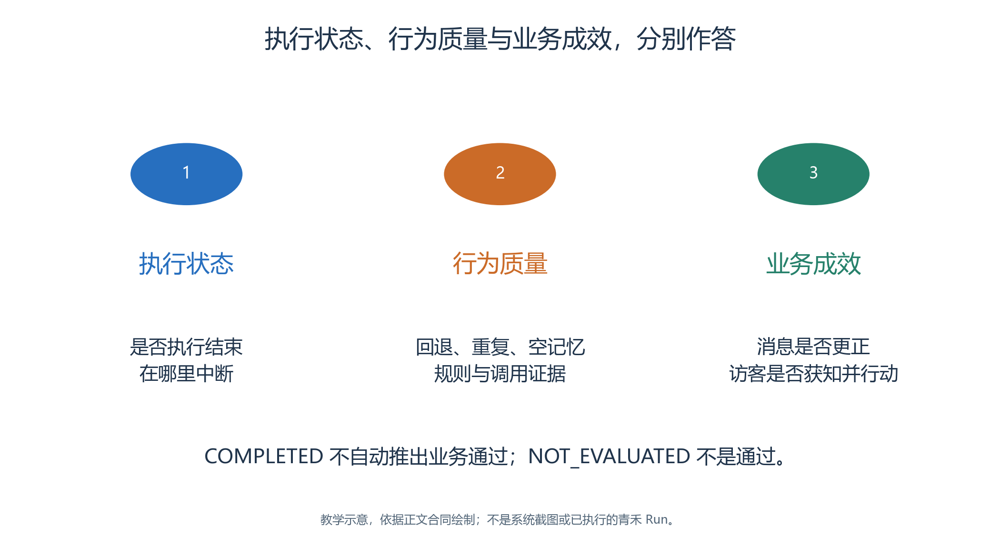
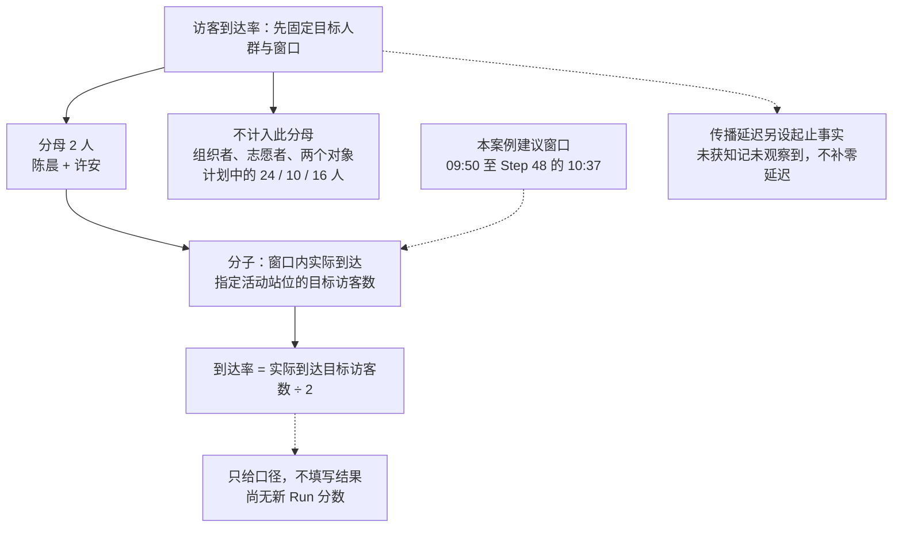
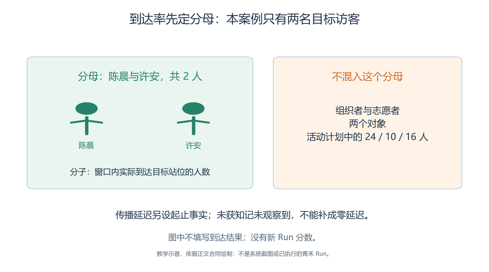

# 3.12 业务指标、行为质量与 Evaluator：怎样判断实验有用

青禾运行完四十八步，只能说明指定执行过程结束。

- 公告可能没有改成新时间，许安可能一直没有获得通知，也可能正确等待后开始手作。
- 要区分这些结果，应在运行前定义业务指标，再依据事实评分。

本节把三件事分开：执行是否结束，系统诊断发现了什么，开放日的研究目标是否达到。它们可以互相解释，但不能互相替代。

## 3.12.1 三层评价各回答一个问题

<!-- book-figure: 12-evaluation-dimensions -->

*图3.12-1　三个维度独立报告；从同一个 Run 分出的三个分支不是评分先后，未执行的评价保持未执行。*

**原图参考（转换前）**

| 层次 | 核心问题 | 主要证据 |
| --- | --- | --- |
| 执行状态 | 请求的步骤是否完成，在哪里中断 | Run 状态、Attempt、已提交边界 |
| 确定性诊断与 Brain 合规 | 是否出现空检索、无动作、回退、重复调用或偏离 SOP | 已提交效果、MCP 调用、规则与必要的专门评价 |
| 业务评价 | 通知是否更正、信息是否传达、参与者是否按新安排行动 | 对象变化、会话、记忆更新、位移与活动事实 |

同一个 Run 可以是 `COMPLETED`，同时存在行为告警；也可以没有基础告警，但业务评价尚未执行。把“没有发现问题”解释成“所有目标达成”，会把未检查的内容错误地计入成功。

## 3.12.2 先定义分母和观察窗口

<!-- book-figure: 12-metric-denominators -->

*图3.12-2　仅说明本案例建议口径，不填写到达结果；完整分母和缺失处理见下表。*

沿分母分支只纳入陈晨与许安，再判断各自是否到达指定活动站位。旁边的传播延迟另用获知事实计时，不能拿到达率的两人分母直接套用。

**原图参考（转换前）**

青禾的四名人物承担不同角色，不能把他们都塞进同一到达率分母。本节将到达目标人群定义为两名访客陈晨和许安，组织者与志愿者另行观察。

| 指标 | 本章建议的可操作定义 | 未完成怎样处理 |
| --- | --- | --- |
| 访客到达率 | 窗口内实际到达指定活动站位的访客数 ÷ 两名目标访客 | 未到达计未达成；注明具体原因与观察终点 |
| 公告传播延迟 | 对更正前尚未获知正式安排的许安，计算公告更正提交到首次确认正式新安排的虚拟时间差 | 未获知记“截至窗口结束未观察到”；更正前已知者另列，不填零 |
| 交流闭环率 | 得到与问题相关的明确回应的目标会话数 ÷ 已发起的目标会话数 | 没有发起会话则分母为零，记不适用 |
| 过时信息行动率 | 更正后仍明确依据旧安排的相关行动次数 ÷ 更正后的相关行动机会 | 缺少行动依据时记无法判断，另报覆盖率 |
| 对象回复完整性 | 以有效请求 ID 核对有无遗漏、重复和错误接收者 | 同时报请求数、回复数与待投递数 |
| 单位有效结果成本 | 本轮实际成本 ÷ 预先定义的成功结果数 | 成功数为零时保留总成本，单位值记不可计算 |

“获知”不能简单等同于附近有一块新公告。

- 应在运行前选择证据口径，例如成功读取正式内容后形成的有效记忆，或明确确认新时间已生效的回复，并在所有样本中一致使用。
- 服务台提出“可考虑 10:30”只是候选方案，不能直接计作获知正式更正；若只有外在行动而没有知识证据，应把结论写成“行为符合新安排”，不推断内部已经理解。

本章建议窗口从 09:50 到 Step 48 的 10:37。它可以评价更正后是否到位和开始，不能评价 11:30 是否完成手作。若修改窗口，指标版本与分母也应一起记录。

## 3.12.3 怎样计算一次延迟

- 若某次真实运行中，公告更正在 Step `u` 提交，许安此前尚未获知正式安排，在 Step `v` 首次满足预先定义的获知证据，步长为一分钟，则步级延迟为 `(v-u)` 分钟。
- 这个公式只有在两条事实处于同一 Run、使用一致时区和步长时成立；还应记录实际消息来源，不能仅凭时间先后断言是公告带来的传播效果。

若许安在公告更正前已从其他渠道核实正式安排，应单列“更正前获知，非公告传播延迟”，保留来源与实际时差，不把负差值截成零。

- 若更正前只听到候选方案，则保留候选记录，继续查找正式确认的时间。
- 这样既不抹去提前获知，也不把建议误算成已经发布的安排。

当对象在 Agent 行动后提交新状态、回复供下一轮使用时，下一轮才出现接收证据可能符合执行顺序，不能直接判为漏投。应核对目标身份和请求 ID，而不是只比较文本出现的墙钟时间。[对象执行与回复测试](../../../tests/runtime/test_object_skill_runtime.py)

暂停也不计入上述虚拟延迟。如果研究用户等待界面的真实时间，应另设墙钟指标。把两种延迟放在同一列，会让恢复实验与连续实验无法公平比较。

## 3.12.4 当前行为质量页面包含什么

进入当前 Run 的**行为质量**页签，先读总体状态，再展开告警，查看参与者或对象、Step、错误代码和具体证据。页面提供定位 Step 的入口；定位后仍要确认当前 Run 没有切换。[质量显示](../../../src/generative_agents/adapters/web/static/shell/console-api.js)

当前确定性投影从所有已提交 StepResult 中提取 Brain 和对象 Skill 的执行记录。

- 检查空记忆、无动作、回退与重复调用等明细时，同时保留参与者、Step 和相关效果来源。
- 它按事实身份生成问题标识，覆盖多个 Attempt，而不是只看最后一次尝试。[质量投影](../../../src/generative_agents/ga_protocol/facts/quality.py)

这些告警需要解释。

- 例如，首次检索没有历史记忆可能合理；一次正确的权限拒绝可能正是边界对照的预期结果。
- 合理不等于删掉告警，应该保留原记录，再在分析表中说明用途。
- 相同文字出现在不同人物、不同 Step，也不能直接去重成同一问题。

## 3.12.5 Evaluator 的资源、方法与实际执行

当前 Studio 有 Evaluator 资源，实验也可以携带相关内容；Brain 类另有可调用的质量评价方法。

- 本次核查的正式结束链使用确定性质量汇总，并未据此证明自定义业务 Evaluator 已被执行。
- 类中有方法、资源能入包，都不能证明每次 Run 已自动执行该评价。[正式执行器](../../../src/generative_agents/ga_runtime/lifecycle/executor.py)、[Brain 评价方法](../../../src/generative_agents/ga_runtime/skills/brain.py)

因此，当前默认路径下：

- `SKIPPED` 表示相应评价未执行。
- 没有确定性告警且评价跳过时，显示 `NOT_EVALUATED`，即未评估。
- 有确定性问题时可显示 `WARNING`，它不改变 Run 是否完成。
- 评价数据不可用或投影失败，需要记录原因，不能改写成通过。

青禾的到达率和通知延迟应先采用可检查的人工或外部评分表，并明确标注评分者、规则、来源与时间。它们不是已经运行的内置 Evaluator 成绩，也不应手工写回历史 Run 把来源伪装成系统结果。

## 3.12.6 核对页面、报告和导出

首先固定本次取材的 Run 与已提交边界。对照质量页中的问题总数、展开明细、报告的 `source_committed_step`、参与者轮次数和对象轮次数。恢复过的 Run 应覆盖此前 Attempt 的已提交问题，不因新 Attempt 看起来正常便丢失历史告警。

当前质量读取可以从提交事实重建报告，而不覆盖旧报告文件；结果 ZIP 导出会保存对应边界的新质量报告。已有回归测试检查跨 Attempt 汇总与页面、导出的一致性，但青禾仍须实际完成同样核对。[质量投影测试](../../../tests/test_quality_projection.py)、[导出一致性测试](../../../tests/test_portable_package_protocol.py)

一条重复读取告警、一次物理模型重试和一个失败业务结果是三种统计单位。它们可能相关，却不能相加成“总错误率”。如需比较方案，先规定每种事件的计数单位，再报告数量、分母与样本范围。

## 3.12.7 用对照说明改动是否有帮助

如果我们调整周宁的说明方式，声称“更清晰的通知改善了访客行为”，应保留基线并只改变相关条件。

- 地图、起点、观察窗口、模型与预算同时变化，会让差异难以归因。
- 多次运行时报告分布、失败与成本，不只选取一条最顺畅的故事。

即使统计显示通知更正后访客行动更合理，也只支持当前设定和模型条件下的仿真观察。四名虚构人物没有代表真实社区的抽样依据，不足以推断真实居民一定会怎样行动。

本节的交付是一份事先定义的评分规则，以及运行后带来源的结果表。尚未运行时只交付规则和空表，所有分数保留未填写。这样，评价才能检验实验，而不是替故事结尾补上一个成功标签。

---

[上一节：回放事实与诊断](11-replay-and-diagnosis.md) · [下一节：包交换与复现](13-packages-and-reproduction.md) · [返回本章](README.md)
