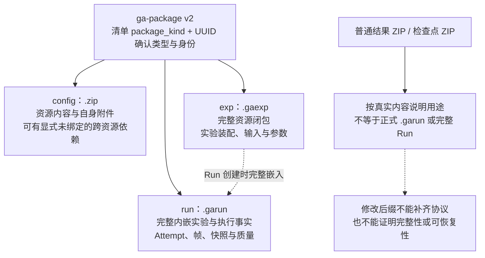
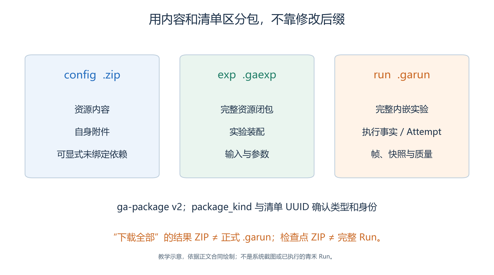
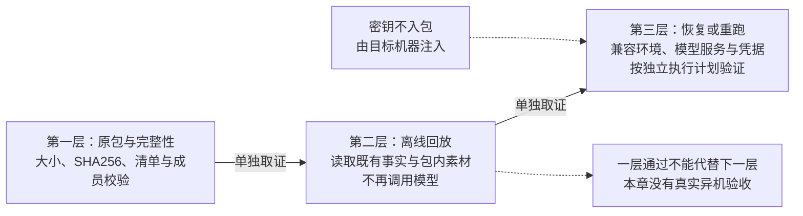
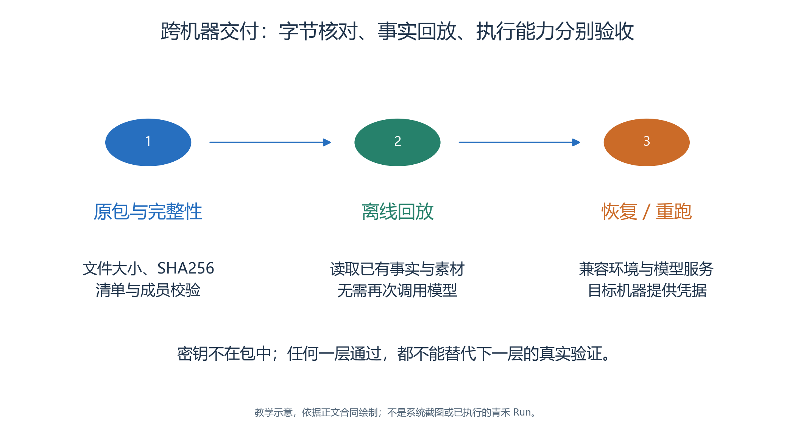

# 3.13 导出、迁移与离线回放：把结果交给另一位读者

完成一次青禾运行以后，分享截图只能让别人看见一个片段；分享提示词也不足以还原地图、素材、初始位置和已经发生的事实。完整交付需要分别保存基础资源、实验输入和运行结果，并说明接收者能够做什么。

本节按当前 `ga-package` v2 协议解释文件，并区分已定位的 UI 能力、底层协议能力与尚未完成的异机验收。没有真实导出文件时，不预填大小、哈希或“导入成功”。

## 3.13.1 三种包回答三个问题

<a id="figure-13-package-contents"></a>
<!-- book-figure: 13-package-contents -->


*图3.13-1　依据 ga-package v2 的内容合同区分；后缀不能证明完整性与可恢复性。*

上方三个分支用 package_kind 和包内内容辨认正式类型；普通结果 ZIP 单独列出。把结果 ZIP 改名为 .garun，并不会沿任何箭头自动补齐 Run 协议。

**原图参考（转换前）**



| 包类型 | 常见交换文件 | 保存内容与用途 |
| --- | --- | --- |
| `config` | `.zip` | 一项或多项基础资源及其自身附件，用于资源交换 |
| `exp` | `.gaexp` | 完整资源内容与实验装配，用于执行一个固定实验 |
| `run` | `.garun` | 完整内嵌实验与执行事实，用于回放、符合条件的恢复或重跑 |

三者均使用 `ga-package`、`schema_version: 2`，由清单中的 `package_kind` 区分。目录是工作形态，归档是交换形态。文件改名不会创建新的业务身份；识别实验和 Run 应读取清单 UUID，而不是猜文件名。[协议清单](../../../src/generative_agents/ga_protocol/schemas/manifests.py)

实验中的 `resources/index.json` 保存统一资源内容，`runtime/assembly.json` 保存地图、Brain、模型用途、出生位置和运行参数等装配。Run 中的 `experiment/` 是完整副本。因此，接收者不需要知道作者公共资源数据库里的旧行号，也不应通过同名资源猜测绑定关系。

## 3.13.2 在资源中心交换所需内容

在相应资源类型中使用**导出资源包**，选择已保存资源，并查看是否同时打包关联资源。

- 资源本身的图片、脚本等附件应齐全；跨资源依赖是否一并导出，由所选范围决定。
- 想分享编辑器中的新内容，应先保存，不把尚未保存的画面误认为导出内容。[资源交换界面](../../../src/generative_agents/adapters/web/static/shell/experiment-console.html)

导入时使用**导入资源包**，上传后查看资源清单，选择所需条目与关联资源，再确认导入。入口接受基础资源、实验或 Run 包，是为了从其中选择基础资源；这不等于把一个 Run 的全部执行历史恢复到运行列表。[资源交换接口](../../../src/generative_agents/adapters/web/routes/resource_exchange.py)

地图、Agent、Crowd、Skill、Brain、模型配置等应分别检查自己的内容与附件。

- `config` 可以携带显式未绑定的跨资源依赖，但进入实验前必须绑定完整；同一个 `skill_key` 对应不同内容时，应阻断并解释冲突，不能静默覆盖或按显示名称配对。
- 公共资源导入成功后，也不能声称某个已封存实验自动采用了它。

## 3.13.3 “下载全部”为什么不等于正式 Run 包

当前结果页的**导出结果**或**结果与导出 → 下载全部**创建的是 `RESULT_BUNDLE`，生成 `result-bundle-step-....zip`。导出按取材时的提交边界保存结果，并生成该边界的质量报告。检查点详情中的**创建 ZIP**则只导出所选检查点。[导出交互](../../../src/generative_agents/adapters/web/static/shell/console-api.js)、[导出实现](../../../src/generative_agents/ga_runtime/storage/exports.py)

| 得到的文件 | 可以先确认的用途 | 不能仅凭后缀承诺的能力 |
| --- | --- | --- |
| 结果 ZIP | 分享指定边界的结果材料与报告 | 完整正式包校验、一键恢复 |
| 检查点 ZIP | 检查一个恢复快照的成员与内容 | 独立替代完整 Run |
| 正式 `.gaexp` | 交换封存实验输入 | 已运行成功或模型可用 |
| 正式 `.garun` | 交换经过协议封存的 Run | 目标机器必然具备执行环境 |

普通结果 ZIP 的生成路径不包含正式外层完整性清单，不能靠改名变成 `.garun`。Run 正式封存由 `RunService.seal` 完成：拒绝活动状态，取得写锁，从一致暂存副本生成完整性清单与归档，不原地改写既有 ZIP。[Run 封存](../../../src/generative_agents/ga_runtime/lifecycle/service.py)

当前后端存在正式包封存与下载接口，但本次未确认相应独立前端按钮的完整操作路径。

- 教材不把结果 ZIP 按钮当成它，也不使用直接接口或 CLI 补做本次 UI 验收。
- 此项应保留为正式交付前的待核对环节。[包下载接口](../../../src/generative_agents/adapters/web/routes/packages.py)

## 3.13.4 原始导出怎样登记

下载后保留原文件，另建记录，写明文件名、实际大小、SHA256、生成时间、源 Run/Attempt、源状态与源提交 Step。若导出时 Run 仍在执行，下载完成时界面可能已经推进到下一步，不能因此把归档的来源 Step 改成页面最新值。

核对结果 ZIP 的状态边界、帧范围、内嵌实验及质量报告。

- 运行中的可变记忆不能混成固定 Step 的事实；未提交模型 Trace 或日志若随包保留，只作过程审计。
- 历史导出的来源不明时，应写“未知”，不能按照文件修改时间推断其取材边界。

传输后比较文件哈希，可以判断是否与原导出字节相同。它不能独立证明内容正确，也不能替代协议校验。协议的内部完整性检查还要核对成员、清单、身份、帧连续性和内嵌实验摘要。

## 3.13.5 迁移时哪些东西需要重新配置

<a id="figure-13-handoff-levels"></a>
<!-- book-figure: 13-handoff-levels -->


*图3.13-2　每层分别取证；本章没有真实异机验收，离线回放与再次执行也不同。*

每条“单独取证”箭头都要补一组新的验收记录。原包哈希一致只完成第一层；第二层的离线回放不调用模型，第三层才需要验证目标机器上的再次执行条件。

**原图参考（转换前）**



模型密钥不进入实验或 Run 包。包内保存环境变量名等连接要求，由目标机器注入凭据；不要为方便复现把密钥补进 `SKILL.md`、JSON 或分享截图。

目标机器还需要兼容的程序版本、Python 与模型服务条件。

- 能离线回放，不代表能重新执行模型调用；能启动模型，也不代表地图与对象状态已经正确回放。
- 建议将验收分成三层：先核对原包字节与完整性，再离线读取既有事实，最后按独立执行计划验证恢复或重跑。

Replay 只读 Run 的事实与包内素材，不要求公共资源数据库保留原记录。仓库已有数据库独立和回放隔离相关测试；本章没有删除用户数据库，也没有完成第二台机器的真实验收。[便携协议测试](../../../tests/test_portable_package_protocol.py)、[回放隔离测试](../../../tests/foundation/test_replay_execution_isolation.py)

## 3.13.6 CLI 延伸：准确区分各条命令

以下是供理解协议和后续独立环境使用的命令速查，尖括号表示待替换的路径或整数。

- 本次教材案例的配置、运行与验收仍由浏览器完成，不能用这些命令绕过缺失的页面步骤。
- 参数来自当前 `argparse` 解析器，而非假定的旧命令接口。[CLI 入口](../../../src/generative_agents/adapters/cli/main.py)

```text
ga experiment validate <实验目录或.gaexp>
ga experiment seal <实验目录> <输出.gaexp>
ga run create <实验包> <新Run目录> [--steps N]
ga run start <实验包> <新Run目录> [--steps N]
ga run status <Run目录或.garun>
ga run pause <Run目录>
ga run cancel <Run目录>
ga run resume <Run目录>
ga run resume <输入.garun> --destination <新可写目录>
ga run rerun <Run目录或.garun> <新Run目录> [--steps N]
ga run seal <Run目录> <输出.garun>
ga replay summary <Run目录或.garun>
ga replay timeline <Run目录或.garun> [--start N] [--end N]
ga replay state <Run目录或.garun> <Step>
```

`create` 只创建，`start` 创建并执行；`resume` 保留 Run 身份，`rerun` 创建新身份。`--steps` 不能突破实验包允许的最大步数。归档文件不能原地续写，恢复 `.garun` 要先安全解压到新的可写目录；恢复之后继续使用同一 Run ID，并建立新 Attempt。

`ga replay` 读取事实，不执行 Skill 或请求模型。CLI 中 `run status` 也使用 Replay 读取摘要，不会把一次状态查询变成继续运行。至于界面是否提供某条 CLI 的同等操作，应按 UI 单独核对，不能由命令存在推导。

## 3.13.7 交付的是证据和边界

正式交付应包含教材素材、精确 Skill、参数说明、原始导出、来源登记、关键事实及质量评分。若只有普通结果 ZIP，就明确这样命名；若已经得到 `.garun`，再记录协议校验；只有完成独立环境验证，才能写该环境中的回放、恢复或重跑结论。

同一包的确定性归档保证同内容可得到相同字节，不意味着重新运行大模型必然生成相同故事。青禾的可复核性首先来自固定输入和真实记录，再来自完整的验证说明，而不是“一键复现”四个字。

---

[上一节：质量与评价](12-quality-and-evaluation.md) · [下一节：架构与交付](14-architecture-and-delivery.md) · [返回本章](README.md)
