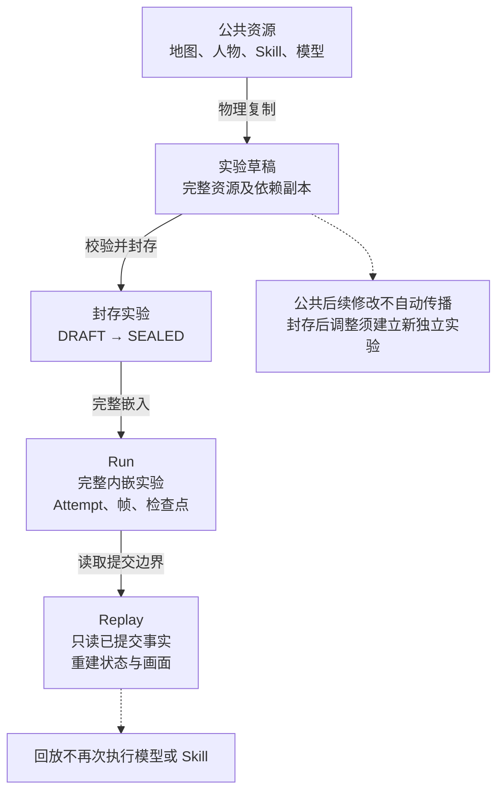
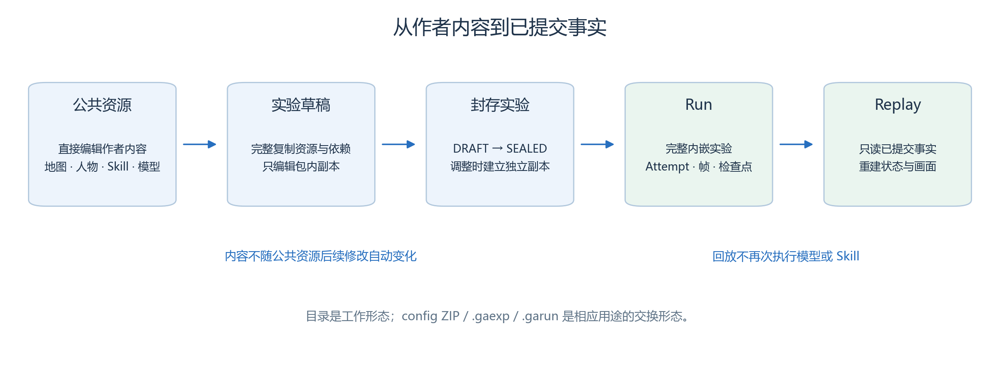
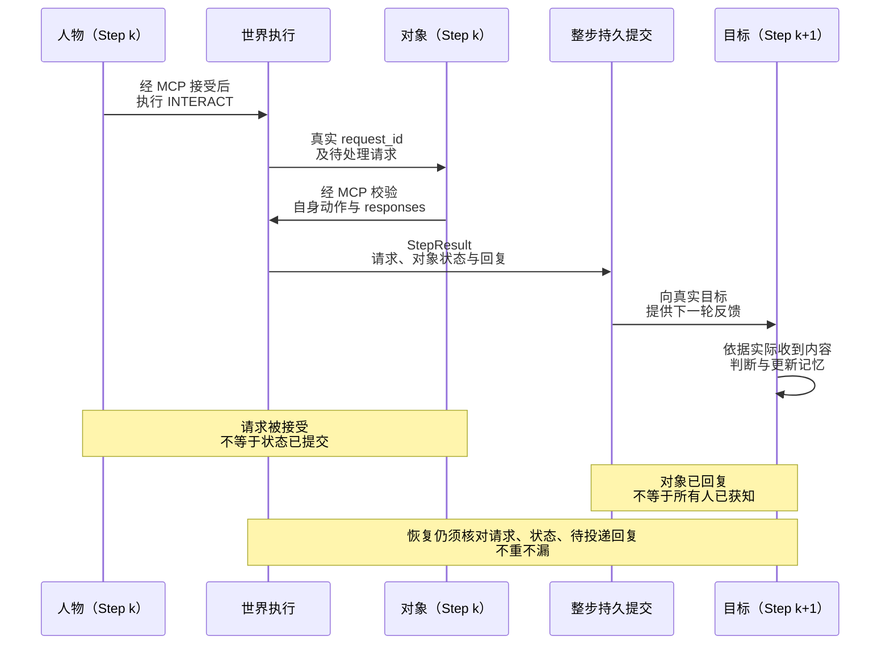
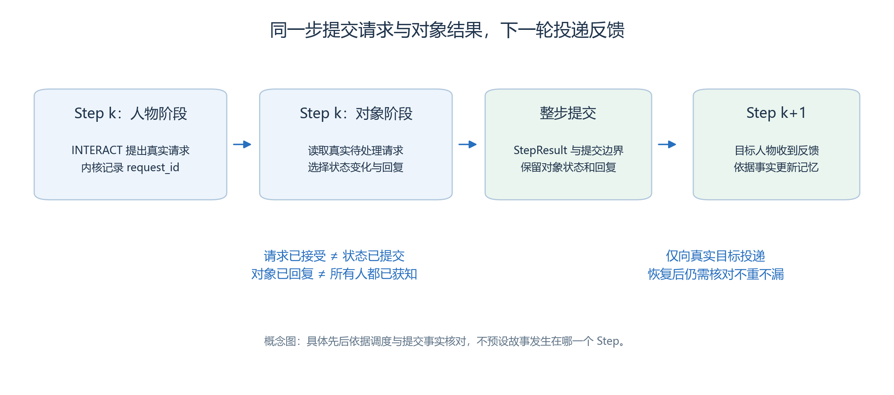
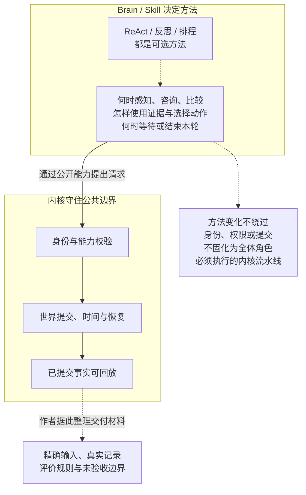
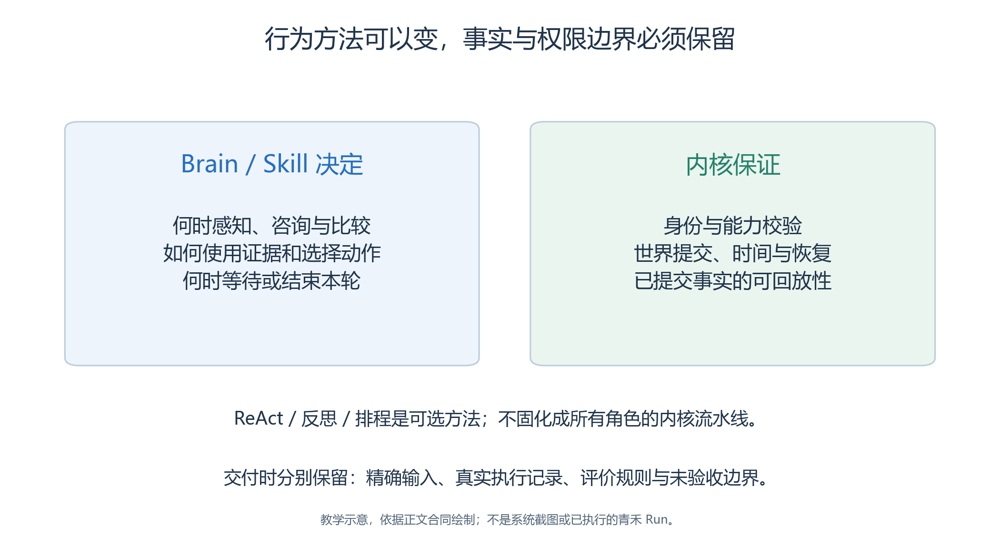

# 3.14　沿着一次行动理解架构，整理可交付的实验

回看本章，最重要的变化不是增加了几个模型角色，而是每项结果都有了明确来源。一个人物想去阅读室，是 Brain 的决定；它是否能走过去，由空间与动作校验决定；它实际走到了哪里，由已提交事实记录；回放展示的内容，则由这些事实重建。

理解这条链，就能把系统的几个模块联系起来，也能知道出现问题时应该检查哪一层。

## 3.14.1 五个职责如何配合

| 模块 | 本章中做什么 | 为什么保持这个边界 |
| --- | --- | --- |
| Protocol | 定义文件、身份、空间、Skill 与事实合同 | 各环节用同一套数据含义交流 |
| Studio | 编辑公共资源与实验，预检并组织交换 | 作者工作不混入运行中的事实 |
| Runtime | 装配 Run、调用能力、提交 Step、监督与恢复 | 执行过程有明确状态与一致边界 |
| Replay | 读取已提交事实并生成状态与页面投影 | 查看历史不会再次执行模型或 Skill |
| CLI / Web 适配层 | 把操作请求转成模块公开 API | 界面不是另一套事实源 |

这些职责通过自包含文件交接。

- Studio 数据库可以保存作者资源和可重建索引，Runtime 与 Replay 仍应依赖实验包与 Run 文件。
- 不能让一个已导出的 Run 在回放时偷偷查询当前公共人物、当前地图或刚改过的 Brain。[项目架构约定](../../../AGENTS.md)、[统一资源协议](../../unified-resource-protocol.md)

<!-- book-figure: package-flow -->

*图3.14-1　原有教学示意，物理复制形成独立内容；不是本案例的实测交接。*

图中的“复制”是物理内容复制。公共资源后续改动不会自动改变实验，实验封存后也不会被后来编辑的公共 Skill 追着更新。Run 进一步内嵌执行所需的实验内容，成为分析那次执行的依据。

**原图参考（转换前）**

## 3.14.2 从一条 MOVE 看完整链条

假设陈晨准备从交流室到阅读桌附近。他先从实际上下文与感知得到目标地址，再调用导航。导航给出可走终点和路径信息，Brain 选择 MOVE，由 `world-act` 接收并校验本轮动作。

此时，工具返回 accepted 说明动作选择被接受，不等于整步事实已经持久提交。

- Runtime 按移动预算消费实际路径、保留剩余路径，构造 Event 与结构化载荷，再通过 StepResult 提交。
- 回放读取这些已提交坐标、轨迹和活动，不根据模型一句“我已抵达”直接画人。

如果人物只走了前 4 格，活动描述应与实际进度分开阅读。

- 计划路径表示想走哪里，实际路径表示已经走过哪里，剩余路径表示尚未完成的部分。
- 途中可以正在“前往阅读室”，却不能在未抵达时把一次阅读活动当作已发生。

定位代码时，先看[能力服务](../../../src/generative_agents/ga_runtime/capabilities/server.py)对请求的校验，再看[世界提交](../../../src/generative_agents/ga_runtime/engine/world.py)怎样构造事实，最后看[回放读取器](../../../src/generative_agents/ga_replay/reader.py)如何限制已提交边界。不要从页面文字反推一条不存在的底层事件。

## 3.14.3 从一条咨询看跨步反馈

对象交互比单人移动多一个阶段。林岚提交 INTERACT 后，服务台在本步人物动作之后运行，读取真实请求、产生自己的动作与回复；这些内容随整步事实提交，目标人物在下一轮收到反馈。

<!-- book-figure: step-and-feedback -->

*图3.14-2　原有源码合同示意，不预设请求发生的具体 Step。*

先沿请求 ID 找对象回复，再沿最右侧箭头找指定人物收到的内容。对象已回复与人物已获知分属两端；恢复核验也要保留这条待投递关系，不能只比较人物坐标。

**原图参考（转换前）**

若服务台回答了预约冲突，林岚应在后续上下文实际收到这条信息后再修正记忆。

- 之后请求公告栏更新，也要等待对象提交和真实回复。
- 把“已提出更新请求”记成“全体来访者已经获知”，会跨越多个尚未成立的证据环节。

恢复时，要检查的不仅是人物坐标，还包括请求身份、待投递回复、对象状态、会话以及记忆进度。

- 系统应从一致的提交边界继续，不能把已交付消息再发一次，或把未交付消息永久漏掉。
- 这里的恢复语义必须用同一 Run、新 Attempt 的真实记录验证，不能以一次新建 Run 的成功替代。

## 3.14.4 Brain 决定做法，内核守住事实边界

<!-- book-figure: 14-behavior-kernel-boundary -->

*图3.14-3　模块职责示意，不表示青禾已执行；方法可变，身份、提交与恢复合同不变。*

方法框到内核框的实线必须经过身份与能力校验；更换 Brain 不会新增绕过该入口的通道。最后的虚线表示作者据真实事实整理交付材料，不表示内核自动写出了业务结论。

**原图参考（转换前）**

本章的 Brain 选择何时感知、何时咨询、何时调用比较方案的子 Skill，以及什么时候停止本轮。

- 其他实验可以采用不同做法：更谨慎地问询、更主动地探索，或在任务简单时直接行动。
- ReAct、反思与排程都可以作为 Brain 的方法，不需要成为所有角色必须走的系统流水线。

内核则保证身份、可用能力、动作校验、提交与恢复等公共条件。改变 SOP 可以改变角色怎样决策，却不能让它伪造别人的身份、读取他人私有记忆，或在同一 Step 中成功提交第二个动作。

也要避免把行为约定夸大成底层保证。

- 例如，本案例要求对实际可见的人说话，应结合感知记录与当前实现检查；角色写着“我是组织者”不会自动获得新的内核权限。
- Skill 的业务规则和能力服务的权限规则需要分别说明。

## 3.14.5 一份实验交付物应包含什么

| 交付项 | 读者应能回答的问题 |
| --- | --- |
| 研究问题与参数理由 | 为什么设这些角色、时间、视野和对照？ |
| 地图与人物素材 | 图片、语义、碰撞和实际位置是否对应？ |
| 精确 Skill 与依赖 | 当时到底执行了什么方法，是否有遗漏内容？ |
| 实验包 | 装配了哪些独立副本，身份与摘要是什么？ |
| Run 与 Attempt 记录 | 哪次执行、从哪里恢复、最终提交到哪一步？ |
| 关键事实与质量明细 | 哪些条件成立，哪些失败，证据能定位到哪里？ |
| 包和导出核验 | 原始文件、时间、状态、大小、摘要与协议类型是否明确？ |
| 复现说明 | 哪些环境前提已验证，哪些仍未知？ |

图像、Skill 文本和模型参数都可能影响结果。只交付一张漂亮回放截图，会丢掉产生该画面的条件；只交付几个数字，也无法判断是否正确处理了失败样本与缺失数据。

本章的[验收表](case/verification/checklist.md)和[运行记录模板](case/verification/run-record-template.md)为后续实操预留了证据位置。尚未执行的条目保持未执行；配置素材已准备、文档已解析、实验已封存、Run 已完成、业务目标已达成，是不同状态。

## 3.14.6 从已有能力走向新场景

完成开放日的基础练习后，可以提出新的问题。

- 例如，把公告栏放远一些会不会增加信息更新延迟？
- 志愿者更主动地询问是否能减少按旧安排行动的情况？
- 视野与注意力降低后，角色会怎样选择咨询渠道？

每次先提出可测量的假设，只改变清楚的因素，保留其他条件与失败 Run。原实验封存后，创建新的独立实验记录修改内容；这不是在旧包上建立业务 Revision，也不是覆盖旧运行证据。

还需要区分两种复现。

- **事实回放复现**要求同一批已提交事实得到一致的状态；**重新运行实验**重新调用模型，即使初始材料相同，也可能产生不同决策。
- 随机种子、相同模型名或温度为零，都不能单独保证外部推理逐字相同。

第四章将从场景问题出发设计对照，而不再逐项重复介绍按钮。第三章留下的最大工具，是一套判断方法：想观察的现象，应当对应可定位的输入、条件、已提交事实与评价标准。

## 3.14.7 章末练习与参考思路

**练习一：沿证据判断完成。**人物说“我已经通知许安”，但只有人物自己的 ACT 描述，没有 SPEAK、INTERACT 或对象回复。能否判定消息已传达？

参考思路：不能。先检查实际通信入口、会话或请求身份、接收方可见内容，再检查接收方是否有后续响应。自然语言自述不能补齐不存在的链条。

**练习二：判断该复制什么。**公共公告栏 Skill 已修改，原实验为 SEALED，读者想比较新旧行为，应如何操作？

参考思路：保留旧实验和 Run，复制为新的独立草稿，显式更新新草稿中的包内内容并核查依赖；再次预检和运行。不要使用旧 Run 的成功结果证明新 Skill。

**练习三：区分执行和质量。**Run 为 COMPLETED，许安没有得知调整，质量面板又显示业务评价未执行。如何报告？

参考思路：分别报告运行终结状态、可定位的业务观察结果与评价执行状态。NOT_EVALUATED 不算通过，人工核验应标为人工记录，不能冒充内置 Evaluator 输出。

**练习四：确定迁移承诺。**已经下载结果 ZIP，但未取得正式 `.garun`，也未在独立环境运行。可以写“一键迁移复现”吗？

参考思路：只能描述已下载文件的实际内容与协议类型。正式包、恢复与异机运行需要分别取得证据；未知项应保留，不用扩大的承诺填补它们。

[上一节：导出、迁移与离线回放](13-packages-and-reproduction.md) · [下一章：场景化应用](<../chapter 04/README.md>) · [参考与实现定位](references.md) · [返回本章](README.md)
