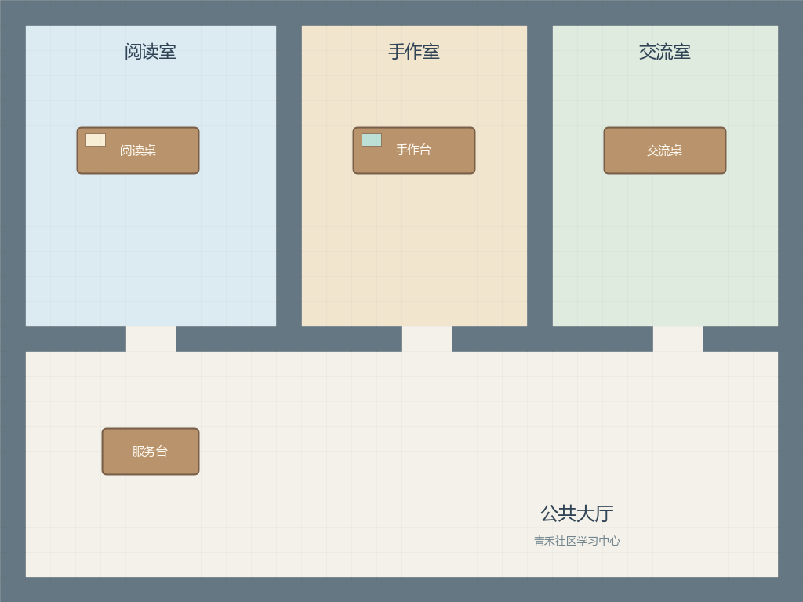

# 地图作者材料：青禾社区学习中心

状态：**素材已准备，尚未在 Studio 上传、绑定或验证**。这里的 [design.json](design.json) 是教材绘图数据，不符合实验包清单合同，不能改后缀当作 `.gaexp` 导入。

## 先看空间，再录入语义

使用一张 1024×768 像素的[完整背景](assets/learning-center-background.png)，对应 32×24 逻辑格，每格 32 像素。原点在左上，x 向右、y 向下；矩形写成 `[x,y,width,height]`，右边界与下边界不包含在矩形内。像素不表示现实米数；当前算法的移动预算另由步长和引擎约定决定。

World 为“青禾社区”，Sector 为“学习中心”，两者均覆盖完整 32×24 地图。四个 Arena 如下：

| Arena | 矩形 | 语义说明 |
| --- | --- | --- |
| 阅读室 | `[1,1,10,12]` | 阅读分享与安静浏览；活动计划人数 24，房间容量资料为 30 |
| 手作室 | `[12,1,9,12]` | 手作活动；已有预约信息由服务台提供，不能全局写入人物共同提示 |
| 交流室 | `[22,1,9,12]` | 交流与整理随身物；活动计划人数 16 |
| 公共大厅 | `[1,13,30,10]` | 连接三个房间，包含公告栏与服务台 |

背景已画出墙体、普通桌面与服务台。公告栏是唯一需要随状态换图的独立图层，背景预留对应地面；不要再给普通桌面叠加重复图片。节点的显示、语义与碰撞分别录入，上传背景不会自动生成它们。

## Game Object 与站位

| 对象 | 所属 Arena | 矩形 | 行为 |
| --- | --- | --- | --- |
| 阅读桌 | 阅读室 | `[3,5,5,2]` | 普通物品；人物抵达可走邻格后阅读 |
| 手作台 | 手作室 | `[14,5,5,2]` | 普通物品；按实际已知安排开展活动 |
| 交流桌 | 交流室 | `[24,5,5,2]` | 普通物品；整理材料与交流 |
| 公告栏 | 公共大厅 | `[14,15,3,2]` | 绑定 `qinghe-notice-board`；初态 `{"state":"original"}` |
| 服务台 | 公共大厅 | `[4,17,4,2]` | 绑定 `qinghe-helpdesk`；初态 `{"state":"ready"}` |

五个物品占地都设置为不可行走，交互和活动使用周边可走位置。公告栏与服务台的交互距离建议初设 1 格，并逐项核对对象导航选择的终点是否满足运行期交互条件。这个数是案例作者方案，不是全系统默认值。

公告栏两张状态图都为 96×64 像素，图像边界、支架位置与尺寸一致：`original → board-original.png`，`revised → board-revised.png`。先在编辑器切换检查，再以真实对象 `SET_OBJECT_STATE` 的已提交事实验收回放换图。静态预览只能验证图层设置。

## 碰撞与门洞录入表

- 外边界：x=0 与 x=31 的全部格，y=0 与 y=23 的全部格。
- 两条内隔墙：x=11、x=21，y 从 1 到 12。
- 房间与大厅之间：y=13，除六个门洞格外均阻挡。
- 门洞格：`(5,13),(6,13),(16,13),(17,13),(26,13),(27,13)`，保留可走。
- 家具：按上述五个对象矩形阻挡。

门洞的美术开口、碰撞空隙和通路必须重合。本设计把门洞格归入公共大厅，避免可走门洞缺少 Arena 语义锚点。不能因为背景画了门，就跳过碰撞与导航检查。

## 出生与已知空间

通过实验内人物“选择空间”设置：林岚在公共大厅，周宁在手作室，陈晨在交流室，许安在阅读室。当前选择器会根据所选空间寻找落点；记录服务端实际保存的坐标，不在包文件中强写一个纸面坐标来绕过界面。

四人初始“可用空间”只声明本学习中心的公共大厅及三个活动室；林岚、周宁再声明公告栏与服务台的四层地址，来访者可在大厅感知发现对象。“常用地址”可按人物需要设置，但要从真实空间树选择。场所名称不包含预约事实，人物不会因此知道服务台的私有信息。

全部保存后重新打开，核对各人的坐标、三层地址和已知空间。空地出生使用实际 Arena 地址，不虚构“出生点物品”；如果选择的是某个对象内部，则保留真实四层地址。

## 尚待 UI 验收

上传背景与状态图；绑定显示素材；输入语义与碰撞；保存重开；逐个核对出生点；检查跨房间路线与对象邻格；确认人物脚底、遮挡和比例。最后在真实 Run 中验证移动、对象状态与回放，不用本设计表替代系统返回路径。

矢量源位于同目录 `assets/`，由[素材生成脚本](../render_assets.py)绘制。它只生成作者素材，不读取或修改 Studio 数据。

[案例总览](../README.md) · [第三章空间教学](../../03-map-and-space.md)
