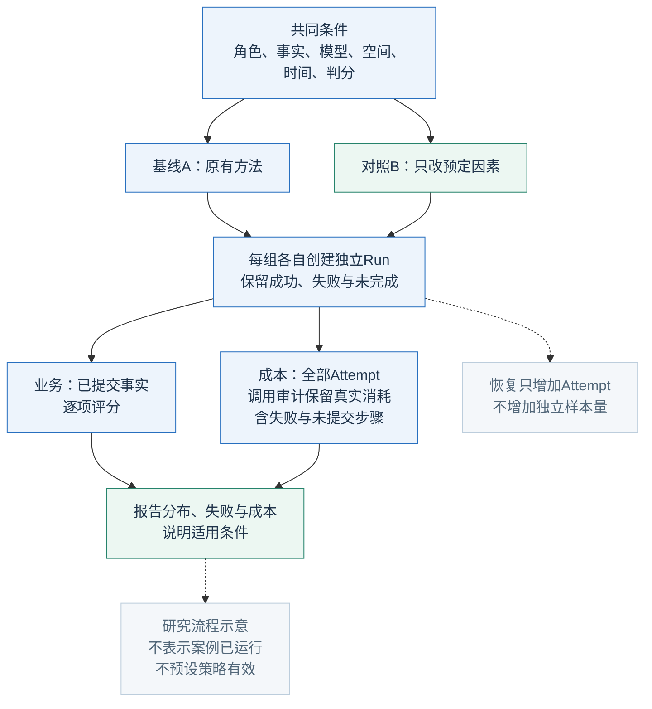
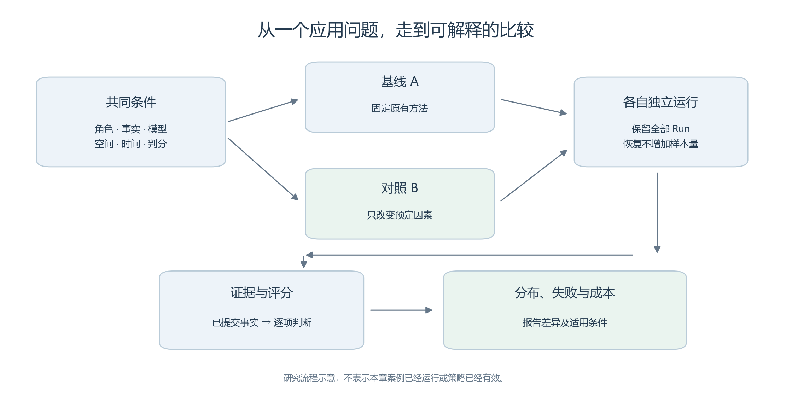
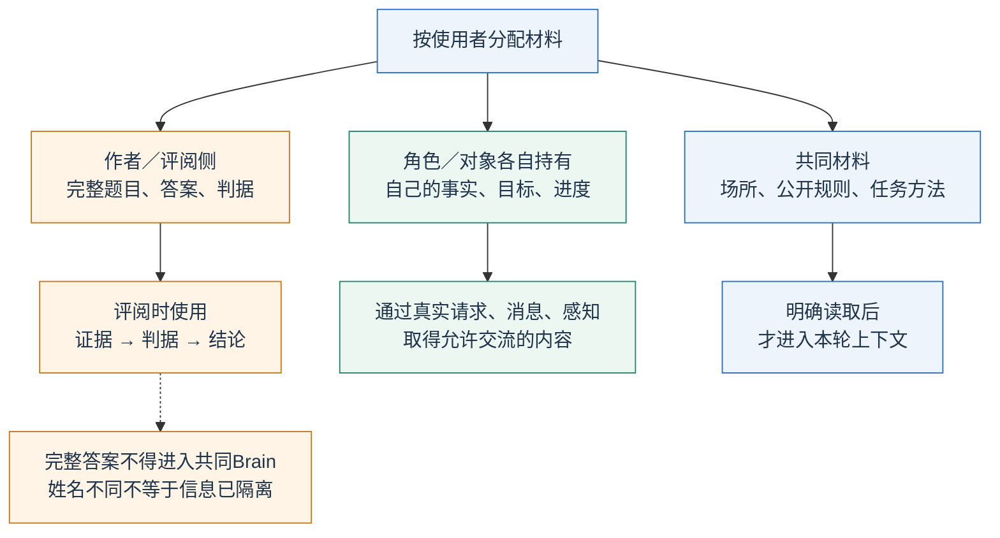
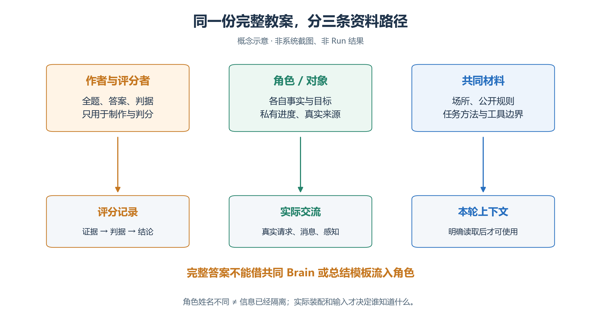
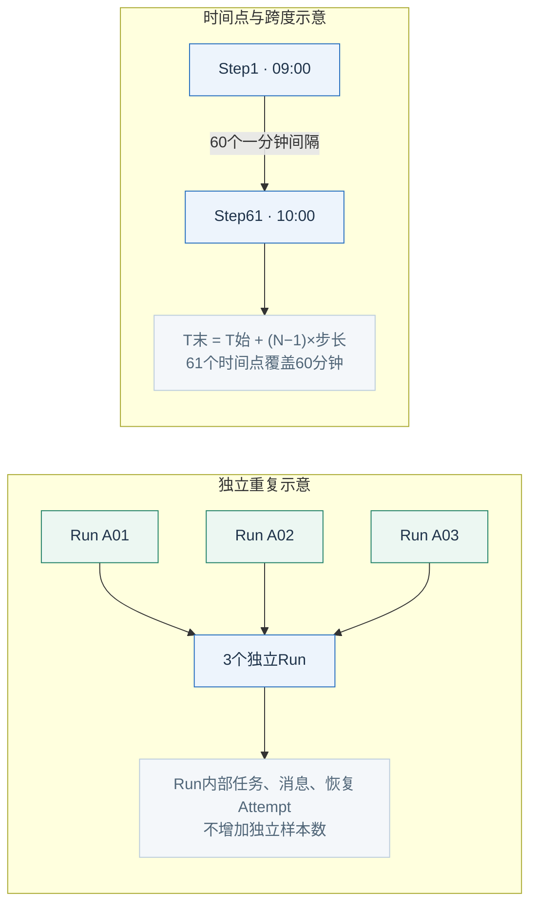
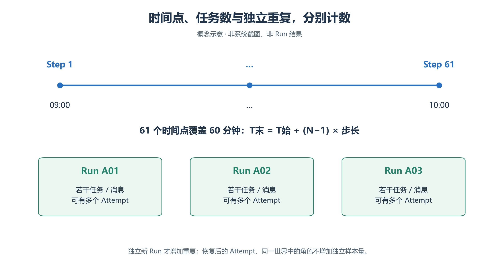

# 阅读准备　从“让角色行动”到“用实验回答问题”

第三章建立可核查的世界；本章用它比较服务、交接、导览和记忆策略。**六个主案例、两个选修案例均为虚构教案，尚无新场景的实际 Run 结果。**人工判分只教计算，不能提前写成研究发现。

<!-- book-figure: study-design -->

*图4.0-1　概念示意。系统提供事实，研究设计决定事实能够回答什么。*

先看两组分叉处：共同条件保持相同，只替换预定因素。再看报告前的两条证据线：业务成功据已提交事实判定，失败步骤已经发生的调用仍须计成本；恢复Attempt只延续原Run。

**原图参考（转换前）**

## 先把应用问题缩小

| 太宽的问题 | 可被结果推翻的问题 | 可能的反例 |
| --- | --- | --- |
| 让大厅更高效 | 四项固定任务中，先澄清目的是否提高咨询闭环率？ | 错误少了，但增加等待和调用 |
| 让交接更可靠 | 五项整理是否提高关键事实到达率？ | 格式完整，内容仍遗漏 |
| 让导览更好 | 只移动牌子，是否改善预算内的主题使用？ | 两个位置都已经可见 |

结论要停在证据能够支持的位置：

| 层次 | 所需证据 | 不能跳到的结论 |
| --- | --- | --- |
| 系统机制 | 权限、请求、路径、提交与恢复身份 | 机制正常≠业务成功 |
| 本次模型行为 | 固定条件、独立 Run、判分和成本 | 三个角色≠三个现实人口样本 |
| 现实应用效果 | 现实资料校准、外部验证、适用条件 | 仿真全员赞同≠现实支持率 |

## 把作者、角色和评阅者的资料分开

<!-- book-figure: study-information-boundaries -->

*图4.0-2　信息分配示意。完整题目和答案留在作者／评阅侧；公开材料也须实际送入上下文。*

以大厅任务H1为例：本人目的放中间的私有材料，窗口分工按角色／对象职责分配，正确窗口和判据留在左侧评阅材料。右侧“共同材料”只表示允许共同知道，仍要说明从哪次初始输入、感知或消息取得。

**原图参考（转换前）**

- **共同材料**：场所、公开规则、任务方法；说明通过初始资料、感知还是消息进入。
- **私有材料**：各人／对象自己的事实、目标、进度；不能借共享 Skill 或总结模板泄漏。
- **评阅材料**：完整条件、答案与判据；不实时帮助人物成功。

姓名不同并不等于信息隔离。普通记忆里写入地址，也不会自动建立导航所需的已知空间。[第三章：记忆与跨步进度](<../chapter 03/06-memory-and-progress.md>)

## 为两组保存精确差异

1. 为基线、对照建立独立实验；冻结共同地图、人物、事实、模型、视野、注意力、窗口与留存设置。
2. 只修改预登记的句子或布局，保存原句／替换句、原坐标／新坐标。
3. SEALED 要复制成新草稿；公共资源不自动更新包内副本，不建立 Revision。
4. 同一批次安排两种条件，事先打乱执行次序，记录模型服务或环境变化。
5. 若要研究位置×视野的相互作用，另作明确多因素设计；两次随意改动不能拼成结论。

区组与随机化降低组别和运行时间重合的风险，不消除所有变化，也不保证远端模型完全复现。[NIST：随机区组](https://www.itl.nist.gov/div898/handbook/pri/section3/pri332.htm)

## 观察单位、时间点与独立重复分别计数

<!-- book-figure: study-time-and-repeats -->

*图4.0-3　时间点和重复单位示意，不是实际运行安排或样本量证明。*

上框数的是**时间间隔**：从Step1到Step61只有60个间隔。下框数的是**独立Run**：一个Run里即使有四项任务和多个Attempt，也不能把它们当成四次独立重复。下面的表分别规定业务分母与重复单位。

**原图参考（转换前）**

| 要数什么 | 本章口径 |
| --- | --- |
| 业务观察单位 | 任务、访客、关键事实等，用于各指标分母 |
| 独立重复 | 新 Run；同 Run 的角色会互相影响 |
| 恢复 | 同一 run_id、新 attempt_id；不增加独立样本量 |
| 时间跨度 | `T_last = T_start + (N−1)×Δ`；61步、1分钟覆盖60分钟 |
| 活动时长 | ACT出现不等于自动持续完整步长，按案例事实核对 |

教学探索可先给每组预留三次独立 Run 的预算，用来认识变异；这不是统计显著性的样本量建议，也不要求正式运行前试跑若干步。正式重复次数需根据问题、变异和预算确定。资料调试记录保留，条件改动后重新登记正式比较范围。

**时延必须有起止点。**Run开始→闭环，与首次咨询→有效回复不同；对象本步处理、人物下轮接收，还受到步长限制。[Scheduler](../../../src/generative_agents/ga_runtime/engine/scheduler.py)

窗口结束未完成者保留“截至截止时刻未完成”。不能删掉后只算成功者，也不能把截止时间填成完成时间；截止后事件时刻未知，涉及右删失。[NIST：删失数据](https://www.itl.nist.gov/div898/handbook/apr/section1/apr131.htm)

## 每个主要指标都要有证据入口

| 判断 | 主要证据 |
| --- | --- |
| 抵达、绕行 | 已执行 MOVE、实际坐标与地址 |
| 咨询正确 | 请求、对象答复、人物实际接收与确认 |
| 认识更正 | 来源消息、有效记忆、替代关系、真实检索 |
| 共同结论 | 双人消息、指定最终陈述、条件核对 |
| 对象变化 | 对象动作、状态补丁、已提交事实 |
| 调用代价 | 同一 Run 全部 Attempt 的逻辑调用、物理尝试、用量与失败 |

主要指标回答业务问题；时延、错误和成本解释取舍，不将所有指标强行揉成总分。语义判分先写成立、不成立、部分成立和无法判断的例子。重要样本可由两位评阅者独立评分，保留分歧；模型辅助评分也须记录模型、输入和规则，人工复核关键分歧。

Run 状态、系统质量、业务分数分开：**COMPLETED ≠ 任务完成，NOT_EVALUATED ≠ 通过。**本章评分表是人工或独立分析材料，不宣称业务 Evaluator 已自动执行。[实现范围](<../chapter 03/verification.md>)

## 将教案落实为作者材料

1. 每案独立保存 `map/agents/skill/settings/verification/`，将事实与 SOP 片段落实为完整资源。
2. 按第三章通过浏览器上传、绑定、装配、保存、预检、封存和运行；本文不是可导入实验包。
3. 发现实际问题，登记入口、动作、预期／实际、Experiment／Run／Attempt／Step和证据，按逐问题规则停止相应验收。合理拒绝、静态不可达、业务失败分别解释。
4. 用[实验计划](templates/study-plan.md)开题，用[报告模板](templates/report.md)交付全部结果和局限。

材料描述可借鉴 ODD 对目的、实体、尺度、过程、初态与输入的写法，但本章不是完整 ODD 认证，也不替换本项目文件合同。[ODD第二次更新](https://www.jasss.org/23/2/7.html)

[上一章](<../chapter 03/README.md>) · [下一节：社区服务大厅](01-service-hall.md) · [返回本章](README.md)

