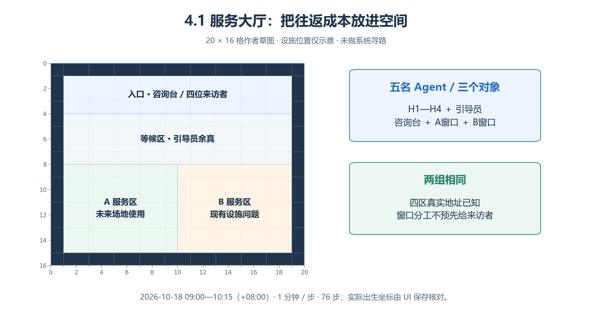
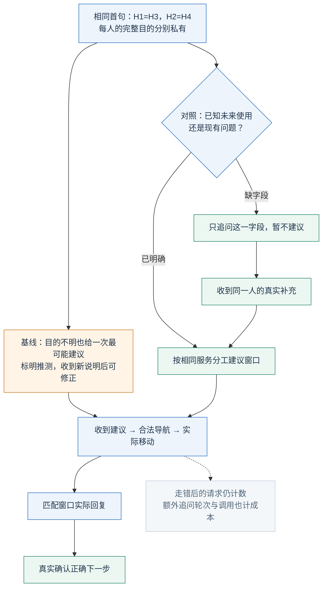
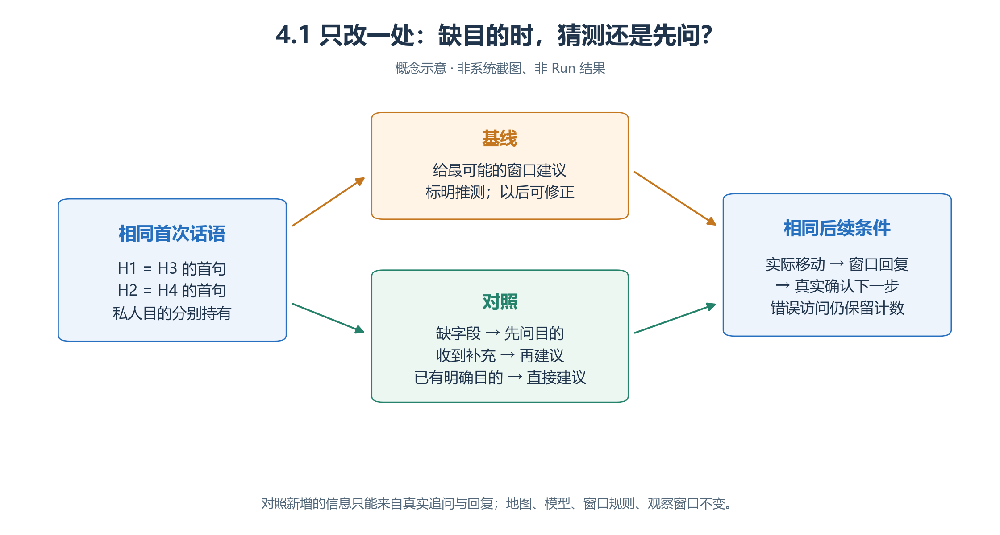
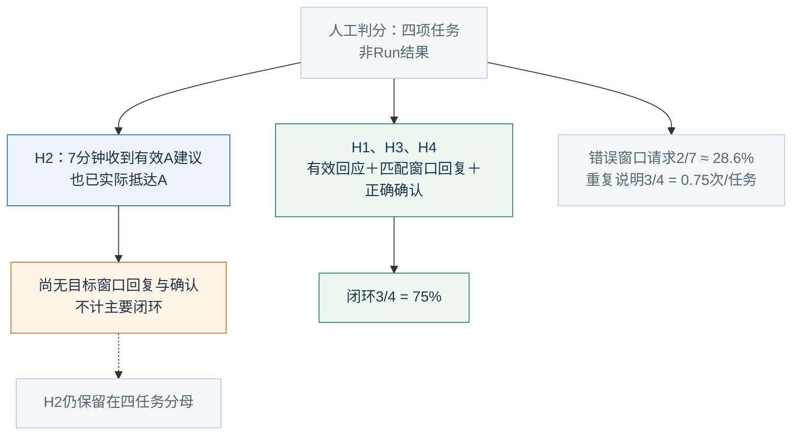
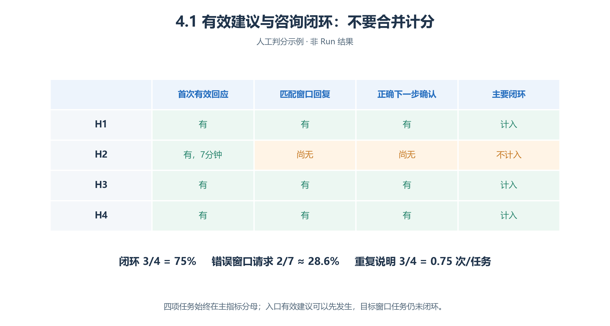

# 4.1 社区服务大厅：先问清楚，会不会少走一次？

“我想问活动室灯光的事。”是在安排未来活动，还是报告已经损坏的灯？**先追问一个字段，可能减少往返，也可能增加等待。**本节比较咨询策略，不模拟行政审批、设施修复或现实排队。

本案为虚构教案，尚未制作独立资源、上传或运行；能力边界见[第三章核查记录](<../chapter 03/verification.md>)。

## 4.1.1 先分清四项需求与谁能知道答案

| 人物／任务 | 只有本人初始知道的目的 | 首次对咨询台说的话 | 教师答案：窗口与下一步 |
| --- | --- | --- | --- |
| 周澈 H1 | 下周借活动室办读书会，需确认照明 | “我想问活动室照明和使用的事。” | A；准备日期、人数、设施需求 |
| 谭悦 H2 | 想预约手工作品展示，需确认桌面照明 | “我想问活动室灯具的安排。” | A；准备日期、人数、设施需求 |
| 孟川 H3 | 今天发现活动室东侧一盏灯不亮，想了解如何报告 | 与H1相同 | B；记录位置、现象、发现时间 |
| 邱禾 H4 | 今天发现活动室入口灯持续闪烁，想了解如何报告 | 与H2相同 | B；记录位置、现象、发现时间 |

**完整表只供作者与评分者。**每位来访者只得本人的目的和首句，不得答案列；被问后如实补充，未被问不主动补齐故意省略的目的。

| 角色／对象 | 初始信息与职责 |
| --- | --- |
| 余真，引导员 | 知道服务分工与咨询台位置；不知道私人任务。只帮助实际遇到且求助者，不预先分类、不逐人索要需求 |
| 咨询台对象 | 知道A管未来场地使用、B管现有设施问题；用真实请求ID回复 |
| A、B窗口对象 | 各知自身和另一窗口职责；只解释下一步，不声称办结 |
| 三个对象 | 各有独立请求和记忆，不能跨身份读取来访者资料 |

## 4.1.2 空间与窗口：让往返成为可观察的代价

*图4.1-1　作者空间示意，非实际地图或寻路结果。设施具体落点与人物出生坐标须经UI保存核对。*

从入口分别找到A、B服务区：建议错误会把一次咨询变成往返。图中的“未来场地使用／现有设施问题”是作者标注，不能因此预塞给来访者；他们初始只知道四区地址。网格用来核对下表范围，不提供实际步行耗时。

World“青禾社区”→Sector“便民服务站”，20×16格；Arena矩形采用 `[x,y,width,height]`：

| 入口 | 等候区 | A服务区 | B服务区 |
| --- | --- | --- | --- |
| [1,1,18,3] | [1,4,18,4] | [1,8,9,7] | [10,8,9,7] |

外边界阻挡，内部连通，对象留可走邻格。四位来访者从入口、余真从等候区开始；两组实际出生、遮挡、视野一致。来访者预知四区真实地址，**不预知窗口分工**；按建议到服务区后，从感知取得窗口对象。口头地址不会自动进入系统已知空间。

候选W为 **2026-10-18 09:00—10:15，Asia/Shanghai，1分钟／步，76步**。正式比较前校准并冻结，两组相同；最后一轮尚未投递的回复不算人物已收到。

## 4.1.3 唯一变化：咨询台的一段判断方法

<!-- book-figure: hall-intervention -->

*图4.1-2　咨询台的两段决策方法，之后沿用同一请求、移动与确认流程。箭头不指定完成Step。*

H1与H3首句相同，为什么该去不同窗口？区别在本人持有的用途。对照分支必须经过“收到同一人的真实补充”，不能把教师答案当补充；基线收到新说明后也能补救。下方闭环仍要逐环取得证据。

**原图参考（转换前）**

共同SOP：读取真实待办请求，依据服务范围说明窗口、理由和下一步；按请求ID回复，不广播、不声称已办理；获知的目的可在对象自己的记忆中关联真实请求者。

**基线决策段：**

> 根据本次请求及此前实际获得的信息给出一次窗口建议。关键目的不明确时，选择你认为最可能的窗口，明确说明这是推测；不要先发澄清问题。收到新的说明后可以修正建议。

**对照仅替换为：**

> 若现有信息没有说明“安排未来使用”还是“报告现有问题”，先只询问这一点，暂不建议窗口；已有明确目的则直接建议。收到同一人的真实补充后，再按相同服务范围推荐窗口。不要重复追问已经回答的字段。

地图、人物、模型、依赖、窗口规则和留存设置相同。对照的新增信息必须来自实际回复，不能预塞任务表；追问的轮次和调用计入成本。

## 4.1.4 用条件连接请求、移动与确认

1. 来访者接近咨询台，感知交互项，提交规定首句。
2. 收到澄清就说明私人目的；收到建议就记录来源，合法导航并实际移动。
3. 窗口对缺目的者追问；适配则给下一步，不适配则解释分工并转介。走错后可改道，但错误窗口请求仍计数。
4. 收到适配回复后，以真实发言或后续交互复述正确窗口与准备内容。私人总结不算确认。
5. 无新条件可有理由地等待，不按Step排剧情。

工具接受≠窗口已答复；导航可达≠已抵达。对象一轮可答复多个请求，**本案没有业务排队模型**；不能将等待解释成行政窗口吞吐。

## 4.1.5 指标覆盖全部四项任务

| 指标 | 分子／分母与边界 |
| --- | --- |
| **正确咨询闭环率** | W内获适配窗口回复且真实确认正确下一步的任务数 **÷4**；每任务一次。入口建议、仅抵达、错误复述均不够 |
| 无效窗口访问率 | 错误窗口交互请求数÷全部窗口交互请求数；不含入口咨询／澄清，重复错误请求逐次计 |
| 重复说明负担 | 向同一对象、未增新事实的核心需求重复提交次数÷4，次／任务；首次向另一窗口说明、补充目的、新发现或纠正口误不计 |
| 首次有效回应时延 | 首次咨询→实际收到首条适配且可执行建议，虚拟分钟；“请等一下”不算。逐人、分需求类型报告，未回应者保留 |

主指标兼顾分流和理解，但不能独自定位失败，另列“已建议／已抵达／已回复／已确认”。无效率须同时给原始请求数；不同总咨询次数会改变比率。

## 4.1.6 人工判分：有效建议可以先于闭环

<!-- book-figure: hall-scoring -->

*图4.1-3　人工评分材料，没有实验身份、Step或真实事件。*

H2为什么有7分钟有效回应，却不在绿色闭环分子中？入口建议已适配且可执行，但目标窗口回复与确认尚缺。右侧2/7数的是窗口请求，3/4数的是重复说明负担，不能都解读成任务成功率。

**原图参考（转换前）**

例中H1、H3、H4取得正确窗口答复并确认；H2已获入口的有效A建议并抵达，但未获目标窗口回复和完成确认。全体窗口请求7次、错误2次；同对象无新增事实的重复说明3次。

| 闭环 | 无效访问 | 重复负担 | H1—H4首次有效回应 |
| --- | --- | --- | --- |
| 3/4＝75% | 2/7≈28.6% | 3/4＝0.75次／任务 | [12,7,6,9]分钟；未回应0人 |

相同75%也可能来自更多澄清或窗口补救，须结合时延、负担、调用解释，不凭单一比率宣布优劣。

## 4.1.7 失败定位与练习

| 现象 | 先核对 |
| --- | --- |
| 澄清后仍分错 | 字段是否问出→补充是否投递→答案是否被使用 |
| 没有答复 | 业务等待、对象调用失败、窗口截断分别记录 |
| 到不了窗口 | 已知地址、感知对象、真实路径；正确权限拒绝不自动是bug |

真实系统问题按第三章规则留证并停止相应验收；模型误分流不自动是系统故障。

**练习：**“我已知道怎么办了”如何判分？需指向正确窗口，并至少说出一项相关准备内容，满意表态不够。再加入两组共有的一项明确需求，观察字段齐全时能否跳过追问；须事先修改总任务数和判分表，不能看结果后挑人。

[上一节：研究设计](00-study-design.md) · [下一节：设备维护班组交接](02-shift-handover.md) · [返回本章](README.md)

