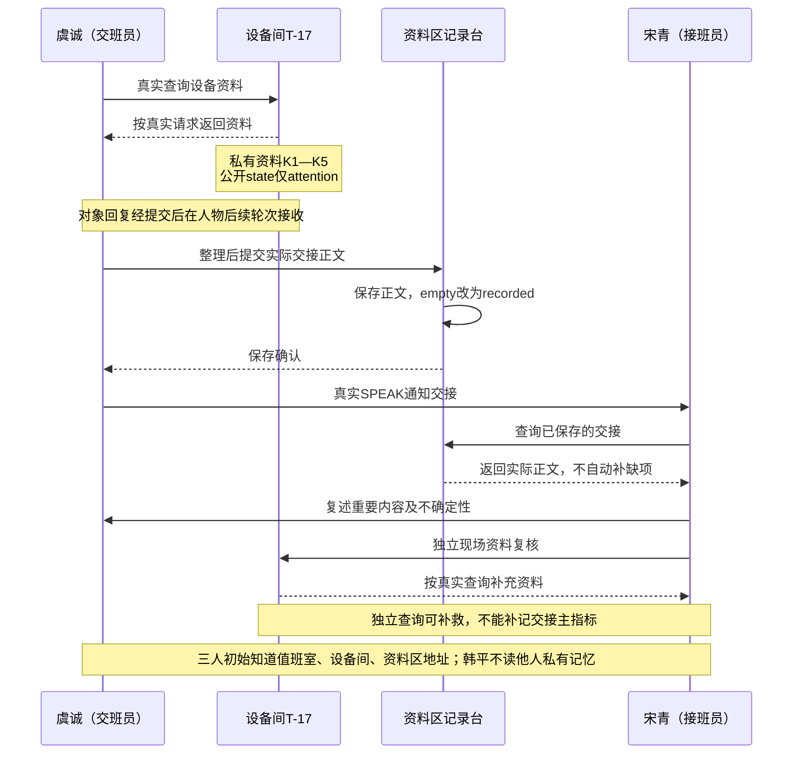
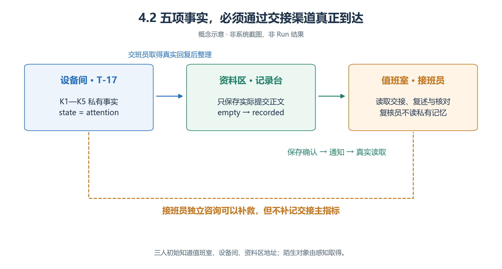
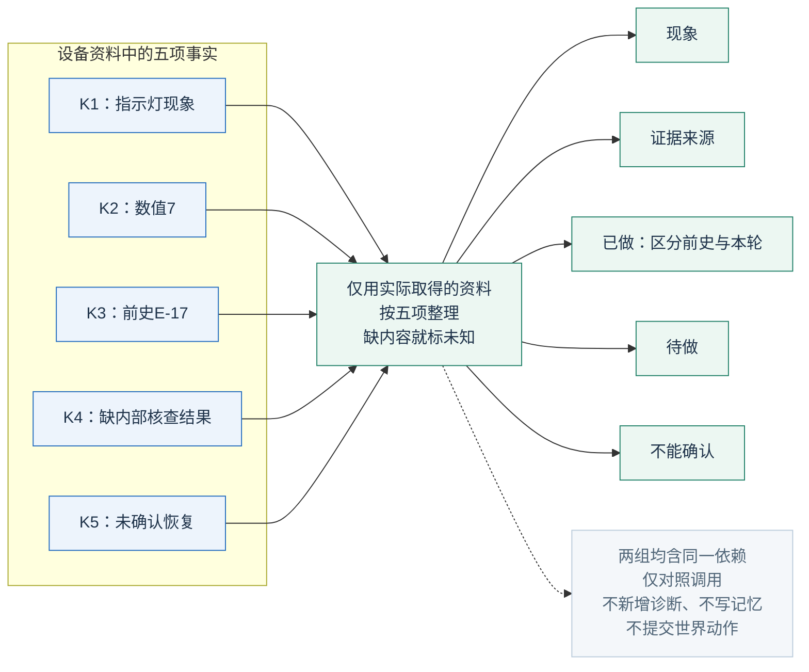
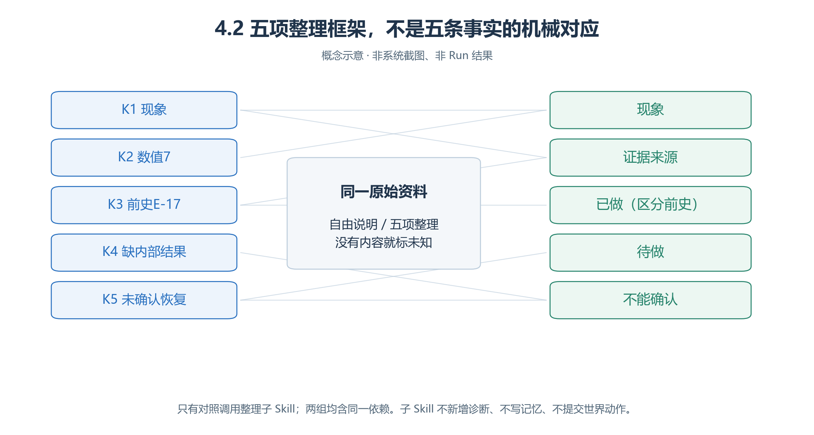
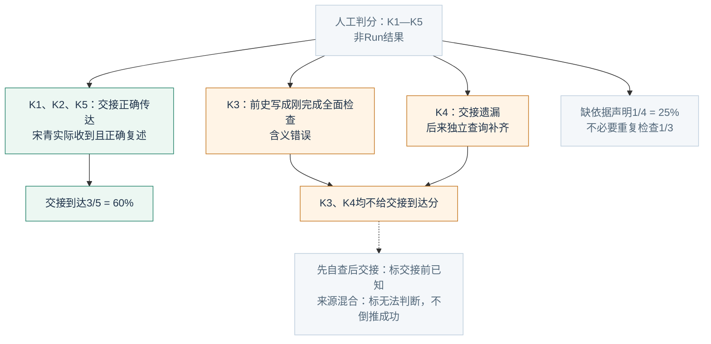
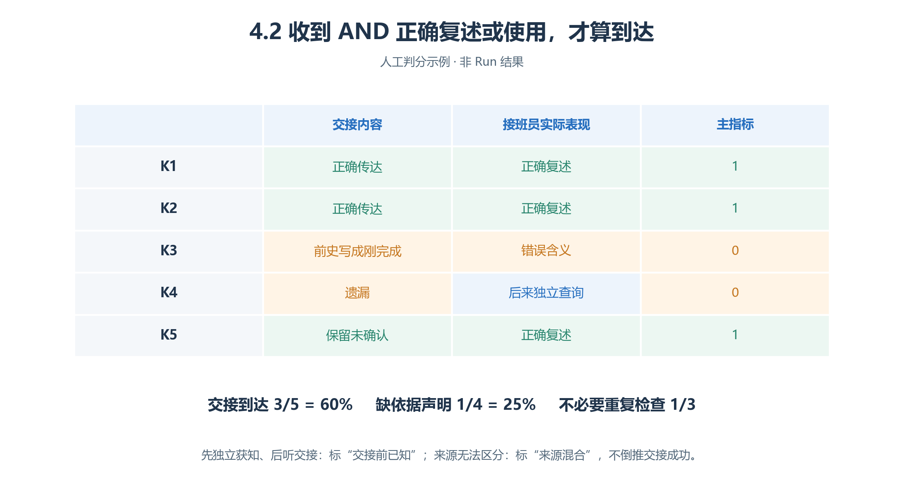

# 4.2 设备维护班组交接：把“做过什么”与“还不知道什么”交出去

“指示灯异常，我已经看过了。”究竟是只观察过，还是已经处理？**固定设备事实，用五项清单整理，是否改善信息到达并减少无依据声明？**

本案为虚构教案，尚未制作资源和运行。设备没有电气、机械或故障概率模型；“检查”的ACT不证明物理维修。

## 4.2.1 五条有限事实：不要补造诊断

T-17公开 `state=attention`，仅表示值得关注。下表是设备根Skill的私有资料和教师判据，人物初始不知道。

| 事实 | 内容 | 不能推出 |
| --- | --- | --- |
| K1 | 教学面板橙色指示灯间歇出现 | 某部件已损坏 |
| K2 | 显示7，单位为虚构教学单位 | 过高／过低；没有正常范围 |
| K3 | 前次记录E-17只写了外观观察 | 本Run刚完成全面检查 |
| K4 | 前次记录没有内部核查结果 | 已确定内部异常 |
| K5 | 无恢复正常确认，仍待复核 | 已观察＝已修好 |

设备按真实请求提供事实，不替人物写交接稿，不依组别补答案；未知阈值、原因、零件、修法都说未知。这是本案固定资料设定，不是要求所有对象都作静态问答库。

记录台初始 `empty`，只保存实际请求正文，通过自身 `SET_OBJECT_STATE` 改为 `recorded`，再按请求ID回复。它不补缺项、不保证正文正确；人物只能申请保存。

## 4.2.2 空间与角色：三人一直都在

<!-- book-figure: handover-sources -->

*图4.2-1　交接消息的条件顺序示意；横向四条生命线是两名人物与两个对象，不是空间站位。韩平的质询未展开。*

沿宋青的生命线找两种来源：先读记录台的交接正文，再直接查询T-17。后一种查询可以补救遗漏，却不能回填“经交接到达”；记录台变为recorded也只证明保存，不证明宋青已读取或理解。

**原图参考（转换前）**

| 人物 | 初态与共同职责 |
| --- | --- |
| 虞诚，交班员 | 初始不知道K1—K5；查询T-17并交接 |
| 宋青，接班员 | 接收、复述、核对；未获交接可整理用品或有边界等待 |
| 韩平，复核员 | 只据实际发言和设备回复质询事实／推断，不读别人私有记忆 |

三人从Run开始就存在，接班不动态创建人物。职业不授予改设备状态的权限，共同Brain没有答案；复核员只向实际接触者问缺口，不广播教师表。

地图用值班室、设备间、资料区三个Arena，分别供交流、T-17、记录台使用。三人初始都有三区真实地址；陌生对象从感知取得，文字地址不自动成为导航知识。后续制作四层语义、通道和邻格。

**W＝2026-10-19 08:00—09:40，Asia/Shanghai，1分钟／步，101步**；两组起点、视野、模型、预算相同。

## 4.2.3 共同流程，只改变整理段

<!-- book-figure: handover-checklist -->

*图4.2-2　关联示意。K1—K5是事实，五个栏目是表达框架，两者不是一一配对。*

试把K3“前次E-17只作外观观察”放进框架：它同时涉及来源、已做事项及前史边界。凑齐五个栏目不能补齐五项事实；尚未从设备取得的内容仍是缺口，不能照图把答案交给子Skill。

**原图参考（转换前）**

共同前置：先取到设备真实回复，区分资料描述和本轮实际活动；形成说明→提交记录台→收到保存确认→真实SPEAK通知宋青。不能先写“对方已理解”，也不等待未发出的请求。

**基线：**

> 根据已经实际取得的设备回复、个人观察与待办，用自然语言自由整理一份交接说明。保持事实准确，不猜未知内容；不调用交接整理子 Skill。之后按共同流程保存、通知、回应问题。

**对照：**

> 在准备这份交接说明时，调用一次交接整理子 Skill，将已有事实和来源交给它；依据其建议检查说明，再按共同流程保存、通知、回应问题。有新证据导致实质修改时才重新整理，不每轮重复调用。

两组含相同子Skill依赖，仅调用规则不同。子Skill将输入整理为**现象／证据来源／已做／待做／不能确认**；缺内容标未知，检查“观察→维修”“前史→本轮”的偷换，只返回建议，不世界动作、不替人写记忆、不接触答案。额外调用、长文本与阅读负担计成本。

## 4.2.4 让对方真正参与

1. 宋青收到交班消息，查询已保存记录，向虞诚复述事实和不确定性；有疑问追问。
2. 接近设备，提交规定的现场资料复核请求，并在实际地点提交一次外观核对ACT。
3. 韩平收到“已完成／已恢复”或冲突声明时，要求指出来源；缺证据保留待办。
4. 没有新设备事实时，合格结果可以是“资料已交接，设备仍未确认恢复”。

正常接班复核是规定任务，不能因为交班员已查过而算重复劳动。本案不自动修复；若研究状态变化，应另定触发与证据、重新设计对照。

## 4.2.5 收到与正确使用，缺一不可

| 指标 | 计算与边界 |
| --- | --- |
| **关键交接信息到达率** | 首次交接开始至W结束，宋青**经交接渠道实际收到 AND 正确复述或使用**的K项数÷5；每事实一次，来源须可追 |
| 最终掌握率 | 另报独立查询等补救后的掌握，不能回填交接分数 |
| 无依据完成声明率 | 缺规定证据的完成主张数÷全部完成主张数；一句可含多项，无声明记不适用 |
| 不必要重复检查率 | 无新证据、变化或明确复核要求的重复实例数÷全部已提交检查实例数 |
| 有效交接调用成本 | 全部样本逻辑调用总数÷五项全过且保留K5含义的有效交接任务数；物理尝试另列，零成功不可计算 |

交接未开始仍报0/5并标“未形成交接”，不只选顺利样本。正确猜测无交接来源不计；先自查、后收到者标“交接前已知”，不是新增到达；来源混合／无法判断单列，分母仍五项。

登记要有对象保存与回复，检查要有相应ACT，恢复在本案无成立依据。规定复核和有新疑问的追查不计重复；目的不清单列。失败、未形成交接的调用也进入成本。本指标说明信息，不推断设备可靠性或维修效率。

## 4.2.6 人工判分：记录流畅不能补信息分

<!-- book-figure: handover-scoring -->

*图4.2-3　人工例子，没有实际请求、会话或Run。*

K3与K4都不给分，原因却不同：K3在传递中改变了含义，K4根本没经交接传到。绿色分支同时要求“交接来源可追、实际收到、正确复述”；只看最终知道几项，会把独立查询的补救混进主指标。

**原图参考（转换前）**

交接正确传K1、K2、K5，宋青也正确复述；K3被改成“我刚完成全面检查”，K4遗漏。宋青后来独立查询补K4。

| 练习事实 | 正确计算 |
| --- | --- |
| 经交接正确到达三项 | 3/5＝60%；独立补K4不改主指标 |
| 四项完成声明，“已全面检查”缺证据 | 1/4＝25% |
| 三次检查：规定复核、新疑问追查、无新条件重复追查 | 不必要重复1/3，不是2/3 |

若评阅者对第三次有无新条件意见不同，保留引用与分歧；五栏齐全但内容为空仍是遗漏。

## 4.2.7 从哪一环丢失，解释就停在哪一环

| 失败 | 核对位置 |
| --- | --- |
| 设备从未回复K4 | 查询与原回复 |
| 已收到K4却没整理进去 | 子Skill输入／输出 |
| 记录已保存，宋青未读取 | 保存、通知、接收、查询链 |
| 收到后说错 | 复述与实际使用，而非只看文件存在 |

**练习：**“检查已完成”若指现场核对面板，需位置和ACT；若指恢复正常，本案不成立。用同一事实分别写自由说明和五项清单，检查清单是否新增原材料没有的诊断。离线表达练习不替代两组运行证据。

[上一节：社区服务大厅](01-service-hall.md) · [下一节：图书馆与展馆导览](03-gallery-wayfinding.md) · [返回本章](README.md)

