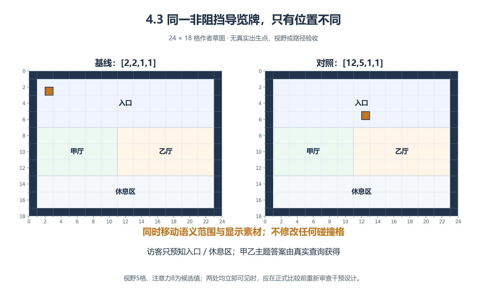
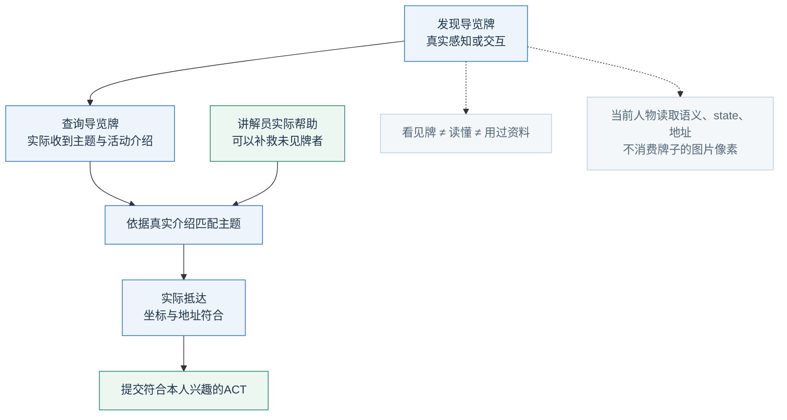
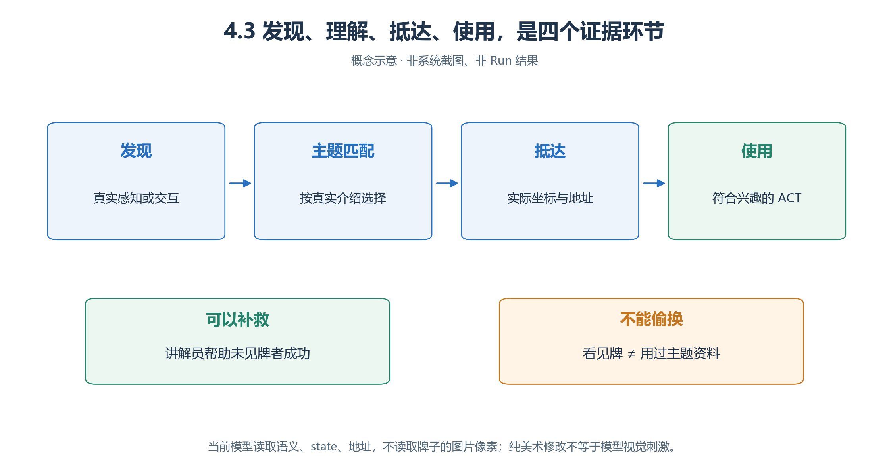
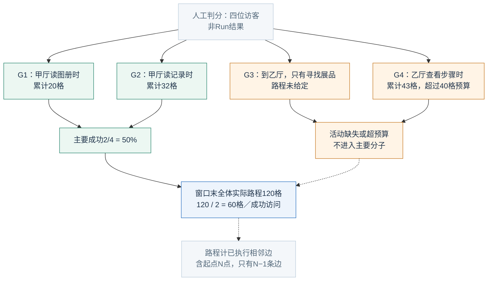
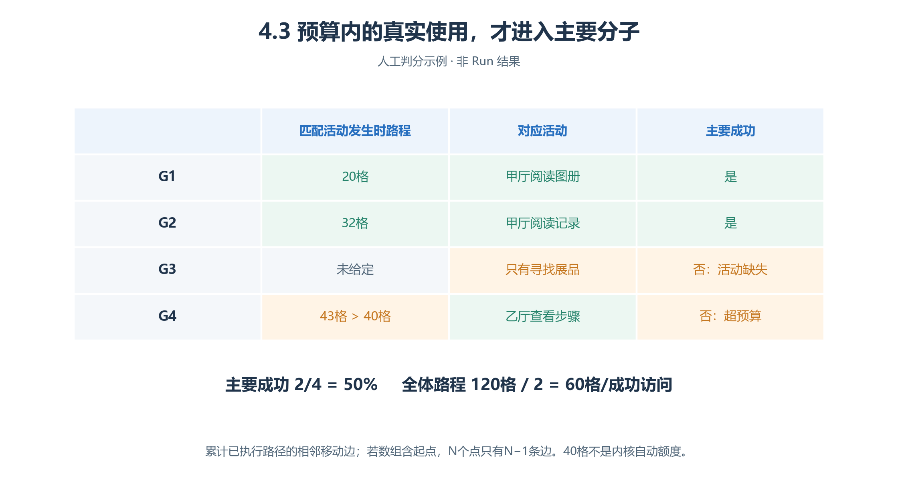

# 4.3 图书馆与展馆导览：同一块牌子，换个位置会怎样？

想找鸟类图册的人先走进纸艺区：可能不是文字难懂，而是没有发现导览。**保持信息与行为方法相同，只移动牌子，发现与访问会改变吗？**

“青禾主题馆”是虚构教案，尚未制作资源、上传或运行。尺寸、预算与窗口是待固定的教学候选，不是建筑导视评价结果。

## 4.3.1 兴趣表给谁看？

| 访客 | 本人兴趣 | 匹配活动 | 评分者答案 |
| --- | --- | --- | --- |
| 安禾 G1 | 辨认城市常见鸟类外形 | 阅读／观看鸟类图册 | 甲厅 |
| 罗宁 G2 | 了解鸟类活动记录方法 | 阅读鸟类观察记录 | 甲厅 |
| 姚知 G3 | 比较传统纸艺纹样 | 观看／阅读纹样资料 | 乙厅 |
| 施远 G4 | 了解纸艺制作步骤 | 查看过程图片／说明 | 乙厅 |

**访客只有自己的兴趣，不得右侧主题答案。**共同Brain没有完整表，公共名称与语义只写甲／乙厅，不提前泄漏主题。初始已知空间仅入口、休息区。

| 设施／人物 | 独立掌握的资料 |
| --- | --- |
| 甲厅介绍对象 | 城市鸟类外形图册、活动记录 |
| 乙厅介绍对象 | 纸艺纹样、制作过程图片；无真实手作器材 |
| 导览牌 | 两厅主题、适用活动、真实地址 |
| 讲解员温岚 | 同导览牌；从休息区开始，帮助实际遇到且求助者，不逐人广播 |

讲解员帮助未见牌者成功，是合理补救，不能为了凸显牌子而删掉结果。

## 4.3.2 唯一干预：同一块非阻挡牌的位置

*图4.3-1　作者草图，无真实出生点、视野或寻路验收。两图只是同一对象的两个独立实验条件。*

对照两幅网格，只找橙色牌子的位置变化；外框和内部通路相同。这里研究位置是否改变信息被发现的机会，不能解释成移动障碍物缩短了路，也不能仅凭纸面距离断言进入了真实感知范围。

World“青禾社区”→Sector“主题馆”，24×18格：

| Arena | [x,y,width,height] |
| --- | --- |
| 入口 | [1,1,22,6] |
| 甲厅 | [1,7,10,6] |
| 乙厅 | [11,7,12,6] |
| 休息区 | [1,13,22,4] |

边界封闭、内部连通；两厅资料对象与邻格不变。导览牌基线 `[2,2,1,1]`，对照 `[12,5,1,1]`，同时移动语义范围与显示素材，**不增改任何碰撞格**。名称、内容、根Skill、交互距离、图片尺寸相同；背景不能留下另一块烘焙的牌子。

四人从入口，实际出生以空间选择器保存为准。视野5格、注意力8为候选值；在正式比较前核对两位置相对实际出生与通路的距离。若两组都立即可见，应在业务比较前修订设计并记录，不能看完结果再挑位置。

系统可见性由空间范围和候选截断决定，不等同人眼朝向、阅读距离或墙体遮挡；不能假定“背对就看不见”。

## 4.3.3 相同SOP，让位置通过真实信息起作用

<!-- book-figure: gallery-evidence-chain -->

*图4.3-2　概念链。发现不等于理解，理解不等于实际使用；不预设每人必须经过导览牌。*

从两个入口分别走到“匹配主题”：看见牌子只定位信息源，实际介绍来自查询回复；讲解员的真实帮助是另一条有效来源。两条路线最终都要核对坐标、地址和对应ACT，因此G2可以没见牌却成功，G3也可能见牌后仍未使用。

**原图参考（转换前）**

两组共同Brain：

> 先检索自己的目标和已获信息，再感知当前地点。发现导览或资料对象且信息尚不足时，接近后提交真实查询；遇到能回答问题的讲解员可询问。只依据收到的介绍选择主题，不根据甲乙名称猜答案。未获必要信息时，可以沿已知公共空间探索，发现新区域后再核实。目标确定后查询合法路径，按实际位置继续移动；抵达后，在真实地点做一次与兴趣相符的阅读或观看活动，并把有证据的体验写入个人记忆。

导览牌只按包内主题表答复，兴趣缺项先澄清，不编展品、捷径或服务；按真实请求ID回复，不代替人物宣布已决定。介绍对象只解释自身主题，不泄漏私人目标。

回复中有地址≠工具已允许导航。目标须已在已知空间或实际感知中，否则先探索并感知；普通记忆不能绕过检查。两组不改Brain、不加对照专用Skill，也不增加视野或讲解员提醒。

## 4.3.4 一个时间窗口，一个软步行预算

**W＝2026-10-20 14:00—15:00，Asia/Shanghai，1分钟／步，61步；每人40格。**

40格是人物任务约束与人工判分条件，**内核不会自动扣额或截停**。人物根据真实进度控制探索，未知消耗不能当零。

| 路径材料 | 怎么计 |
| --- | --- |
| 已提交 `executed_path` 含起点 | N个点计N−1条相邻移动边 |
| 数组不含起点 | 先接入事实中的 `from_coord` 再数边 |
| 空路径／计划路径／被拒请求 | 不产生已执行路程 |
| 超过40格后才匹配 | 另报超预算匹配，不进主要分子 |

预算凸显绕行代价，也会掩盖继续探索后的成功，故同时报告预算前后结果，不称其为人类耐力标准。到预算不必虚构离馆，可实际休息或阅读。

## 4.3.5 指标把发现与使用分开

| 指标 | 计算与边界 |
| --- | --- |
| **合适区域使用率** | W内、累计≤40格、真实抵达匹配区域并提交至少一次对应ACT的人数÷4，每人一次 |
| 导览发现率 | 首入主题区前，真实感知出现牌或真实交互过的人数÷4 |
| 成功访问路程成本 | W内全体访客实际移动格数÷主要成功人数，格／成功访问；失败路程也计，零成功不可计算 |
| 首次匹配时延 | Run开始→首个满足兴趣、位置、预算条件的ACT，虚拟分钟；列四人及未匹配数 |

感知出现只支持“发现”；原始感知缺失时，交互证据只能给下界，未知单列。活动语义与实际位置同时成立，满意宣言不够；一次ACT不证明读完或掌握知识。主指标也不评价满意度、长期学习或真实群体公平。

## 4.3.6 人工判分：走到正确房间仍可能不成功

<!-- book-figure: gallery-scoring -->

*图4.3-3　人工材料，非Run结果。G3的路程未给定，不能补造。*

20、32、43格是各次对应ACT发生时的累计路程；120格是**窗口末全体**累计量，时间边界不同，不能用120减前三个数倒推G3路程。橙色两支分别缺活动、超预算；两人仍留在四人分母，失败路程也留在成本中。

**原图参考（转换前）**

G1在甲厅读图册时20格，G2读记录时32格；G3到乙厅但只“寻找展品”；G4在乙厅查看制作步骤时43格。全体窗口末累计120格。

| 主要使用率 | 路程成本 | 另外报告 |
| --- | --- | --- |
| G1、G2成功：2/4＝50% | 120/2＝60格／成功访问 | G3缺活动；G4超预算，不能事后改阈值为45 |

若只有G1、G3在首入主题区前有导览发现证据，发现率也是2/4；G2由讲解员帮助成功，G3发现却未使用，说明二者不是同一指标。

## 4.3.7 失败解释与下一轮练习

| 可能机制 | 应查证据 |
| --- | --- |
| 两处均可见、注意力截断 | 感知候选与实际返回 |
| 查过仍选错 | 请求、回复、目标判断 |
| 讲解员已补救或重复询问耗时 | 实际对话与时序 |
| 语义／图像不一致、碰撞或出生改变 | 先记录装配问题，不伪装成空间干预效果 |

**练习：**G3的“寻找资料”与“观看纸艺纹样”怎样判分？后者才可能满足活动条件，仍须检查位置与预算。

下一轮可固定位置，只改工具实际返回的某项语义文本，并核对接收。当前人物感知读取语义、公开 `state`、地址，**不消费地图或牌子图片像素**。纯配色、字号、图片变化主要影响人类回放外观；可作为预期无直接行为通道的对照，但不保证随机运行逐步相同。

[上一节：设备维护班组交接](02-shift-handover.md) · [下一节：通知纠错与信息传播](04-information-correction.md) · [返回本章](README.md)

