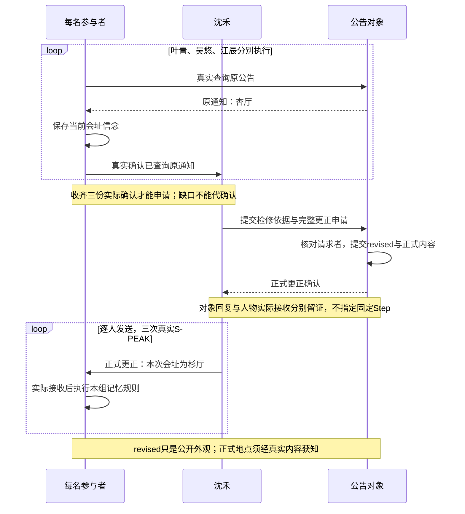
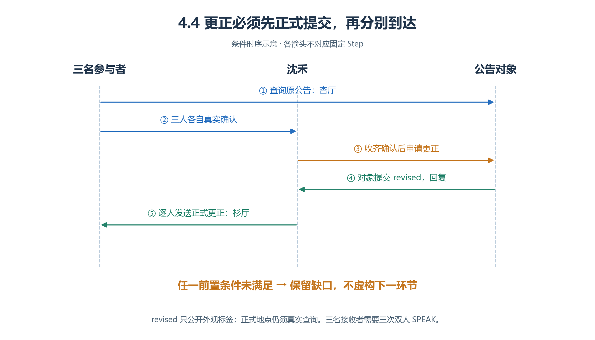
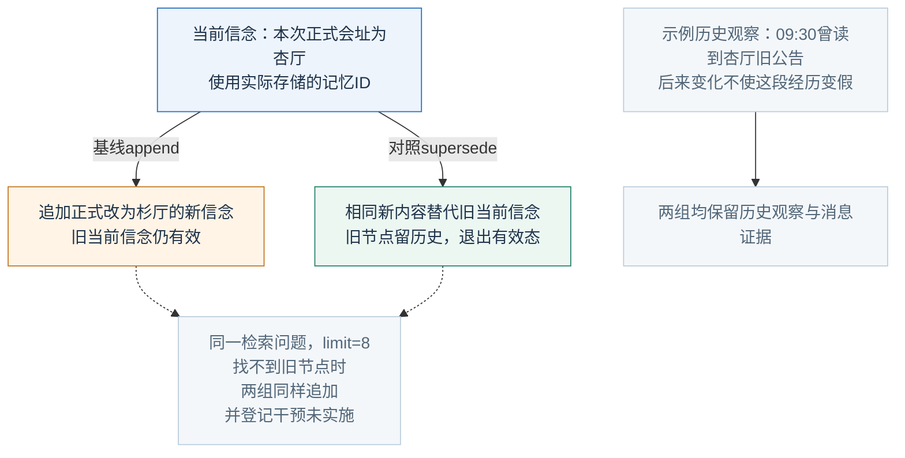
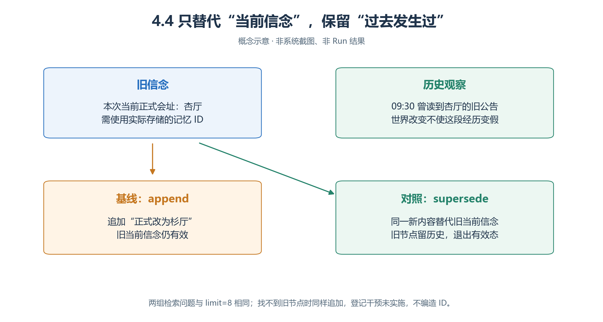
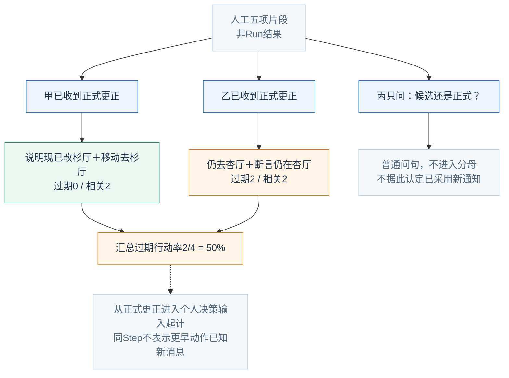
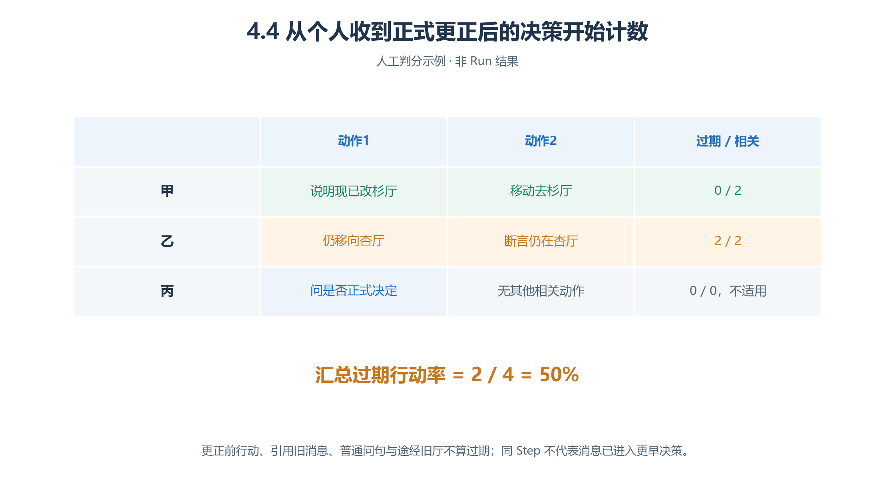

# 4.4 通知纠错：让过期消息退出当前认识

“原来在杏厅”“也许换到杉厅”“正式改到杉厅”是三种认识。**消息与行动目标相同，只改变旧信念的处理，能否减少收到正式更正后的过期行动？**

以下为虚构教案，尚无实验或Run，不预设替代策略一定获胜。

## 4.4.1 固定活动与初始知情分布

| 固定事实 | 教学值 |
| --- | --- |
| 活动 | 青禾读写交流，2026-11-07 10:30—11:00，Asia/Shanghai |
| 原会址／候选新址 | 杏厅／杉厅；因教案设定的投影检修申请更正 |
| 人数 | 计划六位来宾；只模拟协调员沈禾及叶青、吴悠、江辰三名参与者 |
| Run候选窗口 | 当天09:30—10:30，1分钟／步，61步；路线准备后校准并冻结 |

| 参与者／对象 | 初始资料 | 不得预塞 |
| --- | --- | --- |
| 沈禾 | 原通知、检修依据、杉厅可用；有权提出更正 | 三人已经收到的虚构确认 |
| 三名参与者 | 活动名称与时间，需要查询正式会址 | 检修、最终结果、他人私有记忆 |
| 公告对象 | 原通知，允许沈禾据检修申请改杉厅 | 推测的人物接收情况 |

两厅都容纳计划六人，时间与内容不变。公告初态 `original`、正文杏厅；真实更正后 `revised`，正文、生效时间、被采纳请求ID在对象状态中。**看见revised只知外观变化，不自动知道新地点。**

## 4.4.2 先完成原通知链，再触发更正

<!-- book-figure: correction-sequence -->



*图4.4-1　条件顺序示意，不指定第几Step完成。对象回复／接收仍须分别留证。*

先找第一段循环的终点：沈禾收齐三份真实确认，才有申请更正的条件。再看第二段循环：三名参与者各有自己的接收时刻，不能把公告改为revised的时刻当成三人同时知道杉厅。

**原图参考（转换前）**



四层可设“青禾社区→活动中心→公告区／杏厅／杉厅／连廊→物件”。公告绑定根Skill，两厅有可走连接；两组位置、碰撞、视野、交互距离相同，所有人初始知道四个场所的准确三层地址。

1. 三人真实INTERACT查询原公告，保存“本次当前正式会址为杏厅，来源原公告回复”。
2. 原信念只用自然语言，不附可能在替代时继承的旧地点SPO。
3. 三人分别真实SPEAK告知沈禾已查询。
4. 沈禾收齐实际确认才申请更正；缺人则追问，不代确认。
5. 窗口末还没正式更正，标“未形成纠错观察条件”，报告数量，不造更正时点，也不单独延长一组。

## 4.4.3 两组共同的条件式SOP

```text
尚未取得本次正式通知：接近公告，使用真实 selection_key 查询。
收到原公告：保存当前会址信念，再真实 SPEAK 向沈禾确认。
沈禾收到三份实际确认：向公告提交依据和完整更正申请。
公告处理真实待办，核对注入的请求者身份，再修改自身状态并回复。
沈禾收到正式更正确认：逐人发出内容相同的正式更正。
参与者收到来源明确的最终更正：执行本组记忆处理。
此前与某同伴交换过地点：按共同规则向其转告一次；否则不全员广播。
会址行动前，固定检索“本次活动当前正式通知与会址地点”，limit=8。
按最新已确认正式通知行动；候选建议、待确认申请、引用旧消息不当新正式地点。
成功 world-act 后结束本轮；动作前写待确认便签，下轮据真实反馈核实。
```

当前检索是 `file_lexical`，不是向量检索；相同问题可能取回不同有效节点。[实现核查](<../chapter 03/verification.md>) 基线也可能同时看到旧、新消息而选对；对照没收到通知也不会自动正确。地址记忆不更新导航知识，本案预知同样场所就是为了控制这一因素。

## 4.4.4 唯一变化：追加还是替代当前信念

<!-- book-figure: correction-belief-states -->



*图4.4-2　记忆状态示意。历史记录保留，不以删除过去来“证明纠错”。*

两条会址分支写入的新内容相同，变化只在旧“当前信念”是否仍有效。右侧历史观察回答“曾看到什么”，不回答“现在去哪里”；图中09:30是观察示例，真实记录须保留实际发生时间。

**原图参考（转换前）**



**基线：**

> 收到正式更正后，用 `memory-stream-append` 追加一条当前正式会址的新信念，写明来源和生效时间；保留原会址信念的有效态。

**对照：**

> 收到正式更正后，用 `memory-stream-supersede` 替代此前那条当前会址信念，使用其真实记忆ID，新内容与基线完全相同，并写明正式更正的理由。

替代的是“目前在哪里举行”，不是“09:30曾看过杏厅旧公告”。两组都先找真实旧节点；找不到时同样追加，登记干预未实施，不编ID或只替对照额外查询。工具可用性、检索、其余SOP、模型、窗口相同。只有撤销而无替代内容的 `invalidate` 留作另一实验。

## 4.4.5 按个人接收边界计数

证据链：**原回复→原信念→三份确认→更正请求→对象提交→个人实际接收→记忆处理→相关行动**。SPEAK一次只向一名其他Agent，三份通知需三次发言；发信者便签“已通知”不能代替接收证据。

个人窗口从更正进入其可读消息／观察的那次决策输入开始，计该决策及以后的相关动作。同一Step内有先后，不能把更早动作视为已受新消息影响。

| 指标 | 预登记口径 |
| --- | --- |
| **过期行动率** | 接收正式更正后的过期相关动作÷接收后的全部相关动作；按三人各自边界再汇总 |
| 更正覆盖率 | 实际收到正确最终更正的人数÷3；仅在已正式更正的Run报告 |
| 有效记忆纠正率 | 已证实旧信念退出默认有效检索的人数÷已接收且曾存旧信念的人数 |
| 传播时延 | 个人首次实际接收Step−对象正式提交Step；未接收者单列，不填窗口长度 |

相关动作只含：以正式会址为目标的已提交MOVE、在会址等候／参加ACT、向别人断言当前正式会址的SPEAK。一次MOVE计一个动作，不按格扩分母。普通问句、导航查询、拿遗落物、途经杏厅、更正前遵照原通知，均不算过期。

零相关行动记不适用；零过期不代表传播全面，须同时看覆盖率。记忆纠正还需**节点有效态＋固定问题的真实检索**；一次限量检索没返回旧节点不够。N人中s已证实、u未核验，报告范围 `[s/N,(s+u)/N]` 与u，不强判未知。

## 4.4.6 人工判分与失败解释

<!-- book-figure: correction-scoring -->



*图4.4-3　人工五项片段，不对应Run。问句不进入相关行动分母。*

先在甲、乙上方检查“已收到正式更正”，再数下方的相关动作：两人各两项，共四项；丙的普通问句没有进入分母。这里数行动而非人数，故2/4不能读成“一半人仍相信旧会址”。

**原图参考（转换前）**



甲收到正式更正，说“原先杏厅，现在改杉厅”并移往杉厅：0/2过期；乙收到后仍移往杏厅并断言旧地点：2/2；丙只问“候选还是正式？”：不计。汇总 **2/4＝50%**，不能把丙没行动说成采用正确通知。只收到候选建议者，个人纠错窗口尚未开始。

| 看到的情况 | 合理解释 |
| --- | --- |
| 历史导出仍含旧公告 | 保留历史，不等于替代失败 |
| 仅有SUPERSEDED标签 | 仍需新节点、检索和后续行动 |
| 消息正常，行动仍旧 | 查来源判断、检索、待确认进度 |
| 公告根本没改 | 先报触发未满足，不叫模型遗忘 |

从“结果→Agent→人物→记忆／对话”找摘要，再用已提交记录／导出核对ID与替代关系。

**练习：**“我记得旧公告是杏厅，但现在请去杉厅”为什么不是传播过期通知？再独立设计只有撤销、没有新址时的invalidate条件，不把它混入本次对照。

[上一节：展馆导览](03-gallery-wayfinding.md) · [返回本章](README.md) · [下一节：小组协作学习](05-collaborative-learning.md)

