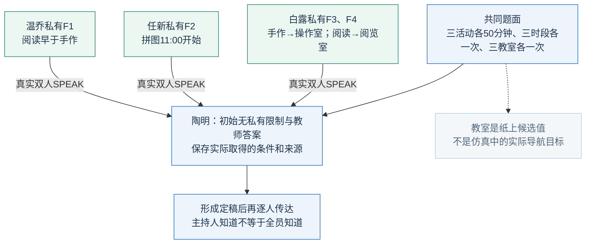
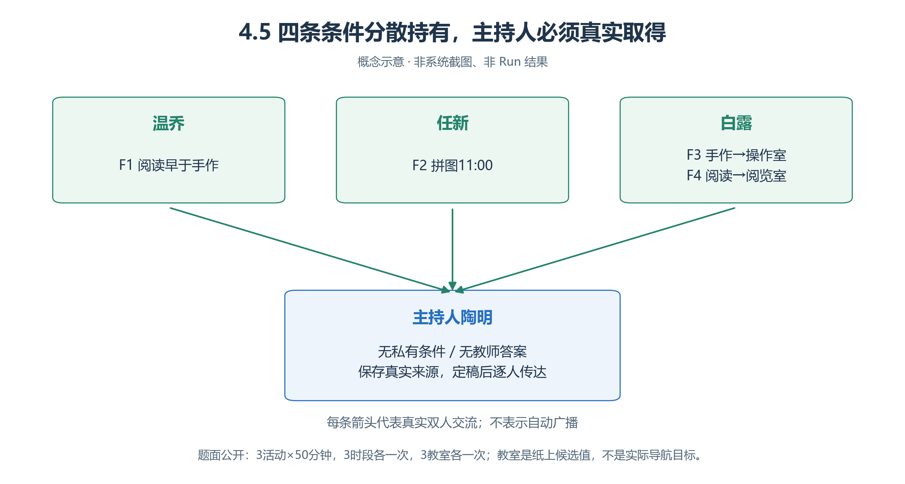
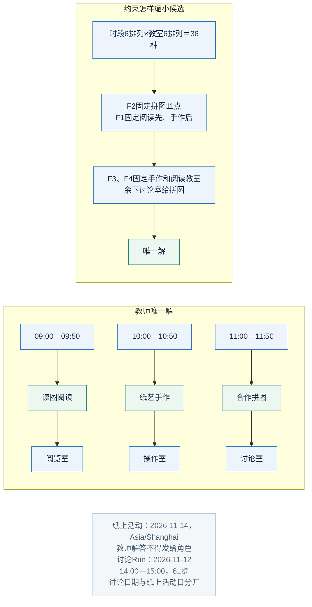
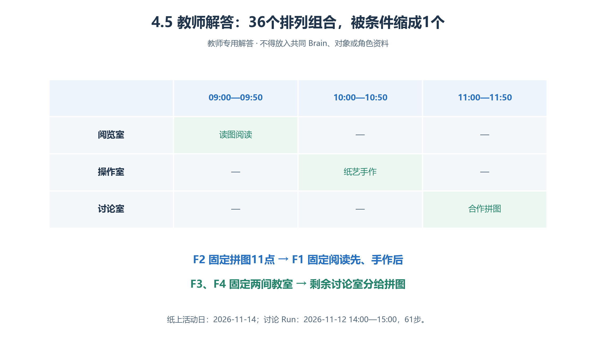
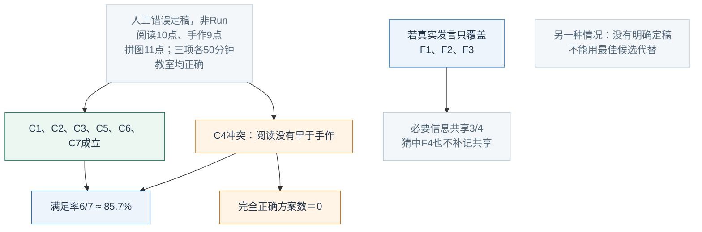
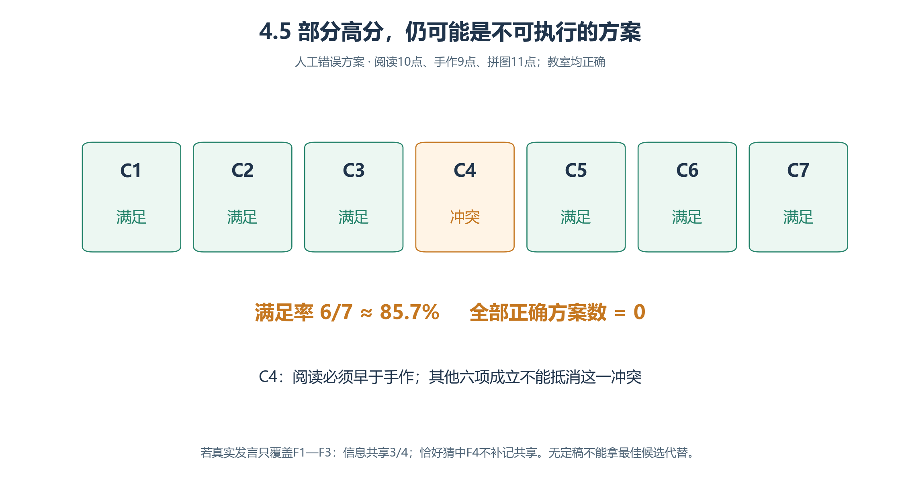

# 4.5 小组协作学习：把分散条件变成有依据的结论

答对可能是猜中，发言多也不代表条件齐。**信息分散给三名成员，主持人定稿前显式核对约束，是否改善最终方案？**

本案是有唯一解的虚构题，尚无Run；不证明现实学生的成绩或教学效果。

## 4.5.1 完整共同题面

> 为2026年11月14日的读图阅读、纸艺手作、合作拼图排程。每项50分钟；只能09:00、10:00、11:00开始，时区Asia/Shanghai，每时段恰一项。教室只有阅览室、操作室、讨论室，每间在本题恰用一次。每项须有时段与教室。三位成员另持四条限制：温乔一条、任新一条、白露两条。主持人通过交流取得条件，说明完整安排与依据。

“教室只用一次”是题目限制，不能以现实中可复用为由取消。世界内做阅读、讨论和定稿，**不真正举办这三项活动**。

讨论Run候选为 **2026-11-12 14:00—15:00，1分钟／步，61步**，与纸上活动日分开；执行前校准冻结，不能为等11点拼图而停止讨论。

## 4.5.2 条件卡只能分别发给持有者

<!-- book-figure: learning-information -->



*图4.5-1　信息分配示意。三条标有SPEAK的箭头表示成员真实传递私有条件；共同题面箭头表示输入来源，定稿后仍须逐人传达。*

白露到陶明只有一条人物连线，却承载F3、F4两条限制。核对时要分别找两条事实的真实内容，不能按箭头数判成三条条件，也不能把主持人已收到当成全员已收到。

**原图参考（转换前）**



| 角色 | 只给本人的条件／任务 |
| --- | --- |
| 温乔 | F1：读图阅读必须早于纸艺手作 |
| 任新 | F2：合作拼图必须11:00开始 |
| 白露 | F3：手作必须操作室；F4：阅读必须阅览室 |
| 主持人陶明 | 无私有限制、无教师答案；汇总实际收到的条件 |

成员准确表达自己的条件，不补造他人限制；白露须把两条独立事实说清。完整卡片表不得进入共同Brain、主持人初始记忆或题面对象。

四层可设“青禾社区→学习站→讨论区／资料区→题面卡”。四人知道两区地址；对象只答共同题面，不给解答。三个教室是纸上候选值，不必建真实Arena，也不能说选教室等于实际移动。

## 4.5.3 双人交谈与最终版本

```text
理解共同题面和自己的条件卡，不知道的保持未知。
被询问时，真实 SPEAK 向一人说明条件编号、完整限制和来源。
遇含糊或冲突向实际来源追问，不从教师资料补齐。
主持人保存收到的条件与来源，提出候选，必要时逐人说明。
成员仅按已获限制检查候选，指出冲突及还不知道什么。
准备结束时，主持人按本组方法核对，通过真实发言给出标明“最终方案”的完整安排。
再逐人传达同一最终方案；修改时说明新旧关系。
按事实更新记忆；成功 world-act 后结束本轮。
```

一次SPEAK只对一名其他Agent；主持人知道≠其他人都知道。“公开表达”在本案指至少真实传给一名组内接收者，可审查但不等于全员接收。

以**主持人最后一次明确、完整的定稿发言**判分，另登记三名成员谁收到该版本。同案向三人传达不算三项结论；私人反思不算小组定稿。

## 4.5.4 唯一变化：是否显式调用核对子Skill

| 共同条件 | 相同题面、卡片、询问澄清策略、模型、位置、对象、窗口与依赖 |
| --- | --- |
| 基线段 | 存在冲突或准备定稿时，依据已收到信息自行整理方案与说明；不调用逐项核对子Skill |
| 对照段 | 存在冲突或准备定稿时，调用逐项核对子Skill，传入共同题面、已收到限制及来源、当前完整候选；同候选与同条件集合只核对一次，据返回缺口决定追问、修订或定稿 |

子Skill只列输入已有规则，逐项标“满足／冲突／缺信息”，说明有依据推导并返回待询问题；不新增未知条件、不写记忆、不世界动作。没收到白露两条件就标缺口，不猜教师答案。

两组都知道共有四条私有限制，也都能追问；对照只多显式核对，不多正确答案、时间或更强模型。额外调用、晚定稿和仍出错都保留。

## 4.5.5 七项判据与不同分母

| 编号 | 最终方案必须满足 |
| --- | --- |
| C1 | 恰三项规定活动，各一次，无遗漏／新增 |
| C2 | 09、10、11点各一次，结束均为开始后50分钟 |
| C3 | 三间规定教室各一次，无其他教室 |
| C4 | 阅读开始早于手作 |
| C5 | 拼图11点开始 |
| C6 | 手作在操作室 |
| C7 | 阅读在阅览室 |

**主指标＝满足条件数÷7。**字段缺失、矛盾或不可判不给分，表达措辞不影响；无明确最终方案标“未定稿”，不拿最佳候选替换，也不删除该Run。

| 同时报什么 | 为什么 |
| --- | --- |
| 全七项满足的Run数÷全部预定Run数；定稿覆盖 | 七项不是七种独立能力，高部分分不等于能执行 |
| 真实准确表达过的F条件数÷4 | 必要信息共享；重复不重计，不证明全员理解 |
| 有效贡献发言÷三成员全部任务相关发言 | 新必要事实、纠错或有依据推导算有效；一条含两条件仍只计一条 |
| 全部样本逻辑调用÷完全正确方案数 | 含人物、对象、失败和无定稿成本，物理重试另列，零正确不可计算 |

## 4.5.6 教师解答与人工判分

**以下仅给教师，不得进入角色、共同Brain或题面对象。**

<!-- book-figure: learning-teacher-schedule -->



*图4.5-2　教师解答，非人物已完成排程的实测证据。*

先读“约束怎样缩小候选”，再对照三行安排：F2拿走11点，F1确定剩余两时段的次序；F3、F4固定两间教室，第三间才随之确定。下表把图中的时间、活动、教室写成可逐项核查的同一答案。

**原图参考（转换前）**



| 活动 | 开始—结束 | 教室 |
| --- | --- | --- |
| 读图阅读 | 09:00—09:50 | 阅览室 |
| 纸艺手作 | 10:00—10:50 | 操作室 |
| 合作拼图 | 11:00—11:50 | 讨论室 |

F2固定11点，F1使阅读／手作只能依次09／10点；F3、F4定两室，余室给拼图。没有四私有限制时，时段6排列×教室6排列＝36种；全部限制缩成唯一解。

<!-- book-figure: learning-scoring -->



*图4.5-3　人工错误方案，不来自Run。*

沿C4分支看：已明确给出的方案违反先后顺序，虽得6/7，仍不是完全正确。独立的“没有明确定稿”提示是另一种缺口，不能把本例误读成未定稿；F条件共享3/4也另有发言分母，不由方案得分推算。

**原图参考（转换前）**



例：阅读10:00—10:50在阅览室，手作09:00—09:50在操作室，拼图11:00—11:50在讨论室。只违C4，**6/7≈85.7%，完全正确数仍0**。

若发言只覆盖F1、F2、F3，共享率3/4＝75%；猜中阅览室不补记F4共享。“设备安排没意见”也未表达具体活动与教室，不能得该事实分。

## 4.5.7 失败定位与练习

| 失败位置 | 查什么 |
| --- | --- |
| 未传条件 | 持有者发言、接收上下文 |
| 收到却漏掉 | 主持人记忆、核对输入 |
| 推导错误 | 子Skill输出、候选与七判据 |
| 修订后未重发 | 最后定稿版本、接收者 |

结果页“Agent→人物→对话／记忆”先找摘要，再核对完整证据。此评分是教材外部评价，不称系统已执行业务Evaluator。[评价边界](<../chapter 03/12-quality-and-evaluation.md>)

**练习：**删F1，保留其他条件，阅读／手作09与10点有两种排列，不能唯一确定。再比较重复复述与指出“阅读比手作晚”的有依据反驳：话更多不等于贡献更多。

[上一节：通知纠错](04-information-correction.md) · [返回本章](README.md) · [下一节：公共议题协商](06-public-deliberation.md)

