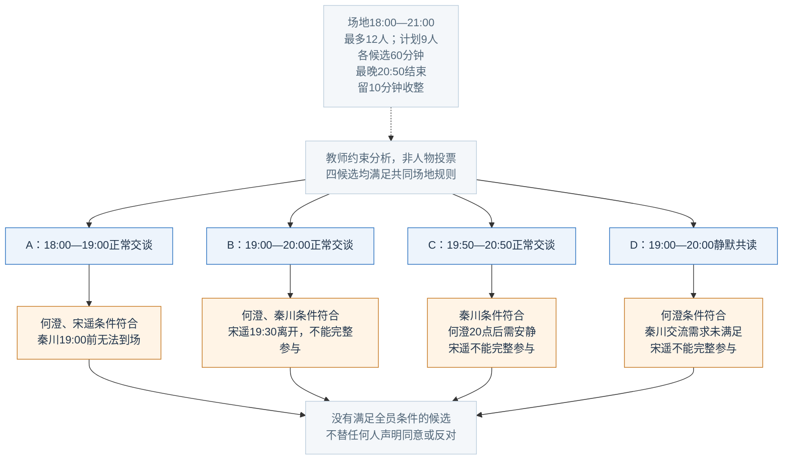
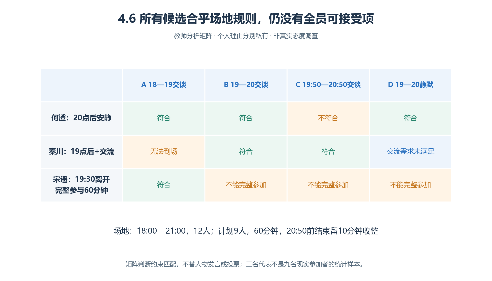
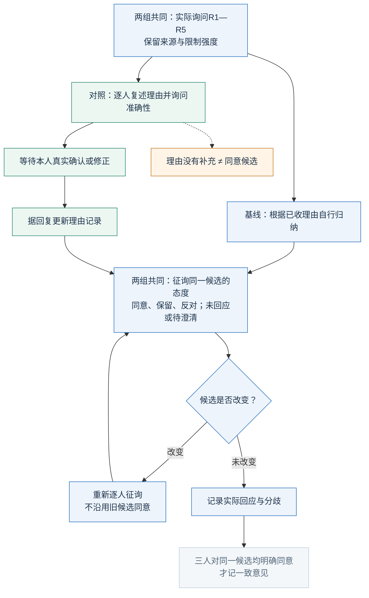
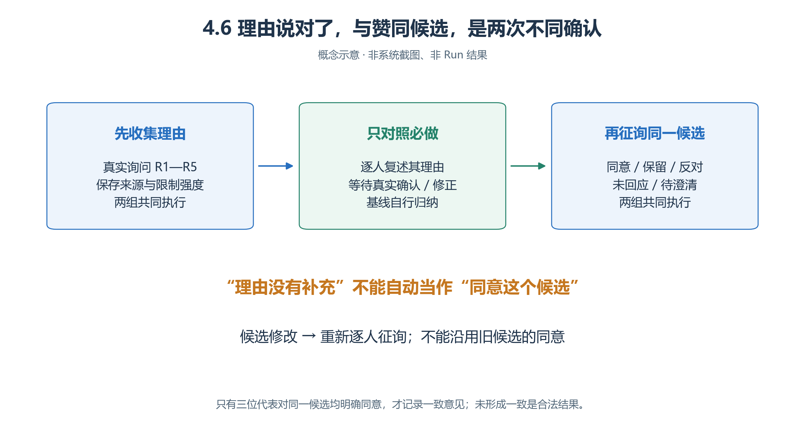
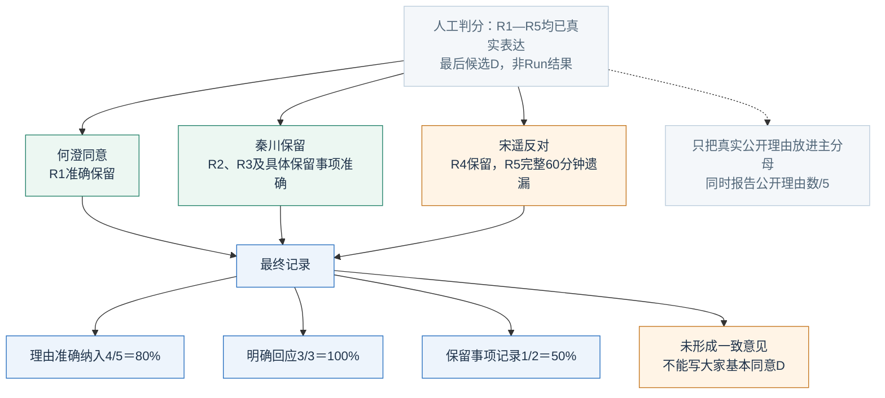
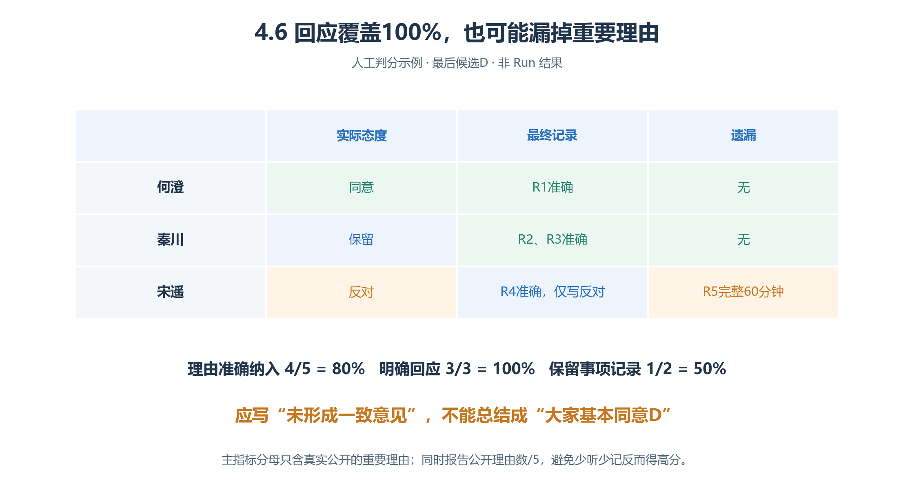

# 4.6 公共议题协商：把理由与分歧准确留下来

上一题有唯一解，本题**不以“大家同意”判成功**。研究问题是：定稿前逐人确认理由是否被准确表达，能否减少重要理由和反对意见的丢失？

人物、场地和材料均虚构，尚无Run；不代表现实人群支持率、政治倾向或政策效果。

## 4.6.1 共同事实与四个候选

活动日 **2026-11-21**，共享活动室体验一次60分钟，计划九人；只模拟三位代表与主持人杜宁。不涉及永久政策、收费、资格或审批。

场地说明牌持有共同规则：Asia/Shanghai的18:00—21:00可用，最多12人；最后10分钟收整，活动最晚20:50结束。模式只有正常交谈、静默共读；无隔音分区、远程参加、自动延时，也没有噪声物理模型。

| 候选 | 时间 | 模式 | 场地规则 |
| --- | --- | --- | --- |
| A | 18:00—19:00 | 正常交谈 | 满足 |
| B | 19:00—20:00 | 正常交谈 | 满足 |
| C | 19:50—20:50 | 正常交谈 | 满足，余10分钟收整 |
| D | 19:00—20:00 | 静默共读 | 满足 |

符合场地规则不等于满足个人需求。**三人对同一候选均明确同意才记一致**；保留、反对、未回应都如实记录，主持人不能临时改成多数通过。

## 4.6.2 私有理由与教师分析分开

| 代表 | 只发给本人的理由 |
| --- | --- |
| 何澄 | R1：20:00后需要安静，不可妥协；不反对20点前交谈或静默活动 |
| 秦川 | R2：19:00前无法到场，固定条件；R3：希望口头交流，静默可保留但不能称交流需求已满足 |
| 宋遥 | R4：19:30必须离开赴另一承诺；R5：完整参与60分钟才接受，不能把半程当完整参加 |

主持人、其他代表初始不知道这些理由，共同Brain只含表达与核对方法。人物不能为圆满故事取消硬条件。

<!-- book-figure: deliberation-constraints -->



*图4.6-1　教师分析，不是实际投票或人物公开知识；不得作为共享答案。*

逐列从候选读到个人条件：A被秦川的到场时间挡住，B、C、D均不满足宋遥完整参与。C恰在20:50结束，仍符合场地规则；问题出在个人约束。没有全员满足的候选，也不授权主持人替别人投票。

**原图参考（转换前）**



A不满足秦川到场时间，B/C/D不满足宋遥完整参与。**这不是隐藏正确候选，而是检查是否强造一致的背景。**

四层用“青禾社区→活动中心→协商区／资料区→场地说明牌”。四人知道两区地址，对象只答共同事实。讨论Run候选 **2026-11-20 14:00—15:15，1分钟／步，76步**，不等待次晚活动举办。

## 4.6.3 共同SOP：态度必须针对具体候选

```text
代表被询问时说明自己的理由与不可调整条件，不替别人宣布态度。
收到候选后按实际已知时间、模式判断；不清楚先问，沉默不表示同意。
主持人核实场地事实，逐人询问理由，记录来源和未确认内容。
提出候选时说明编号、时间、模式及尚未满足的要求。
按本组方法整理理由，再将同一候选逐人发给三人，问同意、保留或反对。
只记真实回应：未回应如实标记，含糊表态待澄清。
更改候选后重新问三人，不沿用对旧候选的同意。
最终记录候选、已表达理由、各方回应、未决事项、有无一致意见。
通过真实发言逐人传达，不在一句话里虚构全体确认。
```

SPEAK每次只有一名其他接收者，主持人听到不等于全员知道。“理由还有补充吗？”之后回答“没别的补充”，不能算候选投票。态度按含义判断，不机械要求指定词；仍不清楚再澄清。

## 4.6.4 唯一变化：理由复述确认

<!-- book-figure: deliberation-confirmations -->



*图4.6-2　两类确认的对象不同，不能互相替代；额外轮次和等待均为干预成本。*

绿色分支核对“我是否准确理解你的理由”，两组汇合后才问“你对这个候选什么态度”。沿回环检查：如果B改成D，旧B的同意不能穿过回环沿用。两个确认环节都要真实回复，不能由主持人代答。

**原图参考（转换前）**



**基线：**

> 根据已收到的理由自行归纳，然后进入对同一候选的逐人态度征询；不设置必做的逐人理由复述确认环节。

**对照：**

> 先逐人复述自己对该代表理由的理解，询问是否准确；依据对方真实确认或修正更新记录，再进入与基线相同的逐人态度征询。

其余场地核实、询问理由、候选征询、最终记录、模型、人物条件和窗口相同。向何澄说“你反对晚上活动”已歪曲R1，须真实询问、等待纠正，不能脑内代答。

对照至少分别问三人并获回复，可能晚定稿甚至未定稿；基线自然出现复述也保留，比较的是规定方法，不删不合预想的行为。

## 4.6.5 主要指标：记录已经讨论过的理由

**理由准确纳入率＝最终记录准确纳入的重要理由数÷讨论中已真实公开的重要理由数。**

R1—R5预先登记，每条一次；教师知道但角色从未说出的内容不入分母。准确纳入须保留主体、关键时间／内容、限制强度和原意；“19:30必须离开”不能缩成“希望早点回去”。部分正确留解释，不给半分；可以说明不采纳，但不能省略该要求。

| 同时报什么 | 分母与边界 |
| --- | --- |
| 重要理由公开率 | 已公开R项÷5；只听一项可能准确率100%，却不全面 |
| 最终记录状态 | 未定稿单列；理由分母0记不适用 |
| 明确回应覆盖率 | 对最后候选有明确态度的代表÷3；无最后候选记未进此阶段 |
| 保留事项记录率 | 准确保留原意的反对／保留事项÷最终征询实际提出的此类事项；无事项不适用 |
| 事实性错误比例 | 矛盾或无依据冒充场地事实的声明÷全部可核验场地事实声明 |

“容量30人”可判错；“更喜欢交流”是偏好；“担心太晚影响休息”是理由／担忧，不能仅因无实验数据判为错误事实。**支持率不是主要成功指标。**

## 4.6.6 人工判分：全员回应，不等于理由完整

<!-- book-figure: deliberation-scoring -->



*图4.6-3　人工构造：R1—R5都已真实表达；并非Run结果。*

从宋遥这一支追到四个结果：反对已被记录，所以回应覆盖是3/3；但R5和完整反对原因遗漏，理由只得4/5、保留事项只得1/2。分歧可以被准确记录，“全员回应”不能改写为“全员同意”。

**原图参考（转换前）**



最后讨论D：何澄同意，秦川因不能口头交流保留，宋遥因不能完整参加反对。记录准确保留R1—R4，遗漏R5；完整记录秦川保留事项，却只写“宋遥反对”而没写完整原因。

| 理由准确纳入 | 明确回应 | 保留事项记录 | 一致意见 |
| --- | --- | --- | --- |
| 4/5＝80% | 3/3＝100% | 1/2＝50% | 未形成 |

写“大家基本同意D”是另一个结论歪曲。准确留下全部分歧、未有可接受方案，也可以具有较高记录质量。

证据连接：**理由原文→场地回复→候选版本→复述及修正→明确态度→最终记录**。结果页“Agent→人物→对话”找摘要，再核对参与者、顺序与全文；私人总结不替代公开记录。[对话边界](<../chapter 03/07-conversation-and-objects.md>)

## 4.6.7 失败解释与练习

| 问题 | 解释要点 |
| --- | --- |
| 对照仍遗漏 | 是否等到回复？复述是否已带偏？定稿是否又删硬条件？ |
| 宋遥未回应 | 登记阶段与缺口，不推断默认接受 |
| 收到B同意，定稿成D | 应重新征询，不能移用态度 |
| Run为COMPLETED | 仅执行结束，不代表共识或现实决策有效 |

**练习：**分别记录“同意D但希望将来交流”“对D仍保留”“未回答”，不能合成一类。再指出把何澄“20点后需安静”写成“不愿参加”，丢失了时间范围与真实意愿。

[上一节：小组协作学习](05-collaborative-learning.md) · [返回本章](README.md) · [下一节：场地临时关闭](07-route-closure.md)

