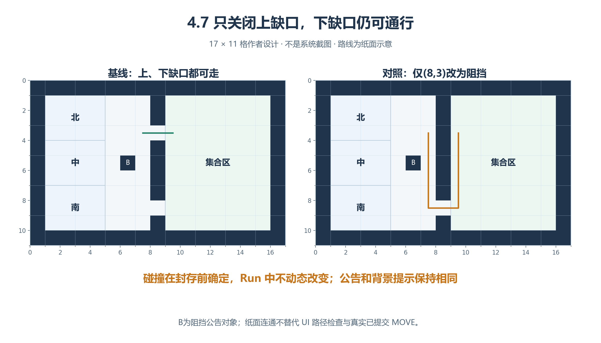
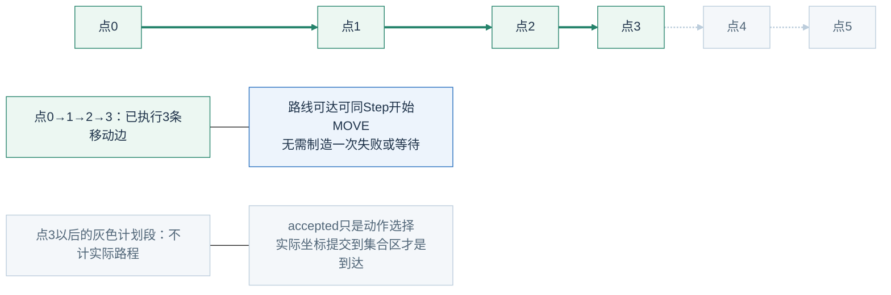
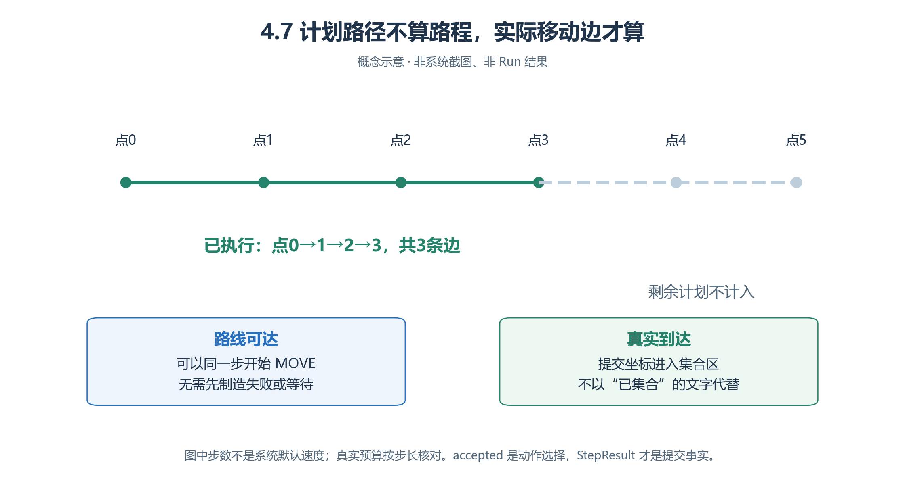
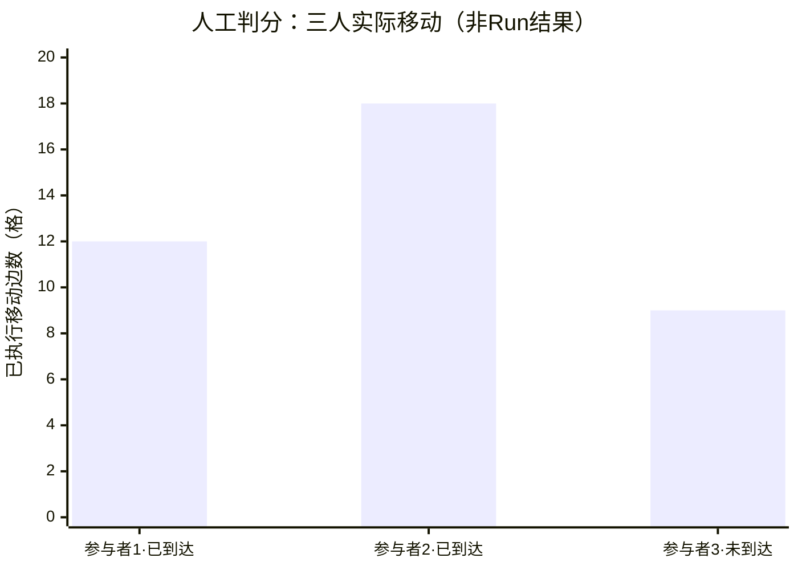
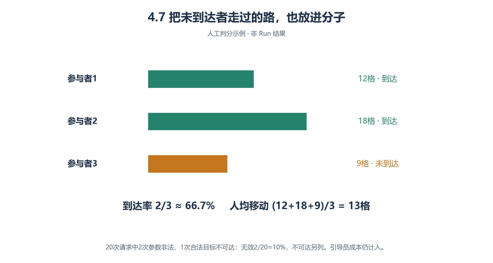

# 4.7 场地临时关闭演练：同一个目标，两种可走条件

常用通路关闭，目标仍可能可达；导航可以直接返回绕行路线，不必先撞墙。**目标和信息相同，只关一处缺口，怎样影响集合与移动负担？**

“白榆社团资料交流日”为虚构教案，尚未创建地图、实验或Run。“临时”指本次采用关闭布局，碰撞在封存前确定，**Run中不动态改变**。

## 4.7.1 用地图说明唯一干预

*图4.7-1　17×11格作者网格，非系统截图／路径结果；折线仅表示候选绕行方向。*

先比较墙上两处缺口：只封(8,3)，(8,8)仍开。橙色折线提示下口可能提供绕行方向，不能当作某人已走的路径或精确路长；南区人物原本就可能走下口，因此关闭不必同样影响三个人。

World“白榆校园”→Sector“社团活动中心”，均覆盖整图。坐标从0开始，外边框阻挡，内部墙 `x=8`；基线开 `(8,3)` 与 `(8,8)`，对照只封上缺口。

| Arena／对象 | [x,y,width,height]或占格 |
| --- | --- |
| 北等候区 | [1,1,4,3] |
| 中等候区 | [1,4,4,3] |
| 南等候区 | [1,7,4,3] |
| 连接区 | [5,1,4,9] |
| 集合区 | [9,1,7,9] |
| 公告对象B | 连接区(6,5)，占格阻挡 |

程夏、沈禾、杜衡分别从北／中／南出发；引导员叶青从连接区开始。三人有真实集合区地址，没有教师完整碰撞表；其他地址依已知空间与感知取得。

公告两组同文：“请依据当前导航结果前往集合区；如有具体问题，可咨询现场引导员。”它不透露额外组别信息。

纸面可从(7,3)沿x=7至(7,8)，经(8,8)、(9,8)再向北，不穿墙或公告。原作者四邻接检查为127／126可走格，各组全连通、每可走格恰有一Arena；**这是纸面自洽，不是系统寻路验收**。墙与门洞也归对应语义区域。

## 4.7.2 作者操作：只动一个碰撞格

1. 制作开放布局，复制为独立草稿；只将(8,3)改阻挡，分别封存。
2. 两组同一抽象背景，以不承诺开闭状态的地面标记显示通口；不额外改外观、公告、视野或引导策略。
3. 地图“世界→通路”中确认是对照副本，Ctrl编辑目标格；保存、离开、重开，核对上封、下开、邻格没误涂。
4. 用“路径检查”核对东西连接；运行时仍须查内嵌地图与真实MOVE。预检不替代。[通路实现](../../../src/generative_agents/adapters/web/static/resources/map-navigation.js)
5. 人物出生经空间选择器保存；两组实际坐标一致，不改文件绕过UI。

| 固定项 | 本案值 |
| --- | --- |
| 参与者 | 3名集合者＋1名引导员＋1公告对象 |
| 时间 | 2026-10-22 14:00—14:30，Asia/Shanghai，1分钟／步，31步 |
| 其余条件 | 模型、采样、Skill、人物、注意力、视野、实际出生、审计设置一致 |
| 干预 | 仅上缺口从可走到阻挡；下缺口不变 |

每组同预算先一Run，再按预登记计划决定重复；同世界三人不是三个独立实验。完整31步有 `5×31=155` 参与者轮次，**不等于155请求**；含引导员、对象、失败与物理重试的全部成本。

## 4.7.3 两组同一条件式Brain

> 我的目标是进入本次实际配置的集合区。先读当前坐标、地址和有效进度，再用真实已知地址查询路线。若返回可达且仍需移动，保留相同完整目标提交MOVE；下一轮以实际位置判断进度。若已进入集合区，记录待核对的到达信息，并在当前位置进行一次集合准备ACT。若目标合法但确实不可达，保存原因，再咨询实际可交互公告或可见引导员。参数被拒时按具体错误修正，不猜地址、不扩大视野突破上限。每轮成功选择世界动作后结束。

引导员只帮助当前感知到的人，说明已知目标与真实查询；不知道通路就请重查，不穿墙、不替人移动。公告按真实请求ID回复，目标下轮接收；“恢复通行”文字不改变碰撞。

导航直接给下口可达路线时，可同Step选择MOVE，不加虚构失败／等待。1分钟默认移动预算四格，实际还受路径长度限制；中途下一轮按实际位置查询同一完整目标，**next_coord不是整个目标**。完整剩余路径由教师查提交事实，不假设Agent上下文已暴露。[导航](../../../src/generative_agents/ga_runtime/capabilities/server.py)、[移动预算](../../../src/generative_agents/ga_runtime/engine/scheduler.py)

## 4.7.4 实际移动与真实到达

<!-- book-figure: closure-executed-path -->

*图4.7-2　概念路径，不是默认速度示例。绿色是已执行边，灰色计划段不进入实际路程。*

从起点0数到实际终点3，有四个路径点、三条移动边；把点数直接当格数会多计一格。灰色点4、5尚属计划，不能据此宣布抵达。到达率还须把已提交终点坐标放回集合区语义范围判断。

**原图参考（转换前）**

证据链为**导航输入／结果→MOVE选择→执行路径→实际坐标／地址**。`accepted`只表示动作选择接受；世界提交进入StepResult后才是回放事实。

本案到达定义：已提交状态的实际坐标进入集合区，每人记首次，不要求站在指定点。准备ACT是补充，**不是到达率必要条件**。南区人物基线就可能走下口，关闭上口不必影响每个人；解释时列三人起点、路线和结果。

## 4.7.5 指标与人工判分

| 指标 | 口径 |
| --- | --- |
| **集合到达率** | W内首次进入集合区人数÷3；引导员不入分母 |
| 人均移动负担 | 三人W内全部已执行路径边数÷3，格／人 |
| 路线执行启动时延 | 首次获得目标可达路线→首次实际朝该目标MOVE，虚拟分钟，可为0 |
| 无效请求率 | 地址、目标证据、权限不合法的导航／MOVE拒绝数÷全部导航／MOVE请求 |

数组含起点不多计一格；重复查询不产生位移。合法目标确实不可达另列，不入参数无效分子；未得路线与得路线但未执行分别记录。零请求分母不适用；截止未到达者保留最后状态与原因。

<!-- book-figure: closure-scoring -->

*图4.7-3　人工评分数字，非Run结果。*

先看横轴的到达状态，再看柱高：9格那人尚未到达，短柱不表示更高效率。三柱之和39都进入移动成本，只有标“已到达”的两人进入到达分子；下面的两个公式分别除以同样三人。

**原图参考（转换前）**

三人分别12、18、9格，前两人到达、第三人中途停下：**到达2/3≈66.7%，移动39/3＝13格／人**。失败者走得短不能证明效率高。

20次导航／MOVE请求，2次地址非法、1次合法目标不可达：无效率2/20＝10%，不可达另报1。可达查询同Step执行的启动时延0，未执行者不补时间。

## 4.7.6 失败分层与练习

| 现象 | 解释／处理 |
| --- | --- |
| 根本没有替代通路 | 装配不满足题目，留证，不改Run碰撞冒充原对照 |
| 路存在但反复询问 | 分析行为与调用预算 |
| 缺目标知识被正确拒绝 | 合同边界，不自动报bug |
| 已执行路径穿阻挡格 | 核对事实，按项目规则停止验收并报告 |
| 开始MOVE但未到达 | 查实际路程、剩余路径、窗口；区别于未启动 |

两组全到达也有效，可用路程解释代价；不得事后换指标或删掉不按预想走的人。此案无现实疏散、容量或物理运动模型，不能推断场地安全。

**练习：**解释“关闭后直接返回可达”为什么正确。若研究提前通知，应另建同一关闭图、只改通知策略的实验；若改成确实不可达目标，另定问题并把正确拒绝作为预期。

[上一节：公共议题协商](06-public-deliberation.md) · [下一节：长时程校园生活](08-long-horizon-memory.md) · [返回本章](README.md)

