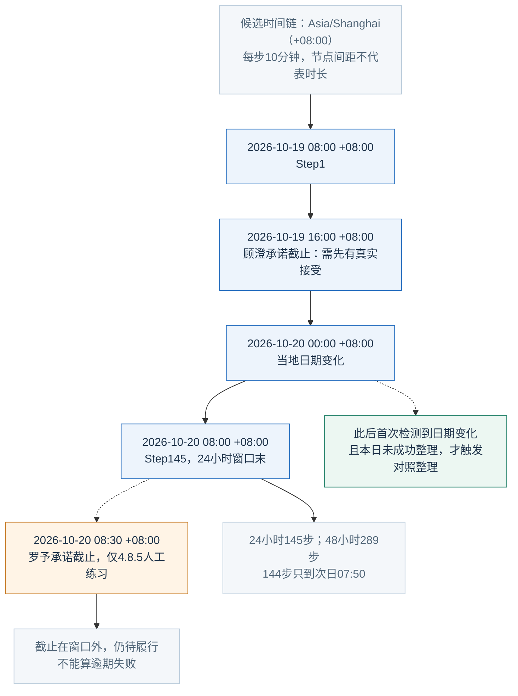
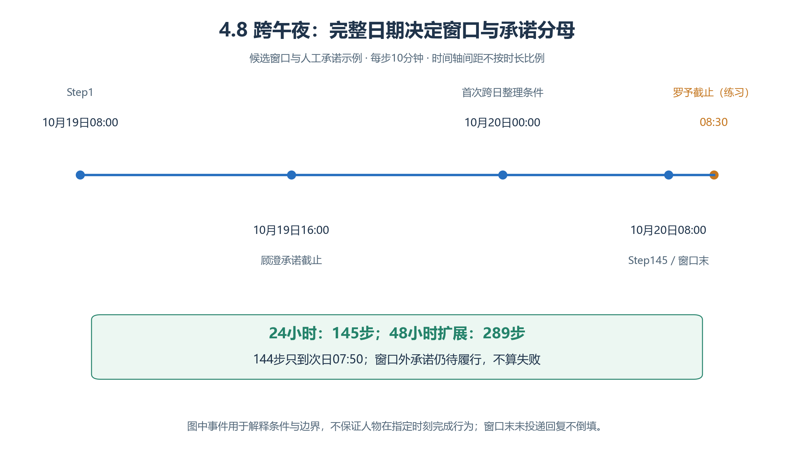
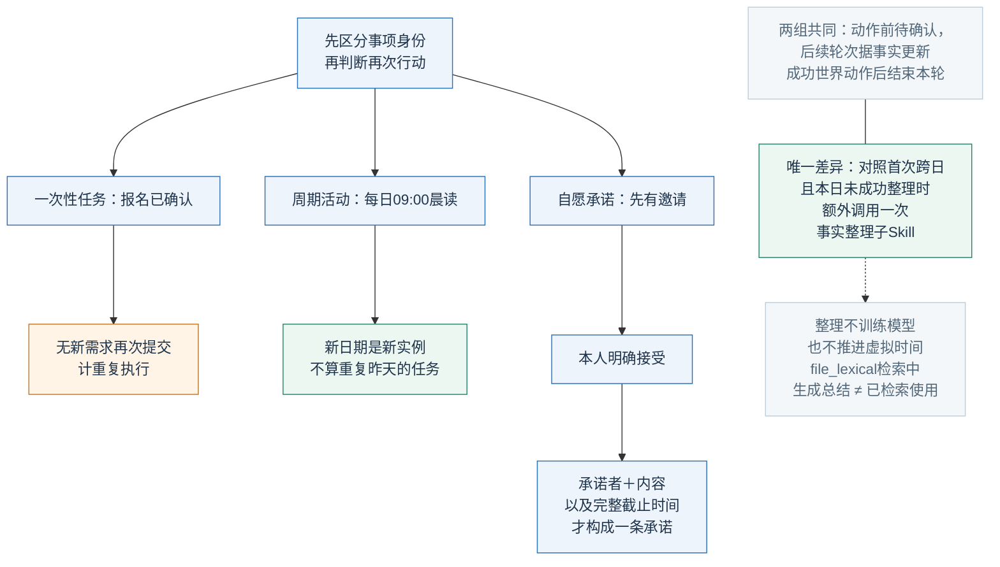
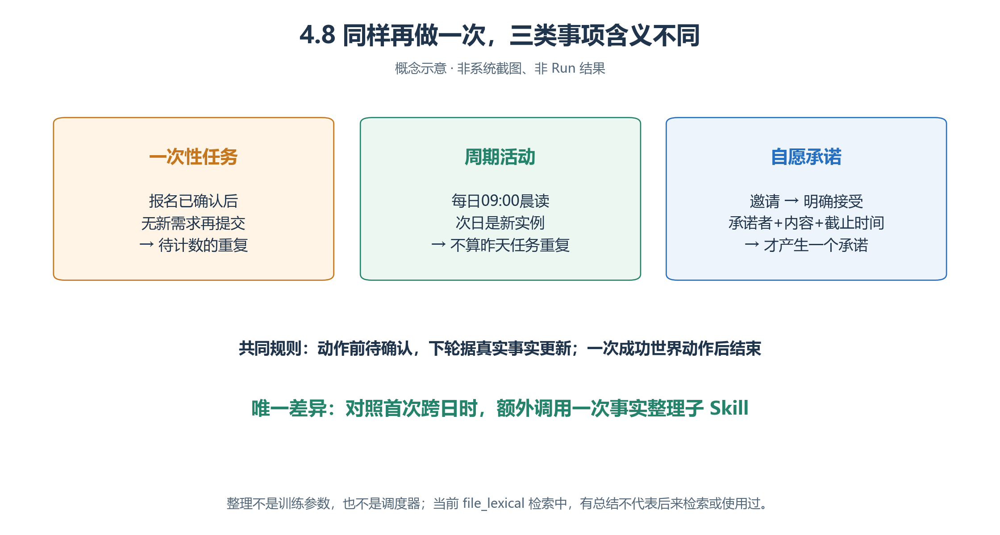
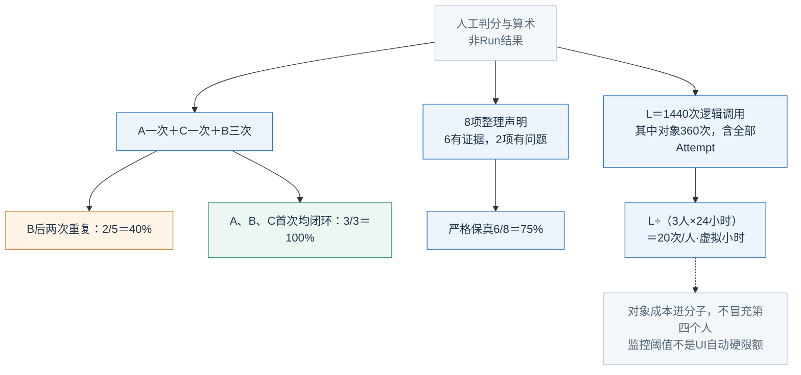
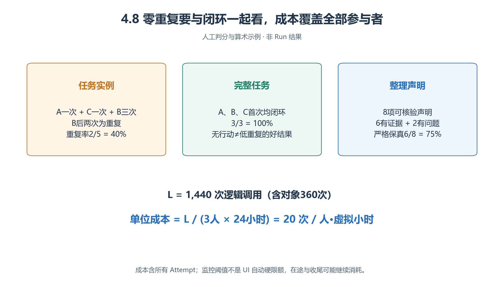

# 4.8 长时程校园生活：跨过午夜以后，还记得什么

昨日办完的事是否重做？承诺会不会跨日丢失？总结是否把“待确认”写成“已完成”？本案比较两种记忆整理策略，**不把跑得久当成智能提高**。

“白榆校园开放学习周”为虚构设计，尚无资源包、Run或成绩；投入长跑前应满足[第三章恢复与证据条件](<../chapter 03/verification.md>)。

## 4.8.1 把一次性任务、周期活动、承诺分开

World白榆校园→Sector学习生活区→居住／阅览／讨论／公共休息四个相邻Arena。唐悠、顾澄、罗予三名学习者，休息区一个咨询台；无课程、饥饿或疲劳物理模型，休息／学习是活动语义。

| 类型 | 完整任务 | 成立证据 |
| --- | --- | --- |
| 一次性A | 唐悠向咨询台核对阅览约定，再准确转述顾澄 | 真实回复、转述、顾澄相关回应 |
| 一次性B | 顾澄提交一次观摩报名意向 | 对象对真实请求确认接收，仅证明意向收到 |
| 一次性C | 罗予核对讨论室使用说明，再转述唐悠 | 查询与消息链齐全 |
| 周期活动 | 每日09:00—10:00倾向晨读，20:00—20:30倾向晚间整理 | 活动名＋当地日期识别，不是内核强制 |
| 自愿承诺 | 唐悠邀请顾澄最晚2026-10-19 16:00 +08:00在阅览区开始笔记交流 | 顾澄明确承诺本人行动后才有其一条承诺 |

咨询台固定资料：阅览区安静，可交流处是讨论区；报名只记本周意向；讨论室使用前先确认当前说明。它没有真实座位、库存或报名锁。初始目标只放各自任务，不共享全部答案和他人进度。

承诺按**承诺者、内容、完整截止时间**识别；邀请不等于接受，也不自动给邀请者添加承诺。两人均明确自我承诺才计两条。兑现需本人实际到阅览区，并在截止前或当时向约定对象SPEAK实质笔记内容，仅到场／自称交流不够。

## 4.8.2 先算时间，再决定跑多久

<!-- book-figure: memory-timeline -->

*图4.8-1　候选时间轴，间距不按时长比例；罗予08:30的承诺来自4.8.5人工练习。截止和触发条件不是已发生行为。*

从Step145窗口末往后看，08:30已在观察范围外，所以罗予不能判逾期。午夜旁的分支表达“首次检测到日期变化且本日尚未成功整理”的条件，并不指定所有人必须在00:00同轮完成整理。

**原图参考（转换前）**

起点 `2026-10-19T08:00:00+08:00`，Asia/Shanghai，步长10分钟；第k步为 `t0+(k−1)×10分钟`。[Scheduler](../../../src/generative_agents/ga_runtime/engine/scheduler.py)

| 窗口 | 所需步数 | 常见误数 |
| --- | --- | --- |
| 到10月20日08:00，24小时 | 145 | 144步只到07:50，23小时50分 |
| 到10月21日08:00，48小时 | 289 | 288步只到07:50，47小时50分 |

主比较24小时，48小时另登记，不因一组没成功而延长。窗口含末端提交，不倒填端点后才收到的回复；次日08:30截止的承诺仍待履行，不算逾期。

默认每分钟四格，10分钟MOVE最多消费40格路径，但每人同轮仍一次世界动作，不能抵达后同轮ACT。粗粒度不等于逐分钟模拟生活，Scheduler到9点不强制上课。

## 4.8.3 唯一变化：跨日时额外整理一次

<!-- book-figure: memory-instance-types -->

*图4.8-2　实例分类示意。晚间“整理资料”ACT与跨日记忆子Skill是不同操作。*

比较前两支：已确认的同一次报名再提交，可能重复；新日期的晨读则是新实例。第三支先检查本人是否接受，再建立承诺。右侧跨日整理只整理这些已有事实，不能替人物制造接受或完成证据。

**原图参考（转换前）**

共同Brain：

> 每轮依据当前虚拟日期、实际位置、有效进度和真实消息决定下一件事。动作前只记“待确认”，下一轮有提交事实或目标回复支持时才更新为完成。一次性任务和按日期重复的活动分开记；记录谁明确承诺做什么、约定对象、地点与完整截止时间。没有真实接受，不写成双方已约定；不把对方的承诺记为自己的。成功选择world-act后结束本轮。

基线仅逐项进度。两组均声明相同包内atomic依赖 `$campus-fact-review`，复制同文；仅对照启用：

> 检索上次处理日期与有效进度。第一次运行只记当前日期；首次发现当地日期变化且本日未成功整理时，用call_skill调用name为campus-fact-review的子Skill。input_text给出现有记忆及真实来源，要求分开已确认完成、待证据、未来承诺、下一周期活动，不新增历史事实。核对建议后保存带日期和来源的整理，标记本日成功；每日期最多一次成功整理，失败记原因，仍受公共调用预算和无进展规则约束。

子Skill只建议，不世界动作、不读他人记忆、不获教师答案；根Brain决定采纳。两组处理更正、失效、完成证据的规则相同，不给对照更大权限或更好事实。

当前为 `file_lexical`；选Embedding不自动启用向量检索。整理不训练模型、不新增调度器，只改变以后可检索文本，可能减少遗漏也可能增噪。[记忆实现](../../../src/generative_agents/ga_runtime/memory/stream.py)

## 4.8.4 跨日、跨Attempt都保留证据

| 对象 | 证据链 |
| --- | --- |
| 一次性任务 | 目标→请求／发言→真实回复→完成便签→后续行为 |
| 承诺 | 再加明确接受、承诺者与完整截止时间 |
| 整理 | 输入实际含哪些事实→输出声明来源→之后真实检索／使用 |
| 恢复 | 同run_id、新attempt_id、完整恢复边界、下一提交；消息／便签不重复不丢失 |

生成总结不证明影响了决策。午夜以后保留日期和偏移，`2026-10-20T08:30:00+08:00`不能缩成歧义“八点半”。次日晨读是新实例，不能把昨日报名改名成今日任务逃避重复。

暂停不是重新灌教师答案；两组若研究恢复，用相同规则，仅对照暂停会混入另一因素。晚间可真实休息或有理由等待，不自动算卡死。

## 4.8.5 指标与人工练习

一次性A/C的实例从重新启动的已提交查询开始，到转述、明确放弃或截止；必要澄清不拆成多实例。B每次已提交同一报名各一实例。首次完成后无新要求又提交，即使对象拒绝重复接收也算重复；工具拒绝、未世界提交的请求仅列调用负担。

| 指标 | 分母与边界 |
| --- | --- |
| **已完成事项重复执行率** | 首次完成后无新需求又启动的重复实例÷全部已提交一次性任务实例 |
| 初始任务闭环率 | W内完整证据成立的A/B/C数÷3 |
| 承诺按期兑现率 | 按事实标准兑现数÷已明确接受且截止落在W内的承诺数 |
| 整理事实保真率 | 有此前事实或有效来源支持的可核验声明÷全部可核验整理声明 |

零任务执行、零承诺或零整理时，相应比率不适用；重复率须配闭环率，避免不行动也得好分。“已报名且罗予同意同行”拆两声明，预测／建议不混入历史声明。

<!-- book-figure: memory-scoring-cost -->

*图4.8-3　人工判分与算术，不是实际Run或费用记录。*

三个分支数的单位不同：左侧5个执行实例与3项初始任务，中间8项声明，右侧3人×24虚拟小时。一次性任务全部闭环仍可能反复重做，保真率也不由闭环率推得；对象调用进入右侧分子，不增加人物分母。

**原图参考（转换前）**

- A、C各一次，B首次确认后再提交两次，即使被对象拒重复接收：5实例、2重复，**2/5＝40%**；三任务首次都闭环，3/3＝100%。
- 顾澄承诺10月19日16:00交流，按时到场并发实质消息；罗予另承诺10月20日08:30分享。24小时窗口分母仅顾澄，兑现1/1；罗予待履行，唐悠只邀请不新增承诺。
- 整理8声明，6有证据、1虚构完成、1来源不明，严格保真6/8＝75%，两种问题分列。

## 4.8.6 预算在长跑之前固定

实际最后提交k、步长Δ分钟，覆盖小时 `H=(k−1)Δ/60`。全部Attempt中三人和咨询台逻辑调用L，单位值 **L/(3H)**，调用／人·虚拟小时；对象进分子、不冒充第四个人，另报人物／对象／物理尝试。仅Step1时H=0不可计算。

| 人工算术 | 结果 |
| --- | --- |
| 完整145步，3人×24小时 | 72人·虚拟小时 |
| L＝1440，其中对象360 | 20调用／人·虚拟小时；对象360另列 |
| 145步×4参与者 | 580轮次，不是580请求 |
| 289步×4参与者 | 1156轮次，不是1156请求 |

失败、恢复前消耗保留；半日停止报告实际覆盖、未完成项，不只凭单位值称便宜。长上下文、整理和重试可增成本，估算与真实用量分开。

可选预算草案：每组先一个24小时Run；每Run达到**2000物理尝试、400万Token、两小时执行墙钟**任一阈值便计划暂停、记边界、重评。事前按负担能力调整，两组一致；这是作者监控规则，**不是UI自动硬限额**，在途／收尾仍可耗费。Token缺失记未知，不称已控。

## 4.8.7 失败定位与练习

反复重办沿“完成证据→有效记忆→检索→整理输出→下一动作”查；输入没提供事实，与总结丢失事实不同。编造完成降低保真；COMPLETED或NOT_EVALUATED都不替代业务评分。

**练习：**给“昨天已报名”“今天再晨读”“明天08:30见面”分别写实例身份与证据。解释48小时窗口为何可能将第三项纳入承诺分母。后续可单改整理频率或摘要长度；三名虚构人物不支持真实学生生活规律结论。

[上一节：场地临时关闭](07-route-closure.md) · [下一节：跨案例比较](09-comparison-and-your-study.md) · [返回本章](README.md)

