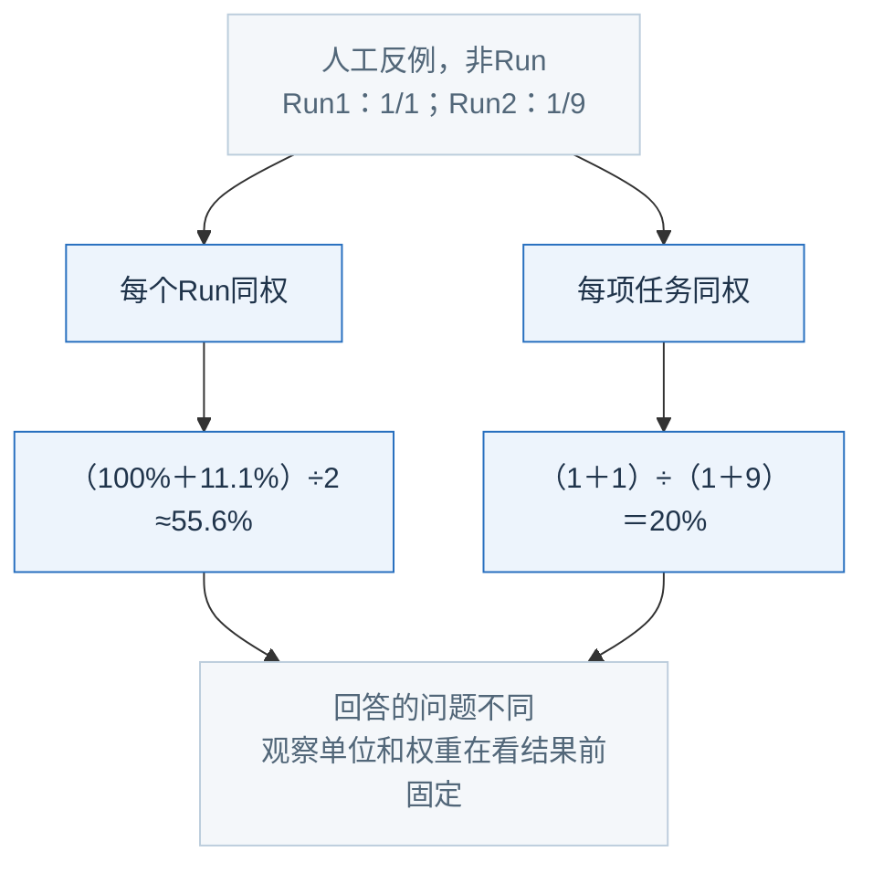
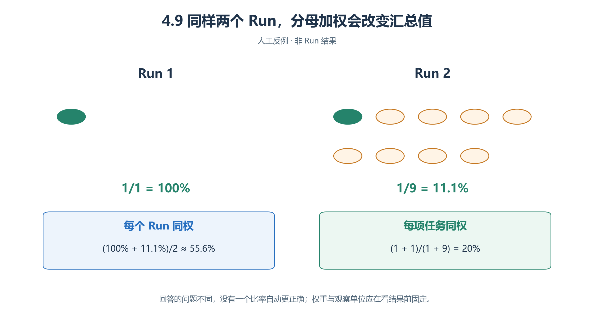
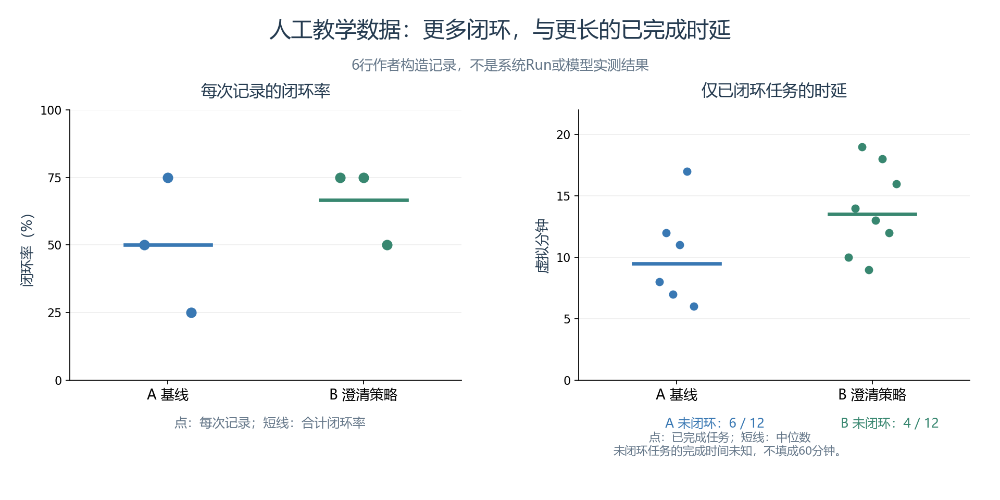
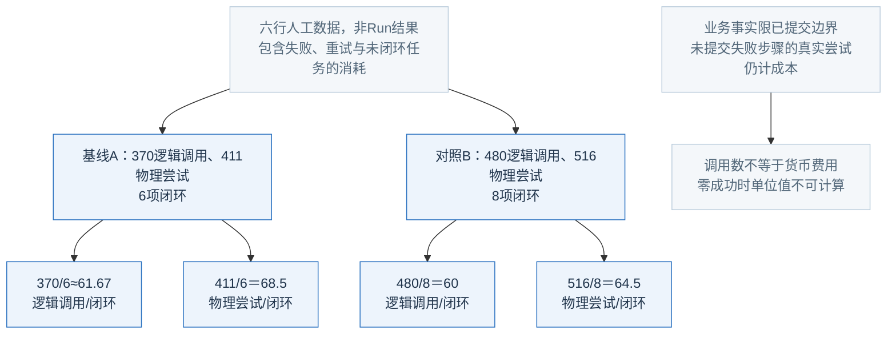
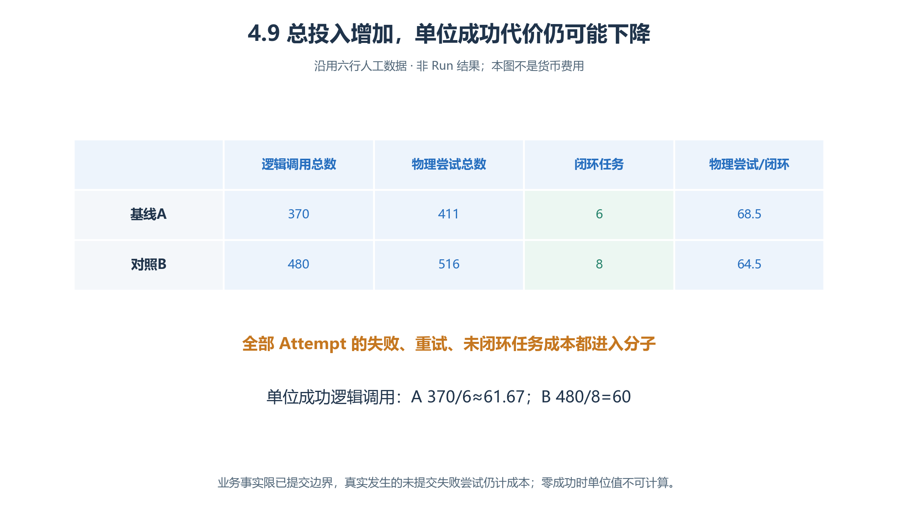

# 4.9 跨案例比较：完成你自己的研究设计

咨询闭环、关键事实到达、理由准确纳入都能写成百分数，**却不是同一种量**。本节用六行人工数据练习比较，再写自己的研究计划；无真实run_id，不是模型效果结论。

## 4.9.1 从事实到结果，一条链不能少

1. 按Run收齐全部Attempt；业务事实限已提交边界，失败Step已发生的真实模型尝试仍计成本。
2. 每项预登记任务一行，关联真实人物、Step、Event、请求、会话、记忆身份。教学任务可自定义键，运行UUID不得编造。
3. 咨询分别核对窗口适配、可执行答复已收到、下一步已确认，再判闭环；ACT描述不替代真实回复。
4. 记录损坏导致无法判断要单列，不当成功或从分母删去。
5. 同事件截取／恢复后重现不重复计成功；先失败后成功可按预登记规则计闭环，但失败成本和重复访问保留。

## 4.9.2 完整人工比较数据

每行代表一次独立Run的**人工汇总**，每次四任务，统一从开始观察至第60虚拟分钟。A基线，B有澄清。这里的时延是**Run开始→闭环**，不同于4.1的首次咨询→有效回应。

| 教学行 | 组别 | 闭环/任务 | 已闭环时延（分钟） | 未闭环 | 逻辑调用 | 物理尝试 |
| --- | --- | --- | --- | --- | --- | --- |
| A01 | A | 2/4 | 8，12 | 2 | 120 | 132 |
| A02 | A | 3/4 | 7，11，17 | 1 | 140 | 154 |
| A03 | A | 1/4 | 6 | 3 | 110 | 125 |
| B01 | B | 3/4 | 10，14，19 | 1 | 160 | 170 |
| B02 | B | 3/4 | 9，13，18 | 1 | 155 | 166 |
| B03 | B | 2/4 | 12，16 | 2 | 165 | 180 |

人工数据假设每项都完整观察至60分钟，无基础设施中断／缺失；真实报告另列这些情况和任务未发起。[演算目录](examples/README.md)只读教材JSON、不读系统导出、不调用模型、不替代语义评分。

## 4.9.3 比率与权重分别说清

| 计算 | A | B |
| --- | --- | --- |
| 总闭环率 | 6/12＝50% | 8/12≈66.7% |
| 每Run比率 | 50%、75%、25% | 75%、75%、50% |
| B−A | — | 约16.7**个百分点** |
| 相对A的变化 | — | (66.7%−50%)/50%≈33.3% |

三次小练习显示分布有重合，不能据均值较高说统计显著或稳定优越。各Run任务数相同，本例平均Run比率＝汇总任务比率；换分母就未必如此。

<!-- book-figure: comparison-denominators -->

*图4.9-1　人工反例：每个Run同权与每个任务同权回答不同问题。*

左支让一次只有1项任务的Run与一次有9项任务的Run权重相同；右支则把10项任务等权合并。55.6%与20%都能算对，但分别回答“平均一场怎样”和“全部任务多少成功”，不能择高报告。

**原图参考（转换前）**

两Run分别1/1与1/9：平均Run比率≈55.6%，汇总任务率2/10＝20%。权重须事前选。两组还须有同任务构成；若B多简单任务，提升可能是构成差异。小组每类两人时，直接列原始情况优于装饰性公平分数。

## 4.9.4 成功子集的用时，不是全体完成时间

*图4.9-2　六行人工数据：左图每点为一次Run的闭环率，右图每点为一项已闭环任务的时延。未完成者没有伪填60分钟完成点。*

左右点数为何不同？左图每组固定3次Run，横线为汇总闭环率；右图A有6项、B有8项成功任务，横线为各自成功子集的中位数。右图不能一一连点当配对任务，也没有给未完成者估计完成时间。

| 人工时延排序 | 中位数 | 未闭环 |
| --- | --- | --- |
| A：6,7,8,11,12,17 | 9.5分钟 | 6项 |
| B：9,10,12,13,14,16,18,19 | 13.5分钟 | 4项 |

应读为：B闭环更多，**已闭环子集**典型时间更长；不能证明B对每人更慢，或某任务因澄清才成功，因为两组成功子集可能不同。

60分钟只是截止，不是未完成者的真实终点。进一步分析需处理删失，并检查提前终止与难度的关系；本入门例不拟合生存模型。[NIST：删失数据](https://www.itl.nist.gov/div898/handbook/apr/section1/apr131.htm)

真实提前停止时，报告覆盖与原因。可把预定四任务全保留在计划分母，注明含中断影响；若另分析完整窗口样本，同时展示排除Run与理由，不能只留漂亮分析。

## 4.9.5 总投入与单位成功代价同时报告

<!-- book-figure: comparison-cost -->

*图4.9-3　沿用六行人工数据的算术，不是费用或真实耗时。*

先比上方总量，再比下方单位值：B用480次逻辑调用取得8项闭环，A用370次取得6项，因而B总投入较高、单位成功代价却较低。两个子列分别数逻辑调用和物理尝试，不能相加成一种“总调用”。

**原图参考（转换前）**

| 指标 | A | B |
| --- | --- | --- |
| 物理尝试合计 | 411 | 516 |
| 物理尝试／闭环 | 411/6＝68.5 | 516/8＝64.5 |
| 逻辑调用／闭环 | 370/6≈61.67 | 480/8＝60 |

B总投入高、人工例的单位成功代价略低，两者可同时成立。分子包括未闭环任务、全部Attempt、恢复前失败和真实重试，不只计成功路径；零成功时单位值不可计算，仍列总投入。

调用数不是货币费用：上下文长度、模型计价都影响金额，需要真实用量与对应时间的价格证据。无资料就报调用／Token，不编金额。含暂停与人工排查的墙钟耗时，不等于模型吞吐或虚拟业务等待。

## 4.9.6 独立重复、随机条件与不确定性

| 应做 | 避免 |
| --- | --- |
| 先列每Run结果，再中心值、范围、失败 | 将同Run角色、消息当独立样本 |
| 足够独立Run后按Run重采样，保留成对批次结构 | 对三次演算加显著性星号 |
| 同批含A/B，事先确定次序，记录服务与版本变化 | 上午全A、下午全B，把时间混为组别 |
| 预登记预算与停止规则，变更另立阶段 | 重跑到满意为止，隐藏原计划／原结果 |

区间反映给定设计的估计不确定性，不保证模型设定真实，也不将角色变为现实随机样本。[NIST：随机区组](https://www.itl.nist.gov/div898/handbook/pri/section3/pri332.htm)

## 4.9.7 跨场景先统一尺度

| 可比方面 | 先统一 |
| --- | --- |
| 证据完整程度 | 输入、提交、评分、失败是否可定位 |
| 开销 | 模型、计价、窗口、参与者规模 |
| 一种机制 | 同类任务、共同基线、明确差异 |
| 鲁棒性 | 事前定义模型／布局／事实扰动，逐条件报告 |
| 应用价值 | 共同业务目标、现实约束、外部验证 |

交接与学习可比较核对方法怎样保留来源，不能直接相减“信息到达率”和“约束满足率”。同名Skill迁移也需重验内容与工具条件；换模型、地图或视野属于新条件，不覆盖旧结果。

## 4.9.8 一页研究计划应能让别人判分

填写[实验计划](templates/study-plan.md)与[干预差异](templates/intervention-diff.md)：

1. 谁遇到什么问题，唯一主要观察结果是什么？
2. 作者、角色、对象、评阅者各知道什么？
3. 改哪一项，哪些两组相同？
4. 单位、Run数、窗口、预算与停止规则？
5. 成立证据是什么，未知、未完成、合理拒绝怎样记？
6. 成本、失败、未触发条件怎样进入报告？

创建实验前请另一读者按规则判一段示例，不能判就先改量表。需要真实库存锁、动态通路或物理故障传播时，缩小问题或列为系统需求；Skill写名称不构成实现。

各案独立保存作者材料，UI操作按第三章；参数调整进入新独立实验，既有Run与原始导出不改。最终交方法、全部结果、解释、局限，不只一张顺利回放。

## 4.9.9 综合练习与参考

| 练习 | 参考要点 |
| --- | --- |
| 重算六行人工数据 | A/B：50%/66.7%；成功时延9.5/13.5；逻辑成本61.67/60；物理成本68.5/64.5。少重复、不同成功子集、无现实校准，不证明普遍优越 |
| A为3人1分钟，B为6人5分钟且加清单，能归因清单吗？ | 不能。人数改互动与成本，步长改反馈／移动；恢复共同条件或预先做多因素研究 |
| 为偏爱的策略写反例 | 人人已见牌时移牌未必有用；事实少且清楚时清单可能只有成本 |
| 写一页结论 | 用[报告模板](templates/report.md)，分开观察、解释、外推限制；每个数字有结果行，每个语义判断有依据 |

计算脚本只核算算术，不验证现实结论。研究设计的作用，是让“试试会不会更好”变成一个可执行、可计分、可复查的问题。

[上一节：长时程校园生活](08-long-horizon-memory.md) · [参考资料](references.md) · [返回本章](README.md) · [下一章：综合实战与交付](<../chapter 05/README.md>)

