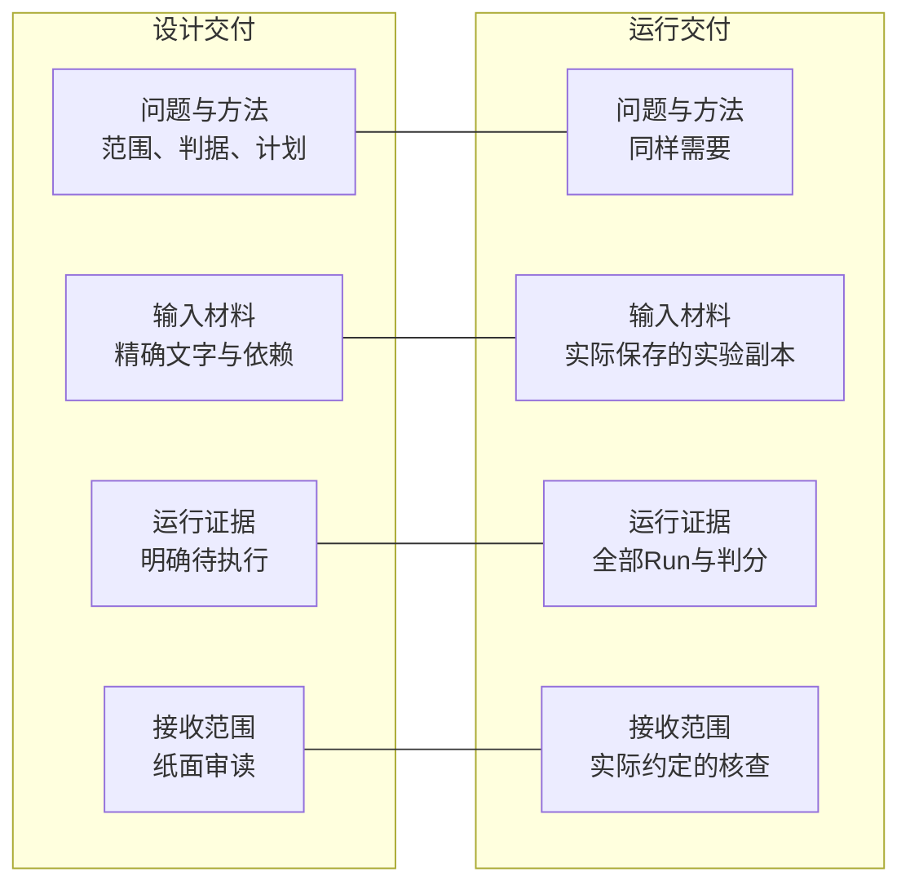
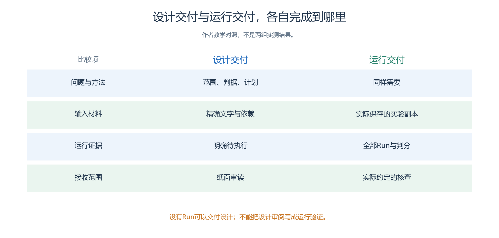
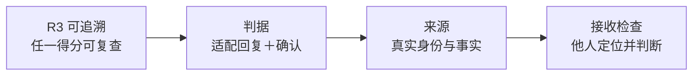
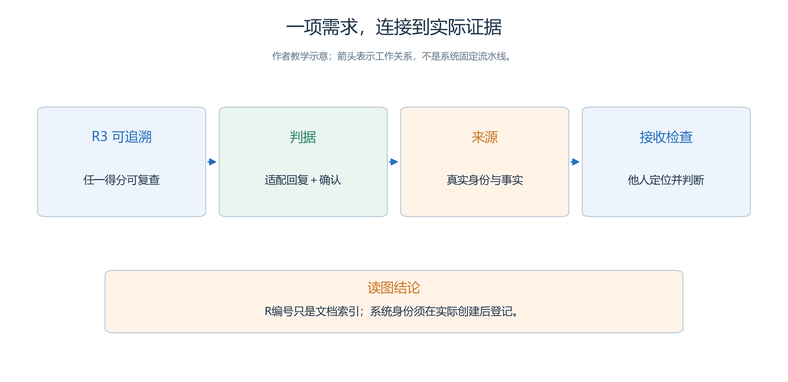
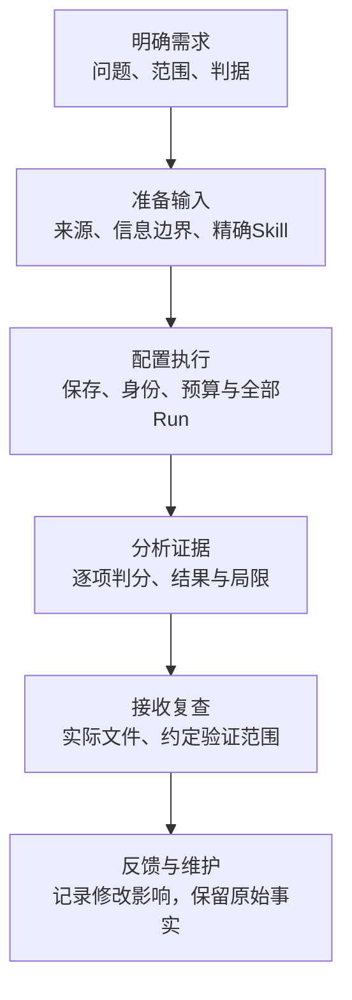
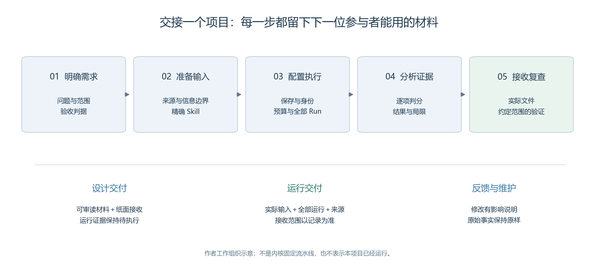

# 5.1 从一个委托开始：什么才算把项目做完

一位社区培训负责人看过第四章的服务大厅教案后，希望用它组织一次工作人员研讨。

- 他提出的要求很自然：“让大家看看，先问清楚是不是比直接指路好。”作者也许很快就能展示一段人物行走与对话，但这还不能回答委托人的问题。
- 对方需要知道展示依据什么规则、遗漏了哪些结果，以及下次换一位讲师能不能继续使用。

第五章把这项要求组织成一个可以交接的项目。

- 我们复用[第四章 4.1](<../chapter 04/01-service-hall.md>)的虚构服务大厅，不再增加一种行业场景。
- 第三章已经说明系统如何操作，第四章已经说明实验如何比较；
- 本章关注这些知识怎样共同变成一份别人能够检查、使用和维护的成果。

本章的委托、人物和材料均为教学设计。目前没有对应的新 Experiment、Run 或实测结论。下面的完成条件是读者将来实践时应获得的结果，不能因书稿已经写好就勾选通过。

## 5.1.1 将一句愿望改写成可回答的问题

“先问清楚是不是更好”至少包含三个未确定之处：对谁更好、改善什么、愿意付出多少代价。

- 对来访者而言，更少走错可能有益；
- 对咨询台而言，多一轮询问也要时间与调用；
- 对讲师而言，方法能否被学员理解又是另一项教学目标。
- 这些目标需要分别说明。

本项目将研究问题写成：在给定的四项咨询需求、服务分工、人物信息与观察窗口下，将入口咨询台的“一次窗口建议”替换为“缺少关键目的时先澄清”，咨询闭环、错误窗口请求和咨询负担会出现什么差异？结果用于讨论信息缺失与服务策略，不能推定现实大厅的业务处理效率。

这句话保留了结果不确定的空间。

- 若澄清组调用更多却没有增加闭环，仍然是一项可以讨论的发现。
- 项目不以证明预设观点为完成条件，也不要求每个角色都成功；
- 它要求共同条件明确、结果完整、解释能接受复查。

委托人还可能提出“减少排队”或“自动完成申请”。

- 当前教案没有队列容量、服务时长和真实审批规则，无法用它回答这两项要求。
- 作者应把它们列入后续议题，在本次说明中明确范围。
- 仅仅在人物台词中加入“排队结束”或“申请通过”，不会补齐所需机制。

## 5.1.2 建立一页足够具体的项目约定

项目约定首先要选清交付范围：本次只交可审阅的设计，还是还要交真实运行与接收记录？两种范围分别列出完成材料。

<!-- book-figure: s51-delivery-scope -->

*图5.1-1　设计交付检查材料是否完整，运行交付再要求真实配置、全部Run与证据；本章示例尚处于设计准备。*

**原图参考（转换前）**

一页项目约定先于地图制作。它不需要冗长的管理术语，但应让参加者对同一件事有共同理解。

| 项目问题 | 本章采用的约定 |
| --- | --- |
| 谁使用成果 | 组织研讨的讲师，以及接手材料的另一位操作者 |
| 用来做什么 | 讨论信息不足时立即建议与先行澄清的取舍 |
| 观察什么 | 四项任务的咨询闭环、无效窗口访问、重复说明、首次有效回应时延和模型调用 |
| 改变什么 | 咨询台 Skill 中的一段决策方法 |
| 保持什么 | 地图、五名 Agent、三个对象、任务、模型、窗口规则、时间和判分口径 |
| 交什么 | 作者材料、方法与差异说明、完整运行索引、可追溯报告、实际取得的导出及接收记录 |
| 谁决定完成 | 作者自查后，由未参与配置的接收者按约定检查；同一人兼任时写明 |

这里的“完整运行索引”指纳入本项目的全部运行，而不是要求向外公开所有原始资料。

- 哪些人可以阅读哪些文件，应在交付约定中说明。
- 本章采用虚构人物，不需要收集真实办事记录，也不需要取得真实居民的信息。

[项目委托书](capstone/brief.md)已整理本章共用条件。制作时可以复制它填写本机路径、参与人员与预算，但不要把空白字段变成想象中的系统事实。系统尚未创建身份时，`run_id` 应保持“待创建”，文件尚未导出时，哈希应保持“待计算”。

## 5.1.3 把需求连到证据，而不只连到文件名

下面用需求编号R3“结果可追溯”演示：咨询闭环这一分数，怎样一路查回实际回复与确认。R3只是文档索引。

<!-- book-figure: s51-requirement-chain -->

*图5.1-2　从R3到接收检查逐项建立对应；教师判据定义何为正确，实际Run中的身份与事实说明是否发生。*

> R编号只是文档索引；系统身份须在实际创建后登记。

**原图参考（转换前）**

有人交出一个名为“最终报告”的文件，不能由文件名判断项目完成。

- 更有效的方法是给需求一个简短编号，再说明什么证据支持它。
- 这些编号只是作者文档中的引用，不是系统资源 ID，更不是需要加入内核的新状态机。

| 需求 | 验收问题 | 支持它的材料 | 无法替代的证据 |
| --- | --- | --- | --- |
| R1 可理解 | 接收者能解释研究问题和范围吗 | 委托书、方法说明 | 仅有漂亮的回放截图 |
| R2 可比较 | 两组除决策段外条件一致吗 | 精确差异、包内资源核对 | 作者口头说“都一样” |
| R3 可追溯 | 任一任务得分能回到事实吗 | 判分行、Run/Attempt/Step 与事件定位 | 模型最后的自我总结 |
| R4 可盘点 | 失败、中断和成本是否保留 | 全部运行索引、调用统计 | 只展示完成最快的 Run |
| R5 可接手 | 接收者完成了约定层次的检查吗 | 实际文件、环境说明、接收记录 | 发送成功或下载成功 |

“有证据”也需要限定强度。R2 可以先通过作者文本比较，证明计划只改一段；完成 UI 配置后，还要核对实验副本，才能证明实际使用内容符合计划。R5 如果只完成阅读和文件完整性检查，就不能写成异机重新运行成功。

使用[需求—证据矩阵](templates/requirement-evidence-matrix.md)时，一行允许暂时没有证据。保留缺口能告诉接手人下一步做什么；填上一个不支持该需求的链接，只会掩盖缺口。

## 5.1.4 三类参与者，三种不同职责

作者负责把问题转成材料与实验；

- 复核者负责检查信息分配、判分和报告；
- 接收者负责按文档实际寻找文件、读取证据并完成约定操作。
- 这三种是项目分工，**不是新增的仿真 Agent**。
- 服务大厅仍然只有周澈、谭悦、孟川、邱禾和余真五名 Agent，以及咨询台、A 窗口、B 窗口三个绑定 Skill 的对象。

一人可以完成小型项目，但应该留一次隔日复核：关闭编辑页面，只按交付入口重新寻找资料，随机抽一项得分回查。

- 此举能发现路径失效、说明遗漏和只存在于作者记忆中的前提，却不能冒充独立评阅。
- 如果确有另一位接收者参与，应记录他检查了什么，不要求写一个笼统的“全部无误”。

讲师的职责同样需要界定。讲师可以安排学员先猜测两种策略的利弊，再看证据讨论；不能为了课堂节奏，只留下最符合预期的片段。教学展示可以节选，研究台账仍应完整，节选依据需要说明。

## 5.1.5 用阶段产物控制工作量

按交接产物把项目分成六个工作环节；沿图看下一位参与者需要收到什么，最后将接收反馈带入维护。

<!-- book-figure: project-handoff -->

*图5.1-3　六个环节与下方六项清单一一对应；它们组织作者工作，不规定Brain的调用流程，也不表示本案已执行。*

**原图参考（转换前）**

项目可分为六个便于交接的工作环节。

- 先确定问题与边界，形成委托书；
- 再准备材料和精确 Skill，形成作者资料；
- 随后按预算完成配置与运行，形成全部运行索引；
- 之后依据事实判分，形成报告；
- 再整理实际导出并由接收者核查；
- 最后记录接收反馈，按修改影响安排维护。

这不是系统必须执行的固定流程。Brain 仍根据 SOP 决定调用顺序，Runtime 仍按原有合同提交事实。这里的阶段只是作者组织工作的方式；发现任务表含混时，可以回到材料阶段，而不必先完成一轮昂贵运行。

每次转入下一阶段，问一个具体问题：下一位参与者拿到这些材料，能否开展他的工作？地图草图和人物名单足以讨论范围，却不足以直接导入实验；

- 完整作者材料可以支持配置，不能证明运行稳定；
- 运行已结束可以开始分析，不能自动证明业务成功。
- 这些判断能减少返工，也使进度报告更诚实。

## 5.1.6 完成不等于所有问题都得到肯定答案

本章采用两种交付范围。

- **设计交付**包括可审读的委托、资料、信息分配、精确行为文本和计划，验收到“可以开始实施”。
- **运行交付**在其上增加实际实验、全部 Run、结果和接收记录，验收到双方约定的读取、复算或重新执行层次。
- 两者都可以成为合格成果，但名称与证据要相称。

当前书稿属于教学材料交付。

- 它没有完成第二种范围，也没有假定前三章的历史证据可以替代这个服务大厅。
- 读者将来发现系统问题，应保存入口、操作、预期与实际、身份和边界，停止该项验收并按仓库规则处理；
- 发现研究方案不合适，则记录原因，设计新的独立实验，保留旧证据。

- 本节练习是把“仿真证明澄清策略有效”改成可验收的项目要求。
- 一个较好的答案是：“在固定教学条件下比较两种入口咨询策略，提交包含全部任务、未完成样本、调用负担和证据定位的报告，由接收者抽查任一任务的判分。”它规定了应完成的工作，也允许结果与预期不同。

[上一章](<../chapter 04/README.md>) · [下一节：资料来源与假设](02-source-materials-and-assumptions.md) · [返回本章](README.md)
