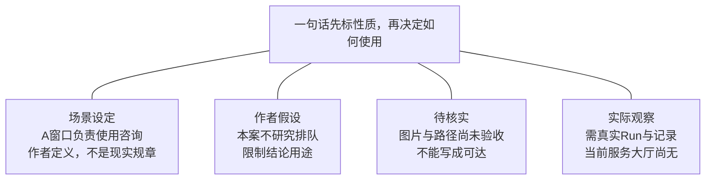
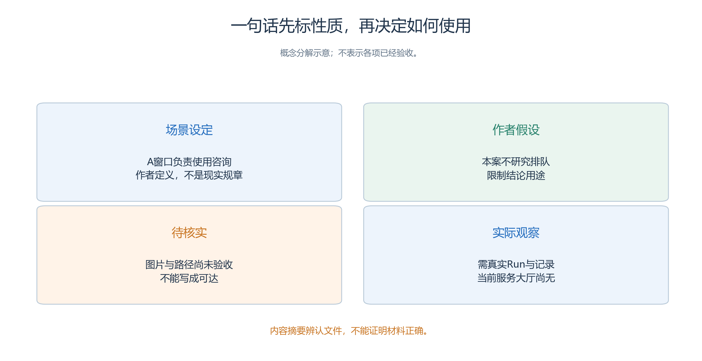
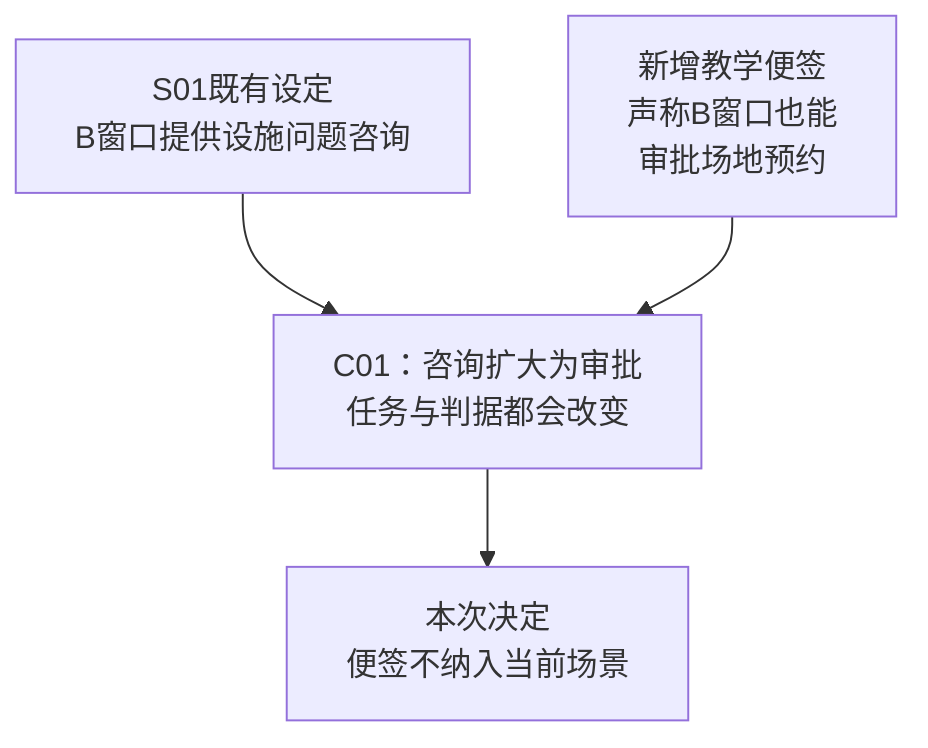
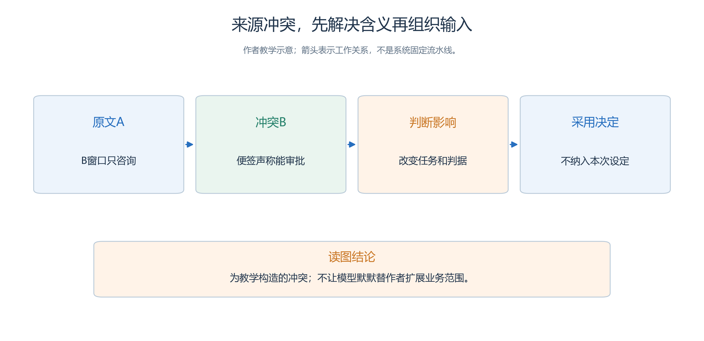

# 5.2 材料来源、假设与可用范围

团队准备把第四章的服务大厅教案交给另一位操作者实施。

- 收到的材料可能包括一页服务分工、四份人物任务、空间草图、两段咨询策略和一张评分表。
- 如果只把它们放进文件夹，接收者仍然不知道：哪些内容是本次采用的条件，哪些只是候选建议，哪里存在冲突，哪些空白必须保留。

本节把这些材料整理成可解释的资料集，继续使用 [4.1 社区服务大厅](<../chapter 04/01-service-hall.md>)，不另造场景。全部人物和业务材料均为教学虚构；下面的登记表是填写范例，不是已经上传、封存或运行的证据。

## 5.2.1 先给每句话标明性质

“A窗口负责哪类咨询”“本案是否研究排队”“图片是否已保存”“角色实际做了什么”，分别来自不同性质的材料。先分类再登记出处。

<!-- book-figure: s52-source-types -->

*图5.2-1　四个分支分别是场景设定、作者假设、待核实项与实际观察；前三类都不能替代真实Run中的行为记录。*

**原图参考（转换前）**

服务分工、角色经历、作者选择和运行观察有不同来源。

- “A 窗口提供场地使用咨询”是本案约定的业务范围；
- “孟川发现东侧一盏灯不亮”是人物初始材料中的虚构经历；
- “地图采用 20×16 格”是作者的空间方案；
- “孟川已在 B 窗口得到回复”则必须等待运行事实支持。

这些话都可以进入项目资料，但不能合并成一列“已验证事实”。

- 一个有用的分类是：**采用的场景设定、作者假设、待核实事项、实际观察**。
- 材料还应注明适用范围，例如“只用于这次虚构咨询”或“只说明历史案例的某次 Run”。
- 服务大厅尚无新 Run，因此实际观察栏应保持空白。

这里的“采用”表示作者决定本轮用什么条件，并不表示它是真实社区的规章。

- “未知”也不总是错误。
- 例如周澈尚未确定具体日期和人数，A 窗口才需要告诉他准备哪些信息；
- 不能为了表格整齐，擅自补成某个日期、二十人和一个已经成功的预约。

## 5.2.2 建一张能追到原文的来源表

先保存收到的原文，再写整理稿，避免后来的概括覆盖最初含义。下面的 S 编号只是作者资料索引，不是系统资源 ID 或实验 UUID。

| 资料索引 | 来源与采用内容 | 用途 | 当前可证明的范围 |
| --- | --- | --- | --- |
| S01 | 4.1.1 的窗口分工：A 为场地使用咨询，B 为设施问题咨询 | 编写三个设施及引导员的服务知识 | 教案规定的分工，不是审批规则 |
| S02 | 4.1.1 的四项任务 H1—H4 与首次话语 | 制作四份独立人物材料 | 角色初始目的，不是到场后的实测发言 |
| S03 | 4.1.2 的地图与出生区域方案 | 制作图像、语义和碰撞资料 | 空间草图，未证明系统中可达 |
| S04 | 4.1.3 的两段咨询台决策文本 | 保存基线与对照的唯一策略差异 | 待写入 Skill，未证明实际执行 |
| S05 | 4.1.2 的时间方案 | 填写实验装配参数 | 09:00—10:15、每步一分钟、76 步 |
| S06 | 4.1.5 的咨询闭环条件 | 制作评分材料 | 判据，不是任务已经成功的答案 |

实际工作表还应加入原文件位置、获取日期、整理人、采用段落、关联材料、待确认问题和内容摘要。

- 来源不是一句“来自文档”；
- 至少要能定位到哪一份文档的哪一段。
- 文件后来改动时，保留本次采用内容及摘要，接收者才能解释实验为何使用这些文字。

内容摘要用于辨认资料，不能证明资料正确。作者文稿的修改记录也不是公共资源的业务 Revision；后续进入 Studio 时，仍按稳定资源身份和独立实验副本管理。[第三章资源身份说明](<../chapter 03/02-studio-and-resources.md>)

## 5.2.3 冲突先登记，再决定是否采用

下图只展开表中C01：既有咨询分工与新增“可以审批”的便签冲突，作者需要先作范围决定。

<!-- book-figure: s52-conflict-resolution -->

*图5.2-2　两份材料汇合后才判断冲突与处置；便签为教学反例，不因被读到就成为对象的新能力。*

**原图参考（转换前）**

假设资料包里多了一张便签：“B 窗口也能审批场地预约。”这是一条为练习构造的冲突材料，不是本案新增事实。它与 S01 冲突，而且将“咨询”扩大为“审批”。不能把两句话拼成一个更完整的 SOP，让对象自行选择相信谁。

| 问题项 | 相互冲突的内容 | 对项目的影响 | 本次处置 |
| --- | --- | --- | --- |
| C01 | S01 规定咨询分工，便签增加审批能力 | 改变正确窗口与成功含义 | 便签不纳入当前场景；需要新需求时另议范围 |
| C02 | 草稿清单写“四名人物”，原教案另有引导员余真 | 漏掉协助渠道，改变调用规模 | 按原教案核对为五名 Agent |
| C03 | 某整理稿把 75 分钟写成 75 步 | 最后时间点提前一分钟 | 保留 76 步，注明 Step 1 为 09:00 |

处理冲突时先问：这句话来自哪里，是否针对同一用途，是否已经被作者明确采用？较新的文件不自动更可靠，写得更自信也不是优先依据。

- 无法确认的业务条件进入待办，并注明它会影响哪个资源或判断；
- 不要让模型偷偷替团队完成一次需求决策。

也要识别有意保留的差异。

- H1 和 H3 的首次话语相同，私人目的不同，这不是重复数据需要合并；
- 关键目的暂时没有说出来，正是澄清策略的研究条件。
- 若整理者“优化”首句，把预约或报修直接写明，就在配置之前消除了原来要观察的问题。

## 5.2.4 把假设写成可检查的约束

第五章沿用既定设计：四项咨询任务、四位来访者与引导员余真共五名 Agent，咨询台及两个窗口共三个对象；20×16 格地图，入口、等候区、A 服务区、B 服务区共四个 Arena。时间为 `2026-10-18 09:00—10:15`，`Asia/Shanghai`，步长一分钟，共 76 步。

这些值属于本次采用的条件，不是从真实大厅统计中估计出来的。

- 材料表还应列出假设怎样影响结论：内部通道设计为连通，但实际录入后的路线待验；
- 人物从规定 Arena 出生，但坐标待空间选择器保存；
- 对象可以按 SOP 答复多个请求，不能据此推出真实窗口的服务速度。

| 假设或尚缺资料 | 为什么暂这样处理 | 需要什么证据才能改变状态 |
| --- | --- | --- |
| 两组除澄清段外使用相同内容 | 便于解释策略差异 | 保存后的资源内容逐项比较 |
| 四位来访者能够接近咨询台及窗口 | 是完成任务的空间前提 | 实际地图路径与运行位移核对 |
| 模型配置可以支持所需调用 | 需要选用可用服务，当前未填写实测结论 | 真实配置、连接及运行记录分别核对 |
| 对象没有业务队列与审批流程 | 本案只研究咨询，不模拟办理 | 如要增加机制，应重新定义项目，不能补一句提示冒充实现 |

未确认信息不必一律阻止资料制作。

- 背景图片可以先画，但依赖错误服务范围的 Skill 不能定稿。
- 反过来，未知信息若会改变任务答案、权限或主要比较条件，就应先处理它，再形成正式比较材料；
- 不要边运行边悄悄换条件。

## 5.2.5 整理信息时保留原意与空白

以孟川的材料为例，原文是“今天发现活动室东侧一盏灯不亮，想了解如何报告”。

- 整理后可以拆成“人物初始经历”“咨询目的”“规定的首次话语”三个字段；
- 不能改成“设施已确认损坏”“需要更换灯具”或“已经提交报修”。
- 后三句分别补入了诊断、方案和执行结果，原材料都不支持。

建议每条整理内容附一列变化说明：只是分段、改为同义表达、补充了作者假设，还是仍待确认。

- 数字、时间、否定词、条件和信息来源要逐项复看，尤其警惕把“未确认恢复”缩成“恢复”，或把“可咨询”写成“已办理”。
- 使用第二章的助手整理资料时，也应人工核对这些关键变化，不能拿流畅程度代替忠实程度。

本项目不需要真实来访者的姓名、电话、证件或住址。

- 沿用虚构人物即可；
- 也无需为了“像真实系统”增加这些字段。
- 接收来源不明的图片或资料时，记录来源与使用限制，无法说明的素材继续标为待处理，不因已经出现在文件夹里就宣称可任意传播。

## 5.2.6 交给下一位作者的应是什么

本节交付的资料集应让接收者找到三种内容：采用的原文与来源；

- 整理后的明确条件；
- 冲突、假设和未完成事项。
- 目录可以按原始材料、采用说明、待办和接收检查组织，但它只是作者资料组织方式，不是可导入的 `ga-package` 清单。

条件式检查可以这样执行：发现一个没有来源的数值，就退回标注为作者设定或待确认；

- 发现两份分工不一致，就记录影响并确定本次采用者；
- 发现一句话暗含运行成功，就要求实际证据，没有则改回目标或候选；
- 发现材料混入另一个人物的私人目的，就留给下一节拆分，而不是整份投入共同 Brain。

接收者应能用这套资料回答：“为什么是五个人、三个对象、76 步？为什么两人首句相同却去不同窗口？哪些信息仍然不知道？”能回答这些问题，说明资料集可解释；还不能据此填写“系统已配置”或“咨询策略有效”。

练习：将“余真会帮助所有人快速完成业务”拆成材料与假设。

- 参考思路是：余真的职责和帮助条件可以写入人物材料；
- “所有人”“快速”“完成业务”不是已取得的结果，且本案只以咨询闭环评价。
- 再找出一个应该保留的空白，例如周澈尚未填写活动人数，说明它为什么不需要作者擅自补齐。

[上一节：项目范围](01-project-scope.md) · [下一节：作者资源与信息边界](03-authoring-and-information-boundaries.md) · [返回本章](README.md)
