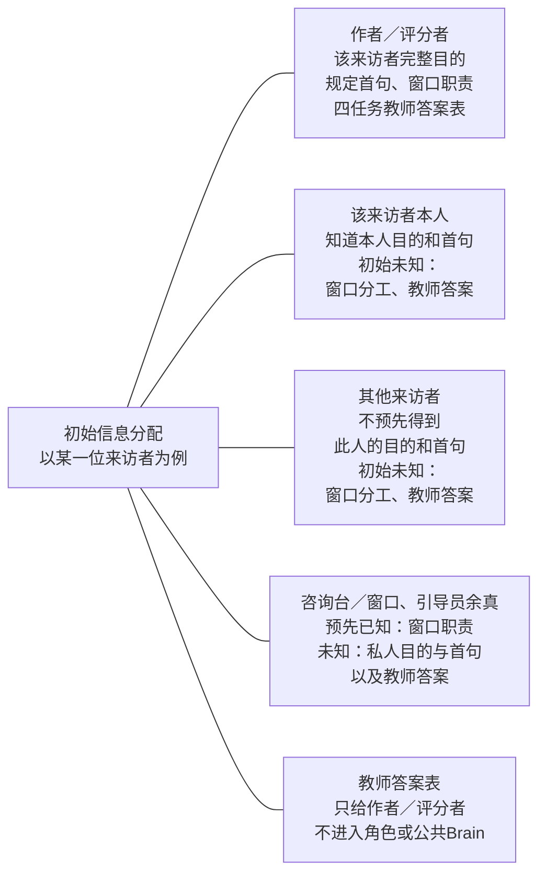
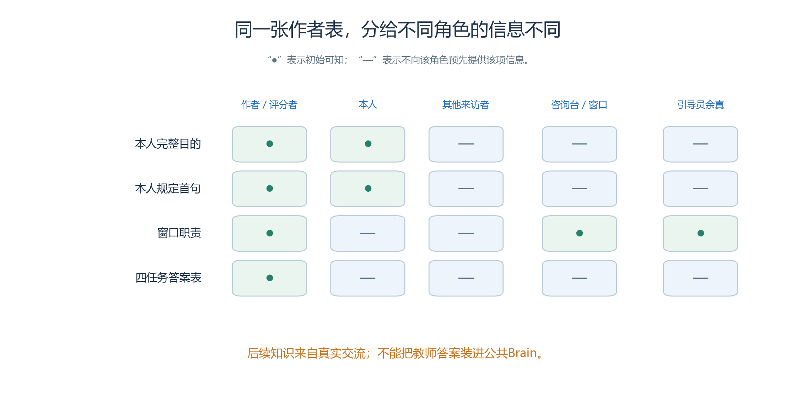
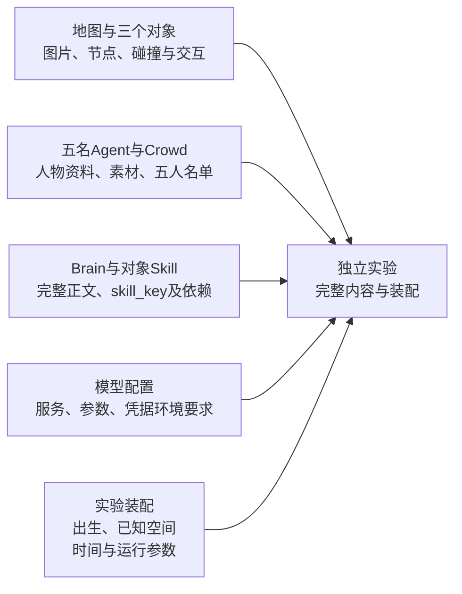
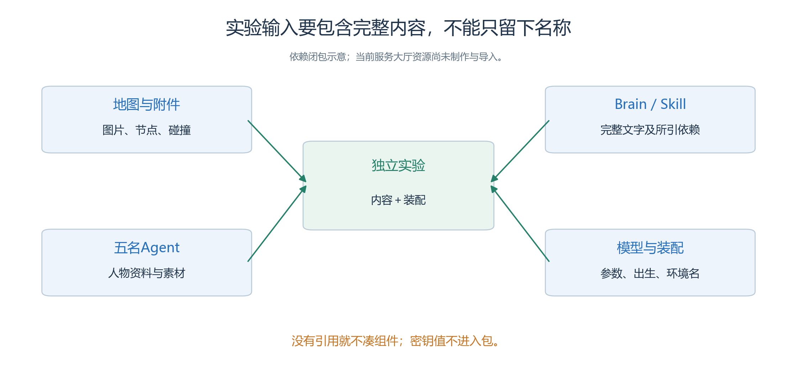
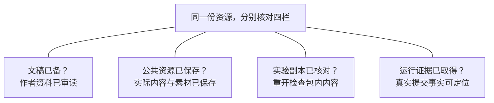
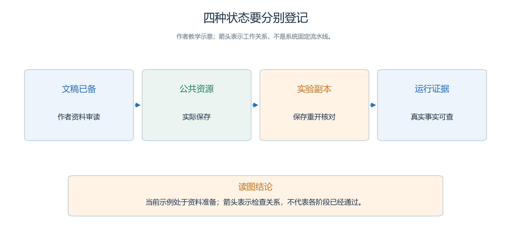

# 5.3 把材料落实为独立作者资源与信息边界

来源清楚以后，还要决定每句话放在哪里。

- 若把完整需求表放进共同 Brain，咨询台一开始就知道周澈应该去 A 窗口，澄清策略便失去了意义。
- 若只保留图像而没有空间语义，人物又无法凭作者眼中的门口和柜台完成导航。
- 本节把整理稿转成资源分配与保存核对方案。

我们继续使用第四章的服务大厅，目标是让另一位操作者能够检查材料有没有装错。

- 以下工作表仍是制作模板；
- 本章没有把这些候选内容保存成新的公共资源、实验或 Run。
- 界面操作细节参照[第三章资源教程](<../chapter 03/02-studio-and-resources.md>)，这里着重说明每一步应交付什么内容。

## 5.3.1 同一张作者表，不等于同一份角色输入

以一名来访者为中心，分别看作者、本人、其他来访者和工作人员事前知道什么；后续交流另按真实接收记录。

<!-- book-figure: s53-information-matrix -->

*图5.3-1　分支表示信息归属，不表示消息已经投递。图先区分任务信息，后表再说明各类资料应放进哪里。*

**原图参考（转换前）**

资源分配表至少包含“内容”“接收者”“进入方式”“不得包含什么”。角色资料、对象知识、空间语义和评分答案是不同用途，不能按文件大小平均切分。

| 内容 | 放置位置与接收者 | 不应顺便加入的内容 |
| --- | --- | --- |
| 四个 Arena 的名称、范围与一般空间用途 | 地图语义；按感知与初始已知空间取得 | 四人的私人任务和正确分流答案 |
| A、B 窗口分工与咨询范围 | 咨询台、两个窗口的根 Skill；引导员余真资料 | “某位来访者一定属于哪类”的完整映射 |
| H1—H4 的完整私人目的 | 对应来访者的初态资料 | 其他三人的目的、评分答案列 |
| 每人规定的首次话语与补充条件 | 对应人物资料及共同执行规则 | 提前把预约／报修补进首次话语 |
| 如何感知、询问、移动、确认和停止 | 共用 Brain | 完整任务表、预定成功剧情 |
| 正确窗口映射和闭环判据 | 作者与评分者材料 | 不因方便调试而注入所有角色 |

“每人获得自己的任务”具体是获得自己的目的和首次话语，不是连作者表中的正确窗口答案一起复制。

- 这里没有设置隐藏系统权限来替作者纠正分配错误；
- 一旦把答案写入共同输入，模型看到它并不属于跨身份记忆泄漏，而是材料本身泄露。

## 5.3.2 地图给出地点，不替咨询台回答问题

地图采用 World“青禾社区”、Sector“便民服务站”，下设入口、等候区、A 服务区、B 服务区。四个 Arena 的草图矩形仍为 `[1,1,18,3]`、`[1,4,18,4]`、`[1,8,9,7]`、`[10,8,9,7]`，整图 20×16 格，不沿用第三章学习中心的房间坐标。

- 三个 Game Object 分别是入口的咨询台、A 服务区的 A 窗口、B 服务区的 B 窗口。
- 公开空间说明可以写“A 服务区内设一个咨询窗口”，不要写“这里专门解决周澈和谭悦的问题”，也不要为了让人物找对而把分工答案写到每个 Arena 的公共语义里。

图像、节点和碰撞分别准备。

- 图片显示柜台，语义说明它是什么，通路决定人物能到哪里；
- 三个对象的具体矩形与邻格仍须在素材制作阶段补齐并核验。
- 不能把尚未完成的 4.1 草图称为可导入地图，更不能临时借用旧案例同名物件并认为地址含义相同。[第三章地图与空间](<../chapter 03/03-map-and-space.md>)

两组来访者都获得四个 Arena 的真实初始已知地址，但不知道窗口分工；

- 进入相应服务区后，再从感知取得对象地址和交互项。
- 收到一句文字地址不自动新增系统已知空间。
- 此处提供的是合法移动的公共空间基础，不是让角色预先知道咨询答案。

## 5.3.3 把人物初态与对象知识分别核对

人物清单必须有周澈、谭悦、孟川、邱禾和余真五条独立 Agent；四人是来访者，余真是引导员。H1—H4 是任务标签，不能代替实际保存后的 Agent 身份。Crowd 只是五人选择集，不是第六位角色；三个绑定 Skill 的设施也不加入公共人物目录。

核对周澈时，应看到未来读书会的私人目的和规定首句，看不到“正确窗口 A”的评分提示。

- 核对孟川时，应看到对现有灯光问题的初始经历，但首次话语与周澈相同。
- 公共 Brain 可要求“被问到后如实补充自己的目的”，不能把各人的私人目的再汇总抄一遍。

余真知道服务分工和咨询台位置，但初始不知道四项具体任务。

- 其资料应保持“对实际遇到且求助的人说明入口与已知地址，不替咨询台预先分类”的共同策略。
- 增加主动逐人问询，看似只是人物更热情，实际上会改变两组的信息渠道。

公共 Agent 核心不含出生坐标。

- 选入实验后，四位来访者装配到入口，余真装配到等候区，记录空间选择器实际保存的位置。
- 初始经历来自作者设定，不需要伪造一条声称在某个 Step 发生过的记忆记录。
- 角色进入运行以后如何写入与更新记忆，才由真实工具调用形成证据。

## 5.3.4 完整资源闭包需要逐项点清

把刚才逐人分配的材料收进实验时，按下图五类输入逐项点清；图中每一类都对应后表的一行。

<!-- book-figure: s53-resource-closure -->

*图5.3-2　地图与对象、Agent与Crowd、Brain与Skill、模型、装配共同构成输入；箭头表示完整内容装入实验，当前仍待实际制作与导入。*

> 当前资源尚待制作与导入；没有引用就不凑组件，密钥值不进入包。

**原图参考（转换前）**

作者交付的不只是几份自然语言段落。

- 地图要有实际图片与节点资料，人物要有对应头像和行走图，唯一 Brain 要有完整正文，三个对象要绑定各自根 Skill。
- 若引用了子 Skill、脚本或模板，它们也应进入依赖清单；
- 没有引用就不要为凑数量增加组件。

| 资源项 | 作者侧应备齐 | 保存后需登记 |
| --- | --- | --- |
| 地图与三个对象 | 背景、节点、碰撞、对象位置与交互说明 | 实际资源及节点身份、显示绑定与语义 |
| 五名 Agent 与 Crowd | 各自资料、图片、五人名单 | 稳定身份、成员数、保存后的内容 |
| Brain 与对象 Skill | 完整正文、包内 `skill_key` 及依赖 | 真实键、内容摘要、绑定关系 |
| 模型配置 | 实际服务和适用参数说明 | 所选配置与凭据环境要求，不登记密钥正文 |
| 实验装配 | 出生、已知空间、时间与运行参数 | 实验身份、实际坐标、保存结果 |

选入实验时复制的是完整内容及依赖，公共资源后续改动不会自动传过去。

- Skill 同 key 同内容可合并，同 key 异内容须处理冲突；
- 不能靠名称相近静默选择一个。
- 图片原件在作者目录存在，也不证明已经上传进实验副本。[资源复制与闭包装配](../../../src/generative_agents/ga_studio/experiments/workspace.py)

实际模型字段按当前页面与保存结果记录。提供 Embedding 配置不表示记忆已改用向量检索，评分表也不表示自定义 Evaluator 已由 Runtime 执行。模型连接和业务评价的当前范围见[第三章核查记录](<../chapter 03/verification.md>)，本节不扩充这些能力。

## 5.3.5 按内容关系安排作者操作

先完成本节分配表，再制作和保存公共材料。

- 发现依赖未齐，就补齐对应内容，不把悬空引用留给运行时猜测；
- 发现人物资料包含评分答案，就修正文稿后再录入。
- 具体 Skill 的共同部分和唯一替换段在下一节评审，不能在本节另写一套略有不同的业务流程。

材料齐备后，通过第三章的浏览器路径选入独立实验，核对五人、三个对象及依赖，而不是只看导入提示。

- 随后装配出生与已知空间，保存并从同一实验重开。
- 两组时间均为 `2026-10-18 09:00—10:15`、`Asia/Shanghai`、每步一分钟、76 步；
- 身份和实验名称可以不同，共同内容不能随之漂移。

一个实用的核对顺序是：打开孟川资料，看私人目的与首句；

- 打开咨询台 Skill，看有分工但没有四人的答案表；
- 打开地图，看公共语义没有泄露任务；
- 最后打开实验内人物，核对实际出生地址与公共副本的区别。
- 这样检查的是信息流，不只是字段有没有填满。

对已经封存的内容需要调整时，先创建新的独立草稿。

- 公共模型或 Skill 改了，不等于实验已经换用新材料；
- 更换地图后，坐标与地址也须重新核对，不能沿用旧场景含义。
- 保存入口与封存边界参照[第三章实验生命周期](<../chapter 03/08-experiment-lifecycle.md>)，这里不以直接修改包文件替代页面操作。

## 5.3.6 用状态表避免“文件有了就是完成了”

同一份咨询台Skill可以“文稿已改”，却仍“实验副本未更新”。四栏分别记录，不能用一个完成状态相互替代。

<!-- book-figure: s53-material-states -->

*图5.3-3　四个并列核对项允许有不同状态；例如文稿已备不意味着公共资源已保存，更不意味着取得了运行证据。*

**原图参考（转换前）**

接收检查至少分出“文稿已备”“公共资源已保存”“实验副本已核对”“运行证据已取得”。这四列可以有不同状态，不能只用一个绿色“完成”覆盖全部工作。

例如，孟川的作者卡已经审读，但图片未上传，应写文稿已备、公共资源待保存；

- 咨询台公共 Skill 已改成澄清策略，但实验仍是旧内容，应写实验副本未同步；
- 预检通过但没有 Run，只能记录预检结果，不能填“分流正确”。
- 本章当前示例都尚未执行这些系统操作。

若页面重开后内容不符，先核对是不是打开了公共资源或另一个实验。

- 若确认同一对象仍未正确保存，保留身份、前后内容及页面证据，按仓库规则处理实际问题；
- 不要为了完成表格而从外部改数据库、实验目录或历史 Run。
- 内容登记错误与真实产品缺陷也应分开，不能都归为模型能力不足。

练习：有人建议把窗口分工写进所有来访者目标，保证无人走错。

- 说明这会怎样改变研究条件，并指出正确分工应该留在哪些材料中。
- 再请另一位读者只看分配表，检查能否发现“第五个人被遗漏”“对象当成 Agent”“两组使用不同图片或视野”等问题。
- 能够指出缺口，正是作者评审的价值；
- 它仍不是运行验收通过。

[上一节：来源、假设与范围](02-source-materials-and-assumptions.md) · [下一节：Skill 与评审](04-skills-and-review.md) · [返回本章](README.md)
