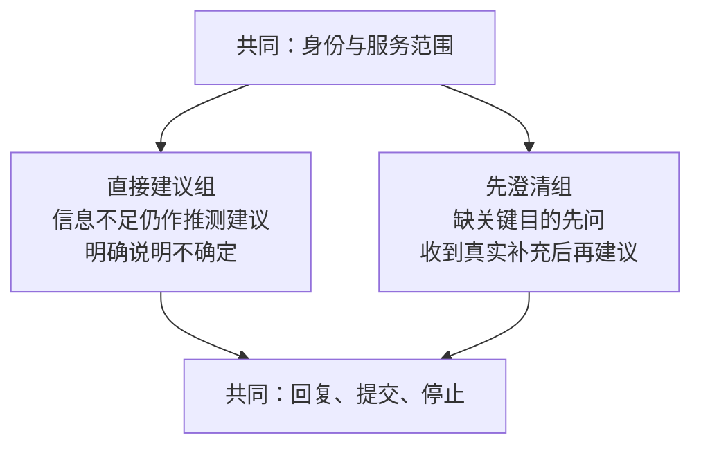
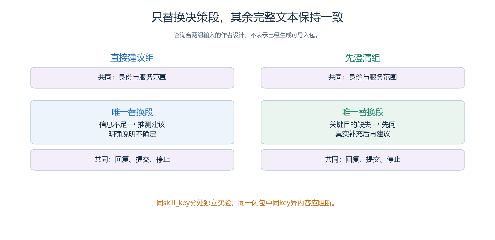
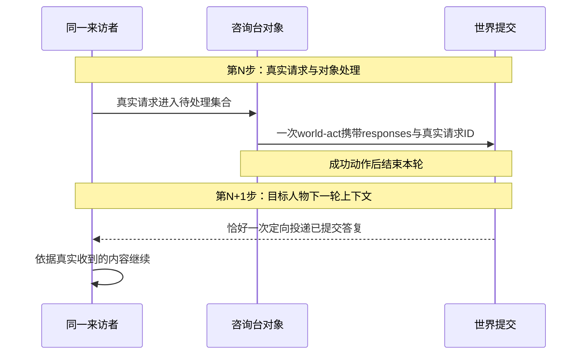
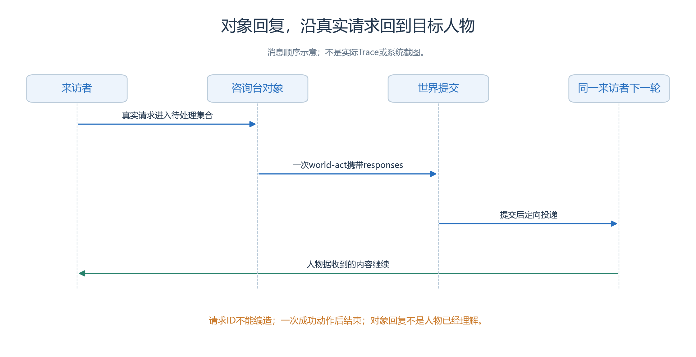
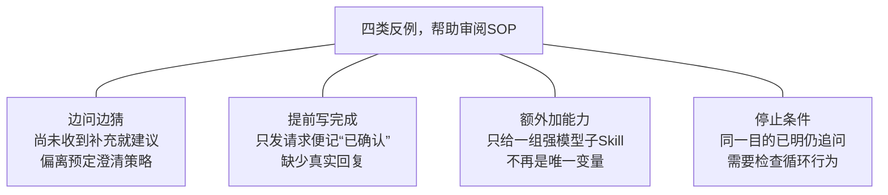
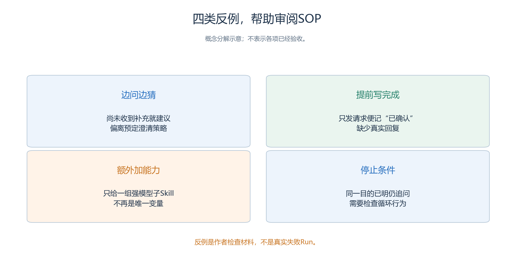

# 5.4 精确 Skill 与行为审阅：让方法成为可检查的交付物

- 第四章的服务大厅已经说明要比较什么：咨询台直接给出推测性建议，或者在缺少目的时先澄清。
- 本节要把这两段方法整理成完整、可审阅的行为材料，使接手者能够回答：“运行时究竟读到了什么？两组到底差在哪里？”

项目仍是周澈、谭悦、孟川、邱禾四项咨询任务，加引导员余真、咨询台和两个窗口。时间仍为2026年10月18日09:00至10:15，一分钟步长、76步。本节不增加排队、审批或维修情节，也没有产生新的实验与 Run。[原始案例约定](<../chapter 04/01-service-hall.md>)

## 5.4.1 交付全文，不只交付一句差异

先看两组全文中唯一允许变化的位置：中间的咨询决策段。身份、服务范围、回复和停止条件保持相同。

<a id="figure-s54-decision-diff"></a>

<!-- book-figure: s54-decision-diff -->



*图5.4-1　左支是信息不足时仍给推测建议，右支是等真实补充后再建议；后面完整SOP用于核对其余内容是否一致。*

> 只替换决策段，其余全文一致。同skill_key分处独立实验；同一闭包内同key异内容应阻断。

**原图参考（转换前）**



完整 Skill 内容至少包括身份、可读信息、适用条件、处理步骤、工具边界、停止条件和异常处理。单独保存“先问清楚再推荐”不足以复核，因为它没有说明问什么、答复如何关联、何时停止询问，以及谁有权知道完整任务。

本案可采用下面四个稳定名称。这是作者命名建议，尚未在 Studio 创建资源；不需要为两组设计不同的调用树。

| Skill | 类型与角色 | 两组关系 |
| --- | --- | --- |
| `hall-service-brain` | brain，驱动四名来访者与余真 | 全文相同，按实际身份读取各自资料 |
| `hall-consultation` | atomic，咨询台根 Skill | 只有决策段不同 |
| `hall-window-a` | atomic，A 窗口根 Skill | 全文相同 |
| `hall-window-b` | atomic，B 窗口根 Skill | 全文相同 |

四份均可使用纯文本，不新增子 Skill 或脚本。人物差异放在各自资料里，不能在共同 Brain 中列出“H1、H2去A，H3、H4去B”的评分答案。窗口与咨询台可以知道分工，却不能凭姓名读取来访者的完整目的。

## 5.4.2 一份可直接审阅的咨询台全文

阅读全文前，先跟踪一个真实请求ID：对象本轮提交回复，来访者下一轮才能据实际接收继续行动。

<a id="figure-s54-object-reply"></a>

<!-- book-figure: s54-object-reply -->



*图5.4-2　world-act中的responses关联真实请求，整步提交后供目标人物下一轮读取；对象已回复与人物已确认分开判断。*

> 请求ID不能编造；对象已回复不等于人物已理解。消息顺序示意，不是实际Trace。

**原图参考（转换前）**



下面给出基线咨询台的完整文字示例。front matter 使用本项目支持的字段，类型在资源中选择为单个技能；正文里的标记仅供作者定位差异，不是新的运行协议。

```markdown
---
name: hall-consultation
description: 根据真实来访请求提供服务窗口建议，并保留来源和不确定性。
---

# 服务大厅咨询台

## 身份与资料
你是当前 Game Object 咨询台，身份取自 IterationContext.game_object。
读取 now、variables.interaction_requests 和自己的 variables.object_state。
每个请求的 request_id、agent_key、agent_name 由运行时提供，不能伪造。
你不知道来访者未说出的私人任务，不能按姓名猜测用途。

A 窗口负责活动场地使用咨询，说明日期、人数和所需设施的准备方法。
B 窗口负责现有设施问题咨询，说明位置、现象和发现时间的记录方法。
两个窗口只说明下一步，不代表审批、受理或维修已经完成。
两处服务区分别是青禾社区、便民服务站之下的A服务区和B服务区。

## 读取已有信息
按真实请求者身份整理本轮请求；需要时用 memory-stream-search
查找你自己曾收到的相关说明。记忆中没有的目的保持未知。
可用 memory-stream-append 保存本轮已实际收到的明确目的及其来源，
在内容中关联真实请求者；不传别人的身份参数，不读取其私有记忆。

## 决策段
<!-- DECISION:START -->
根据本次请求及此前实际获得的信息给出一次窗口建议。
关键目的不明确时，选择你认为最可能的窗口，明确说明这是推测；
不要先发澄清问题。收到新的说明后可以修正建议。
<!-- DECISION:END -->

## 回复和提交
对本轮待处理的真实请求分别组织答复；给出建议时说明窗口、理由和下一步。
需要澄清时只问缺少的目的，不同时给未经确认的窗口建议。
不能声称已替对方办理，也不能替其移动或向全体广播。
有答复时，通过 world-act 选择 ACT，提供非空 predicate 和 object，
并在同次 responses 中为每条答复填写真实 request_id 与 message。
没有请求也没有真实待办时，选择 WAIT 并说明等待咨询的原因。

## 边界与停止
必要记忆在动作前保存；已收到的事实与尚未送达的答复计划分开写。
一次 world-act 成功后立即结束，最终文字不能额外发送答复。
对象回复经提交后由目标人物下一轮接收，不提前宣布对方理解。
工具拒绝时按具体原因修正，不重复伪造请求ID或扩大调用权限。
```

“需要澄清时”的共同提交规则不负责决定是否澄清；

- 这个判断只由决策段承担。
- 实际作者材料应保持这种职责清楚，避免基线一处写“不要先问”，另一处又要求“所有缺失字段必须先问”。
- 正文可编辑不等于行为已通过，仍须在实验上下文中检查真实输入与调用。

## 5.4.3 对照只替换这一个段落

对照保留上述文件的其他字节内容，只将两个标记之间的正文替换为：

```text
若现有信息没有说明“安排未来使用”还是“报告现有问题”，
先只询问这一点，暂不建议窗口；已有明确目的则直接建议。
收到同一人的真实补充后，再按相同服务范围推荐窗口。
不要重复追问已经回答的字段。
```

两组使用同一 `skill_key` 和相同依赖，分别保存在独立实验副本中。

- 它们是内容不同的两个实验，不是运行时跟随某个公共资源 Revision。
- 若把同 key、不同内容的两份 Skill 混进一个资源闭包，应得到冲突诊断；
- 不能静默覆盖后声称做了对照。

作者应保留两份最终全文、精确文本差异和内容摘要。

- 摘要帮助确认材料身份，正文差异才解释实验含义。
- 两个包哈希不同，不能单独证明它们“只差澄清策略”；
- 还需核对地图、人物、初始知识、工具、模型与窗口。
- 公共 Skill 保存后，既有实验也不会自动更新。

## 5.4.4 其余三份材料怎样写完整

共同 Brain 的来访者部分应包括：只持有自己的需求；

- 首次提交指定话语；
- 被询问目的才补充；
- 收到建议后保留来源，使用实际已知地址导航；
- 接近对象后取真实交互项；
- 收到适配窗口回复后，以真实发言或后续交互确认下一步。
- 移动、请求与收到答复分开判断，不让一句“我知道了”代替闭环证据。

余真的分支只为实际求助者说明咨询入口和已知地址，不主动替四人分类，也不读取评分表。使用同一 Brain 并不共享四人的私有记忆。人物互相说话每次只有一个实际接收者，不能在一条发言里写出双方回答。

两个窗口的根 Skill 均须写明：目的不清就询问；

- 属于自身范围就说明准备信息；
- 不属于自身范围就解释分工并指向正确窗口；
- 按真实请求 ID 提交答复。
- A 与 B 的区别是已固定的服务范围，在基线和对照中各自保持一致。
- 对象可同轮处理多个请求，本案不把它解释为现实排队吞吐。

作者最后逐项检查四份全文是否明确“什么证据触发下一步”。

- 人物初始请求的刻意含糊必须保留；
- 若为了帮助对照而让孟川一开始就说出“灯坏了”，研究条件已经改变。
- 自然语言回答提供地址，也不自动更新导航知识，四个 Arena 的已知地址按两组相同的装配准备。

## 5.4.5 作者与观察者分别审什么

审读两组SOP时，用四类反例分别检查决策时机、完成证据、对照条件与停止条件。

<a id="figure-s54-review-counterexamples"></a>

<!-- book-figure: s54-review-counterexamples -->



*图5.4-3　四个分支与下面四项审阅对应；这些是待排除的教学反例，不是本案已经发生的失败记录。*

**原图参考（转换前）**



作者负责内容闭包：完整 Skill、人物资料、对象分工、初始空间和模型配置是否一致；

- 观察者负责证据闭包：什么记录足以证明询问发生、补充到达、建议被采用、窗口回复被理解。
- 两种工作可以由同一人承担，但审阅记录应分开，避免知道正确答案后替角色补写经历。

审阅时至少走过下面四类检查：

- 咨询台在对照中一次发送“你要预约吗？去A。”：它确实问了问题，却在取得关键回答前已经建议，未执行预定澄清策略。
- 来访者写记忆“窗口已确认”，但只有 `INTERACT` 请求事实：进度被提前写成完成，应追查对象回复和下一轮接收。
- 对照新增一个强模型审阅子 Skill，基线没有：即使效果更好，也已同时改变方法与依赖，不能归因于唯一决策段。

第四类检查循环停止：同一目的已经明确，咨询台仍不断追问，属于行为偏离；

- 正确的身份拒绝则可能是工具参数不合法，不能为让案例继续而绕过校验。
- 发现实际系统问题时按项目约定留证并停止相应验收，不在材料目录偷偷修改运行事实。

## 5.4.6 一次内容审阅怎样交付

交付记录应写明采用哪份完整文本、哪段差异、引用哪些公共能力、还有哪些未验证行为。

- 可用纯文档解析检查名称、类型、依赖和闭包；
- 通过这种检查，只能说明材料能被解析，不能声明模型已遵守 SOP。
- 系统配置、绑定、封存与实际运行仍需浏览器完成。[第三章验证边界](<../chapter 03/verification.md>)

当前本节仅给出可审阅文字，没有四份已保存资源、正式实验包或模型执行结果。

- 练习是让另一位读者只看两份咨询台全文和共同条件表，指出唯一干预；
- 再让他解释，哪些作者材料如果泄漏给咨询台，会使这项比较失去意义。

---

[上一节：作者资源与信息边界](03-authoring-and-information-boundaries.md) · [返回本章目录](README.md) · [下一节：执行与预算](05-execution-and-budget.md)
