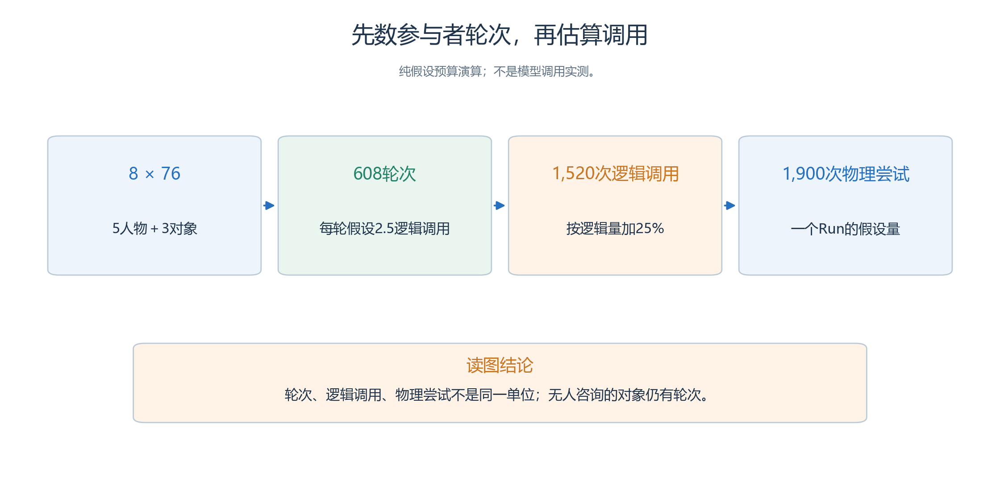
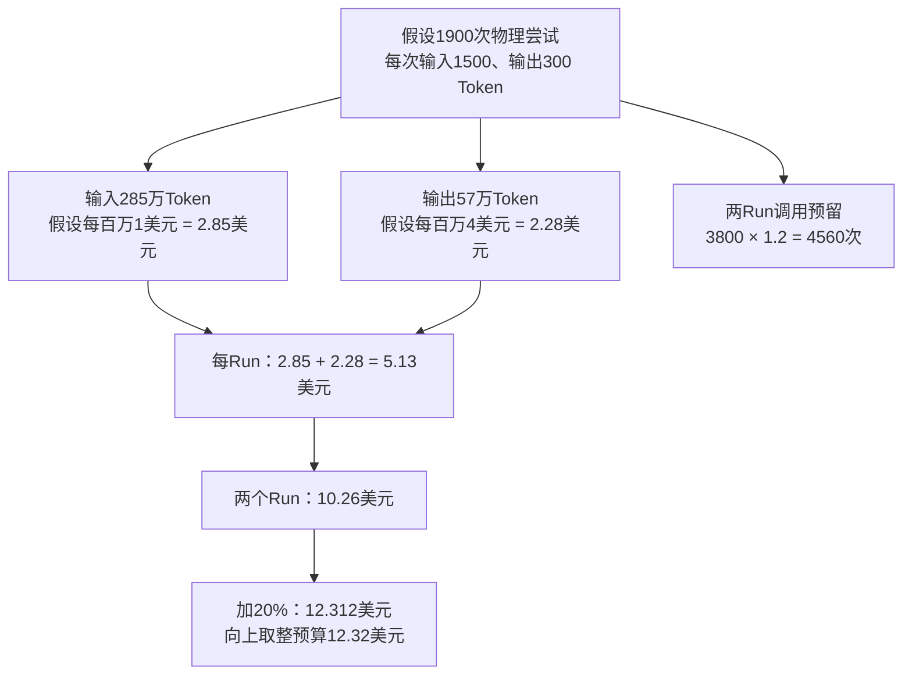
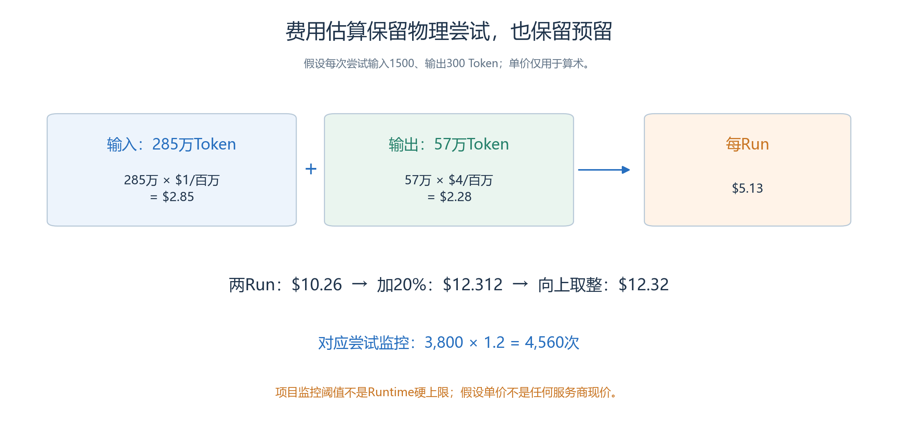
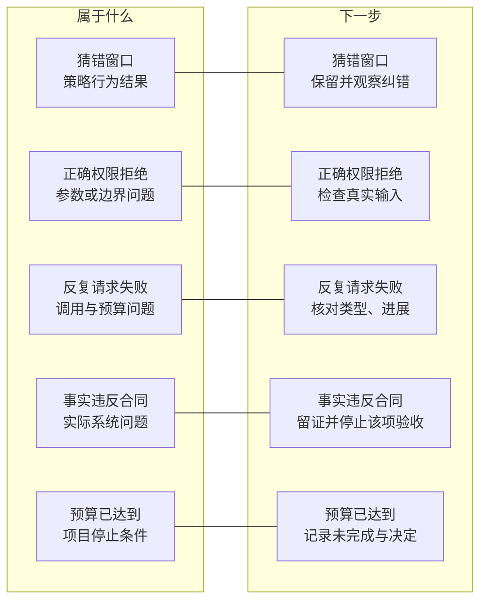
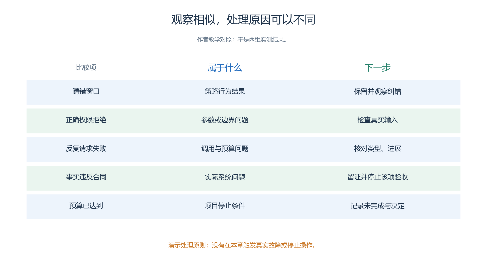

# 5.5 执行与预算：让下一位负责人知道何时继续、何时停下

- 服务大厅的研究问题已经明确：先问清“安排未来使用，还是报告现有问题”，是否值得多一次交互？现在需要将它变成可交接的执行计划。
- 接手者应知道下一步做什么、依据什么进入下一阶段、准备消耗多少资源，以及遇到问题时由谁判断。

本节沿用[社区服务大厅](<../chapter 04/01-service-hall.md>)的五名 Agent、三个对象与四项初始任务，不另造一套场景。当前仍没有已创建的实验、真实调用或业务结果；以下计划和预算都是事前材料。

## 5.5.1 项目角色与仿真角色分开

周澈、谭悦、孟川、邱禾和引导员余真，是世界中的五名人物。项目负责人、操作人员和评阅者，则是组织实验的人。前者的职业或目标不会替后者完成验收，也不会获得系统管理权限。

| 项目职责 | 交给下一环节的具体内容 |
| --- | --- |
| 需求负责人 | 四项咨询的范围、唯一策略差异、闭环判据与不做的事项 |
| 作者与操作人员 | 精确材料、已保存配置、实际身份、操作与问题记录 |
| 证据评阅者 | 每项判断对应的请求、回复、位置与确认记录，以及缺失项 |
| 接收负责人 | 所需交付级别、可用环境、未完成工作与接手确认 |

一个人可以承担多项职责，但记录时仍要注明以什么身份作出决定。比如，操作人员发现 H3 到了 A 窗口，应先记录事实；不能为了按时交付，自己把正确窗口改成 A。需求变更与操作纠错必须留下不同的理由。

两组名称使用“直接建议组”和“先澄清组”，也分别简称基线组和澄清组，避免把策略组别与 A、B 服务窗口混淆。H1、H2 的需求对应 A 窗口；H3、H4 对应 B。完整目的表只供作者和评阅者，人物、咨询台与引导员按各自信息边界获取内容。

## 5.5.2 按证据推进项目，而不是按日历宣布完成

执行顺序应是一条可检查的链：材料可审阅，配置已保存，实验输入已固定，运行事实可读，最后结果可交付。每个阶段完成后再留下一个明确的交接记录。

| 阶段 | 进入下一阶段前必须回答的问题 |
| --- | --- |
| 材料审阅 | 四项需求、窗口分工和两段咨询策略是否完整且不泄漏私人目的？ |
| 浏览器配置 | 图片、空间、出生点、Skill 与模型是否实际保存并重开核对？ |
| 执行准备 | 两组除咨询策略外是否一致，预检与预算是否对应当前草稿？ |
| 运行观察 | 当前 Run、Attempt、已提交 Step 与在途请求是什么？ |
| 结果收集 | 四项任务与全部失败是否登记，报告能否追到提交事实？ |
| 交付检查 | 接收者拿到了哪类文件，哪些用途已经验证？ |

配置和执行仍走第三章的浏览器流程。

- 本节不通过脚本补齐 UI 尚未保存的内容，也不把本地 Skill 文档解析通过当作正式运行通过。
- 若执行前复制了草稿，应重新确认当前实验身份，不能继续使用旧预检截图作为新副本的证明。

候选时间是 `2026-10-18T09:00:00+08:00`，每步一分钟，共 76 步。Step1 为 09:00，最后一步为 10:15，覆盖 75 个虚拟分钟。排程表中还要分别记录实际操作时间、模型耗时和暂停时间，不能把“上午安排两小时操作”写成系统保证两小时内完成。

## 5.5.3 先列数量，再计算一份假设预算

沿着单位换算看预算：8名参与者×76步先得到轮次，再按每轮调用数和额外尝试比例估算请求量。

<!-- book-figure: s55-call-budget -->

*图5.5-1　608是参与者轮次，1,520是逻辑调用，1,900是含额外尝试的物理请求；后两项由2.5次/轮与25%假设推得。*

**原图参考（转换前）**

五名人物加咨询台、A 窗口、B 窗口，共八个参与者。完整一个 Run 有 `8×76=608` 个参与者轮次。对象无人咨询时仍可自主执行，不能只计算四名来访者；每轮又可能有多次推理和工具往返，轮次数不等于模型请求数。

下面是**纯假设的预算演算，单价不是任何服务商现价**。先计划两组各一个 Run；假设每个参与者轮次平均产生 2.5 次逻辑调用，物理尝试比逻辑调用多 25%，每次物理尝试平均使用 1,500 输入 Token、300 输出 Token。

| 一个 Run 的估算项 | 演算 |
| --- | --- |
| 逻辑调用 | `608×2.5=1,520` 次 |
| 含重试的物理尝试 | `1,520×1.25=1,900` 次 |
| 输入量 | `1,900×1,500=2,850,000` Token |
| 输出量 | `1,900×300=570,000` Token |
| 假设计价 | 输入每百万 Token 1 美元，输出每百万 Token 4 美元 |
| 假设费用 | `2.85×1+0.57×4=5.13` 美元 |

两 Run 合计假设费用为 10.26 美元；增加 20% 预留后为 12.312 美元，向上取整到美分为 12.32 美元。这一演算假设每次物理尝试均按上述用量计费。现实中的失败计费、缓存、用量缺失和服务条款可能不同，实际核算须使用实际记录与账单。

当前页面估算采用参与者数和步数的粗粒度区间，尚不能代替这份逐项预算；

- 平均调用数和 Token 假设也尚未由本项目校准。[现有估算边界](<../chapter 03/09-running-and-cost.md>)说明了两者应怎样区分。
- 首次实际观察后可以修订下一批预算，但不要把新的估计倒写成原先就已知道的数值。

## 5.5.4 把预算写成能采取行动的表

承接上一节每Run的1,900次物理尝试，先折成Token和费用，再扩展到两个Run及20%预留；下表另设行动阈值。

<!-- book-figure: s55-cost-budget -->

*图5.5-2　假设预算向上取整为12.32美元，物理尝试预留为4,560次；表中的13美元是负责人复核阈值，两者含义不同。*

> 仅假设算术，非厂商现价或实测账单；项目监控阈值不是Runtime自动硬上限。

**原图参考（转换前）**

预算既包含预计消耗，也包含停止和复核条件。假设负责人为上述两 Run 设置以下监控规则，这些数字只是可替换的教学方案：

| 项目 | 事前登记值 | 到达条件后的动作 |
| --- | --- | --- |
| 本批范围 | 两组各一个完整窗口 | 不因结果不满意自行增加 Run |
| 物理尝试监控阈值 | 两 Run 合计 4,560 次，按 3,800 次增加 20% | 暂停检查剩余工作与重试原因 |
| 费用复核阈值 | 假设计价下 13 美元 | 核对真实计费与后续授权范围 |
| 单次墙钟复核点 | 从启动起两小时，包含暂停；暂停时长另列 | 区分实际执行与等待，检查在途请求和进展 |
| 数据缺口 | 用量或关键过程记录不可获得 | 标为未知，改用仍可核对的限制与证据 |

这些是项目监控规则，并非已经配置进 Runtime 的自动硬上限。

- 现有调用预算、重试配置、运行槽位和人工停跑决定，各有不同作用。
- 操作人员发出暂停或取消后，在途请求和安全收尾仍可能产生消耗；
- 不能承诺按下按钮的一刻立即停止计费。[控制与恢复限制](<../chapter 03/10-pause-resume-rerun.md>)应随执行计划一起交给接手者。

小规模试跑是可选项。

- 若需要检查耗时或素材，可以单独登记为准备活动，说明输入、步数、预算及其不回答的问题。
- 它不能证明 76 步内全部咨询会闭环，也不是正式运行前强制的一至三步仪式。
- 选择不试跑时，就保留估算不确定性并采用明确观察点，而不是补写一份不存在的试跑报告。

## 5.5.5 故障决策应指向不同的下一步

“没有进展”只是表象。按左列识别具体情况，再横向找右列下一步；下表把每一种处理展开。

<!-- book-figure: s55-stop-decisions -->

*图5.5-3　五行分别对应行为结果、正确拒绝、请求失败、合同违规与预算条件；不能对所有现象都采取重跑。处理规则示意。*

**原图参考（转换前）**

当画面暂时没有移动时，先读实际状态和调用。一次有理由的等待、一条未投递完的对象回复、一个在途模型请求和反复无进展，不是同一种情况。

| 观察 | 项目中的处理原则 |
| --- | --- |
| 咨询台按预定策略猜错窗口 | 保留为行为结果，继续观察纠错与成本 |
| 工具正确拒绝非法目标 | 保留输入和原因，检查 SOP 如何处理，不直接判系统故障 |
| 模型请求失败或重试增加 | 核对类型、预算和进展，再决定继续、暂停或结束本次尝试 |
| 路径事实、对象反馈或页面身份违反合同 | 停止当前构建／运行验收，保存证据并报告具体问题 |
| 达到预算但尚未闭环 | 保留未完成状态，交由负责人决定后续阶段，不挑成功 Run 替换 |

系统问题的修复需要针对该问题的明确决定，不能在等待决定时改数据库、实验文件或公共资源绕过。

- 恢复也不能用一次新建 Run 代替：续跑保持 Run 身份并产生新 Attempt；
- 修改输入后运行应使用新的独立实验。
- 记录“为何采取这一步”，比只记“已经重启”更能帮助下一位负责人。

## 5.5.6 执行日志最后要留下什么

交接记录可以是一段短文：“当前完成到哪个阶段；所选实验与 Run 身份是什么；最后完整提交在哪里；已触发哪项预算规则；还有哪些在途或待核对事项；下一步由谁处理。”尚未创建 Run 时，身份明确填“未创建”，不以教学编号代替 UUID。

实际消耗按 Run 汇总全部 Attempt，并分别保留人物、对象、逻辑调用、物理尝试、Token 与费用来源。

- 失败步骤中的模型尝试仍有成本；
- 业务证据限定在已提交边界，不能因此把未提交尝试的消耗也删除。
- 四项任务未闭环的数量同样保留。

本节的完成标准是一份别人能按其继续工作的执行计划与预算登记。此刻计划可以完整，运行结果仍然为空；只有后续事实形成，才能将“计划执行”改为“已经观察”。下一节再把这些记录组织成可审查的结果。

---

[上一节：Skill 与审阅](04-skills-and-review.md) · [下一节：证据与结果](06-evidence-and-results.md) · [返回本章](README.md)
