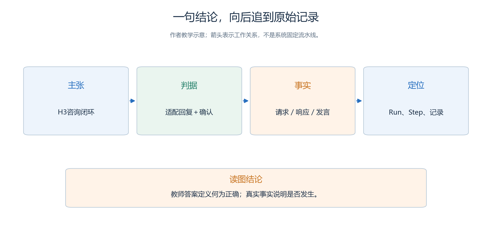
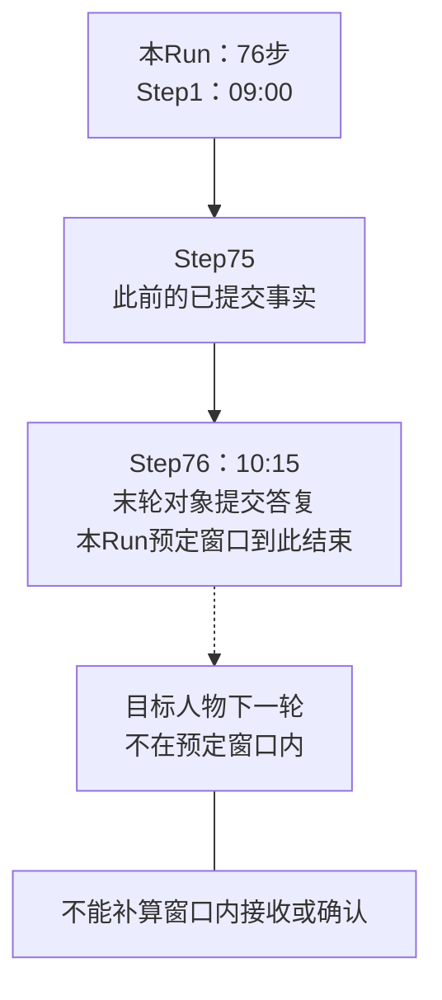
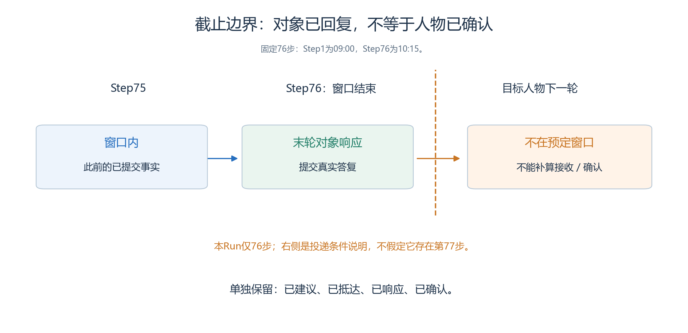
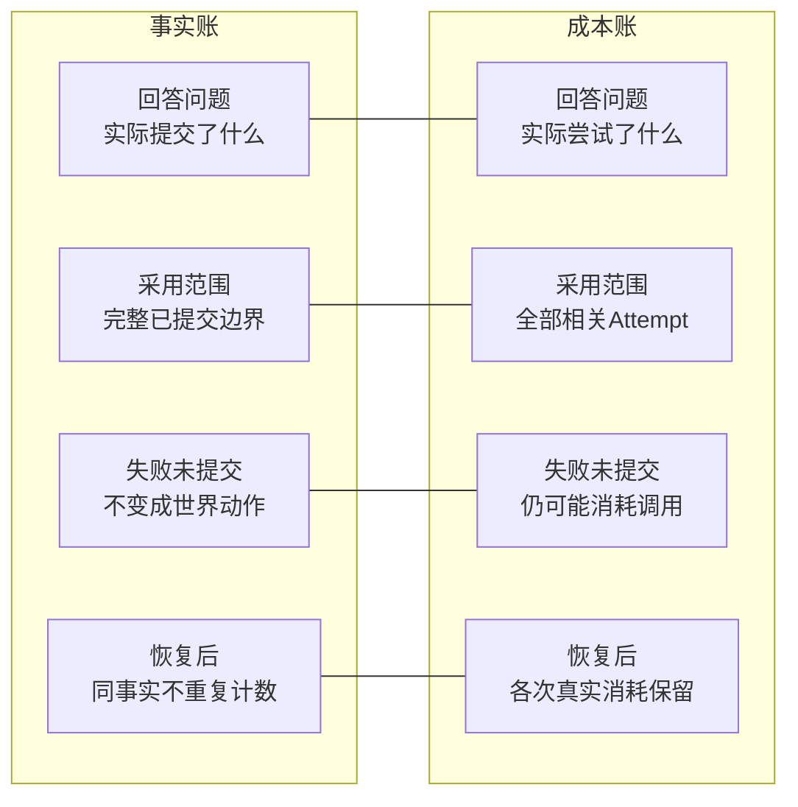
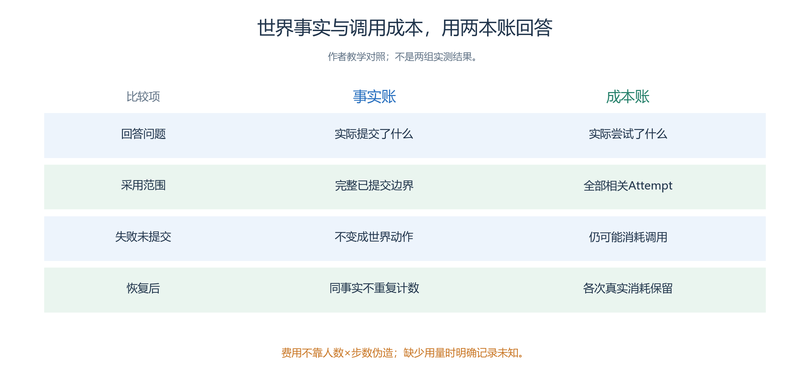

# 5.6 从原始事实到可复核成果：每个结论都能找到出处

“来访者找到了正确窗口”需要一条可复查的证据链：**谁提出需求 → 怎样补充 → 得到什么建议 → 实际去了哪里 → 收到并确认什么。**

本节沿用H1—H4、2026年10月18日09:00—10:15的76步窗口及[第四章判据](<../chapter 04/01-service-hall.md>)，把评分逐项连接到来源。

## 5.6.1 先把原始文件和分析工作分开

下面是建议目录，当前没有创建这些证据文件或取得相应导出：

```text
evidence/
  originals/<真实run_id>/    下载时的原始文件，保留原名和字节内容
  extracted/<真实run_id>/    用于只读查阅的解压副本
  inventory/                来源、身份、边界、大小和摘要清单
  judgments/                人工判分、争议与复核记录
  reports/                  图表、正文和对外说明
```

| 材料层 | 保存什么 | 处理规则 |
| --- | --- | --- |
| 原始导出 | 原名与字节内容 | 不重新打包、改名覆盖或补写字段 |
| 解压副本 | 原始成员内容 | 只读查阅，不反向写回Run或实验 |
| 派生材料 | 清洗、筛选、标注、判分 | 指向原始文件与记录位置 |

交接清单按三组登记，无法核实的字段写“未知”：

| 分组 | 必填信息 |
| --- | --- |
| 文件来源 | 原文件名、实际来源、取得时间、大小、SHA256 |
| 身份与边界 | Experiment、Run、全部Attempt、状态、最后提交Step |
| 操作上下文 | 导出时页面选中的对象、原始归档路径 |

摘要能核对字节是否相同，不能证明业务真实或两组只差一个因素。普通结果ZIP、正式 `.gaexp`、`.garun` 分开标注；改后缀不能改变类型，底层能力也不代表页面已有同名按钮。[包与复现边界](<../chapter 03/13-packages-and-reproduction.md>)

## 5.6.2 让一句主张接受三次追问

假如报告准备写“H3完成咨询闭环”，先沿图连问：判据是什么、事实在哪里、怎样定位到那次记录？

<a id="figure-s56-claim-evidence"></a>

<!-- book-figure: s56-claim-evidence -->


*图5.6-1　H3是待核验的示例主张；适配回复和确认必须各有实际来源，不能拿教师答案证明它们已发生。*

> 教师答案定义何为正确；真实事实说明是否发生。

**原图参考（转换前）**



| 拟写主张 | 必须满足的判据 | 需要找到的来源 |
| --- | --- | --- |
| 实施了澄清策略 | 关键目的缺失时先问，收到补充后再建议 | 请求、询问、真实补充、后续建议 |
| 抵达正确窗口区域 | 提交坐标与地址落在适配服务区 | MOVE事实与参与者状态 |
| 获得适配回复 | 窗口按真实目的说明正确下一步 | 作者任务、窗口请求与响应、接收事实 |
| 完成咨询闭环 | 取得适配回复，并确认正确下一步 | 上述链条，加人物发言或后续交互 |

核对每项评分时，再查两个层次：

- **独立判据**：冻结的作者材料说明什么算正确；角色说“建议正确”不构成独立判断。
- **实际发生**：定位真实Run、Agent或对象、Step，以及事件、请求、会话或记忆身份；教师答案不能证明角色已经收到信息。

保留归档路径、成员文件和记录位置。主张编号只是分析索引；字段与身份按真实协议填写。截图可以辅助说明，不能靠补造事件ID建立来源链。

## 5.6.3 保持相同的取材边界

本案Step1为09:00，每步一分钟，Step76才是10:15。若对象恰在末轮回复，人物的下一轮接收已经超出这次窗口。

<a id="figure-s56-window-boundary"></a>

<!-- book-figure: s56-window-boundary -->



*图5.6-2　实线止于Step76的对象回复，虚线指向窗口外的接收条件；不能将窗口外确认补算成窗口内闭环。*

**原图参考（转换前）**



| 要对齐什么 | 正确做法 | 不能怎样拼接 |
| --- | --- | --- |
| Step边界 | 同一Run、同一已提交边界 | 第50步位置配第51步回复，声称第50步闭环 |
| 业务窗口 | 只取本案76步范围 | 用更长实验后续事实补算 |
| 对象响应 | 第76步提交答复，记录“对象已响应” | 当作人物已在窗口内收到并确认 |
| 历史知识 | 使用对应提交事实与一致性取材 | 把后来追加的记忆当成早已知道 |
| 恢复过程 | 合并全部Attempt，唯一事实计一次 | 恢复前后重复计数，或只选末次Attempt |

窗口末轮为10:15。对象此时答复，人物的下一轮已在预定窗口之外；应同时记录“对象已响应”和“窗口内尚无人物接收／确认事实”。

还要分别标注**虚拟时间、模型耗时、含暂停的墙钟时间**。内存、最新状态与当前记忆会变化；历史判断需要身份、哈希和帧连续性支持，播放顺畅不能替代核查。[第三章事实核查](<../chapter 03/verification.md>)

## 5.6.4 把叙述中的“完成”拆开验证

| 看到的文字或状态 | 能说明什么 | 还缺什么 |
| --- | --- | --- |
| `world-act` 返回 `accepted` | 该请求被接受 | 对象处理、响应提交、人物下一轮接收 |
| 余真说“周澈明白了” | 余真说了这句话 | 周澈自己的真实双人 `SPEAK` 或后续交互 |
| “准备前往A窗口”便签 | 动作前的计划 | 下轮坐标确认抵达、窗口实际答复 |
| “已收到建议” | 有一条接收主张 | 来源及建议是否适配具体任务 |
| “我已经办理好了” | 人物的总结 | 本案只咨询，不能据此认定审批或维修完成 |

本案可报告的业务成果是**获得适配说明并确认下一步**。它没有行政审批或实际维修机制。

第四章人工题中的H2已有适配入口建议、已抵达A服务区，但没有目标窗口回复和完成确认。因此，“首次有效回应已发生”与“尚未闭环”可以同时成立。人工材料没有真实事件ID，不补造编号或截图。

## 5.6.5 失败的成本不能随未提交事实一起消失

一次模型尝试失败且未提交世界动作，还可能产生费用。横向比较两本账怎样处理同一次失败与恢复。

<a id="figure-s56-two-ledgers"></a>

<!-- book-figure: s56-two-ledgers -->



*图5.6-3　事实账按完整提交边界计数，成本账保留全部相关Attempt的真实消耗；两者的记录范围不同，不是实测账单。*

> 费用不靠人数×步数伪造；缺少用量时明确记录未知。

**原图参考（转换前）**



| 账本 | 采用范围 | 典型处理 |
| --- | --- | --- |
| 世界事实 | 完整已提交边界 | 未提交调用不能算移动或咨询 |
| 调用成本 | 全部相关Attempt的真实消耗 | 超时、格式修复、失败尝试仍可能消耗Token |

成本账还须遵守三条规则：

- 区分**参与者轮次、逻辑调用、物理尝试、工具调用**。一次对象轮次可能调用模型多次、一次动作回复多个请求，不等于现实接待人数。
- 保留人物、引导员与对象的消耗；重试不是第二项业务任务，不能只计最终成功的物理请求。
- 原记录缺Token、费用或完整调用信息时写“未记录／无法核验”，不用人数乘步数伪造账单。

| 结果状态 | 判断依据 | 报告方式 |
| --- | --- | --- |
| 未完成 | 有证据表明未形成闭环 | 写明缺失环节 |
| 证据不足 | 归档不足，无法判断 | 保留待判断项 |
| 执行失败 | 系统错误终止 | 另记执行状态与已提交范围 |

保留全部计划内Run，不靠反复重跑只挑成功样本。

## 5.6.6 人工阅卷要留下别人能重复的判断

1. 先读冻结任务表与判据，再逐项核对H1—H4。
2. 每项写“证据支持／证据表明不成立／证据不足”，附来源与短理由。
3. 按预定标准判断确认：只说“很满意”不够，应确认正确窗口及与自身需求有关的准备内容；不能看完结果后临时要求逐字背诵。
4. 两位评阅者可以独立核对关键样本，再区分分歧来自标准不清、原文含糊还是来源缺失。

在“Agent → 选择人物 → 对话／记忆”先定位摘要，再查完整事实。面板未展示的替代关系和消息不能由观察者补写；人工阅卷也不能标成Runtime已执行自定义业务Evaluator。[当前实现范围](<../chapter 04/verification.md>)

证据未补齐时，报告已证实范围与待判断项，不剔除未知项后给出假精确的总体效果。

## 5.6.7 对外结论写到证据能够支持的位置

按以下顺序写报告：**研究条件 → 全体样本与边界 → 观察 → 代价 → 未完成 → 解释限制**。

- 组别称“直接建议组／先澄清组”，地点称“A窗口／B窗口”，避免混淆。
- 图表指向同一运行索引和评分来源。
- 若少走错窗口却多花轮次与调用，应完整报告取舍。
- 当前只有教学设计，交付名称应为“待执行方案和判分方法”。

**练习：**审阅“本系统证明澄清能提高行政服务效率”，指出业务范围、样本证据和外推问题；改成符合当前交付状态的表述，并列出讨论本组效果还需要哪些真实记录。

---

[上一节：执行与预算](05-execution-and-budget.md) · [返回本章目录](README.md) · [下一节：交接与复现](07-handoff-and-reproduction.md)
