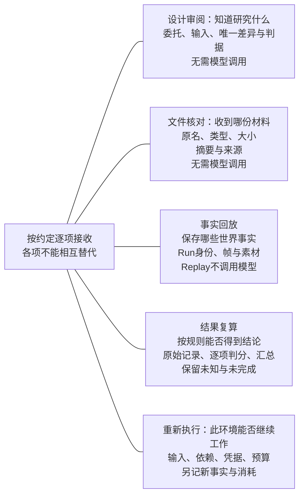
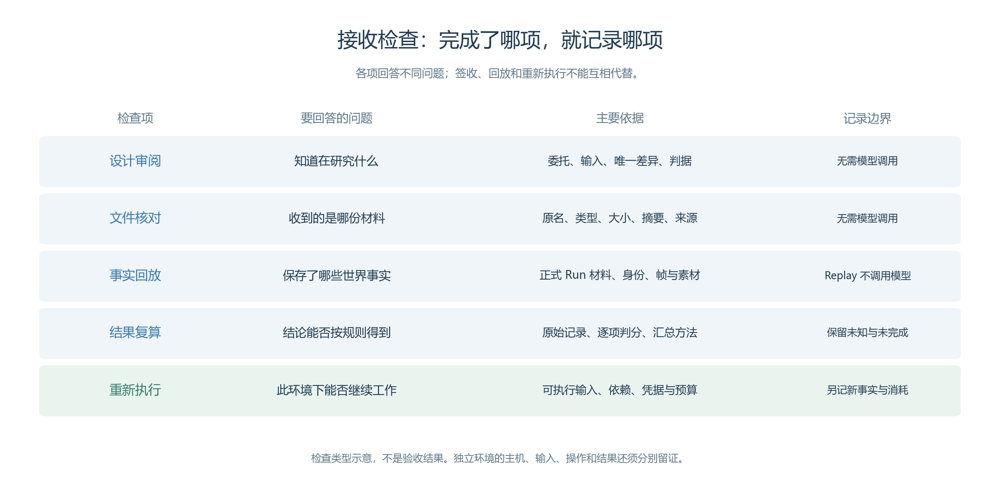
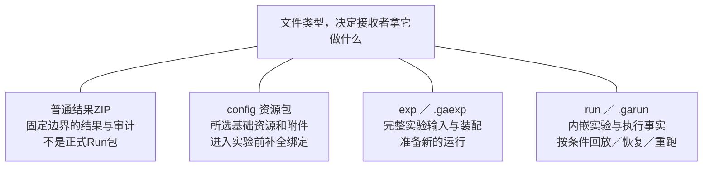
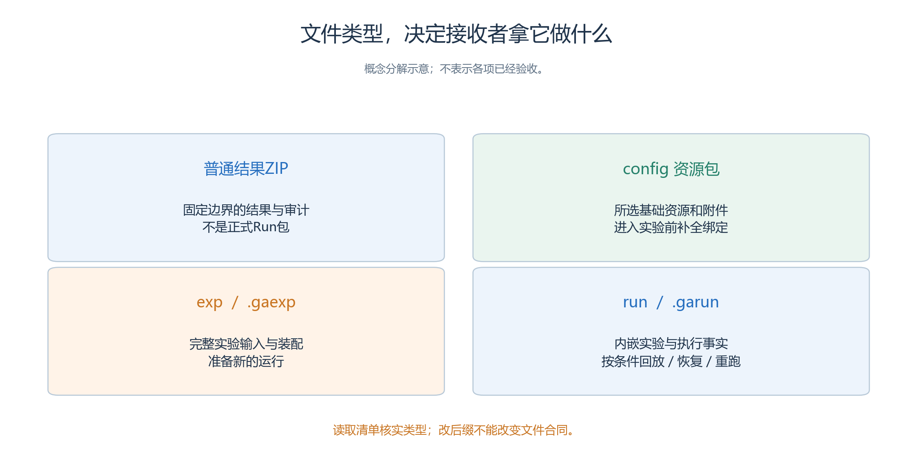
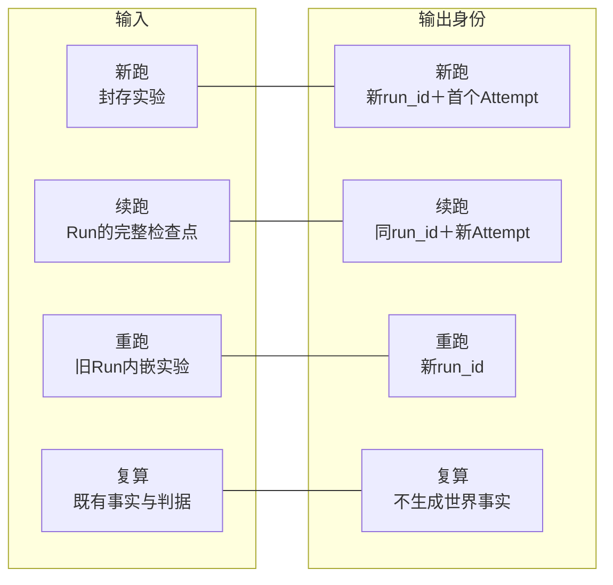
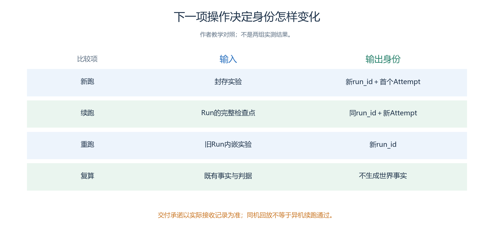

# 5.7 交付与复现：让接收者知道拿到了什么

一份项目材料能被下载，并不意味着另一个人能够理解或继续工作。

- 接收者可能只想审阅结论，也可能需要离线回放，或计划在自己的机器上继续研究。
- 交付之前先写清这项需求，才能决定材料范围和验证深度。

本节继续使用服务大厅项目。当前只有待实施的设计，尚无本项目真实导出或异机结果。以下清单用于准备交付，空项要保留“未生成”或“未验证”，不能用一份演算数据填成已完成的仿真报告。

## 5.7.1 先约定接收者要完成什么

接收者要审设计、核文件、看回放、复算分数，还是重新执行？先选检查类型，再按后表准备对应材料。

<a id="figure-recipient-checks"></a>

<!-- book-figure: recipient-checks -->



*图5.7-1　五类接收检查回答五个不同问题；文件签收、事实回放和重新执行各自留证，不能相互替代。*

**原图参考（转换前）**



“请帮我看看”不是充分的交付目标。更清楚的请求是：“请确认两组只改变了咨询台的澄清策略，并检查 H1—H4 的判分是否能追到证据。”它不要求接收者运行模型，也不要求把所有公共作者资源导入自己的工作区。

如果目标是继续实验，则还要交代下一项工作。例如检查尚未投递的窗口回复、调整一段 SOP，或从相同封存输入增加独立重复。它们分别需要可恢复边界、新草稿或新 Run，不能只写成“继续跑一下”。

| 接手任务 | 必要交付 | 应明确保留的边界 |
| --- | --- | --- |
| 设计审阅 | 需求、两组差异、人物信息边界、判分表 | 尚无行为结果时不能评价策略效果 |
| 文件核对 | 实际文件、来源、原名、类型、大小与摘要 | 收到文件不等于已通过协议校验或运行验收 |
| 结果复算 | 全部结果索引、原始证据、评分依据与缺失项 | 截图和总结不能独立证明闭环 |
| 事实回放 | 可校验的 Run 材料、兼容读取环境与素材 | 回放不重新调用模型 |
| 重新执行 | 正式输入／Run 包、环境条件、执行计划 | 新执行需要另行确认预算与身份 |

可以用[接收方检查表](templates/recipient-checklist.md)记录约定。接收者签收了材料，只说明该次交付被接收，不自动代表每一级验证都通过。


## 5.7.2 用一张清单连接需求、证据与文件

服务大厅交付应能说明：A 窗口处理使用咨询，B 窗口处理已有设施问题；

- 两组共有四项需求，只有咨询台是否先澄清目的不同。
- 精确策略片段、各人物的私人目的、空间方案与运行参数都要有固定出处，避免接收者在多个聊天记录里猜哪一份有效。

| 材料 | 内容与接收检查 |
| --- | --- |
| 项目说明 | 本批范围、负责人、交付日期、当前阶段和下一项工作 |
| 输入清单 | 地图、五人、三对象、Brain／Skill、模型配置及两组精确差异 |
| 身份登记 | 实验、Run、全部 Attempt 与内嵌输入摘要；未产生者明确标记 |
| 结果索引 | 全部 Run、失败与未完成任务、实际观察窗口、评分入口 |
| 证据材料 | 请求／回复、位置、确认消息和人工判分的对应关系 |
| 原始导出 | 文件类型、来源边界、时间、字节数、SHA256 和取得方式 |
| 接手说明 | 环境前提、已知限制、未解决问题及所需决定 |

作者说明中的 H1—H4 是教学任务键，不能替代系统生成的身份。引用一条“孟川已获得正确建议”时，应指出对应人物、请求、回复与接收轮次；人物同名并不足以确认它来自哪次 Run。

角色的私有记忆隔离是 Runtime 的参与者权限边界，不表示交付 Run 时这些记录从文件里消失。需要公开分享的讲义可制作注明来源的摘录；完整证据原件另按项目约定保存，不能删改原包后继续引用原摘要。

## 5.7.3 四类文件对应不同用途

收到一个压缩文件后，先认清实际包类型与内容，再选择导入、运行或回放操作。图与下表使用同一组分类。

<a id="figure-s57-package-uses"></a>

<!-- book-figure: s57-package-uses -->



*图5.7-2　普通结果ZIP与config、exp、run正式包分别处理；扩展名或“能解压”不能单独证明协议验证通过。*

> 读取清单核实类型；改后缀不能改变文件合同。

**原图参考（转换前）**



交付清单不能只写“一个 ZIP”。当前协议和结果导出同时存在，文件后缀相似并不意味着能力相同。

| 类型 | 接收者可以据此做什么 | 仍需核对什么 |
| --- | --- | --- |
| 普通结果 ZIP | 查看固定提交边界的结果、报告与审计材料 | 内容范围、来源 Step；它不自动成为正式 Run 包 |
| `config` 资源包，通常为 `.zip` | 导入所选地图、人物、Skill 等基础资源 | 自身附件及跨资源依赖，不能当作已完成实验 |
| `exp`，`.gaexp` | 取得完整实验输入与装配 | 协议、完整性、环境和执行条件 |
| `run`，`.garun` | 取得内嵌实验与执行事实，供回放及符合条件的恢复／重跑 | 身份、帧、恢复边界和目标环境 |

三种正式包采用 `ga-package` v2；类型由清单的 `package_kind` 识别，不靠文件名推断。`config` 可以含显式未绑定的跨资源依赖，进入实验前必须绑定完整；同一个 Skill key 内容冲突时，不按显示名称静默覆盖。导入资源成功也不等于恢复了一个 Run 的历史。

普通“下载全部”生成结果包，不等于正式 `.garun`。

- 正式封存要在一致边界取得内容并生成完整性清单，不能把一个结果 ZIP 改后缀实现。
- 第三章已区分现有结果按钮与底层正式封存能力；
- 本项目没有经 UI 核验的操作仍列为缺口，不用命令或直接接口补做本次系统验收。[文件类型与边界](<../chapter 03/13-packages-and-reproduction.md>)

## 5.7.4 接收方先做只读核验

第一层是**字节与来源核验**。

- 接收方对照清单中的文件名、大小和 SHA256，确认传输后仍是同一份材料；
- 再核对生成时间、源状态与提交边界。
- 哈希相同只证明字节相同，不证明内容合理或业务成功。
- 没有原始摘要时，应记录缺少比较依据，不能用接收后第一次计算的摘要倒证传输前状态。

第二层是**协议与事实核验**。

- 使用兼容读取环境检查正式包身份、完整性、内嵌实验摘要和帧连续性，再查看提交范围内的状态。
- Replay 只读事实，不加载 Brain 或重新推理；
- 看见 H3 在 B 窗口附近，还要查实际回复与确认，才能评价闭环。[Replay 读取器](../../../src/generative_agents/ga_replay/reader.py)

第三层是**交付结论核验**。

- 在实际存在的类别中，抽查成功、未完成或有争议的判断，沿材料定位原始记录；
- 某类没有样本就说明未观察到，不要求补造。
- 若清单写“完成三项”，明细只有两条充分证据，就登记差异，退回补充或修正报告，不由接收者猜出第三条。

只读核验可以在不具备模型凭据的环境完成，前提是程序、包和素材满足读取要求。它也有自己的失败结果：文件损坏、协议不支持、内容缺失、证据对应错误要分别记录，不能统一写成“复现失败”。

## 5.7.5 正式复现是一项单独工作

先选择“新跑、续跑、重跑、复算”中的哪项工作，再准备目标环境。逐行比较输入来源和是否创建新的运行身份。

<a id="figure-s57-run-identities"></a>

<!-- book-figure: s57-run-identities -->



*图5.7-3　续跑保留run_id并新建attempt_id，重跑从内嵌实验创建新Run，复算只读取事实；后文的环境核对服务于所选操作。*

> 交付承诺以实际接收记录为准；同机回放不等于异机续跑通过。

**原图参考（转换前）**



若接收者计划重新执行，还需记录操作系统、程序版本或源码提交、工作区修改情况、Python 与依赖环境、模型服务地址和实际模型标识。

- 远程服务可能改变；
- 模型名字相同、随机种子相同，都不足以保证重新生成同一组消息。

包不携带模型密钥，只声明环境变量等凭据要求。

- 接收者在目标机器提供自己的可用凭据，不把密钥写进交付表或 Skill。
- 离线读取不需要调用模型；
- 连接验证和正式执行则可能产生请求与费用，应纳入独立的执行计划。

新跑从封存实验创建新 Run；

- 重跑从旧 Run 的内嵌实验创建新 Run；
- 续跑保持同一 Run、建立新 Attempt，并从最新完整提交边界的下一 Step 继续。
- 恢复 `.garun` 需在新的可写目录中安全展开并核验，不能原地续写归档。
- 源 Run 是否符合恢复条件、页面是否提供对应入口，均须实际确认。[身份与恢复](<../chapter 03/10-pause-resume-rerun.md>)

接收方完成这些步骤以后，才能写“在所记录环境中回放通过”或“从某边界续跑通过”。一次新 Run 顺利结束，不能代替旧 Run 的恢复验证；一次回放通过，也不能代替模型行为的重新运行。

## 5.7.6 一份简短但可执行的交付记录

下面是服务大厅项目当前可使用的登记样式，不包含虚构文件和 UUID：

```text
项目：社区服务大厅咨询策略比较
本次交付目标：审阅设计与下一阶段执行计划
当前材料：场景说明、需求表、策略差异、预算与待填写证据清单
实验 / Run / Attempt：未创建
原始结果 ZIP / .gaexp / .garun：未生成
已核验范围：填写本次实际完成的文档检查
接收环境与只读验证：待记录
异机续跑 / 重跑：未执行
下一项工作：按约定完成材料制作及浏览器配置，补齐保存证据
```

未来有真实导出后，逐项替换对应状态，保留交付日期和依据。文件的取材边界与下载时页面最新 Step 可能不同，应以实际导出来源登记；不要仅因为页面继续推进，就将旧文件改记成更晚边界。

可接手的交付允许清楚地写“尚未验证”。接收者应知道缺哪项材料、如何继续，以及什么操作会产生新的事实；每一项复现承诺都有对应的环境与验证记录。

---

[上一节：证据与结果](06-evidence-and-results.md) · [下一节：演示与评审](08-presentation-and-review.md) · [返回本章](README.md)
