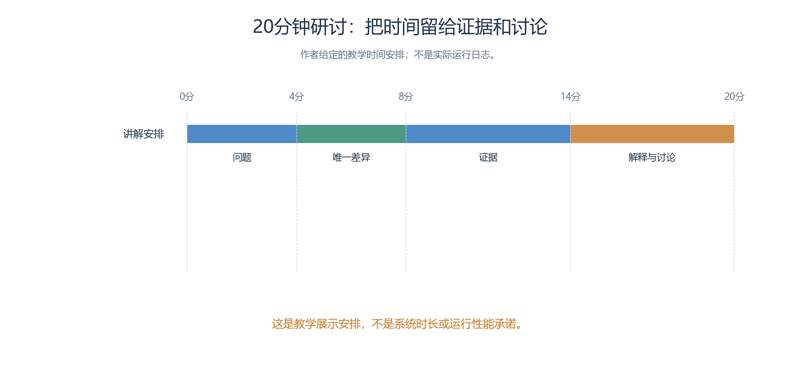
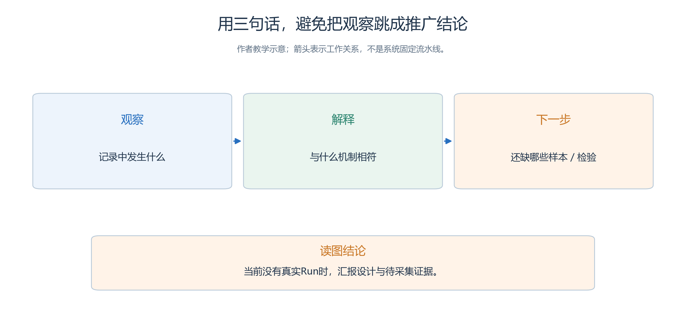

# 5.8 让别人听懂，也让别人能够质疑

到了汇报阶段，作者通常很熟悉角色与规则。

- 他看到“入口询问两轮后转往 A 窗口”，就能想起前因后果；
- 第一次看演示的人却未必知道咨询台掌握哪些信息，更不知道这条路径有没有比另一种策略好。
- 因此，汇报的任务是帮助别人建立判断所需的背景，并把判断依据交给他们。

本节以准备一场二十分钟的教学研讨为例。

- 时间只是展示安排，不是系统参数；
- 所有演示片段和数字必须来自各自标明的来源。
- 当前没有服务大厅的真实 Run，可以讲解设计并用第四章的人工判分题练习，不能播放其他案例却称为本案成功记录。

## 5.8.1 先告诉听众，他们正在看哪一种材料

同一份讲义可能包含需求表、作者空间草图、软件截图、已提交事件、人工算例和作者解释。它们看起来都很直观，证据作用却不同。开场应先说明项目处于设计、运行还是交付阶段，再让每个材料保留自己的身份。

| 材料 | 能说明什么 | 推荐标注 |
| --- | --- | --- |
| 作者空间图 | 预期布局与功能区域 | “待制作草图，未验证系统寻路” |
| Skill 原文 | 要求角色采用的方法 | 文本来源、组别、是否与包内内容核对 |
| 回放片段 | 某个已提交窗口中实际发生的变化 | Run、Step 区间、虚拟时间、取材边界 |
| 调用记录 | 模型与工具的尝试、返回及错误 | Attempt、调用身份、是否产生世界提交 |
| 人工算例 | 指标如何计算 | “人工构造，无对应 Run” |
| 分析结论 | 作者对证据的解释 | 支持记录、适用条件和仍未知之处 |

标注应贴近图片、表格或片段，不能只藏在讲义最后一页。第四章的“3/4=75%”若出现在课堂屏幕上，同一页就应写明它是人工判分练习。把来源说明移到附录，会使不了解材料的读者误以为模型已经达到该表现。

## 5.8.2 用一条问题线组织二十分钟

二十分钟汇报依次回答四个问题：研究什么、怎样比较、证据是什么、能解释到哪里。下文按相同时间段展开。

<!-- book-figure: s58-presentation-time -->

*图5.8-1　前两段各4分钟，证据与讨论各6分钟；时间分配是汇报建议，不是系统运行耗时。*

**原图参考（转换前）**

前四分钟介绍四项任务与服务分工，让听众看到 H1 与 H3、H2 与 H4 分别使用相同首句，却各有不同的私人目的；

- 每项任务在基线组与澄清组中的设定完全相同。
- 此时可问大家：如果不追问，咨询台凭什么区分 H1 与 H3？问题有助于解释干预理由，但不预先告诉大家澄清一定有收益。

接着用四分钟说明唯一变化与共同条件。直接展示咨询台决策段的差异，比铺满一页功能名更清楚。再解释窗口也会核实需求，所以入口分流错误有时能够被下游纠正；这正是不能只看最终闭环率的原因。

中间六分钟用于证据。

- 如果已有真实运行，优先选择一项闭环和一项未闭环的任务，分别定位入口请求、建议、移动、窗口回复与实际确认；
- 某类样本不存在就说明未观察到，不额外重跑来凑展示类别。
- 随后显示全体任务汇总。
- 若尚无运行，就以相同顺序展示待采集证据，使用人工题演练判分，并清楚说明没有结果。

最后六分钟交给解释与讨论：澄清多花的轮次是否值得，哪些失败可能来自消息截断或模型偏离，哪些问题现有教案没有回答。

- 结束时留下报告入口与接收检查范围，使听众可以继续核对。
- 讲稿不需要讲遍所有模块；
- 第三章已有相应章节，可在附页给出定位。

## 5.8.3 选择片段也需要规则

假如某次运行中 H1 一次闭环，H2 在窗口截止前没收到答复，只播放 H1 会让过程显得顺畅，却会遮住边界问题。

- 相应样本存在时，示范片段可以按“一个典型闭环、一个未完成或判分有争议的任务”选择；
- 不存在的类别明确记为未观察到。
- 在报告中记下选择方法，并保留全体运行和任务索引。

对于同一任务，应保留足够上下文。

- 截出一句“请去 A 窗口”时，要说明之前是否已经澄清目的；
- 截出人物位于 A 服务区时，要说明这是实际坐标，还是仍在计划中的目标。
- 不能把角色的行走计划剪接成已经发生的移动，也不能把对象已生成的最后一轮回复剪成来访者已经收到。

展示可以加速播放、放大局部、隐藏与问题无关的面板，但需要保留原始文件并说明加工方式。

- 为讲义裁剪的图片是展示副本，不替代 Run 导出；
- 隐藏面板不能改变所展示事实的身份与含义。
- 虚拟分钟、播放时长与运行耗时应分别标注。

## 5.8.4 让数字带着分母和条件出现

“成功率提高了”没有提供足够信息。听众需要知道成功定义、任务数、运行数、未完成数和比较条件。对本案，正确咨询闭环必须包含适配窗口回复与实际确认；一次入口建议还不满足这个条件。

第四章的人工练习给出三项闭环、四项任务，另有一项已获得入口有效建议却未完成窗口闭环。

- 合适的教学表述是：“在这段人工材料中，按预先给出的判据，闭环为 3/4；H2 的首次有效回应已经发生，最终闭环仍未发生。”不合适的说法是“模型有 75% 的办事能力”，因为这里既没有真实模型运行，也没有真实行政业务。

未来取得重复运行后，报告还需说明各 Run 的分布与汇总方式。

- 主要结论应与全体样本一致，不能先用全部任务计算闭环率，再仅对最快几个成功任务计算平均耗时，却把两者放在一起暗示全面改进。
- 具体计算沿用[4.9 的分析口径](<../chapter 04/09-comparison-and-your-study.md>)。

费用也要说明来源。Token 数不自动等于账单金额，估算单价不等于实际价格，未提交的调用仍可能产生费用。若只能获得部分用量，就写可观测部分与缺失范围，不用一个精确小数掩盖信息不全。

## 5.8.5 将观察、解释和下一步分成三句话

下面用同一条咨询记录写三层句子：先陈述观察，再提出解释，最后说明还需要什么检验。示例句不充当真实结果。

<!-- book-figure: s58-claim-strength -->

*图5.8-2　收到补充后给出适配建议，是待证实的观察；澄清机制是解释；其他任务与重复运行用于继续检验，不能从一次记录直接推广。*

**原图参考（转换前）**

报告最容易发生的跳跃是从“看见一次”直接到“应该推广”。可以用三个连续句子约束自己的推理。

第一句只描述观察，例如“这条任务记录中，咨询台收到补充目的后给出了适配窗口建议”。

- 第二句提出解释，例如“这一过程与澄清有助于补齐分类字段的机制相符”。
- 第三句说明下一步，例如“仍需检查其他任务和重复运行，判断收益是否抵偿额外轮次”。
- 这三句是写作示范，不能在没有记录时当成本案结果使用。

若证据不符合预期，也采用相同结构。

- 观察可以是“已收到补充却仍建议错误窗口”；
- 解释候选可能包括规则理解、记忆检索或执行文本不一致；
- 下一步是定位具体输入与包内 Skill。
- 不要把每次模型行为偏离都归为系统 bug，也不要把工具的正确拒绝包装成策略失败。

## 5.8.6 评阅者可以从五个问题开始

评阅不需要逐行审查所有文件。先挑一个主要结论，沿它的证据链往回走，通常就能暴露关键缺口。

1. 这句话比较的究竟是什么，能否在委托书中找到对应问题？
2. 判分标准是在观察结果前确定的吗，修改过的标准是否有说明？
3. 被引用的证据来自哪次 Run、哪个提交边界，能否重新定位？
4. 失败、没有回应和不利样本是否进入同一份结果表？
5. 结论是否超出了材料、系统机制或接收验证的范围？

发现问题后，评阅意见写成“主张—缺口—所需处理”。例如：“报告称 H2 闭环，但所附记录只有入口建议；请补定位适配窗口回复及确认，否则将其改为未闭环。”这种意见允许作者依据事实回应，比“感觉不可信”更有帮助。

处理评阅意见也要留下结果。

- 补充定位、改判、缩小主张和暂时无法解决，都可以成为明确结局；
- “已沟通”不能告诉后来者证据发生了什么。
- 若原始记录本身无法支持判断，就保留未知，不请求模型代填一个合理故事。

## 5.8.7 为不同听众保留同一事实底稿

讲师需要一页问题与讨论提示，操作者需要环境与接收说明，研究读者需要全体结果和判分记录。

- 可以据此制作不同长度的材料，但它们应该引用同一份事实底稿。
- 摘要更新后，检查图注、讲稿和报告中的数字是否同步，避免一份仍写三项成功、另一份已改成两项。

项目资料的可复用性还依赖来源、内容说明和访问方式。

- FAIR 原则强调数字资料应便于寻找、访问、互操作与再利用，并要求说明来源；
- 它允许必要的认证与授权，并不意味着所有资料必须公开。
- 本章借鉴这些原则组织交付入口，不声称获得了任何认证。[GO FAIR 原则说明](https://www.go-fair.org/fair-principles/)

本节练习：将“我们已验证咨询台显著提高社区服务效率，可直接推广”改写为与当前书稿相符的开场。

- 参考答案是：“我们设计了一项虚构咨询实验，用于比较立即建议与先澄清的取舍；当前交付是教案和验收方法，尚无运行结果。今天先讨论信息分配和判分规则是否足以回答这个问题。”将来取得证据，再据其强度更新这段话。

[上一节：交付与复现](07-handoff-and-reproduction.md) · [下一节：迭代与维护](09-iteration-and-maintenance.md) · [返回本章](README.md)
